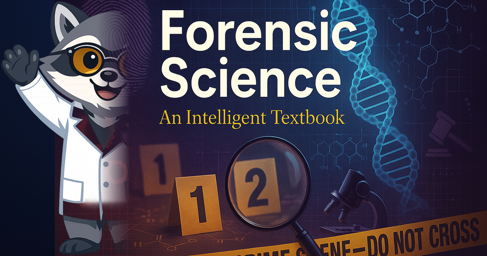

# Forensic Science

<figure markdown>
  { width="100%" }
</figure>

Welcome to **Forensic Science**, a rigorous, laboratory-intensive intelligent textbook
that bridges chemistry, biology, physics, and law through the lens of criminal investigation.

## About This Book

Every chapter is organized around authentic casework methodologies used by practicing
forensic scientists, crime scene investigators, medical examiners, and digital forensics
specialists. Students learn how physical, biological, chemical, and digital evidence is
collected, analyzed, and presented in a court of law.

The course spans **19 chapters** organized into seven thematic modules:

- **Module 1** — Forensic infrastructure and crime scene methodology
- **Module 2** — Physical and microscopic trace evidence
- **Module 3** — Biological evidence and biochemistry
- **Module 4** — Chemical and biomolecular analysis
- **Module 5** — Anatomical and ecological analysis
- **Module 6** — Digital evidence, facial recognition, cell phone analytics, and social media analysis
- **Module 7** - Airplane crash investigation

## Who This Book Is For

High school students (grades 9–12) with a background in introductory biology and
chemistry. The course is appropriate for college-prep and AP-track students seeking
a rigorous application of STEM skills in a real-world investigative context. It is
also suitable for dual-enrollment programs at community colleges.

## How to Use This Book

Use the navigation sidebar to explore:

- **[Chapters](chapters/index.md)** — Main educational content with labs, case studies, and MicroSims
- **[Learning Graph](learning-graph/index.md)** — Interactive concept map showing how ideas connect
- **[MicroSims](sims/index.md)** — Hands-on simulations for key techniques and processes
- **[Glossary](glossary.md)** — Definitions for key forensic science terms
- **[FAQ](faq.md)** - Frequently asked questions

## Getting Started

Begin with [Chapter 1: Foundations & Legal Principles](chapters/01-intro-forensic-science/index.md)
to understand how forensic science operates within the US legal system.
