# List of MicroSims for Forensic Science

This book includes **46 interactive MicroSims** — self-contained, browser-based visualizations you can explore directly. Click any thumbnail to open the MicroSim.

<!-- This gallery is generated by generate-sims-index.py — edits here will be overwritten. -->

  <a href="abo-blood-typing/" title="ABO Blood Typing Interactive Simulator" style="display:block;border:1px solid #e3e7ec;border-radius:8px;overflow:hidden;text-decoration:none;color:inherit;box-shadow:0 1px 3px rgba(0,0,0,0.08);">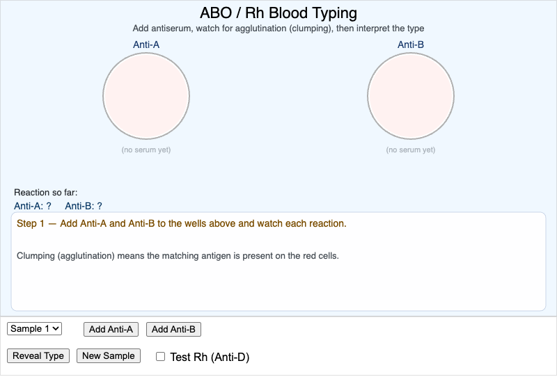ABO Blood Typing Interactive Simulator</a>
  <a href="adh-mpmi-calculator/" title="ADH minimum-PMI Calculator" style="display:block;border:1px solid #e3e7ec;border-radius:8px;overflow:hidden;text-decoration:none;color:inherit;box-shadow:0 1px 3px rgba(0,0,0,0.08);">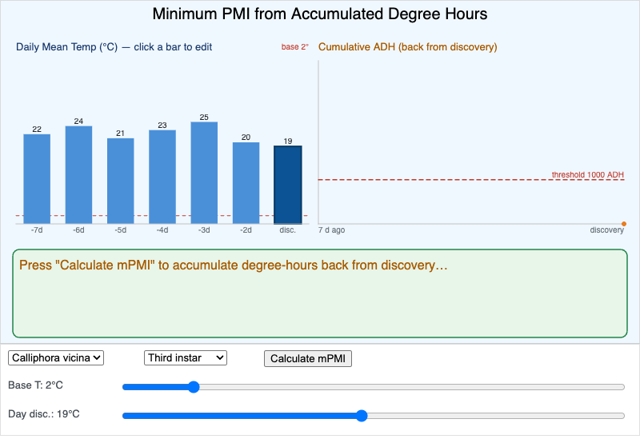ADH minimum-PMI Calculator</a>
  <a href="adme-pathway/" title="ADME Pathway Interactive Flow Diagram" style="display:block;border:1px solid #e3e7ec;border-radius:8px;overflow:hidden;text-decoration:none;color:inherit;box-shadow:0 1px 3px rgba(0,0,0,0.08);">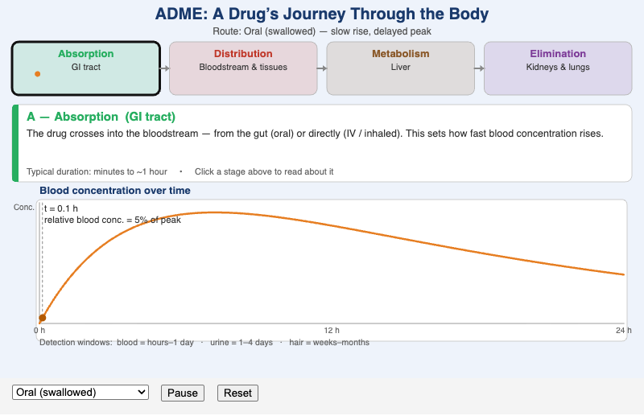ADME Pathway Interactive Flow Diagram</a>
  <a href="afis-search-workflow/" title="AFIS Search Workflow" style="display:block;border:1px solid #e3e7ec;border-radius:8px;overflow:hidden;text-decoration:none;color:inherit;box-shadow:0 1px 3px rgba(0,0,0,0.08);">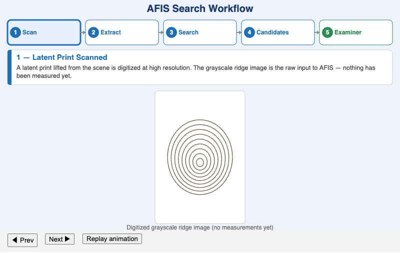AFIS Search Workflow</a>
  <a href="angle-of-impact-calculator/" title="Angle-of-Impact Calculator" style="display:block;border:1px solid #e3e7ec;border-radius:8px;overflow:hidden;text-decoration:none;color:inherit;box-shadow:0 1px 3px rgba(0,0,0,0.08);">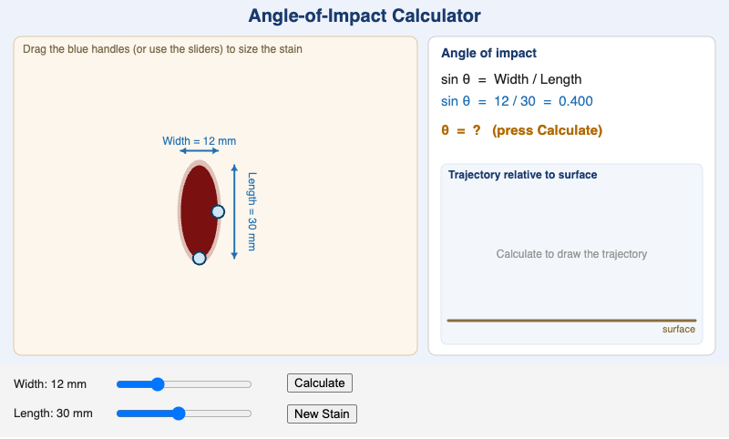Angle-of-Impact Calculator</a>
  <a href="area-of-origin-stringing/" title="Area-of-Origin Stringing" style="display:block;border:1px solid #e3e7ec;border-radius:8px;overflow:hidden;text-decoration:none;color:inherit;box-shadow:0 1px 3px rgba(0,0,0,0.08);">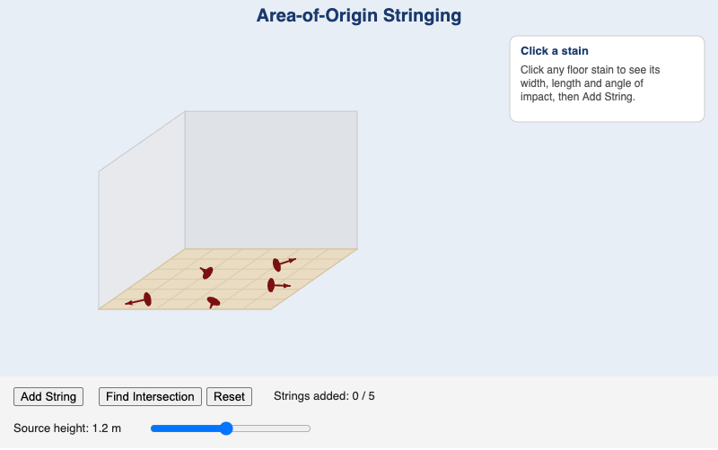Area-of-Origin Stringing</a>
  <a href="bac-retro-extrapolation/" title="BAC Retro-Extrapolation" style="display:block;border:1px solid #e3e7ec;border-radius:8px;overflow:hidden;text-decoration:none;color:inherit;box-shadow:0 1px 3px rgba(0,0,0,0.08);">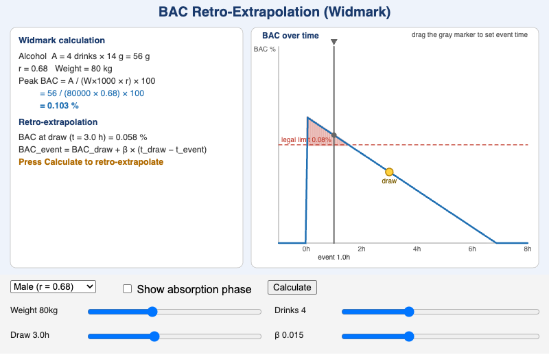BAC Retro-Extrapolation</a>
  <a href="becke-line-test/" title="Becke Line Test Simulator" style="display:block;border:1px solid #e3e7ec;border-radius:8px;overflow:hidden;text-decoration:none;color:inherit;box-shadow:0 1px 3px rgba(0,0,0,0.08);">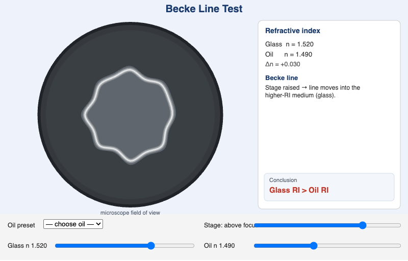Becke Line Test Simulator</a>
  <a href="burn-pattern-origin-explorer/" title="Burn-Pattern Origin Explorer" style="display:block;border:1px solid #e3e7ec;border-radius:8px;overflow:hidden;text-decoration:none;color:inherit;box-shadow:0 1px 3px rgba(0,0,0,0.08);">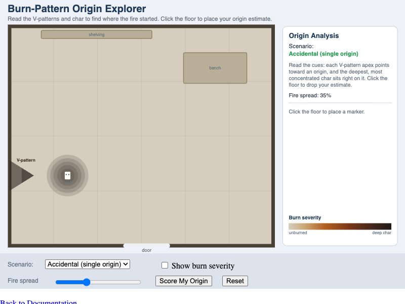Burn-Pattern Origin Explorer</a>
  <a href="cdr-tower-triangulation/" title="CDR &amp; Tower Triangulation Timeline" style="display:block;border:1px solid #e3e7ec;border-radius:8px;overflow:hidden;text-decoration:none;color:inherit;box-shadow:0 1px 3px rgba(0,0,0,0.08);">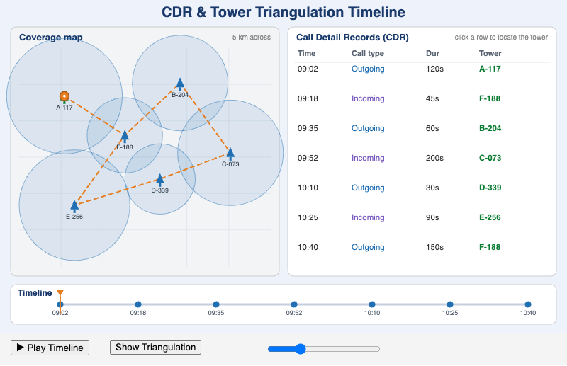CDR &amp; Tower Triangulation Timeline</a>
  <a href="chain-of-custody-flow/" title="Chain of Custody Flow" style="display:block;border:1px solid #e3e7ec;border-radius:8px;overflow:hidden;text-decoration:none;color:inherit;box-shadow:0 1px 3px rgba(0,0,0,0.08);">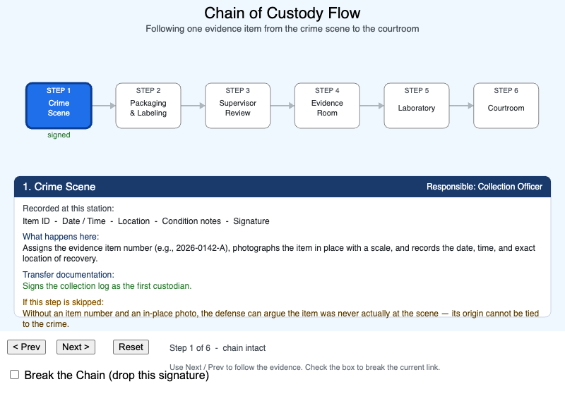Chain of Custody Flow</a>
  <a href="criminal-justice-process-flow/" title="Criminal Justice Process — From Crime Scene to Verdict" style="display:block;border:1px solid #e3e7ec;border-radius:8px;overflow:hidden;text-decoration:none;color:inherit;box-shadow:0 1px 3px rgba(0,0,0,0.08);">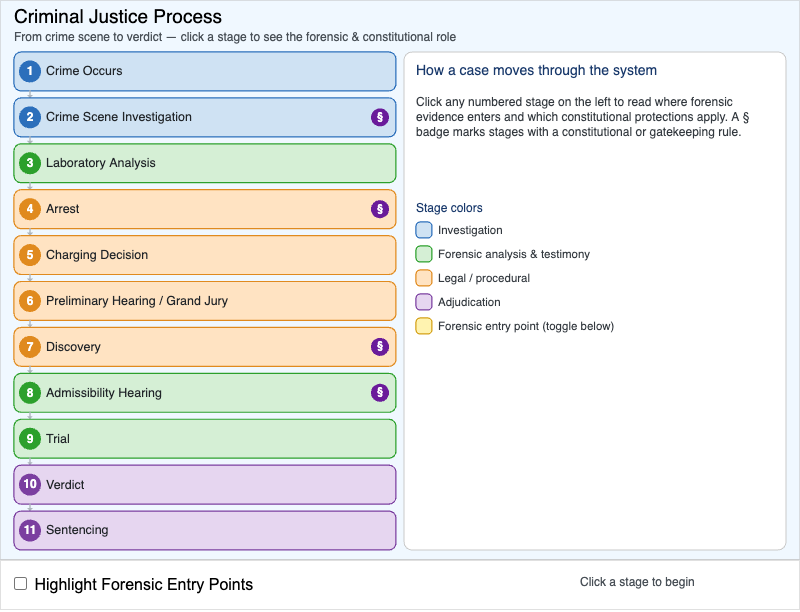Criminal Justice Process — From Crime Scene to Verdict</a>
  <a href="daubert-frye-decision-workflow/" title="Daubert vs. Frye Admissibility Decision Workflow" style="display:block;border:1px solid #e3e7ec;border-radius:8px;overflow:hidden;text-decoration:none;color:inherit;box-shadow:0 1px 3px rgba(0,0,0,0.08);">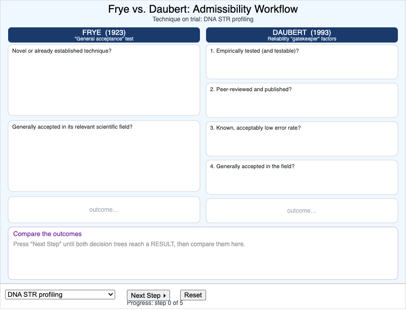Daubert vs. Frye Admissibility Decision Workflow</a>
  <a href="debris-field-pattern-explorer/" title="Debris Field Pattern Explorer" style="display:block;border:1px solid #e3e7ec;border-radius:8px;overflow:hidden;text-decoration:none;color:inherit;box-shadow:0 1px 3px rgba(0,0,0,0.08);">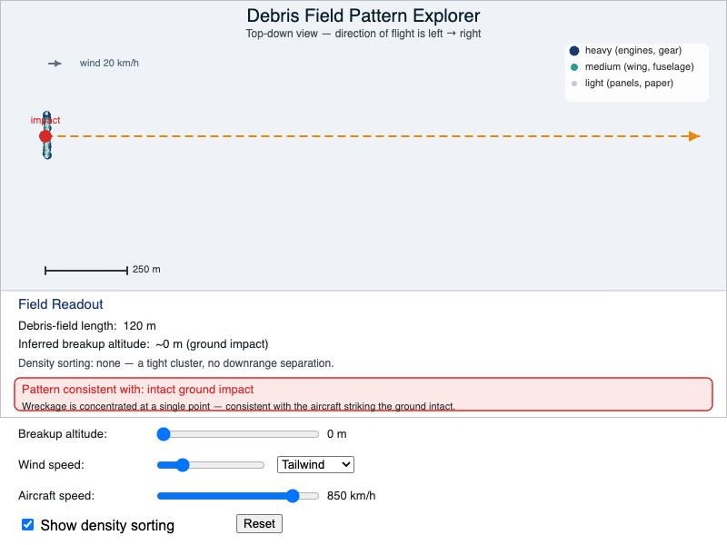Debris Field Pattern Explorer</a>
  <a href="evidence-packaging-guide/" title="Evidence Packaging Guide" style="display:block;border:1px solid #e3e7ec;border-radius:8px;overflow:hidden;text-decoration:none;color:inherit;box-shadow:0 1px 3px rgba(0,0,0,0.08);">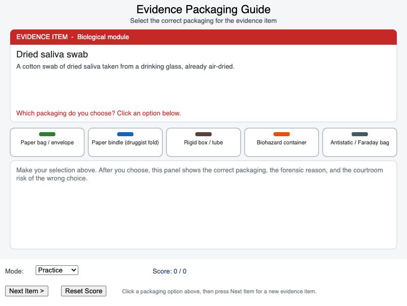Evidence Packaging Guide</a>
  <a href="search-pattern-selector/" title="Evidence Search Pattern Selector" style="display:block;border:1px solid #e3e7ec;border-radius:8px;overflow:hidden;text-decoration:none;color:inherit;box-shadow:0 1px 3px rgba(0,0,0,0.08);">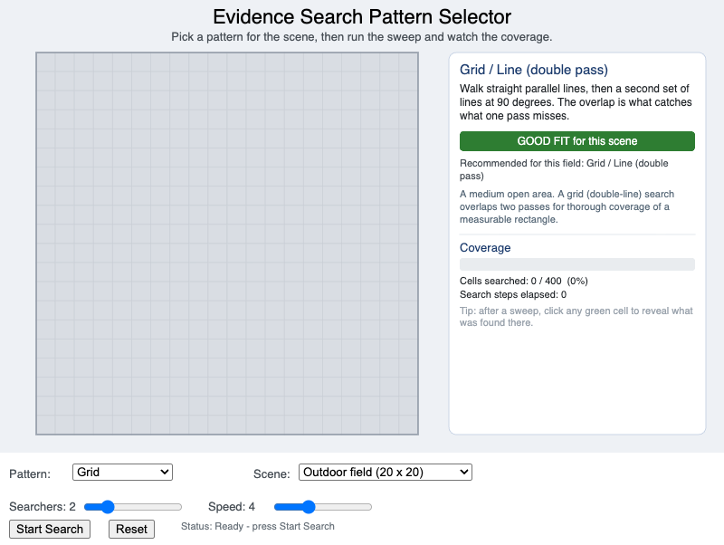Evidence Search Pattern Selector</a>
  <a href="exif-map-plot/" title="EXIF Geolocation &amp; Alibi Timeline" style="display:block;border:1px solid #e3e7ec;border-radius:8px;overflow:hidden;text-decoration:none;color:inherit;box-shadow:0 1px 3px rgba(0,0,0,0.08);">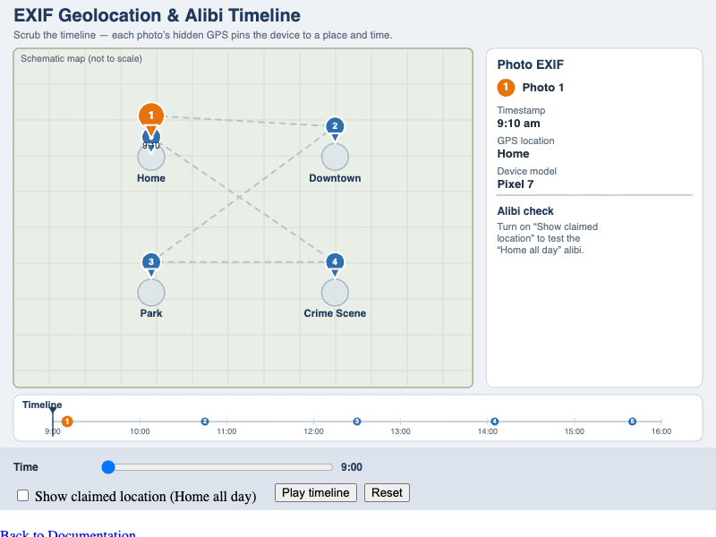EXIF Geolocation &amp; Alibi Timeline</a>
  <a href="facial-recognition-pipeline/" title="Facial Recognition Pipeline" style="display:block;border:1px solid #e3e7ec;border-radius:8px;overflow:hidden;text-decoration:none;color:inherit;box-shadow:0 1px 3px rgba(0,0,0,0.08);">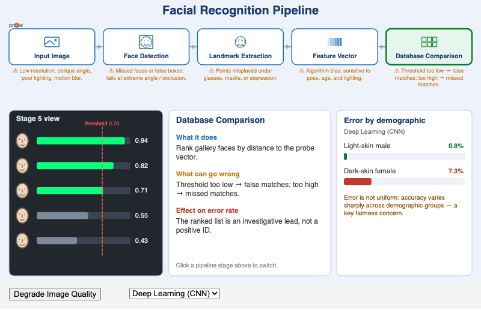Facial Recognition Pipeline</a>
  <a href="fiber-identification-tree/" title="Fiber Identification Decision Tree" style="display:block;border:1px solid #e3e7ec;border-radius:8px;overflow:hidden;text-decoration:none;color:inherit;box-shadow:0 1px 3px rgba(0,0,0,0.08);">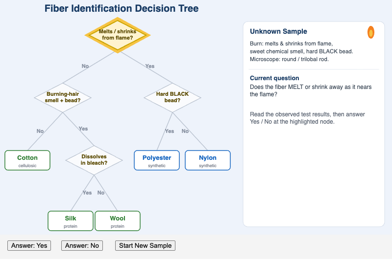Fiber Identification Decision Tree</a>
  <a href="fingerprint-pattern-explorer/" title="Fingerprint Pattern Classification Explorer" style="display:block;border:1px solid #e3e7ec;border-radius:8px;overflow:hidden;text-decoration:none;color:inherit;box-shadow:0 1px 3px rgba(0,0,0,0.08);">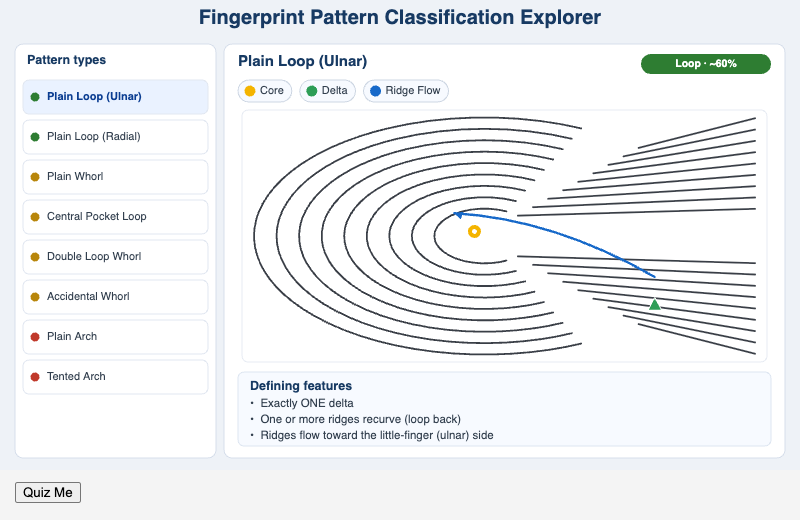Fingerprint Pattern Classification Explorer</a>
  <a href="ballistic-pathway/" title="Firearms Ballistic Pathway" style="display:block;border:1px solid #e3e7ec;border-radius:8px;overflow:hidden;text-decoration:none;color:inherit;box-shadow:0 1px 3px rgba(0,0,0,0.08);">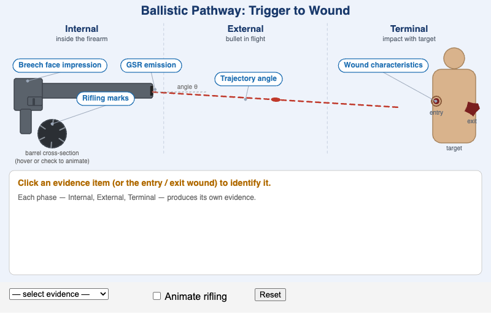Firearms Ballistic Pathway</a>
  <a href="forensic-imaging-workflow/" title="Forensic Imaging &amp; Hash Verification Workflow" style="display:block;border:1px solid #e3e7ec;border-radius:8px;overflow:hidden;text-decoration:none;color:inherit;box-shadow:0 1px 3px rgba(0,0,0,0.08);">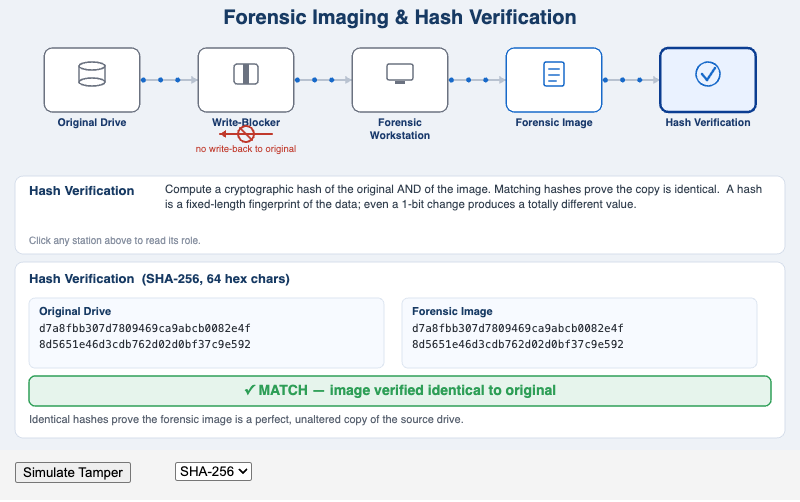Forensic Imaging &amp; Hash Verification Workflow</a>
  <a href="gcms-peak-match/" title="GC-MS Peak-Match Confirmation" style="display:block;border:1px solid #e3e7ec;border-radius:8px;overflow:hidden;text-decoration:none;color:inherit;box-shadow:0 1px 3px rgba(0,0,0,0.08);">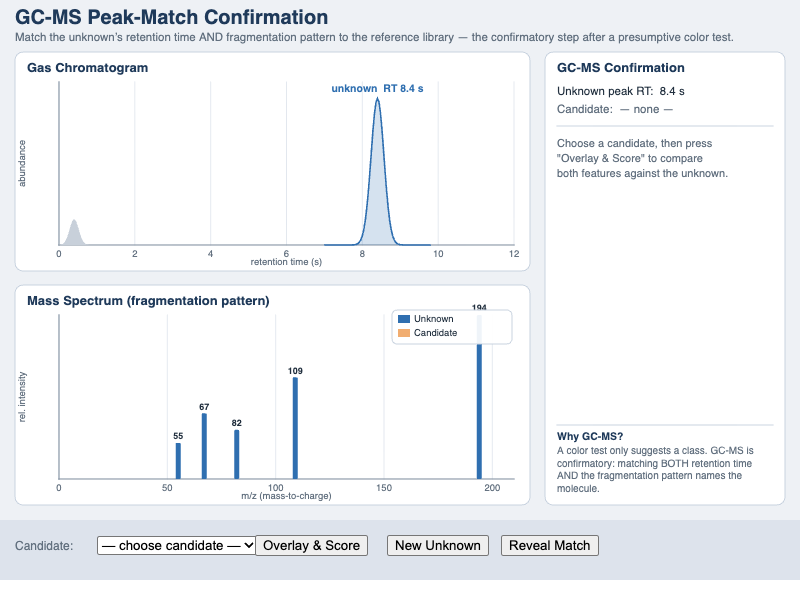GC-MS Peak-Match Confirmation</a>
  <a href="glass-fracture-sequence/" title="Glass Fracture Sequence Analyzer" style="display:block;border:1px solid #e3e7ec;border-radius:8px;overflow:hidden;text-decoration:none;color:inherit;box-shadow:0 1px 3px rgba(0,0,0,0.08);">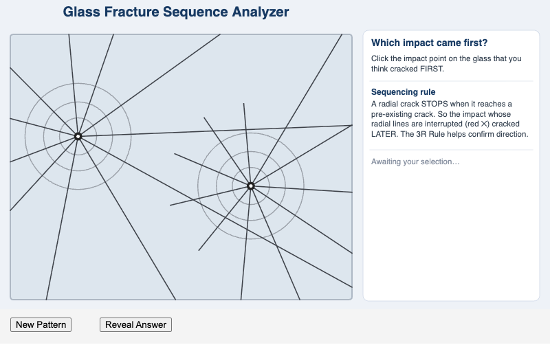Glass Fracture Sequence Analyzer</a>
  <a href="handwriting-comparison/" title="Handwriting Characteristics Comparison" style="display:block;border:1px solid #e3e7ec;border-radius:8px;overflow:hidden;text-decoration:none;color:inherit;box-shadow:0 1px 3px rgba(0,0,0,0.08);">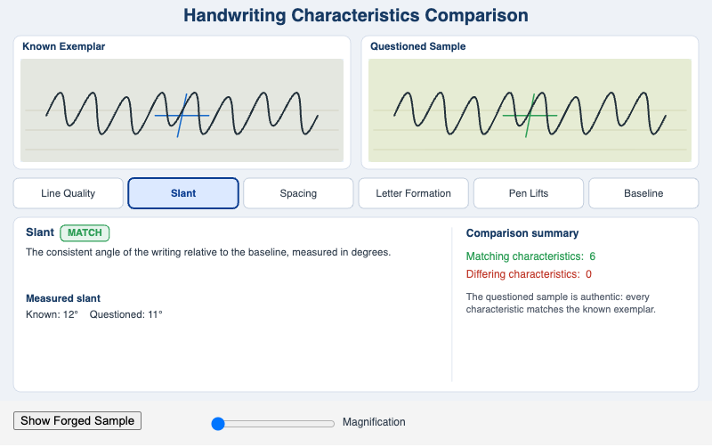Handwriting Characteristics Comparison</a>
  <a href="headspace-spme-workflow/" title="Headspace SPME → GC-MS Workflow" style="display:block;border:1px solid #e3e7ec;border-radius:8px;overflow:hidden;text-decoration:none;color:inherit;box-shadow:0 1px 3px rgba(0,0,0,0.08);">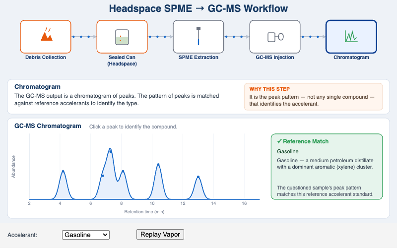Headspace SPME → GC-MS Workflow</a>
  <a href="forensic-science-history-timeline/" title="Interactive Timeline of Forensic Science History" style="display:block;border:1px solid #e3e7ec;border-radius:8px;overflow:hidden;text-decoration:none;color:inherit;box-shadow:0 1px 3px rgba(0,0,0,0.08);">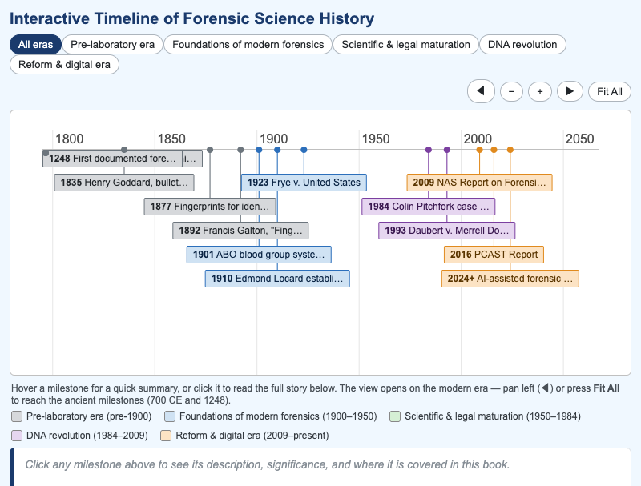Interactive Timeline of Forensic Science History</a>
  <a href="aviation-crash-investigation-timeline/" title="Landmark Crash Investigations Timeline" style="display:block;border:1px solid #e3e7ec;border-radius:8px;overflow:hidden;text-decoration:none;color:inherit;box-shadow:0 1px 3px rgba(0,0,0,0.08);">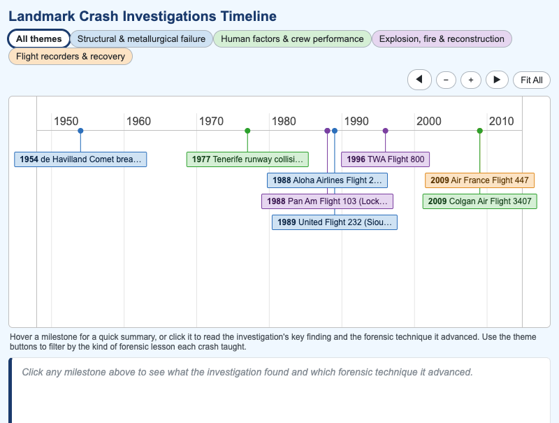Landmark Crash Investigations Timeline</a>
  <a href="latent-print-development/" title="Latent Print Development Technique Selector" style="display:block;border:1px solid #e3e7ec;border-radius:8px;overflow:hidden;text-decoration:none;color:inherit;box-shadow:0 1px 3px rgba(0,0,0,0.08);">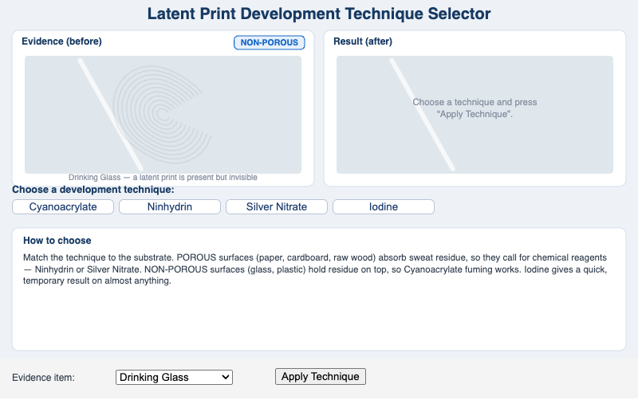Latent Print Development Technique Selector</a>
  <a href="graph-viewer/" title="Learning Graph Viewer" style="display:block;border:1px solid #e3e7ec;border-radius:8px;overflow:hidden;text-decoration:none;color:inherit;box-shadow:0 1px 3px rgba(0,0,0,0.08);">no previewLearning Graph Viewer</a>
  <a href="live-hash-tamper-detector/" title="Live Hash &amp; Tamper Detector" style="display:block;border:1px solid #e3e7ec;border-radius:8px;overflow:hidden;text-decoration:none;color:inherit;box-shadow:0 1px 3px rgba(0,0,0,0.08);">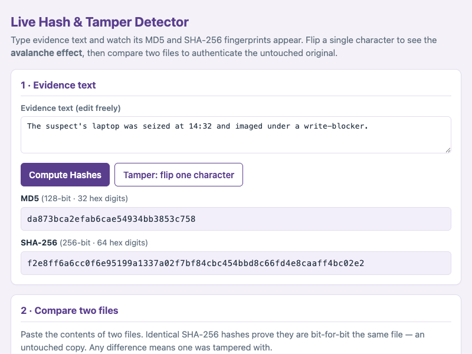Live Hash &amp; Tamper Detector</a>
  <a href="locard-exchange-visualizer/" title="Locard Exchange Principle Visualizer" style="display:block;border:1px solid #e3e7ec;border-radius:8px;overflow:hidden;text-decoration:none;color:inherit;box-shadow:0 1px 3px rgba(0,0,0,0.08);">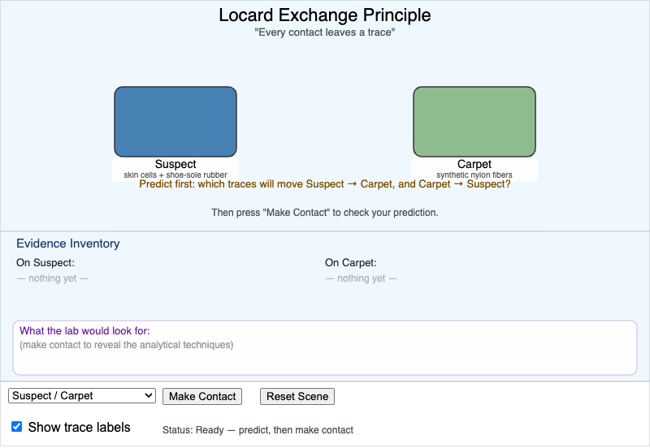Locard Exchange Principle Visualizer</a>
  <a href="medullary-index-calculator/" title="Medullary Index Calculator" style="display:block;border:1px solid #e3e7ec;border-radius:8px;overflow:hidden;text-decoration:none;color:inherit;box-shadow:0 1px 3px rgba(0,0,0,0.08);">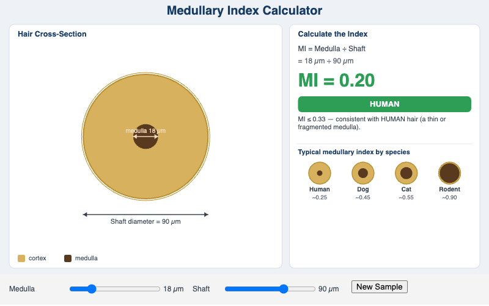Medullary Index Calculator</a>
  <a href="metadata-timeline-builder/" title="Metadata Recovery and Timeline Builder" style="display:block;border:1px solid #e3e7ec;border-radius:8px;overflow:hidden;text-decoration:none;color:inherit;box-shadow:0 1px 3px rgba(0,0,0,0.08);">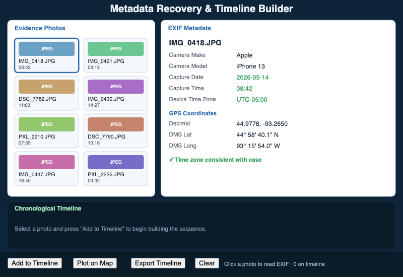Metadata Recovery and Timeline Builder</a>
  <a href="minutiae-tagging-canvas/" title="Minutiae-Tagging Canvas" style="display:block;border:1px solid #e3e7ec;border-radius:8px;overflow:hidden;text-decoration:none;color:inherit;box-shadow:0 1px 3px rgba(0,0,0,0.08);">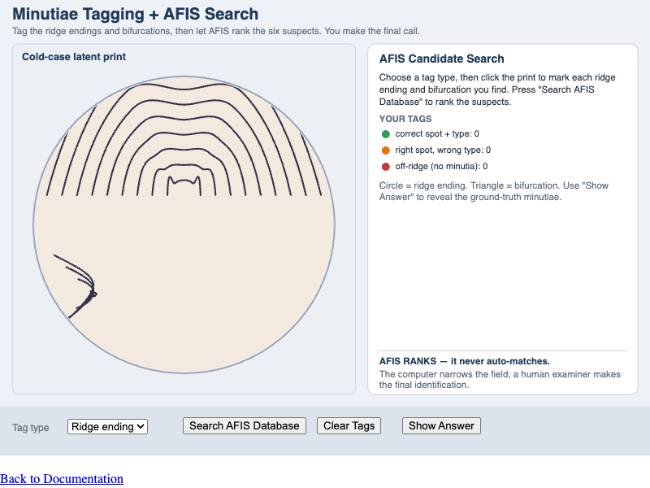Minutiae-Tagging Canvas</a>
  <a href="ntsb-investigation-workflow/" title="NTSB Investigation Workflow" style="display:block;border:1px solid #e3e7ec;border-radius:8px;overflow:hidden;text-decoration:none;color:inherit;box-shadow:0 1px 3px rgba(0,0,0,0.08);">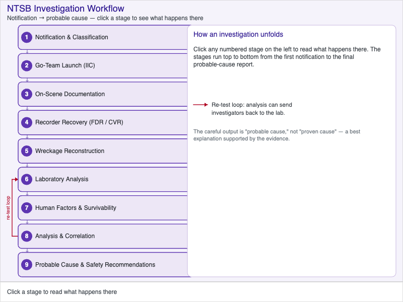NTSB Investigation Workflow</a>
  <a href="pcr-amplification-simulator/" title="PCR Amplification Step-Through Simulator" style="display:block;border:1px solid #e3e7ec;border-radius:8px;overflow:hidden;text-decoration:none;color:inherit;box-shadow:0 1px 3px rgba(0,0,0,0.08);">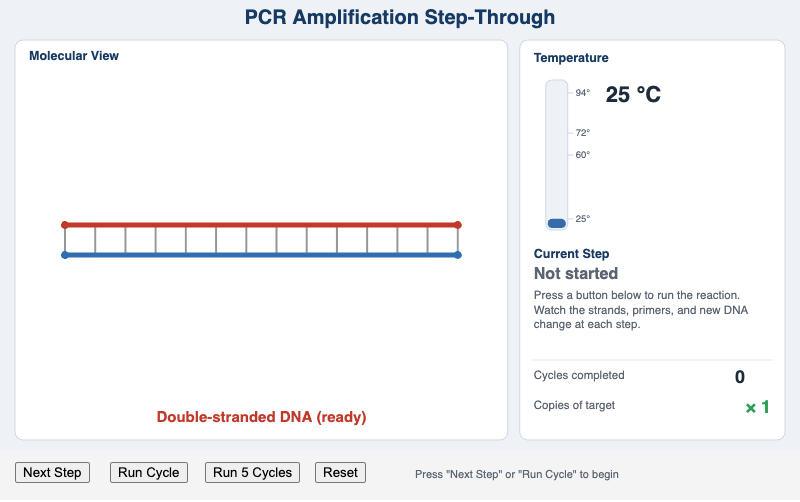PCR Amplification Step-Through Simulator</a>
  <a href="presumptive-test-decision-tool/" title="Presumptive-Test Decision Tool" style="display:block;border:1px solid #e3e7ec;border-radius:8px;overflow:hidden;text-decoration:none;color:inherit;box-shadow:0 1px 3px rgba(0,0,0,0.08);">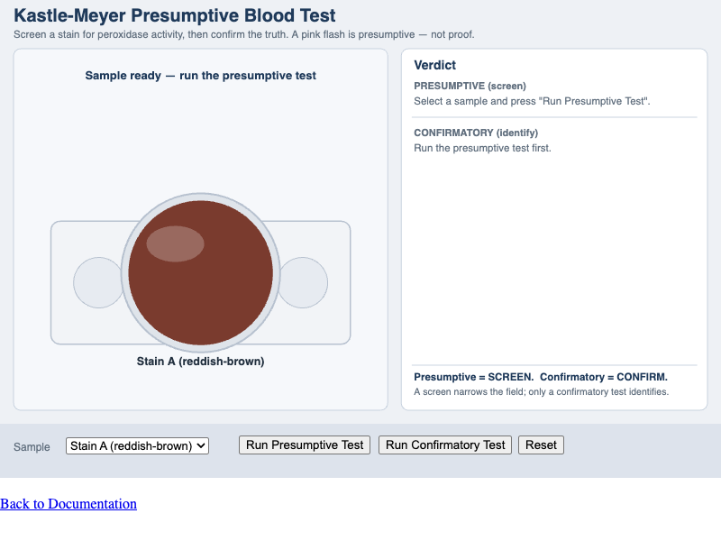Presumptive-Test Decision Tool</a>
  <a href="rmp-product-rule/" title="Random Match Probability Product Rule Calculator" style="display:block;border:1px solid #e3e7ec;border-radius:8px;overflow:hidden;text-decoration:none;color:inherit;box-shadow:0 1px 3px rgba(0,0,0,0.08);">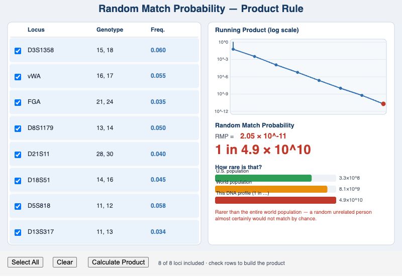Random Match Probability Product Rule Calculator</a>
  <a href="skeletal-sex-indicators/" title="Skeletal Sex Indicators Interactive Diagram" style="display:block;border:1px solid #e3e7ec;border-radius:8px;overflow:hidden;text-decoration:none;color:inherit;box-shadow:0 1px 3px rgba(0,0,0,0.08);">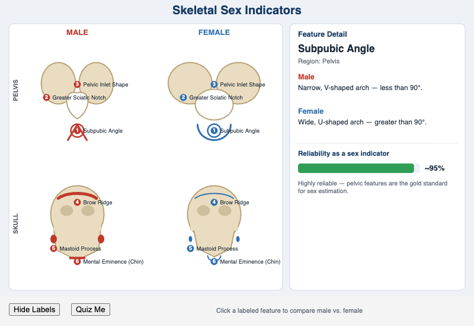Skeletal Sex Indicators Interactive Diagram</a>
  <a href="social-network-analysis/" title="Social Network Analysis Graph Explorer" style="display:block;border:1px solid #e3e7ec;border-radius:8px;overflow:hidden;text-decoration:none;color:inherit;box-shadow:0 1px 3px rgba(0,0,0,0.08);">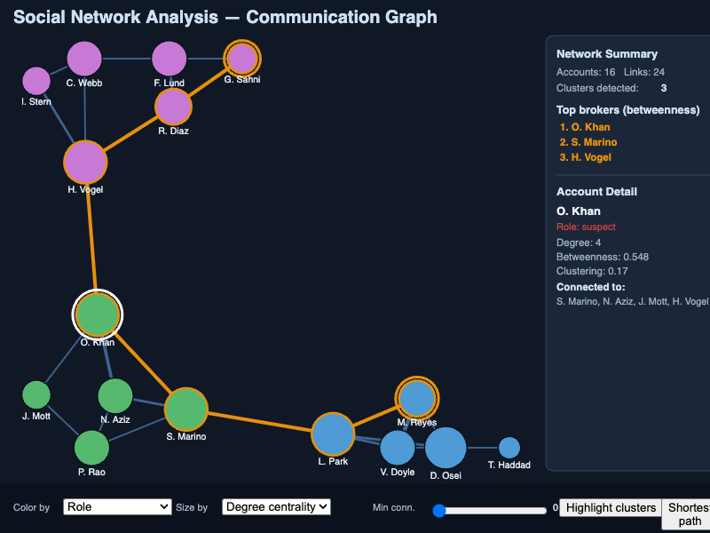Social Network Analysis Graph Explorer</a>
  <a href="soil-analysis-dashboard/" title="Soil Analysis Comparison Dashboard" style="display:block;border:1px solid #e3e7ec;border-radius:8px;overflow:hidden;text-decoration:none;color:inherit;box-shadow:0 1px 3px rgba(0,0,0,0.08);">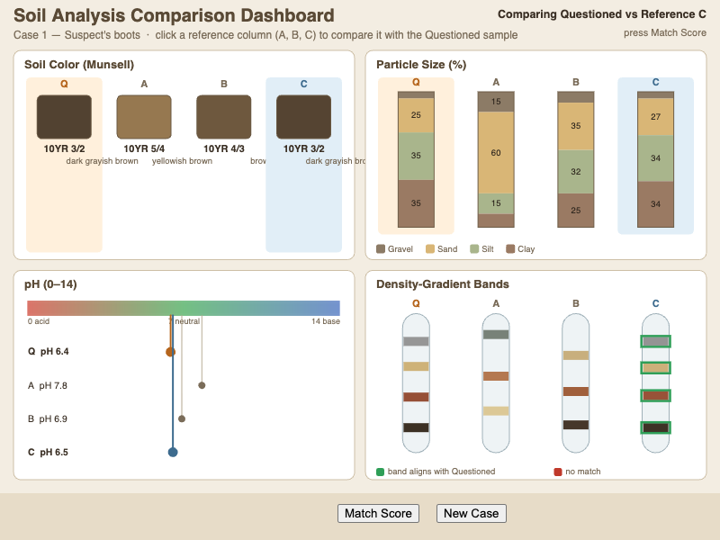Soil Analysis Comparison Dashboard</a>
  <a href="str-electropherogram-comparison/" title="STR Electropherogram Comparison" style="display:block;border:1px solid #e3e7ec;border-radius:8px;overflow:hidden;text-decoration:none;color:inherit;box-shadow:0 1px 3px rgba(0,0,0,0.08);">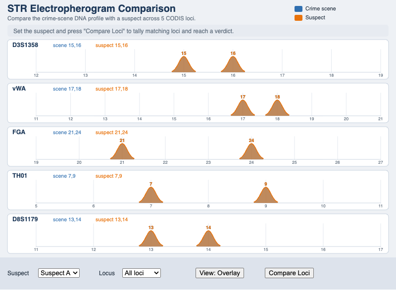STR Electropherogram Comparison</a>
  <a href="striation-overlay-comparator/" title="Striation-Overlay Comparator" style="display:block;border:1px solid #e3e7ec;border-radius:8px;overflow:hidden;text-decoration:none;color:inherit;box-shadow:0 1px 3px rgba(0,0,0,0.08);">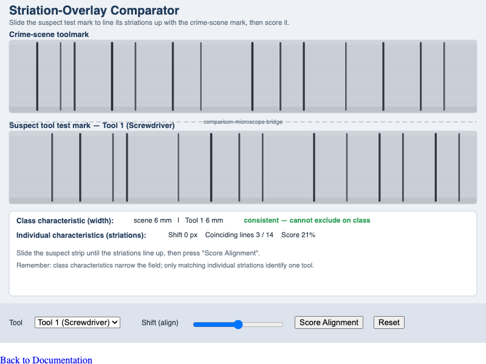Striation-Overlay Comparator</a>
  <a href="tlc-ink-separation/" title="TLC Ink Separation Interactive Diagram" style="display:block;border:1px solid #e3e7ec;border-radius:8px;overflow:hidden;text-decoration:none;color:inherit;box-shadow:0 1px 3px rgba(0,0,0,0.08);">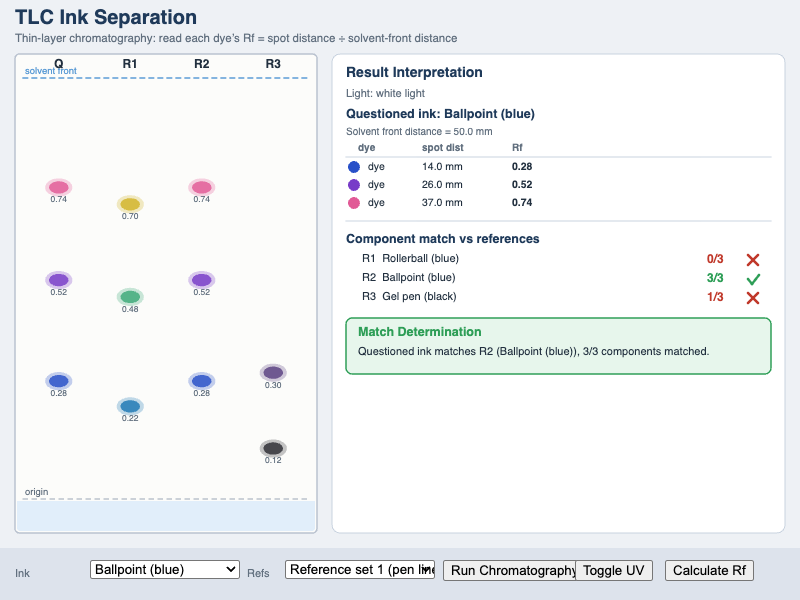TLC Ink Separation Interactive Diagram</a>
  <a href="triangulation-measurement/" title="Triangulation Measurement Technique" style="display:block;border:1px solid #e3e7ec;border-radius:8px;overflow:hidden;text-decoration:none;color:inherit;box-shadow:0 1px 3px rgba(0,0,0,0.08);">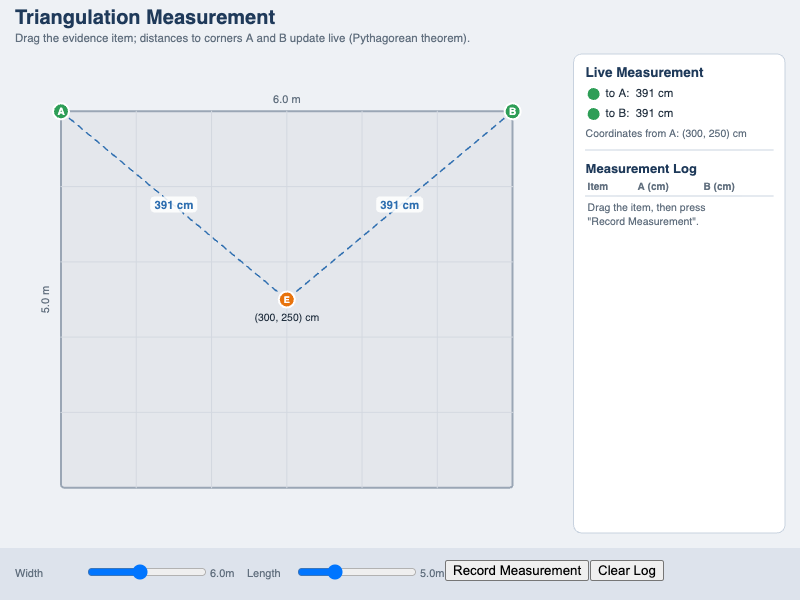Triangulation Measurement Technique</a>

