# The Barcode in Your Blood

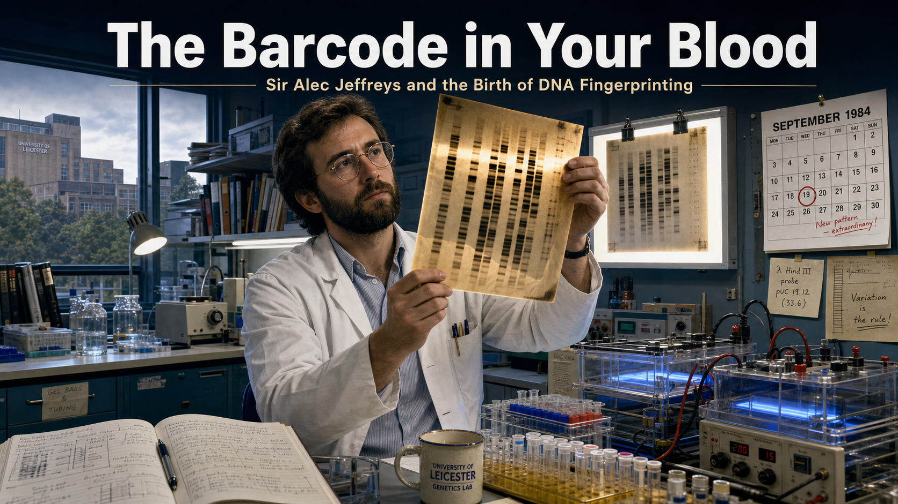

Cover Image Prompt

(This is the Cover Image. Do not include this label in the image.)
A contemporary photorealistic illustration with 1980s laboratory detailing serving as the cover of a forensic science graphic novel. In the center stands Sir Alec Jeffreys: a broad-shouldered British man in his mid-thirties, dark beard, wire-rimmed glasses, wearing a white lab coat over a collared shirt, holding a large X-ray autoradiograph film up to fluorescent light. On the film, vivid dark bands form a striking pattern like a barcode. Behind him: a University of Leicester genetics laboratory, circa 1984, with benches crowded with pipettes, Eppendorf tubes, glass electrophoresis tanks glowing faintly with UV light, and coiled power cables. Fluorescent overhead lights cast a cool blue-white glow. The title text "The Barcode in Your Blood" appears across the top in a clean modern sans-serif typeface in white against deep navy. A subtitle reads "Sir Alec Jeffreys and the Birth of DNA Fingerprinting." The color palette is cool fluorescent blues, steel grey, ivory, and a warm amber accent from the autorad film. Emotional tone: intellectual wonder, the moment before a life-changing revelation. At least six specific visual details: the dark band pattern on the autorad film catching the light, a second autorad film clipped to a light box on the wall, open lab notebooks with handwritten annotations, a ceramic coffee mug at the bench corner, the University of Leicester building visible through a tall window in the background, and a wall calendar showing September 1984.
Generate the image immediately without asking clarifying questions.

Narrative Prompt

This is a 12-panel graphic novel about Sir Alec Jeffreys (born 9 January 1950), the British geneticist at the University of Leicester who invented DNA fingerprinting on the morning of 10 September 1984. The story spans two settings: the University of Leicester genetics laboratory (1984–1986) and the villages of Narborough and Enderby in Leicestershire (1986–1988), culminating in the first criminal conviction using DNA evidence.

Art style for all panels: contemporary photorealistic illustration with 1980s laboratory detailing, cool fluorescent palette. Color palette throughout: cool fluorescent blues and grey-whites dominate the lab scenes; warmer earth tones and grey-green English countryside in the village scenes; deep indigo and charcoal in the more serious investigative panels. No graphic violence, wounds, or victim imagery of any kind — focus entirely on the laboratory, the autoradiograph films, the DNA band patterns, the English villages, and the police screening process.

Character consistency — Alec Jeffreys: stocky, broad-shouldered British man, dark beard and wire-rimmed glasses, mid-thirties in 1984 panels, late thirties in 1986–1988 panels. In the lab he wears a white coat over a collared shirt; in public and courtroom scenes he wears a dark blazer over a jumper. His expression is characteristically animated and engaged — often shown mid-gesture, leaning forward, pointing at evidence.

Key visual props: large rectangular X-ray autoradiograph films showing dark band patterns (these are the DNA "fingerprints" — never label them with any real name); electrophoresis tanks; UV light boxes; police evidence envelopes; a map of Leicestershire villages pinned to a board; rows of numbered test tubes representing the mass screening.

Settings: a 1984 University of Leicester laboratory with period equipment; a Leicestershire countryside village; a police incident room with maps and evidence boards; a lab analysis bench with autorad films side by side; a pub interior (where the key overheard conversation takes place).

The tone throughout is educational and dramatic — the tension of discovery, the moral weight of exoneration, and the quiet significance of scientific rigor serving justice. Every panel should feel like a page from a high-quality contemporary illustrated science magazine.

### Prologue – The Morning That Changed Criminal Justice

On a grey September morning in 1984, a geneticist in Leicester pulled a strip of X-ray film from a developing tank and saw something that had never been seen before. What he held was not merely a scientific curiosity — it was a key, one that could unlock the truth about who a person is from a single drop of blood, a single strand of hair, a single cell. Alec Jeffreys did not plan to transform criminal justice that morning. He simply went to work. The world had other plans.

---

## Panel 1: Reading the Language of Genes

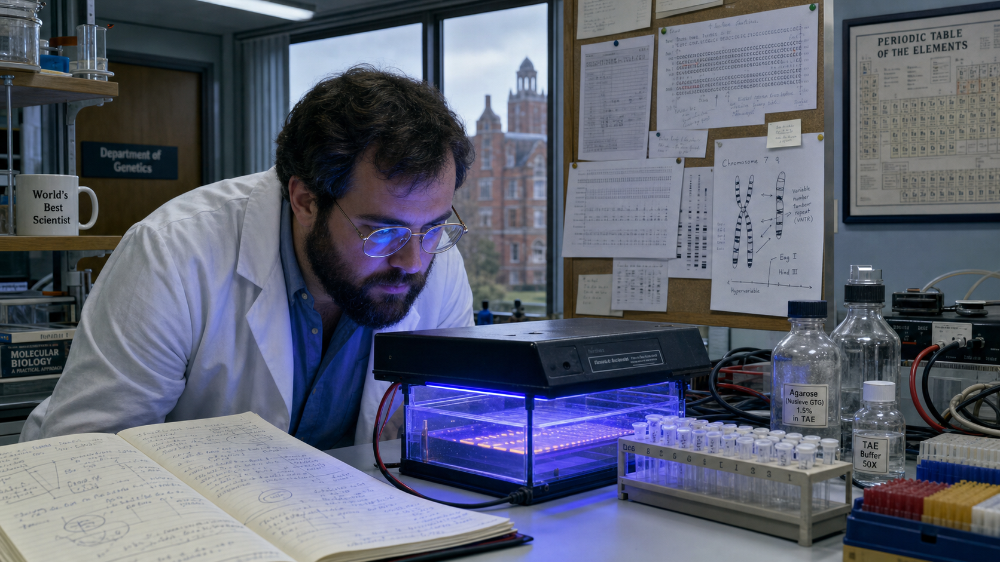

Image Prompt

(This is Panel 01. Do not include the panel number in the image.)
I am about to ask you to generate a series of images for a graphic novel. Please make the images have a consistent style and consistent characters. Do not ask any clarifying questions. Just generate the image immediately when asked.
Please generate a 16:9 image in contemporary photorealistic illustration with 1980s laboratory detailing, cool fluorescent palette depicting panel 1 of 12. The scene shows Alec Jeffreys — a stocky, broad-shouldered British man in his mid-thirties with a dark beard and wire-rimmed glasses, wearing a white lab coat over a blue collared shirt — bent over a laboratory bench at the University of Leicester, circa 1984. He is examining a glass electrophoresis gel tank under a UV transilluminator that casts a faint blue-violet glow. Open lab notebooks with handwritten annotations are spread on the bench beside him. Fluorescent overhead lights illuminate rows of Eppendorf tubes in a plastic rack, glass bottles of agarose gel, and coiled power supply cables. A large corkboard on the wall behind him is pinned with printouts of DNA sequence data and hand-drawn diagrams of chromosomes. Through a tall window, the University of Leicester red-brick campus is visible in overcast daylight. Color palette: cool fluorescent blue-white, steel grey, ivory lab notebook pages, amber gel glow. Emotional tone: focused, methodical curiosity. At least six visual details: the blue UV glow from the gel tank reflecting on Jeffreys' glasses, handwritten notes with arrows and circled data points in the notebook, a ceramic mug labelled "World's Best Scientist" partially visible on a shelf, a university department nameplate on the door reading "Department of Genetics," a rack of coloured pipette tips, and a framed periodic table on the far wall.
Generate the image immediately without asking clarifying questions.

By 1984, Alec Jeffreys and his team at the University of Leicester were deep in the study of how DNA varies between individuals. They were probing "minisatellite" regions of the genome — short sequences that repeat in highly variable patterns from person to person — trying to understand the structure of human genetic variation. It was meticulous, painstaking work: running DNA samples through gel electrophoresis, then transferring the separated fragments onto a membrane and tagging them with radioactive probes. The results appeared as X-ray films coated in dark bands. No one had yet looked at those bands and seen a face.

---

## Panel 2: Into the Developing Tank

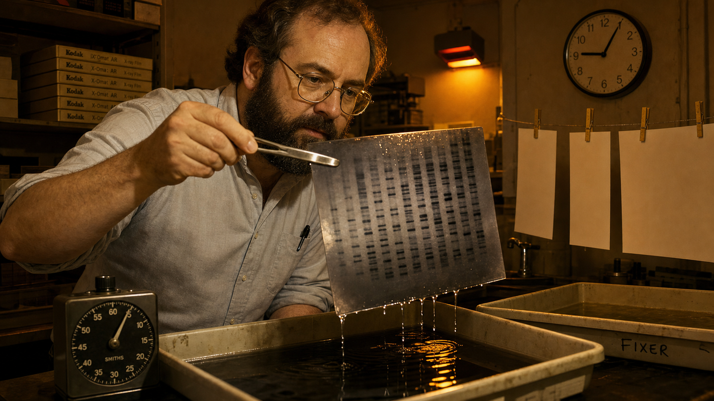

Image Prompt

(This is Panel 02. Do not include the panel number in the image.)
Make the characters and style consistent with the prior panels.
Please generate a 16:9 image in contemporary photorealistic illustration with 1980s laboratory detailing, cool fluorescent palette depicting panel 2 of 12. The scene is a darkroom adjacent to the main laboratory at the University of Leicester, 10 September 1984, early morning. Alec Jeffreys — stocky, dark beard, wire-rimmed glasses, now in rolled-up shirtsleeves without his lab coat, showing he arrived early — is leaning over a shallow developing tray filled with dark developer liquid. His right hand holds a pair of flat stainless-steel tongs gripping the edge of a large rectangular X-ray autoradiograph film that is just emerging from the tray, dripping fluid. The darkroom is lit only by a dim amber safelight mounted on the wall, casting warm amber and deep shadow across the scene. A wall-mounted timer shows 9:05 AM. Nearby, a second tray holds fixer solution, and a line of clothes-pegs on a wire above holds three already-processed blank white films drying. Color palette: deep shadow, amber safelight glow, silver-grey film surfaces, steel tray reflections. Emotional tone: quiet anticipation, the held breath before revelation. At least six visual details: developing fluid dripping from the bottom edge of the film, the amber safelight reflected in the liquid surface, a stack of fresh unexposed film boxes on a shelf, a handwritten label on a cassette reading "Sep 1984 – Minisatellite probe," the ticking analog timer on the wall, and Jeffreys' intent expression as he lifts the film toward the light.
Generate the image immediately without asking clarifying questions.

The morning of 10 September 1984 began like any other. Jeffreys arrived early to process autoradiograph films from an experiment his team had been running — DNA from several members of a technician's family, probed with a radioactive minisatellite marker. The developing tank was standard lab routine: lower the film in, wait the prescribed minutes, lift it out. It was the moment of lifting that would change everything. As the film cleared the surface of the developer, Jeffreys tilted it toward the amber safelight to check the exposure. What he saw made him freeze.

---

## Panel 3: The Eureka Moment

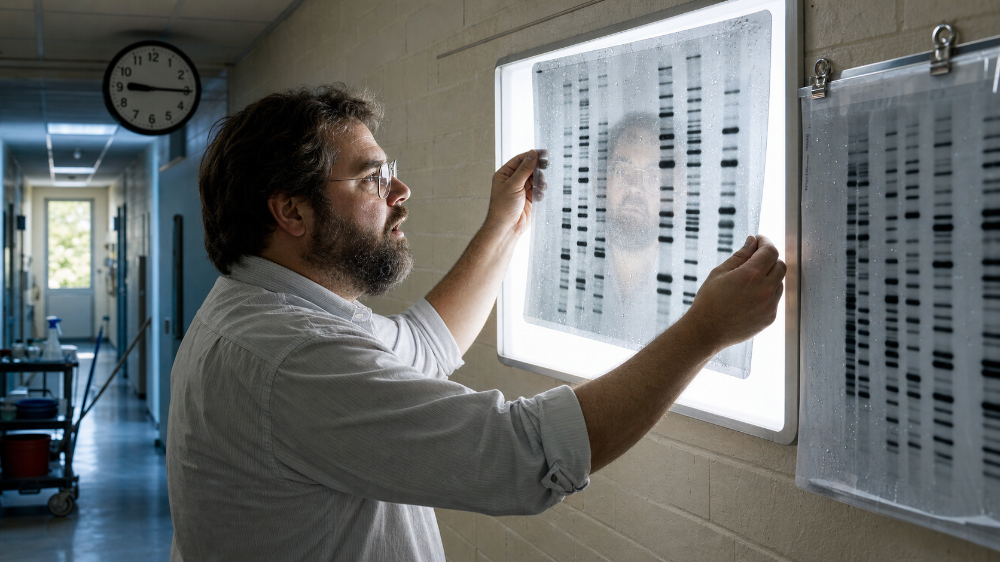

Image Prompt

(This is Panel 03. Do not include the panel number in the image.)
Make the characters and style consistent with the prior panels.
Please generate a 16:9 image in contemporary photorealistic illustration with 1980s laboratory detailing, cool fluorescent palette depicting panel 3 of 12. The scene is the corridor just outside the darkroom, University of Leicester, 10 September 1984. Alec Jeffreys — stocky, dark beard, wire-rimmed glasses, shirtsleeves rolled — holds a large wet X-ray autoradiograph film up flat against a wall-mounted fluorescent light box, both arms raised. The film shows a striking pattern of dark horizontal bands at different heights and thicknesses, like a complex barcode. His face is lit from below by the light box glow, eyes wide with astonishment and dawning comprehension. A second film hangs nearby, showing a visually different but structurally similar band pattern — each film is unique. The corridor walls are institutional cream-painted brick. A clock on the wall reads 9:15 AM. Color palette: the luminous white of the light box dominates, creating a dramatic halo around the film; the rest of the scene is cool fluorescent blue-grey. Emotional tone: pure eureka — the expression of a scientist who has just seen something the world has never seen before. At least six visual details: the distinct dark band pattern on the film clearly visible to the viewer, moisture droplets on the film surface, Jeffreys' reflection faintly visible in the light box glass, a second film with different band pattern clipped to the board beside it, a cleaning trolley parked further down the corridor, and morning light entering from a window at the corridor's end.
Generate the image immediately without asking clarifying questions.

The bands were not random noise. Each film showed a distinct pattern of dark stripes — and no two patterns were the same. Family members shared some bands but not all. The pattern was simultaneously individual and inherited. In that moment, standing in a university corridor with a dripping piece of X-ray film pressed against a light box, Jeffreys understood what he was looking at. He later described it as "one of the most astounding moments of my life." Each person, he realised, carried a unique biological barcode — written not in ink, but in the sequence of their own DNA.

---

## Panel 4: Mapping the Uses

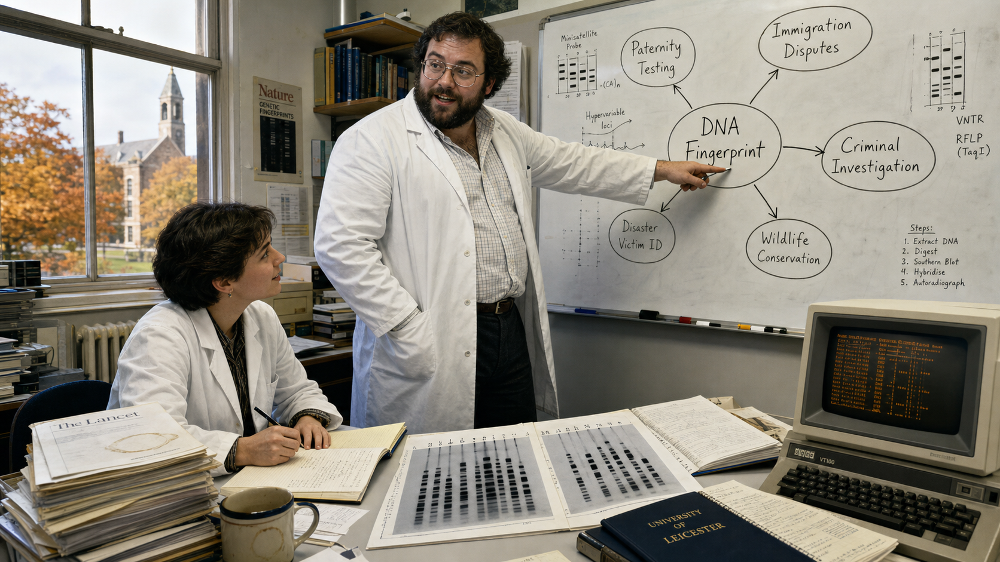

Image Prompt

(This is Panel 04. Do not include the panel number in the image.)
Make the characters and style consistent with the prior panels.
Please generate a 16:9 image in contemporary photorealistic illustration with 1980s laboratory detailing, cool fluorescent palette depicting panel 4 of 12. The scene is Alec Jeffreys' office at the University of Leicester, September–October 1984, daytime. Jeffreys — stocky, dark beard, wire-rimmed glasses, white lab coat — stands at a large whiteboard covered in his handwritten diagrams: a central bubble labelled "DNA Fingerprint" with arrows branching out to labelled bubbles reading "Paternity Testing," "Immigration Disputes," "Criminal Investigation," "Disaster Victim ID," and "Wildlife Conservation." He is mid-gesture, marker in hand, pointing to the "Criminal Investigation" bubble with evident excitement. A colleague — a younger woman in a lab coat with short dark hair — sits at a desk taking notes, looking up with engaged curiosity. On the desk: a pair of autorad films side by side, lab notebooks, a 1984-era desk computer with an amber-text monitor. Through the office window, the Leicester campus is visible in autumn light, trees turning orange. Color palette: cool fluorescent interior, warm autumn amber from the window. Emotional tone: animated intellectual energy, the excitement of grasping the full scope of a discovery. At least six visual details: the whiteboard branches clearly visible, the marker mid-air in Jeffreys' hand, the two autorad films showing different band patterns on the desk, the amber computer monitor glowing, the autumn-tinged trees outside, and a coffee cup with a ring-stain on a stack of journal articles.
Generate the image immediately without asking clarifying questions.

Jeffreys' mind moved quickly from "what is this?" to "what can this do?" Within days he was listing applications on a whiteboard. DNA samples from a biological father and child would share a predictable proportion of bands — paternity settled without ambiguity. Immigration authorities were detaining families who could not prove their relationships with documents; DNA could speak where papers could not. And if a person's DNA was as unique as a fingerprint, then biological traces left at a crime scene — blood, hair roots, saliva — could link a suspect to a location with a precision that no eyewitness testimony could match. Jeffreys had not set out to reinvent forensic science. But forensic science would never be the same.

---

## Panel 5: Reuniting a Family

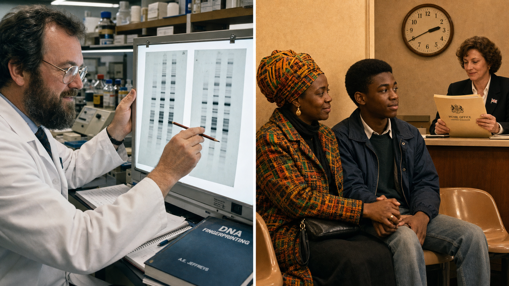

Image Prompt

(This is Panel 05. Do not include the panel number in the image.)
Make the characters and style consistent with the prior panels.
Please generate a 16:9 image in contemporary photorealistic illustration with 1980s laboratory detailing, cool fluorescent palette depicting panel 5 of 12. The scene is a split composition: on the left, Alec Jeffreys in his Leicester laboratory, circa 1985, holding two autorad films side by side on a light box, their band patterns overlapping in a visible match — he is pointing at the matching bands with a pencil, expression focused and satisfied. On the right side of the split, a warm domestic scene: a Ghanaian-British family in a British Home Office waiting room, 1985 — a mother in a bright kente-print headwrap and coat, and her teenage son, sitting on plastic chairs, the mother's hand resting on her son's as they wait. A Home Office clerk at a reception desk in the background holds a manila file. The two halves are separated by a thin vertical white band. Color palette: cool lab fluorescent on the left; warm amber office light on the right. Emotional tone: scientific precision meeting human relief. At least six visual details: the matching band pattern clearly visible on both autorad films, Jeffreys' pencil touching a specific band, the family's clasped hands, an official government stamp on the folder, a Union Jack flag pin on the clerk's lapel, and a wall clock showing 2:40 PM in the waiting room.
Generate the image immediately without asking clarifying questions.

The first real-world test of DNA fingerprinting was not a murder case — it was a family. In 1985 a Ghanaian boy living in the United Kingdom faced deportation because immigration officials doubted he was the biological son of his British-resident mother. The family turned to Jeffreys. He compared the band patterns from the mother, the boy, and siblings already confirmed in the family. The match was unambiguous: the boy was exactly who his mother said he was. The case was resolved, the deportation order overturned, and a family stayed together — all because of a pattern of dark stripes on a piece of X-ray film.

---

## Panel 6: A Case Arrives in Leicester

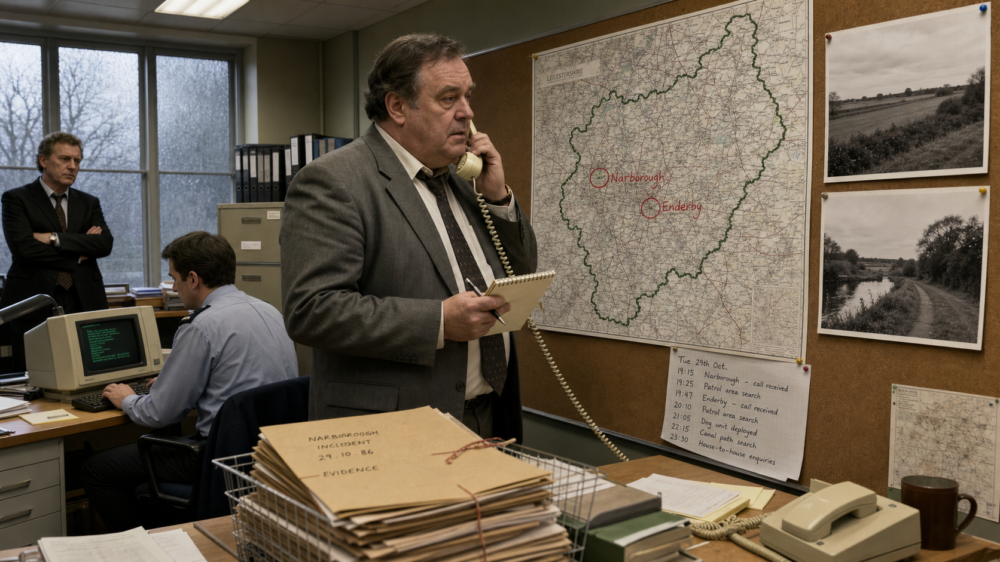

Image Prompt

(This is Panel 06. Do not include the panel number in the image.)
Make the characters and style consistent with the prior panels.
Please generate a 16:9 image in contemporary photorealistic illustration with 1980s laboratory detailing, cool fluorescent palette depicting panel 6 of 12. The scene is a Leicestershire Police incident room, 1986. A senior detective — a heavyset man in his fifties in a grey suit with a tie loosened — stands before a large map of the Leicestershire countryside pinned to a corkboard, with the villages of Narborough and Enderby circled in red marker. Beside the map are two black-and-white photographs of the Leicestershire fields (no victim imagery — only the rural landscape, hedgerows, a canal path). The detective is on the telephone, notepad in hand, pen poised. A junior officer sits at a desk with a 1986-era police computer terminal. A second detective leans against the wall, arms folded, expression grave and tired. Through a frosted window, cold grey English winter light filters in. Color palette: institutional grey-green walls, fluorescent overhead lights, muted earth tones. Emotional tone: weight and urgency, the long exhaustion of an investigation stalled without answers. At least six visual details: the circled villages on the map, the Leicestershire county outline visible on the map, the detective's notepad with written names, the frosted glass window with winter grey outside, a stack of manila evidence folders on the desk, and a handwritten timeline pinned below the map.
Generate the image immediately without asking clarifying questions.

In 1986, Leicestershire Police were investigating the murders of two teenage girls — crimes committed in 1983 and 1986 near the villages of Narborough and Enderby. In 1986 a young local man had given a confession to police, but investigators had doubts. The biological evidence from the crime scenes had been preserved, and the Chief Constable's team had heard of this new technique being developed at the University of Leicester — just 10 kilometres from the investigation's heart. They contacted Jeffreys with an unusual request: could his DNA fingerprint confirm that their suspect was responsible?

---

## Panel 7: Side by Side on the Light Box

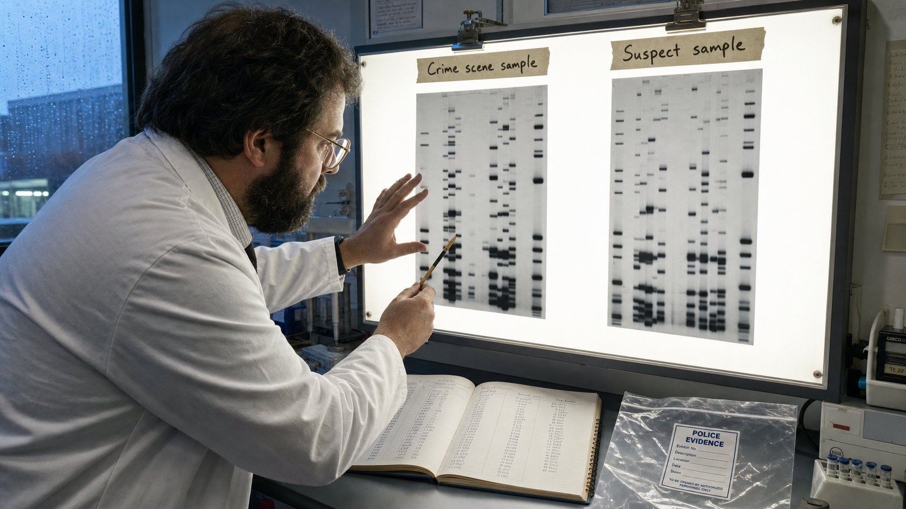

Image Prompt

(This is Panel 07. Do not include the panel number in the image.)
Make the characters and style consistent with the prior panels.
Please generate a 16:9 image in contemporary photorealistic illustration with 1980s laboratory detailing, cool fluorescent palette depicting panel 7 of 12. The scene is Alec Jeffreys' forensic analysis bench at the University of Leicester, 1986. Jeffreys — stocky, dark beard, wire-rimmed glasses, white lab coat — stands before a wide fluorescent light box mounted on the wall. On the light box, two large autorad films are clipped side by side: on the left, labelled only "Crime scene sample" in handwritten marker tape; on the right, labelled only "Suspect sample." The band patterns on the two films are clearly different — the left film has bands at positions the right film does not, and vice versa. Jeffreys is leaning forward, expression intent, left hand hovering near the left film, right hand holding a pencil pointing at a band discrepancy. A lab notebook is open on the bench below, with columns of measurements being filled in. A police evidence bag (empty, plastic, with an official label) sits to one side. Color palette: bright white light from the light box, cool fluorescent blue overhead, the grey film surfaces with stark black bands. Emotional tone: careful scientific scrutiny; the moment of a result that does not match expectation. At least six visual details: the visually distinct band patterns on the two films, the handwritten tape labels, the pencil pointing at a specific band discrepancy, the open notebook with measurements, the police evidence bag, and moisture condensation on the lab window behind.
Generate the image immediately without asking clarifying questions.

Jeffreys ran the analysis with the same rigour he applied to every experiment. Two DNA profiles, side by side on the light box: one from biological material recovered at the crime scenes, one from the suspect in custody. He examined the band positions carefully, cross-referencing the measurements in his notebook. The patterns were not the same. The bands that should have aligned if both samples came from the same individual simply did not align. The science was unambiguous, however uncomfortable its message might be for the police investigation: the young man in custody had not left those biological traces.

---

## Panel 8: The First Exoneration

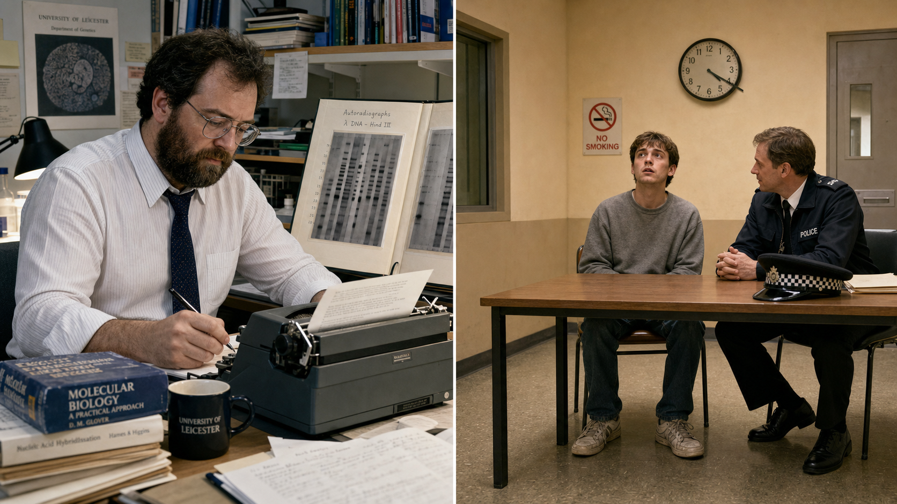

Image Prompt

(This is Panel 08. Do not include the panel number in the image.)
Make the characters and style consistent with the prior panels.
Please generate a 16:9 image in contemporary photorealistic illustration with 1980s laboratory detailing, cool fluorescent palette depicting panel 8 of 12. The scene is a split composition. On the left: Alec Jeffreys at his desk at the University of Leicester, 1986, writing a formal typed report; his expression is composed and certain, the autorad films propped on the desk beside his typewriter. On the right: a beige-walled police custody suite — a young man in his early twenties, plainly dressed in a grey jumper and jeans, seated at a plain table, a uniformed officer beside him; the young man is looking up with an expression of stunned, exhausted relief, as if he has just been told he is free to go. The split is joined by a thin white vertical line. Color palette: cool fluorescent on the left; slightly warmer institutional beige on the right. Emotional tone: the sober weight of justice corrected. At least six visual details: the typewriter on Jeffreys' desk with a partially typed page, the autorad films propped open beside it, the young man's worn trainers visible under the table, an officer's cap on the table beside him, a "No Smoking" sign on the custody suite wall, and a clock reading 4:20 PM.
Generate the image immediately without asking clarifying questions.

Jeffreys submitted his report to Leicestershire Police in 1986: the DNA evidence did not match the suspect. The confession, it turned out, had been false — extracted under pressure from a vulnerable young man who had nothing to do with either crime. Richard Buckland became the first person in history to be exonerated by DNA evidence. The very first use of DNA fingerprinting in a criminal case was not a conviction. It was an exoneration. Science had not served the prosecution — it had served the truth. Jeffreys would later cite this as one of the most important outcomes of his discovery.

---

## Panel 9: The World's First DNA Mass Screening

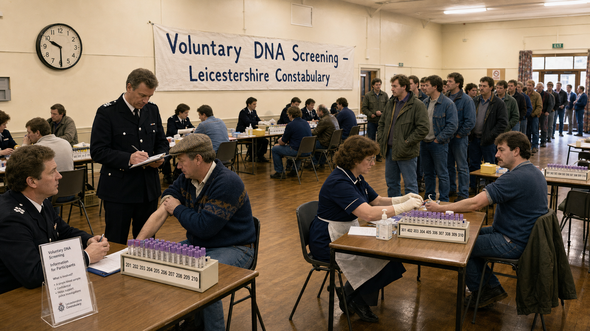

Image Prompt

(This is Panel 09. Do not include the panel number in the image.)
Make the characters and style consistent with the prior panels.
Please generate a 16:9 image in contemporary photorealistic illustration with 1980s laboratory detailing, cool fluorescent palette depicting panel 9 of 12. The scene is a large community hall in Narborough, Leicestershire, 1987 — the world's first mass DNA screening. Long tables are set up in rows across a village hall with wooden floors and fluorescent lighting. At each table, a uniformed police officer or nurse takes a blood sample from local men seated across from them, each man rolling up his sleeve. Numbered collection tubes in labelled racks line each table. A queue of men stretches back to the entrance doors — ordinary working-age men in 1980s British work clothes: parkas, jumpers, denim. A large hand-lettered banner on the back wall reads "Voluntary DNA Screening — Leicestershire Constabulary." A police information desk at the front displays a printed leaflet about the process. Color palette: warm wood floors, harsh fluorescent white overhead, institutional cream walls, the pop of colour from participants' coats. Emotional tone: civic participation mixed with quiet unease — ordinary people doing an extraordinary new thing. At least six visual details: the numbered sample tube racks on the tables, the banner on the wall, the queue stretching to the door, a man in a flat cap rolling up his sleeve, a police officer with a clipboard checking names off a list, and a large wall clock showing 10:30 AM.
Generate the image immediately without asking clarifying questions.

Without a DNA match from the suspect they had in custody, police knew the real perpetrator was still at large. In 1987 Leicestershire Police, working with Jeffreys and the newly formed Forensic Science Service, undertook something that had never been attempted anywhere in the world: they invited virtually every adult male in the surrounding villages — more than 5,000 men — to voluntarily provide a blood sample for DNA analysis. The idea was audacious. The logistics were enormous. But if the perpetrator lived locally and gave a sample, his profile would match the crime-scene evidence. For months the screening produced nothing. Then a conversation in a pub changed everything.

---

## Panel 10: Overheard at the Bar

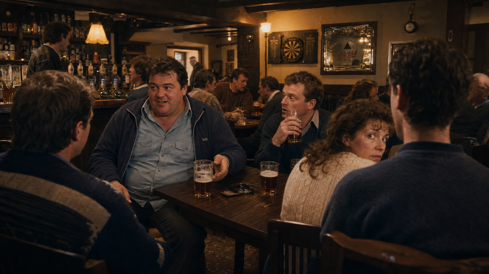

Image Prompt

(This is Panel 10. Do not include the panel number in the image.)
Make the characters and style consistent with the prior panels.
Please generate a 16:9 image in contemporary photorealistic illustration with 1980s laboratory detailing, cool fluorescent palette depicting panel 10 of 12. The scene is the interior of a traditional English pub in the Leicestershire village area, 1987, evening. Warm amber pub lighting, low wooden ceiling beams, a bar with pump handles, and tables of working-age local men in 1980s casual clothing. At a central table, a man in his late thirties — heavy build, dark hair, wearing a light-blue work shirt under a zip-up jacket — is talking to two colleagues; his posture is relaxed, unguarded. One of his companions has a pint glass halfway to his mouth and is listening with a slightly stunned expression. A woman at the adjacent table has turned her head slightly, clearly overhearing the conversation. The camera angle is from behind and to the side, as if the viewer is overhearing too. A dartboard and a framed pub mirror are visible on the far wall. Color palette: warm amber and brown pub tones, pools of lamplight, shadow at the edges. Emotional tone: the oblivious ease of a man who doesn't know the world is about to close in on him. At least six visual details: the pint glasses on the table, the man's zip-up jacket and work shirt, the companion's half-raised glass and startled expression, the woman's turned head at the adjacent table, the dartboard on the wall, and sawdust on the wooden floor by the bar.
Generate the image immediately without asking clarifying questions.

The mass screening had reached the name of Colin Pitchfork — but he never gave his own sample. He persuaded a coworker named Ian Kelly to take the test in his place, providing a false identity. For months this worked. Then, in a local pub, Ian Kelly made an offhand remark to colleagues about what he had done — how he had given a blood sample on behalf of a friend who was nervous about needles. One of the people at the table reported the conversation to police. Officers arrested Kelly, took his statement, and then went to find Colin Pitchfork. This time there would be no proxy.

---

## Panel 11: The Match That Mattered

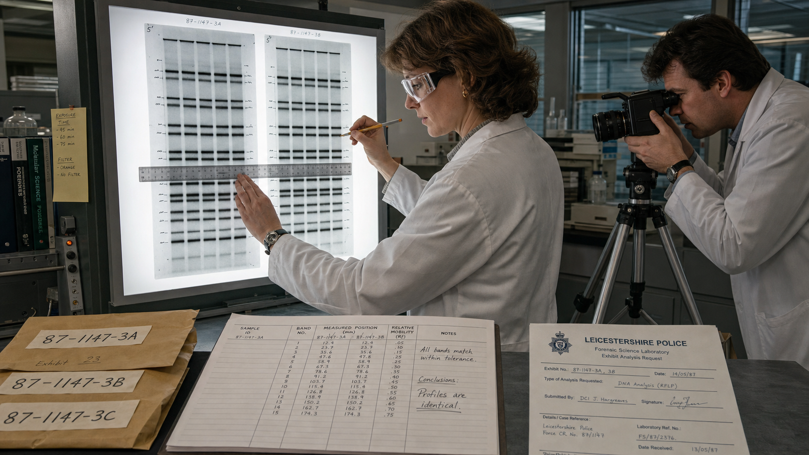

Image Prompt

(This is Panel 11. Do not include the panel number in the image.)
Make the characters and style consistent with the prior panels.
Please generate a 16:9 image in contemporary photorealistic illustration with 1980s laboratory detailing, cool fluorescent palette depicting panel 11 of 12. The scene is a forensic science laboratory, 1987–1988. A forensic scientist — a woman in her thirties in a white lab coat and safety glasses, not Jeffreys — stands at a wide light box examining two large autorad films mounted side by side. The films' band patterns are clearly identical — every dark band on the left film lines up precisely with a band on the right film. She is using a ruler and pencil to mark matching band positions; her expression is alert and certain. Beside her, a second scientist is photographing the light box with a 1980s camera on a tripod. On the bench: a police evidence log, numbered sample envelopes, and a printed request form with an official Leicestershire Police letterhead. Color palette: bright light-box white, cool fluorescent overhead, silver-grey film surfaces with stark black matching bands. Emotional tone: the quiet certainty of scientific conclusion — the evidence speaking for itself. At least six visual details: the matching band positions highlighted with small pencil marks, the ruler laid across both films, the camera on the tripod beside the light box, the police letterhead on the request form, numbered evidence envelopes on the bench, and a data recording sheet with columns of measured band positions.
Generate the image immediately without asking clarifying questions.

When police obtained Colin Pitchfork's actual DNA sample and sent it to the laboratory for analysis, forensic scientists placed his autoradiograph film alongside the profile from the crime-scene evidence. The match was exact — every band in alignment, at every position. The random-match probability was calculated to be vanishingly small: a statistic that placed the probability of a coincidental match among unrelated individuals in the billions-to-one range. In January 1988 Colin Pitchfork pleaded guilty and was sentenced to life imprisonment. He became the first person in history to be convicted of murder on the basis of DNA evidence — caught because a colleague talked in a pub.

---

## Panel 12: A Tool for Truth

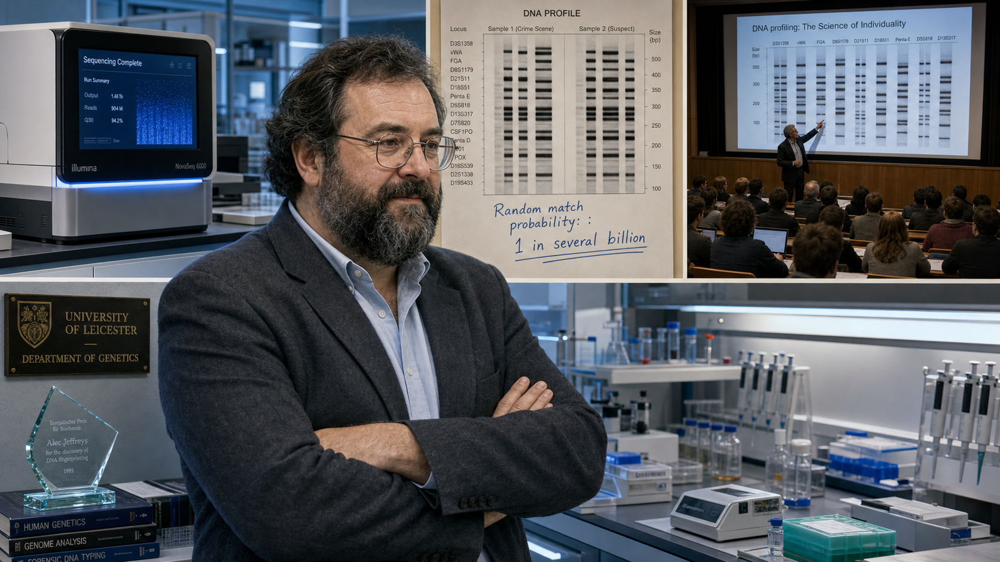

Image Prompt

(This is Panel 12. Do not include the panel number in the image.)
Make the characters and style consistent with the prior panels.
Please generate a 16:9 image in contemporary photorealistic illustration with 1980s laboratory detailing, cool fluorescent palette depicting panel 12 of 12. The scene is a montage-style composition showing the legacy of Jeffreys' discovery, set across different time periods. In the foreground, Alec Jeffreys — now older, grey threading his dark beard, same wire-rimmed glasses — stands in a modern genetics laboratory, arms folded, a slight satisfied expression. Behind him, in a stylised triptych that recedes into the background: LEFT panel shows a modern automated DNA sequencer machine with glowing blue display; CENTRE panel shows a stylised DNA profile printout with vertical bands and a statistical annotation "Random match probability: 1 in several billion" handwritten beside it; RIGHT panel shows a university lecture hall where a professor points to a projected DNA banding diagram for students. A wall plaque behind Jeffreys reads "University of Leicester — Department of Genetics." Color palette: cool modern laboratory blue-white in the foreground; each triptych panel has a slightly different tone — clinical white, documentation ivory, lecture-hall warm amber. Emotional tone: quiet satisfaction of a life's work that became the foundation of a field. At least six visual details: the modern DNA sequencer display, the statistical annotation on the profile printout, the lecture hall students taking notes, Jeffreys' grey-streaked beard, the university department plaque, and a glass trophy or award partially visible on a shelf beside him.
Generate the image immediately without asking clarifying questions.

The technique Jeffreys developed in 1984 has since been refined many times over. Modern forensic DNA analysis uses Short Tandem Repeat (STR) profiling — faster, requiring far smaller samples, and producing profiles that can be compared against national databases containing millions of records. The fundamental principle, however, is unchanged: every person's DNA varies in ways unique to that individual, and a profile derived from biological evidence at a crime scene can be compared against a suspect's profile. A match is expressed as a random-match probability — not certainty, but a statistic. Contamination, transfer, and the quality of interpretation all matter. The science serves the truth, Jeffreys always insisted. Not the prosecution. Not the defence. The truth.

---

### Epilogue – What Made Jeffreys Different?

Alec Jeffreys did not discover DNA fingerprinting by looking for it. He discovered it by looking carefully at something nobody had taken the time to look at carefully before. What distinguished him was not a better theory but a better habit: when the data said something unexpected, he stopped and listened to it instead of filing it away. The Pitchfork case demonstrated that the same technique capable of implicating a guilty person is equally capable — and equally obligated — to exonerate an innocent one. That double-edged principle is now written into every forensic DNA standard in the world.

| Challenge | How Jeffreys Responded | Lesson for Today |
|---|---|---|
| Unexpected experimental result | Stopped work and analysed the anomaly instead of dismissing it | Scientific breakthroughs often hide in data that doesn't fit the expected pattern |
| Police expected DNA to confirm guilt | Reported what the evidence showed — a non-match — regardless of the investigation's preferred outcome | Forensic scientists must report evidence neutrally; their duty is to the truth, not to a particular verdict |
| Mass screening produced no early result | Continued the process systematically; the answer eventually surfaced through non-scientific means | Rigorous method plus patient persistence — even when progress is invisible |
| DNA evidence could be misunderstood as absolute | Always expressed matches as random-match probabilities, not certainties | A statistic is not a verdict; interpretation, contamination risk, and context always matter |

---

### Call to Action

The next time you hear that DNA "proved" someone guilty, pause and ask the more precise question: what was the random-match probability, and what does it actually mean? Science speaks in probabilities and evidence, not in verdicts. Every person who understands that distinction — every juror, every journalist, every student — makes the justice system a little more accurate. That is what Jeffreys gave us: not just a technique, but a standard of evidence worth holding on to.

---

*"It was a eureka moment, without any doubt the most exciting of my career. One look at the film and we immediately saw the potential for individual identification."*
—Sir Alec Jeffreys

*"DNA evidence is a powerful tool in the investigation of crime, but it is not infallible. It has to be interpreted carefully, and it can exonerate the innocent just as readily as it can implicate the guilty."*
—Sir Alec Jeffreys

## References

1. [Wikipedia: Alec Jeffreys](https://en.wikipedia.org/wiki/Alec_Jeffreys) — Biography of the British geneticist who invented DNA fingerprinting at the University of Leicester in 1984
2. [Wikipedia: DNA profiling](https://en.wikipedia.org/wiki/DNA_profiling) — Overview of DNA fingerprinting and forensic DNA analysis, including the development of STR profiling and national databases
3. [Wikipedia: Colin Pitchfork](https://en.wikipedia.org/wiki/Colin_Pitchfork) — Article on the 1988 case in which Pitchfork became the first person convicted of murder using DNA evidence
4. [Encyclopaedia Britannica: Alec Jeffreys](https://www.britannica.com/biography/Alec-Jeffreys) — Curated encyclopaedic biography covering Jeffreys' discovery, its applications, and his recognition including a knighthood
5. [University of Leicester: The Discovery of DNA Fingerprinting](https://le.ac.uk/dna-fingerprinting) — The University of Leicester's own account of Jeffreys' discovery, the Pitchfork case, and the lasting impact of the technique developed in its laboratories
