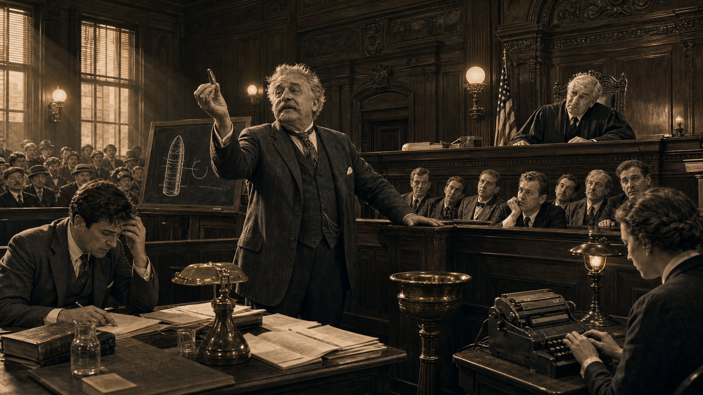
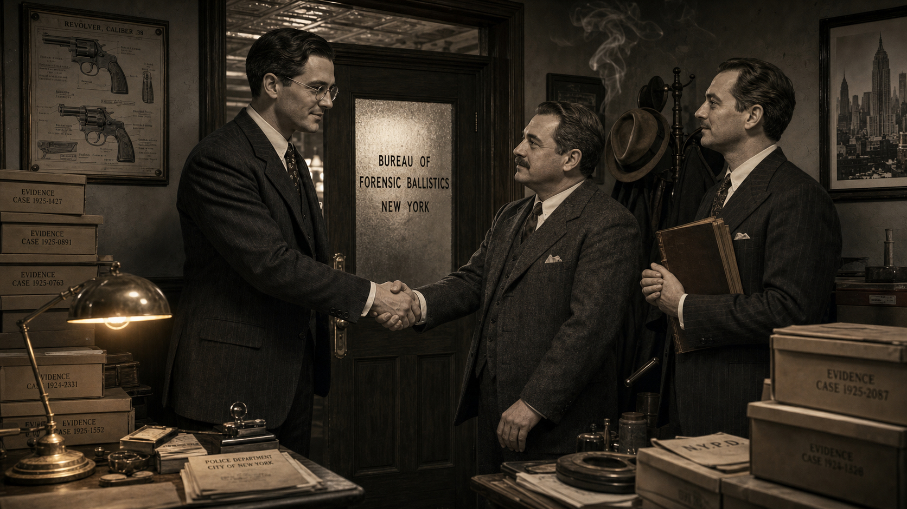
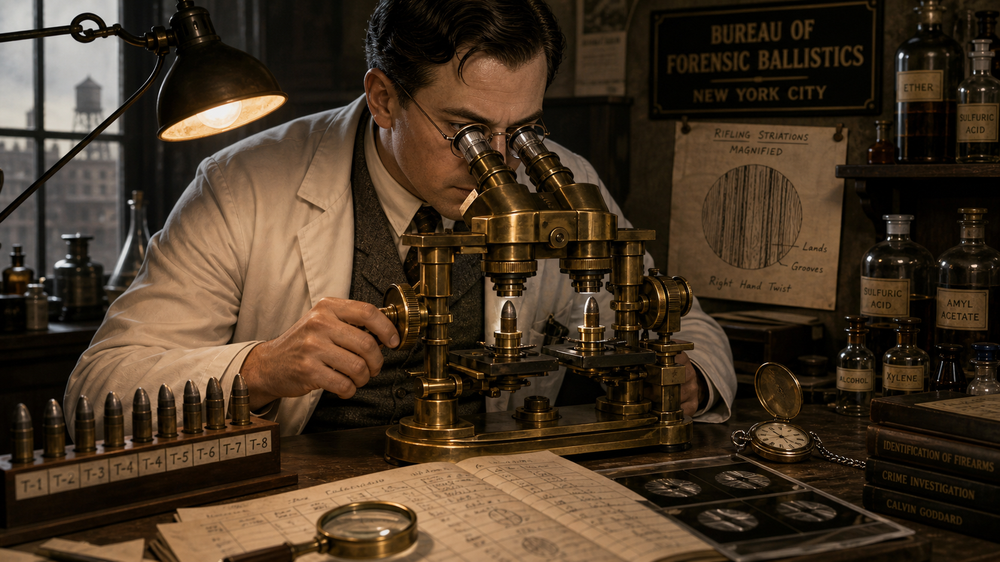
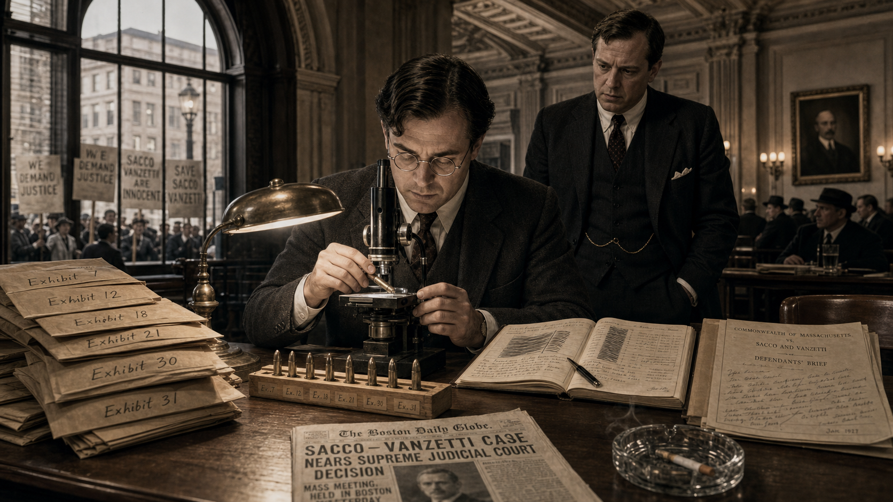
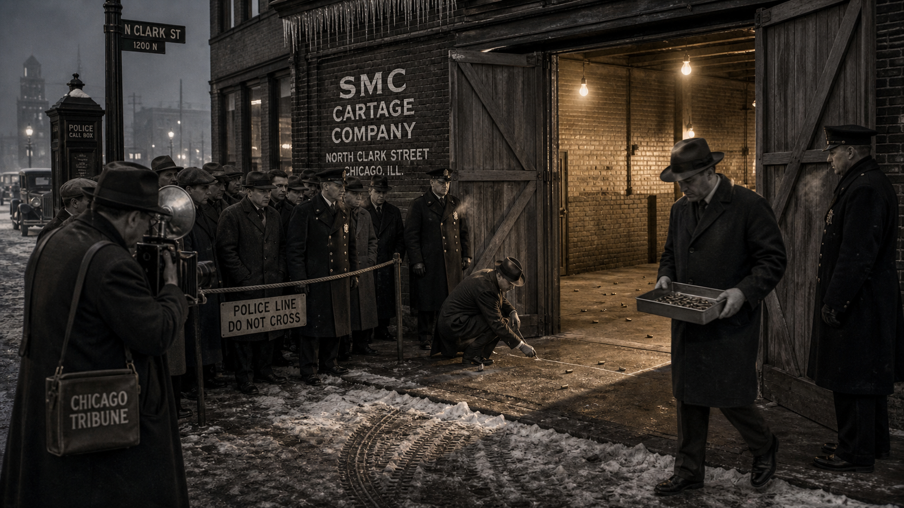
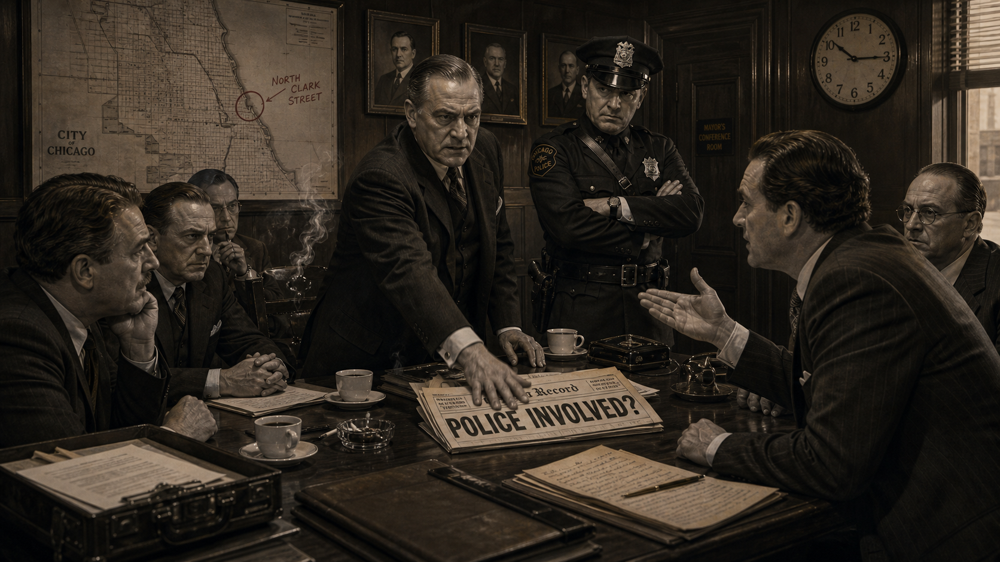
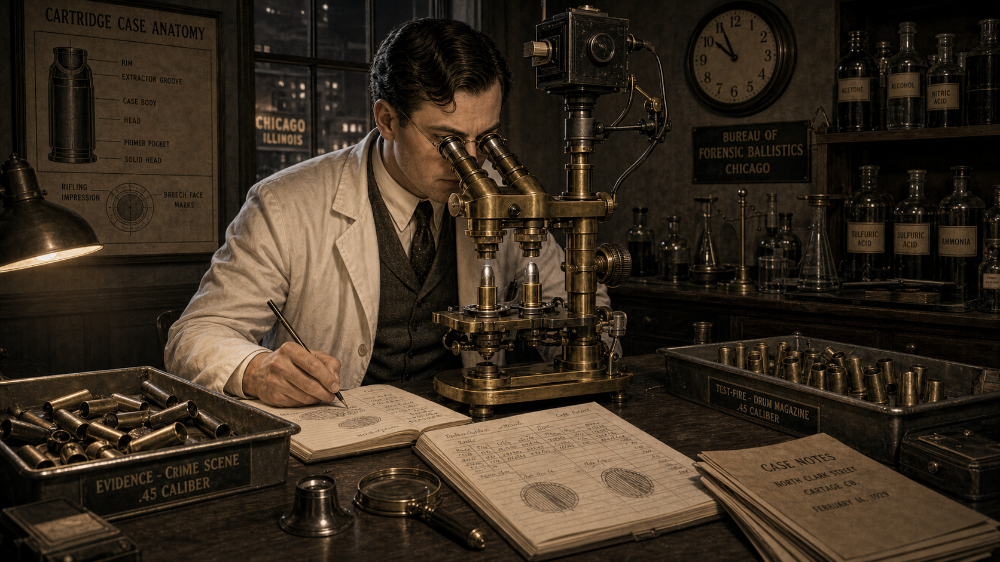
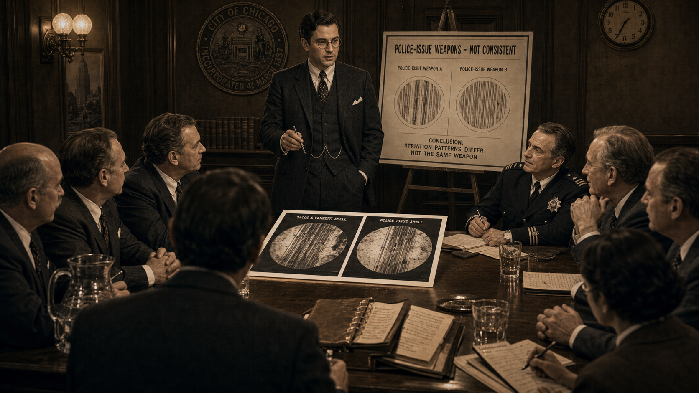
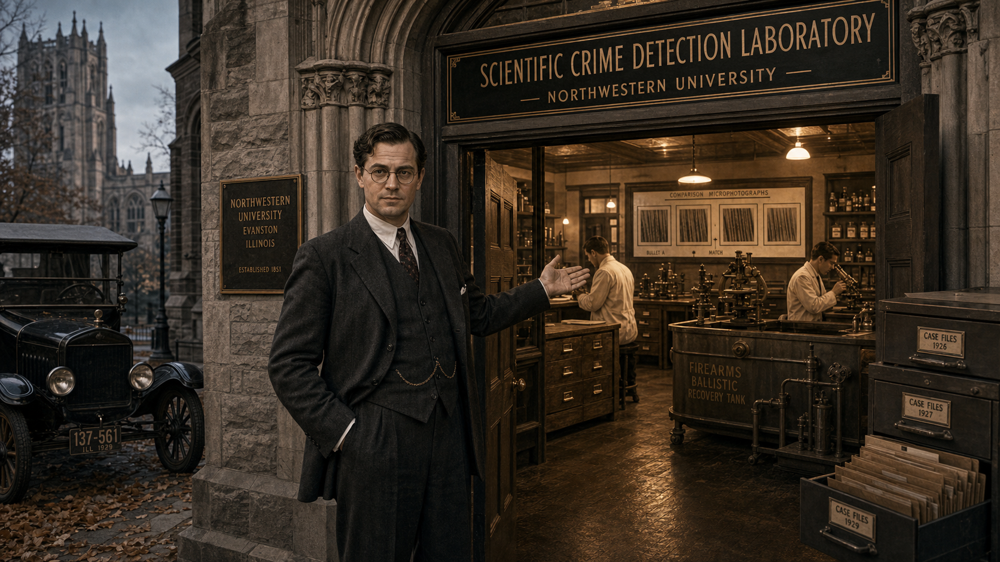

# The Bullet Whisperer: Calvin Goddard and the Birth of Forensic Ballistics

Cover Image Prompt

(This is the Cover Image. Do not include this label in the image.)

A dramatic 1920s Art Deco / Prohibition-era noir illustration cover for a graphic novel titled "The Bullet Whisperer" in a bold period-appropriate serif typeface with Art Deco ornamental flourishes. The central figure is Calvin Goddard — a tall, sharp-featured man in his mid-30s wearing a well-pressed 1920s three-piece suit with a pocket square, round wire-rimmed spectacles, and a precise part in his dark hair — leaning intently over a gleaming brass comparison microscope. His expression is focused, almost reverent. Behind him, a foggy Chicago skyline (year: 1929, CHICAGO USA) fades into amber-tinted shadow. In the lower foreground, two spent bullet casings rest on a white evidence cloth, their bases catching lamplight. The palette is smoky monochrome with warm amber highlights and deep charcoal shadows. Subtle geometric Art Deco border frames the entire composition. Mood: intellectual determination, Prohibition-era tension, scientific precision. Visual details include: microscope oculars gleaming, faint brick wall texture in background, a yellowed case file folder labeled "EVIDENCE," a faint Chicago Tribune headline visible on the desk, dramatic low-angle stage lighting, and the subtitle "The Birth of Forensic Ballistics" in smaller italic type beneath the main title.
Generate the image immediately without asking clarifying questions.

Narrative Prompt

Background: This graphic novel tells the true story of Calvin Hooker Goddard (1891–1955), American physician, U.S. Army ordnance officer, and co-founder of the Bureau of Forensic Ballistics in New York City. Goddard pioneered the use of the comparison microscope to match bullets and cartridge cases to specific firearms through microscopic examination of rifling striations and breech-face marks. His work from 1925 to 1929 culminated in his examination of ballistic evidence from the Saint Valentine's Day Massacre (Chicago, 14 February 1929), which led directly to the founding of the Scientific Crime Detection Laboratory at Northwestern University — widely considered the first independent forensic science laboratory in the United States.

Era: 1920s America — Prohibition, gangland violence, jazz clubs, Art Deco architecture, Model T Fords, telegraphs, gas lamps giving way to electric bulbs, men in fedoras and three-piece suits.

Central theme: Science replacing speculation. At the time, courtroom "firearms experts" relied on personal impression and assertion rather than reproducible method. Goddard insisted that physical evidence — microscopic tool marks left by a gun's barrel, firing pin, and extractor on every bullet and casing it produces — could be examined systematically, documented photographically, and compared to test-fire samples in a rigorous, repeatable way.

Character consistency note: Calvin Goddard should appear consistently throughout as a tall man in his mid-30s, sharp-featured, wire-rimmed round spectacles, dark hair parted on the side, wearing a 1920s three-piece suit in street scenes and a white lab coat over his suit at the microscope. His partner Philip Gravelle may appear as a slightly shorter, stocky man with a mustache. The comparison microscope should look the same in every panel where it appears: a large, heavy brass instrument with two stage platforms and a shared ocular bridge.

### Prologue – When a Bullet Could Get Away with Murder

In the early 1920s, American courtrooms were theatres of confident assertion. A witness called himself a "firearms expert" and declared, based on nothing more than a glance and a career's worth of opinion, whether a bullet came from a particular gun. Judges accepted it. Juries believed it. Defense attorneys could do little but hire a louder expert to shout the opposite. The truth, if it lived anywhere, was trapped inside microscopic grooves on a spent bullet — grooves no one yet knew how to read.

---

## Panel 1: The Problem with Experts

Image Prompt

(This is Panel 1. Do not include the panel number in the image.)

I am about to ask you to generate a series of images for a graphic novel. Please make the images have a consistent style and consistent characters. Do not ask any clarifying questions. Just generate the image immediately when asked.

Please generate a 16:9 image in 1920s Art Deco / Prohibition-era noir illustration, smoky monochrome with amber highlights depicting panel 1 of 9. The scene should include a wood-paneled American courtroom (YEAR: 1922, NEW YORK CITY), a pompous gray-haired "expert witness" in a rumpled suit gesturing grandly toward the jury box while holding a single deformed bullet between his fingers, and a frustrated young attorney at the defense table clutching his head in disbelief. A bemused judge peers down from the bench. Color palette: deep charcoal, ivory, amber gaslight glow. Emotional tone: absurdity tinged with injustice. Visual details include: ornate carved wood paneling behind the judge's bench, a brass spittoon near the witness stand, spectators packed into gallery benches, a chalkboard with crude hand-drawn bullet diagram, a court reporter hunched over a stenotype machine, and tall narrow windows admitting dusty shafts of amber light.
Generate the image immediately without asking clarifying questions.

Before the 1920s, American courts accepted firearms "experts" whose methods amounted to professional intuition. A witness might hold two bullets side by side, squint, and declare them a match — or not — with no reproducible technique and no documentation. Opposing experts routinely contradicted each other with equal conviction, leaving juries to guess which confident man sounded more persuasive. The problem was not that the science was hard; the problem was that no real science existed yet. Calvin Goddard, then a young U.S. Army physician with a deep interest in ordnance, had begun to suspect that microscopic marks on bullets told a story — if only someone built the right instrument to read it.

---

## Panel 2: The Bureau Is Born

Image Prompt

(This is Panel 2. Do not include the panel number in the image.)

Make the characters and style consistent with the prior panels.

Please generate a 16:9 image in 1920s Art Deco / Prohibition-era noir illustration, smoky monochrome with amber highlights depicting panel 2 of 9. The scene should include Calvin Goddard — tall, mid-30s, wire-rimmed round spectacles, dark side-parted hair, sharp features, 1920s three-piece suit — shaking hands with his colleague Philip Gravelle (slightly shorter, stocky, mustached, also in a three-piece suit) in front of a frosted-glass office door stenciled "BUREAU OF FORENSIC BALLISTICS — NEW YORK" (YEAR: 1925, NEW YORK CITY). A third colleague, Charles Waite, stands to the side holding a thick leather-bound ledger. Color palette: smoky monochrome with amber lamplight. Emotional tone: founding optimism, professional resolve. Visual details include: Art Deco brass door hardware, a hat rack loaded with fedoras, stacks of evidence boxes labeled with case numbers, a framed firearms diagram on the wall, an electric desk lamp casting warm amber light, and cigarette smoke curling toward the tin ceiling.
Generate the image immediately without asking clarifying questions.

In 1925, Calvin Goddard joined colleagues Philip Gravelle and Charles Waite to establish the Bureau of Forensic Ballistics in New York City — one of the first organizations in the world dedicated exclusively to scientific firearms examination. Their founding principle was deceptively simple: every gun barrel's interior is unique, machined and worn in ways that leave distinctive microscopic striations on every bullet it fires and distinctive marks on every cartridge case it ejects. Those marks could, in theory, be systematically compared. The challenge was building a tool precise enough to make that comparison reliable and a methodology rigorous enough to stand up in court. Goddard was already certain the technology was within reach.

---

## Panel 3: The Comparison Microscope

Image Prompt

(This is Panel 3. Do not include the panel number in the image.)

Make the characters and style consistent with the prior panels.

Please generate a 16:9 image in 1920s Art Deco / Prohibition-era noir illustration, smoky monochrome with amber highlights depicting panel 3 of 9. The scene should include Calvin Goddard in a white lab coat over his three-piece suit, leaning over a large gleaming brass comparison microscope with two stage platforms and a shared ocular bridge (YEAR: 1925–1927, NEW YORK CITY LAB). Two bullets are mounted on the microscope stages. Goddard peers through the oculars, one hand adjusting a fine-focus knob. On the lab bench beside him: handwritten data sheets, a row of test-fire bullet samples in a labeled rack, a magnifying loupe, and photographic glass plates. Color palette: warm amber lamplight against deep charcoal shadow, brass instrument highlights. Emotional tone: quiet scientific breakthrough, concentrated wonder. Visual details include: the split-field view visible as a faint reflection in the microscope oculars, a hand-drawn sketch of rifling striations pinned to the wall, chemical bottles on a shelf, a pocket watch open on the bench, window casting pale morning light, and the Bureau of Forensic Ballistics name on a placard in the background.
Generate the image immediately without asking clarifying questions.

Gravelle and Goddard adapted an existing optical instrument — the comparison microscope — to place two bullets side by side in a single shared field of view, allowing an examiner to align the microscopic rifling striations on one bullet with those on another and observe continuity across the join. The innovation was not the microscope itself but the rigorous protocol Goddard developed around it: test-fire known weapons into a recovery medium, mount the test-fire bullet alongside the evidence bullet, rotate both under magnification, photograph the alignment, and document every step. For the first time, a firearms comparison could be reproduced, challenged, and independently verified. The era of scientific ballistics had quietly begun.

---

## Panel 4: Sacco, Vanzetti, and the Weight of Evidence

Image Prompt

(This is Panel 4. Do not include the panel number in the image.)

Make the characters and style consistent with the prior panels.

Please generate a 16:9 image in 1920s Art Deco / Prohibition-era noir illustration, smoky monochrome with amber highlights depicting panel 4 of 9. The scene should include Calvin Goddard in his three-piece suit seated at a long wooden table covered in evidence envelopes and labeled bullet specimens (YEAR: 1927, BOSTON, MASSACHUSETTS COURTHOUSE). He examines a bullet under a portable comparison microscope while an attorney in a dark suit watches nervously nearby. Through a tall arched window, protesters holding signs are visible outside in the street. Color palette: charcoal gray, ivory paper, amber desk lamp. Emotional tone: grave solemnity, the crushing weight of a life-or-death examination. Visual details include: stacked manila evidence envelopes labeled with exhibit numbers, a Boston newspaper visible with the headline partially legible, a glass ashtray with a smoldering cigarette, a legal brief covered in handwritten margin notes, the ornate plaster ceiling of a government building, and Goddard's data notebook open to a page of sketched striation patterns.
Generate the image immediately without asking clarifying questions.

In 1927, Goddard was invited to re-examine the ballistic evidence in the Sacco and Vanzetti case — one of the most contested criminal trials of the decade, in which two Italian-American anarchists faced the electric chair partly on disputed firearms evidence. Goddard's comparison microscope examination of the recovered bullets and cartridge cases led him to conclude that the striations were consistent with Sacco's pistol having fired one of the fatal bullets — a finding that aligned with the prosecution's position, though Goddard was careful to frame it in terms of physical consistency rather than absolute certainty. The case illustrated both the power of the new methodology and its limits: scientific evidence could sharpen the question, but examiner judgment remained central, and the political atmosphere around the trial made objective evaluation nearly impossible.

---

## Panel 5: A Chicago Garage, a February Morning

Image Prompt

(This is Panel 5. Do not include the panel number in the image.)

Make the characters and style consistent with the prior panels.

Please generate a 16:9 image in 1920s Art Deco / Prohibition-era noir illustration, smoky monochrome with amber highlights depicting panel 5 of 9. The scene shows the cordoned exterior and interior doorway of the SMC Cartage Company brick garage on North Clark Street (YEAR: 14 FEBRUARY 1929, CHICAGO, ILLINOIS). Police officers in dark wool coats and peaked caps stand at a rope barrier keeping back a crowd of onlookers and newspaper reporters. A detective in a fedora crouches near the entrance, chalk-marking the floor. An evidence technician carries a metal tray holding spent shell casings. The garage's wide wooden doors are ajar, revealing only a sweep of concrete floor lit by bare electric bulbs — no victims visible, only the aftermath: scattered shell casings on the floor and a brick wall. Color palette: cold blue-gray winter light, amber interior light spilling through the doorway, deep shadow. Emotional tone: grim solemnity, procedural urgency. Visual details include: a Chicago Tribune newspaper photographer with a large flash camera, icicles on the eave above the garage door, tire tracks in slushy street, a police call box on the corner, uniformed officers' breath visible in cold air, and a hand-lettered "POLICE LINE — DO NOT CROSS" sign on the rope barrier.
Generate the image immediately without asking clarifying questions.

On Valentine's Day 1929, in a rented brick garage at 2122 North Clark Street in Chicago, seven men associated with the Moran bootlegging operation were shot dead in what became known as the Saint Valentine's Day Massacre. Chicago police arrived to find the scene littered with spent cartridge cases and bullet fragments. No witnesses came forward and no one was immediately charged. Within hours, reporters and politicians began speculating about who had done it — and the rumors that reached Coroner Herman Bundesen were alarming enough that he appointed a citizens' committee, which in turn called on the nation's leading firearms examiner.

---

## Panel 6: The Rumor

Image Prompt

(This is Panel 6. Do not include the panel number in the image.)

Make the characters and style consistent with the prior panels.

Please generate a 16:9 image in 1920s Art Deco / Prohibition-era noir illustration, smoky monochrome with amber highlights depicting panel 6 of 9. The scene shows a tense meeting inside a Chicago government conference room (YEAR: FEBRUARY 1929, CHICAGO CITY HALL). A stern city official in a dark suit slaps a newspaper headline onto a conference table; the headline reads "POLICE INVOLVED?" A uniformed police captain stands stiffly with arms crossed, expression furious. Across the table, a citizens' committee member in a business suit leans forward arguing. A wall clock reads 10:15. Color palette: harsh overhead electric light, charcoal shadows, amber wood paneling. Emotional tone: political tension, institutional suspicion, urgency. Visual details include: a large wall map of Chicago with North Clark Street circled in red grease pencil, cigarette smoke hanging in the air, coffee cups on the table, a telephone on a side credenza, briefcases open with scattered papers, and framed portraits of Chicago officials on the wood-paneled wall.
Generate the image immediately without asking clarifying questions.

A disturbing theory spread through Chicago within days of the massacre: the killers had worn police uniforms, and two witnesses had seen what appeared to be a police squad car leaving the scene. Were rogue officers responsible? The question threatened to shatter public trust in the Chicago Police Department and inflame an already volatile political situation. The citizens' committee demanded a scientific answer — not an opinion, not a press conference, but hard physical evidence. They needed someone who could look at the recovered ammunition and tell them, definitively and defensibly, what type of weapon had fired it.

---

## Panel 7: Test Fires and the Microscope

Image Prompt

(This is Panel 7. Do not include the panel number in the image.)

Make the characters and style consistent with the prior panels.

Please generate a 16:9 image in 1920s Art Deco / Prohibition-era noir illustration, smoky monochrome with amber highlights depicting panel 7 of 9. The scene shows Calvin Goddard in a white lab coat at his large brass comparison microscope in a Chicago laboratory (YEAR: EARLY 1929, CHICAGO, ILLINOIS). On the bench to his left: a labeled evidence tray holding spent .45-caliber shell casings collected from the crime scene. On his right: a tray of freshly test-fired casings from a drum-magazine submachine gun (depicted generically — no brand markings visible). Goddard peers through the oculars, pencil in hand, sketching striation patterns in his notebook. A photographic camera is mounted above the microscope for documentation. Color palette: amber lamplight, deep shadow, gleaming brass and polished steel. Emotional tone: meticulous concentration, scientific rigor. Visual details include: the dual microscope stages clearly showing two shell casings mounted for comparison, a wall chart of cartridge case anatomy, Goddard's handwritten case notes with ruled tables, chemical reagent bottles on a back shelf, a clock on the wall showing late evening, and the shared ocular bridge of the comparison microscope prominently featured.
Generate the image immediately without asking clarifying questions.

Goddard traveled to Chicago, collected the recovered bullets and cartridge cases from the evidence room, and obtained submachine guns from both the Chicago Police Department's arsenal and from private sources for test-firing. Working at the comparison microscope, he mounted crime-scene casings alongside test-fire casings from each candidate weapon in turn, methodically rotating both and looking for the continuous alignment of microscopic firing-pin impressions, extractor marks, and ejector marks that would indicate the same weapon had produced both. The process was painstaking — 70 cartridge cases and 14 bullets required examination — but the comparison microscope made the results visible, documentable, and reproducible.

---

## Panel 8: The Evidence Speaks

Image Prompt

(This is Panel 8. Do not include the panel number in the image.)

Make the characters and style consistent with the prior panels.

Please generate a 16:9 image in 1920s Art Deco / Prohibition-era noir illustration, smoky monochrome with amber highlights depicting panel 8 of 9. The scene shows Calvin Goddard standing at a conference table before the Chicago citizens' committee (YEAR: 1929, CHICAGO, ILLINOIS), presenting his findings with quiet authority. On the table before him: two large photographic prints showing side-by-side microscope views of striation patterns on shell casings. A chart on an easel beside him reads "POLICE-ISSUE WEAPONS — NOT CONSISTENT" with a clear diagram. The committee members — businessmen in dark suits — lean forward with visible relief. A police captain in uniform sits to one side, expression shifting from defensive to relieved. Color palette: amber meeting-room light, charcoal suits, white photographic prints glowing on the table. Emotional tone: quiet vindication, the authority of evidence over rumor. Visual details include: the photographic comparison prints clearly showing two striation patterns side by side, a leather document folder open beside the prints, Goddard's wire-rimmed spectacles catching the light, a wall clock, framed city seal of Chicago on the wall, and a stenographer's notepad on the table.
Generate the image immediately without asking clarifying questions.

Goddard's conclusion was unambiguous in its direction but precisely worded: the striations, firing-pin impressions, and extractor marks on the crime-scene cartridge cases were consistent with having been fired by Thompson-type drum-magazine submachine guns, and were not consistent with any of the police-issue weapons he had test-fired. The physical evidence did not support the theory of police involvement. The citizens' committee received his report with photographic documentation attached — the first time a major American criminal investigation had been resolved (or narrowed) with photographically documented comparison microscopy. The rumor had met its match: reproducible physical evidence.

---

## Panel 9: A Laboratory Is Born

Image Prompt

(This is Panel 9. Do not include the panel number in the image.)

Make the characters and style consistent with the prior panels.

Please generate a 16:9 image in 1920s Art Deco / Prohibition-era noir illustration, smoky monochrome with amber highlights depicting panel 9 of 9. The scene shows Calvin Goddard standing proudly at the entrance of a newly established university laboratory, a sign above the door reading "SCIENTIFIC CRIME DETECTION LABORATORY — NORTHWESTERN UNIVERSITY" (YEAR: 1929, EVANSTON, ILLINOIS). Behind him through the open door, a modern forensic lab is visible: comparison microscopes on benches, filing cabinets of case files, a firearms ballistic recovery tank, and shelves of reference specimens. Two young research assistants in white lab coats work at benches inside. Northwestern University's Gothic stone architecture frames the scene. Color palette: warm amber interior light spilling through the doorway, cool blue-gray exterior daylight, stone archways. Emotional tone: quiet triumph, institutional permanence, optimistic beginning. Visual details include: the lab sign in Art Deco lettering, a brass plaque beside the door, Goddard in three-piece suit gesturing welcomingly toward the lab interior, autumn leaves on the ground, a Model T Ford parked outside, and framed prints of microscope comparison photographs visible on the lab wall through the doorway.
Generate the image immediately without asking clarifying questions.

The Saint Valentine's Day Massacre investigation became a turning point not just in the case itself but in the history of American forensic science. Civic leaders in Chicago, impressed by the power of Goddard's methodology, funded the establishment of the Scientific Crime Detection Laboratory at Northwestern University in Evanston, Illinois in 1929 — the first independent, university-based forensic science laboratory in the United States. Goddard was appointed its director. For the first time, firearms comparison, questioned-document examination, and criminal investigation techniques would be taught, practiced, and refined in an academic setting, insulated from political pressure. The era of forensic science as a discipline — not merely a courtroom performance — had officially begun.

---

### Epilogue – What Made Goddard Different?

Calvin Goddard did not discover that bullets carry marks; firearms examiners had known that for decades. What he built was a method: controlled test fires, documented comparisons, photographic records, and a shared optical instrument that allowed a second examiner to see exactly what the first examiner had seen. That insistence on reproducibility was not merely a technical choice — it was an ethical one, placing evidence above assertion and process above personality. His legacy is complicated by modern scrutiny: the 2009 National Academy of Sciences report and the 2016 PCAST report both flagged toolmark comparison as a discipline that still needs stronger error-rate research and blind validation studies. But the foundation Goddard laid — that firearms evidence must be examined systematically and documented openly — remains the essential starting point for every reform that follows.

| Challenge | How Goddard Responded | Lesson for Today |
|---|---|---|
| Courts accepted untested "expert" opinion | Built a documented, reproducible comparison protocol | Forensic methods need published error rates and validation |
| No standard instrument for bullet comparison | Adapted the comparison microscope with a shared ocular bridge | Tools must allow a second examiner to verify the first |
| Political pressure to assign blame quickly | Issued findings based solely on physical evidence, with documentation | Science serves justice best when insulated from institutional pressure |
| Evidence conclusions treated as absolute | Used careful language: "consistent with" rather than "proves" | Certainty claims must match the actual strength of the evidence |

---

### Call to Action

Next time you read a forensic report, look for two things: does the examiner describe a documented comparison method, and do they state what the evidence is "consistent with" rather than what it "proves"? Those two habits — reproducible method and honest language about uncertainty — are Calvin Goddard's lasting gift to criminal justice. Consider how the 2009 NAS and 2016 PCAST reports extended his work by calling for systematic measurement of error rates across all pattern-comparison disciplines.

---

*"The purpose of forensic ballistics is not to support a theory but to let the evidence speak for itself — and then to listen carefully to what it says."*
— Calvin Goddard

*"Any conclusion about a fired bullet that cannot be demonstrated under the comparison microscope should not be offered as scientific testimony."*
— Calvin Goddard

---

## References

1. **Calvin Hooker Goddard — Wikipedia** — Overview of Goddard's life, military career, role in founding the Bureau of Forensic Ballistics, and the Saint Valentine's Day Massacre investigation.
   <https://en.wikipedia.org/wiki/Calvin_Hooker_Goddard>

2. **Forensic Firearm Examination — Wikipedia** — Explains the scientific basis of firearms identification, the comparison microscope, rifling striations, and the current state of the discipline including NAS and PCAST critiques.
   <https://en.wikipedia.org/wiki/Forensic_firearm_examination>

3. **Saint Valentine's Day Massacre — Wikipedia** — Detailed account of the 14 February 1929 Chicago massacre, the subsequent investigation, and Goddard's role in the ballistic examination.
   <https://en.wikipedia.org/wiki/Saint_Valentine%27s_Day_Massacre>

4. **Calvin Goddard — Encyclopaedia Britannica** — Concise scholarly biography covering Goddard's contributions to forensic science and the founding of the Scientific Crime Detection Laboratory at Northwestern University.
   <https://www.britannica.com/biography/Calvin-Goddard>

5. **Scientific Crime Detection Laboratory — Northwestern University Archives** — Historical materials on the founding and early work of the first independent forensic science laboratory in the United States, established in Evanston, Illinois in 1929.
   <https://www.library.northwestern.edu/find-borrow-request/catalogs-search-tools/digital-collections/forensic-science/>
