# Clyde Snow: The Bones Never Lie

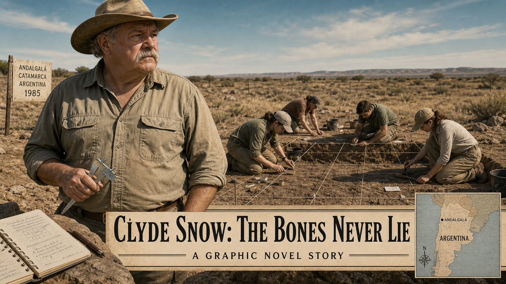

Cover Image Prompt

(This is the Cover Image. Do not include this label in the image.)

A wide-format graphic novel cover in contemporary photorealistic illustration style with somber earth tones and a restrained documentary mood. The central figure is Clyde Snow — a heavyset older man in his late 50s with a thick gray mustache, wearing a weathered tan cowboy hat, a khaki field shirt with rolled sleeves, and worn canvas trousers. He stands at a sunlit outdoor excavation site in Argentina, circa 1985. Behind him, young students in field clothes kneel carefully over a shallow rectangular trench marked by a measured string grid. A dry, buff-colored landscape stretches to the horizon under a pale blue sky. In Snow's left hand he holds a pair of steel calipers; at his feet rests an open field notebook. The title text "Clyde Snow: The Bones Never Lie" appears in a clean, understated serif typeface in the lower third of the image — dark charcoal text on a cream-colored bar. A subtitle line reads "A Graphic Novel Story." Palette dominated by ochre, sand, and warm gray, accented with the faint turquoise of the sky. The overall tone is solemn, purposeful, and quietly heroic.

Generate the image immediately without asking clarifying questions.

Narrative Prompt

This graphic novel tells the true story of Clyde Collins Snow (1928–2014), an American forensic anthropologist from Oklahoma who spent decades developing the science of reading human skeletal remains to answer legal and humanitarian questions. The story spans two main settings: the United States (his labs and courtrooms, 1950s–1980s) and Argentina (Buenos Aires and surrounding provinces, 1984 onward), with brief references to his later global work.

The central character, Clyde Snow, should be depicted consistently throughout: a heavyset older man, late 50s to mid-60s, with a thick gray mustache, deep-set eyes that are kind but sharply observant, and an ever-present weathered tan cowboy hat. In field scenes he wears khaki shirts and work trousers; in courtrooms he wears a plain suit jacket. He is warm, plainspoken, and confident without arrogance.

Supporting characters include young Argentine university students — both men and women in their 20s, dressed in field clothes — who become his students and eventually found the Argentine Forensic Anthropology Team (EAAF). These students should appear consistently: earnest, careful, determined.

The tone throughout is solemn, dignified, and educational. This story involves the victims of state violence — people who were "disappeared" by Argentina's military dictatorship (1976–1983). Depict all evidence respectfully: clean, labeled skeletal remains on lab tables, students measuring carefully, a courtroom scene with Snow testifying. Never show flesh, wounds, decomposition, distress, or graphic imagery of any kind. The mood is documentary and quietly powerful.

The overarching theme is that rigorous science, practiced with integrity and courage, can confront official lies and restore dignity to the voiceless. Forensic anthropology is shown as a moral as much as a scientific discipline.

Art style consistent across all panels: contemporary photorealistic illustration, somber earth tones, restrained documentary mood.

### Prologue – What a Skeleton Can Say

A human skeleton is a record. Etched into its shape and substance are clues to who a person was and what happened to them in life — and at death. For most of history, those clues went unread. Then a plainspoken anthropologist from Oklahoma decided that the bones deserved to be heard. His name was Clyde Snow, and he would spend his life making sure they got their chance to speak.

---

## Panel 1: Reading the Record

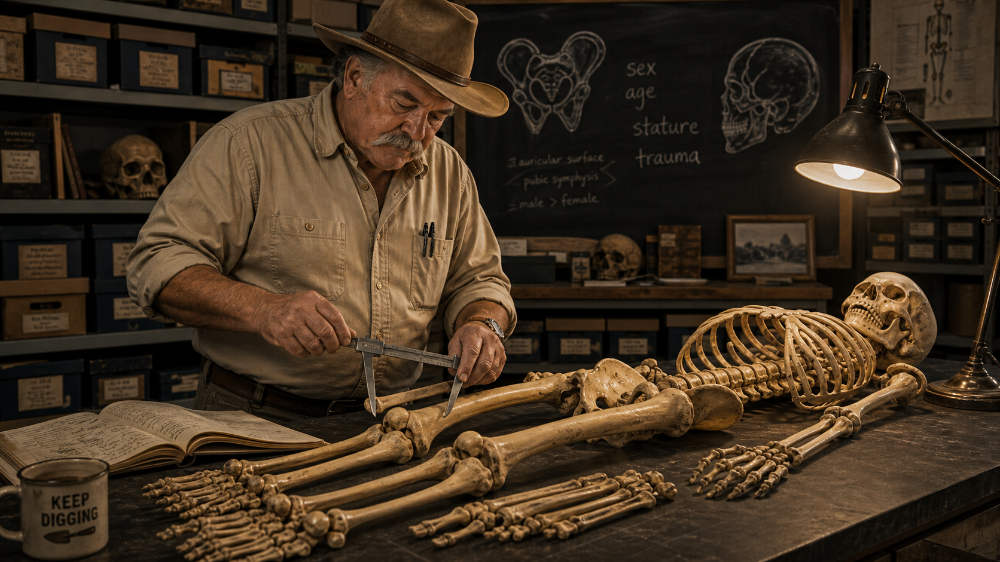

Image Prompt

(This is Panel 01. Do not include the panel number in the image.)

I am about to ask you to generate a series of images for a graphic novel. Please make the images have a consistent style and consistent characters. Do not ask any clarifying questions. Just generate the image immediately when asked.

Please generate a 16:9 image in contemporary photorealistic illustration, somber earth tones, restrained documentary mood depicting panel 1 of 11. The scene should include Clyde Snow — a heavyset older man, late 50s, with a thick gray mustache and a weathered tan cowboy hat, wearing a khaki field shirt and work trousers — standing at a wide laboratory table in the United States, circa 1970. On the table lies a clean, complete human skeleton neatly arranged in anatomical position. Snow holds steel calipers open above the femur, measuring its length with calm precision. Behind him, a chalkboard shows rough sketches of a pelvis and skull with handwritten notes: "sex," "age," "stature," "trauma." A single angled desk lamp illuminates the bones from above, casting long soft shadows. Rows of labeled specimen boxes line the shelves behind him. The room feels like a university lab — modest, orderly, purposeful. Color palette: warm ivory bone tones against deep charcoal walls, accented with ochre and slate blue. Emotional tone: methodical, attentive, quietly authoritative. Visual details include the glint of the calipers' steel jaws, the careful articulation of the carpals on the table, a worn field notebook open beside the skeleton, Snow's eyes focused intently downward, and a coffee mug on the edge of the table.

Generate the image immediately without asking clarifying questions.

Clyde Snow learned to listen to bones in the same way a doctor learns to read an X-ray — systematically, patiently, with evidence always in front of him. A skeleton, he would explain to students, records biological sex in the width of the pelvis and the ridges of the skull. It records approximate age in the wear of teeth and the fusion of growth plates. It records stature in the length of the long bones, and it records trauma in every fracture, nick, and healed break. Snow once said that every skeleton tells a story — and that a careful scientist's job is to read it honestly, reporting only what the evidence will actually support.

---

## Panel 2: The Mengele Identification

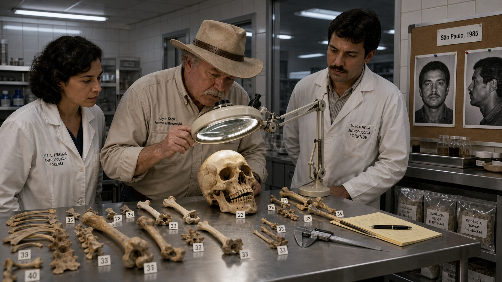

Image Prompt

(This is Panel 02. Do not include the panel number in the image.)

Please generate a 16:9 image in contemporary photorealistic illustration, somber earth tones, restrained documentary mood depicting panel 2 of 11. Make the characters and style consistent with the prior panels. The scene should include Clyde Snow — the same heavyset older man with the gray mustache and cowboy hat, now in a well-lit forensic laboratory in Brazil, 1985. He stands at a broad steel examination table alongside two Brazilian colleagues in lab coats. Between them, several bones and a skull are arranged neatly on the table, each tagged with a small numbered label. Snow peers through a large magnifying lens mounted on an articulated arm, studying the teeth of the skull with focused intensity. On a side counter, two large black-and-white photographs are pinned to a corkboard — one showing a middle-aged man's face from the front and one in profile — for comparison. A neat printed label reads "São Paulo, 1985" pinned above the photos. The room is modern and institutional, with fluorescent ceiling lights, white tile walls, and metal shelving. Color palette: cool clinical white and steel gray offset by the warm ivory of bone; small splashes of amber from the incandescent magnifying lamp. Emotional tone: concentrated, methodical, historically significant. Visual details include the magnifying lens reflecting the ceiling fluorescents, the calipers resting to one side, labeled plastic evidence bags on a lower shelf, Snow's tilted head as he focuses, and the solemn expressions of the colleagues observing.

Generate the image immediately without asking clarifying questions.

By the early 1980s, Snow's reputation had spread far beyond his Oklahoma laboratory. In 1985, Brazilian authorities unearthed remains in a São Paulo cemetery believed to belong to Josef Mengele, the Nazi war criminal who had evaded justice for four decades. An international team of forensic experts was assembled — and Snow was part of it. Through careful skeletal analysis, dental comparison, and photographic superimposition, the team concluded that the remains were consistent with Mengele's known biological profile, providing evidence that one of history's most wanted fugitives had died in Brazil in 1979. The case demonstrated what rigorous forensic science could accomplish even when official records had been deliberately destroyed.

---

## Panel 3: Argentina After the Dictatorship

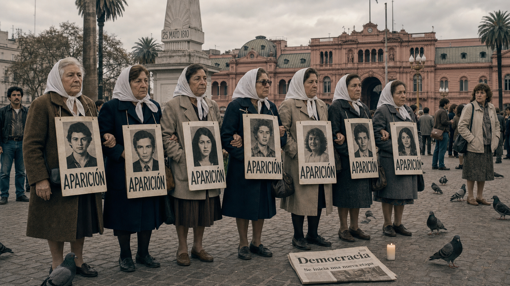

Image Prompt

(This is Panel 03. Do not include the panel number in the image.)

Please generate a 16:9 image in contemporary photorealistic illustration, somber earth tones, restrained documentary mood depicting panel 3 of 11. Make the characters and style consistent with the prior panels. The scene should include a public square in Buenos Aires, Argentina, 1984. In the foreground, a group of women in their 50s and 60s — the Mothers of the Plaza de Mayo — stand together in quiet dignity, wearing white headscarves and holding hand-painted signs bearing photographs of young men and women and the word "APARICIÓN" (which means "appearance" or "where are they"). The Plaza de Mayo is visible in the background with its historic pink government building and central obelisk. The sky is overcast and pale gray. Clyde Snow is not present in this panel — this panel establishes the human context. The women's expressions are resolute, grieving, and dignified. Passersby pause to look. A newspaper on the ground shows the headline "Democracia" — democracy returned. Color palette: muted silver-gray, stone white, and deep charcoal, with the white of the headscarves as the brightest accent. Emotional tone: solemn, determined, heartbreaking yet defiant. Visual details include the hand-lettered signs, the photographs of the young missing printed in black and white, the women's interlocked arms, a single lit candle on the ground, pigeons on the cobblestones, and the looming pink facade of the Casa Rosada in the background.

Generate the image immediately without asking clarifying questions.

In December 1983, Argentina's military dictatorship collapsed under the weight of military defeat and international pressure, and the country returned to democratic rule. Over the preceding seven years, the regime had secretly abducted, tortured, and killed an estimated nine thousand to thirty thousand people — most of them young men and women who had spoken out or been suspected of opposition. Families called them "the disappeared." Now, with the military out of power, the mothers and relatives who had marched in silence for years demanded the truth: where were their children, and what had happened to them?

---

## Panel 4: The Problem of Evidence

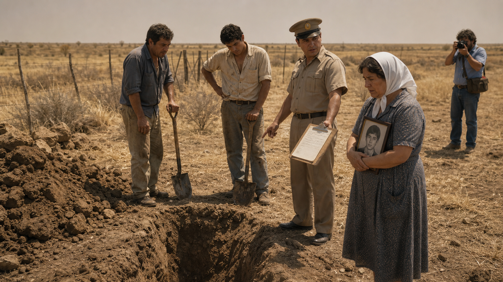

Image Prompt

(This is Panel 04. Do not include the panel number in the image.)

Please generate a 16:9 image in contemporary photorealistic illustration, somber earth tones, restrained documentary mood depicting panel 4 of 11. Make the characters and style consistent with the prior panels. The scene should depict an outdoor landscape in the Argentine pampas, 1984 — a wide, flat, dry grassy field under a hazy midday sky. In the foreground, two workers with shovels stand next to a hastily dug trench, pausing and looking uncertain. A uniformed local official gestures toward the trench with his clipboard. Nearby, a middle-aged Argentine woman in a plain dress and white headscarf watches with anguished restraint, holding a small framed photograph of a young man against her chest. There are no forensic precautions visible: no grid markers, no brushes, no careful documentation — just shovels and urgency. A journalist in the background raises a camera. Clyde Snow is not yet present in this panel. Color palette: parched earth tones — tan, ochre, dry grass yellow — under a bleached, hazy sky. Emotional tone: anxious, precarious, the weight of irreversible mistakes. Visual details include clods of raw earth beside the trench, the clipboard with a handwritten list, scuffed boots on the rough ground, the framed photograph in the woman's hands reflecting a glint of sun, a tangled barbed-wire fence in the background, and a cloudless but oppressively pale sky.

Generate the image immediately without asking clarifying questions.

Argentina's new civilian government established a truth commission — the CONADEP — to investigate the crimes of the dictatorship. Courts would eventually try the generals who had ordered the killings. But evidence was desperately scarce. The regime had burned records and buried victims in unmarked graves. When exhumations began in 1984, they were sometimes rushed and unsystematic — investigators using heavy equipment, bones disturbed or lost, context destroyed. Forensic scientists watching from abroad recognized an urgent problem: without proper archaeological methods, the physical evidence that might name victims and document cause of death would be gone forever before it could speak in any courtroom.

---

## Panel 5: Snow Arrives in Argentina

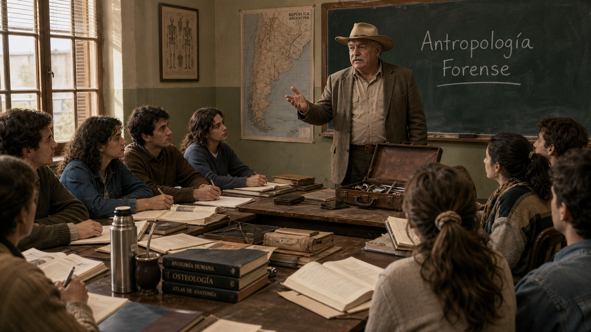

Image Prompt

(This is Panel 05. Do not include the panel number in the image.)

Please generate a 16:9 image in contemporary photorealistic illustration, somber earth tones, restrained documentary mood depicting panel 5 of 11. Make the characters and style consistent with the prior panels. The scene should include Clyde Snow — the same heavyset older man with the gray mustache and cowboy hat, now in a slightly rumpled suit jacket over his field shirt, carrying a worn leather briefcase — arriving at a modest university seminar room in Buenos Aires, Argentina, 1984. He stands at the front of the room, introducing himself to a small group of eight to ten Argentine university students in their 20s, both men and women, seated at pushed-together tables. The students lean forward with attentive, slightly apprehensive expressions. On the chalkboard behind Snow, someone has written "Antropología Forense" in chalk. The room is spare but welcoming — tall windows letting in afternoon light, a few anatomy textbooks stacked on a side table. Color palette: warm afternoon gold from the windows against cool plaster walls of pale sage; Snow's tan hat and khaki provide a warm earth-tone anchor. Emotional tone: purposeful, the start of something historically important, a quiet turning point. Visual details include Snow's hand gesturing as he speaks, the students' notebooks open and pens poised, a map of Argentina pinned to one wall, a thermos of coffee on the table, a worn leather briefcase open beside Snow showing calipers and a field notebook, and late-afternoon dust motes in the sunbeam from the window.

Generate the image immediately without asking clarifying questions.

In 1984, the American Association for the Advancement of Science sent Clyde Snow to Argentina to assess the situation. Snow was blunt in his conclusions: the exhumations were being handled without the methodical care that forensic science required, and the chance to identify victims — and to collect evidence of how they had died — was slipping away. Rather than simply file a report and leave, he stayed. He found a handful of courageous young university students willing to learn the discipline of forensic archaeology, and he began to teach — in Spanish, haltingly at first, with diagrams and demonstrations filling the gaps.

---

## Panel 6: Training in the Field

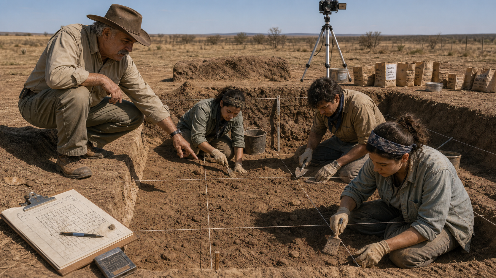

Image Prompt

(This is Panel 06. Do not include the panel number in the image.)

Please generate a 16:9 image in contemporary photorealistic illustration, somber earth tones, restrained documentary mood depicting panel 6 of 11. Make the characters and style consistent with the prior panels. The scene should include Clyde Snow — the same older man with the gray mustache and cowboy hat, now in full field clothes — crouching at the edge of a carefully prepared excavation trench in Argentina, 1985. The trench is divided into neat grid squares by taut string lines. Three young Argentine students — two women and one man, all in their 20s wearing plain field clothes, bandanas, and work gloves — kneel inside the trench working with soft brushes and wooden-handled trowels, moving earth with patient precision. Snow points to a particular area of the trench floor and speaks to the students, his posture instructive and calm. Beside the trench, a clipboard holds a site diagram with numbered squares; a camera on a tripod is positioned to document the trench from above. The setting is a dry, open landscape in the Argentine countryside under a clear midday sky. Color palette: dusty ochre, warm sand, the green-gray of field clothing, and the pale blue of the sky. Emotional tone: focused, methodical, quietly determined — science as an act of respect. Visual details include the string grid lines casting faint shadows on the trench floor, the fine dust raised by the brushwork, individual labeled paper bags for finds, Snow's boots at the edge of the trench, a hand-drawn site map on the clipboard, and the students' careful, concentrated expressions.

Generate the image immediately without asking clarifying questions.

Snow taught his students that an excavation site is also a crime scene, and that the way bones are removed matters as much as the bones themselves. Every item had to be photographed in place before it was touched. The grid divided the trench into documented squares so that the spatial relationship between bones — critical for understanding events — would be preserved in the record. Students learned to use flat brushes and pointed trowels to free remains from the soil grain by grain, bagging and labeling each find with its precise location. What might have seemed slow to the impatient families waiting outside the tape was, Snow explained, the only method that would produce evidence strong enough to stand up in court.

---

## Panel 7: The EAAF Is Born

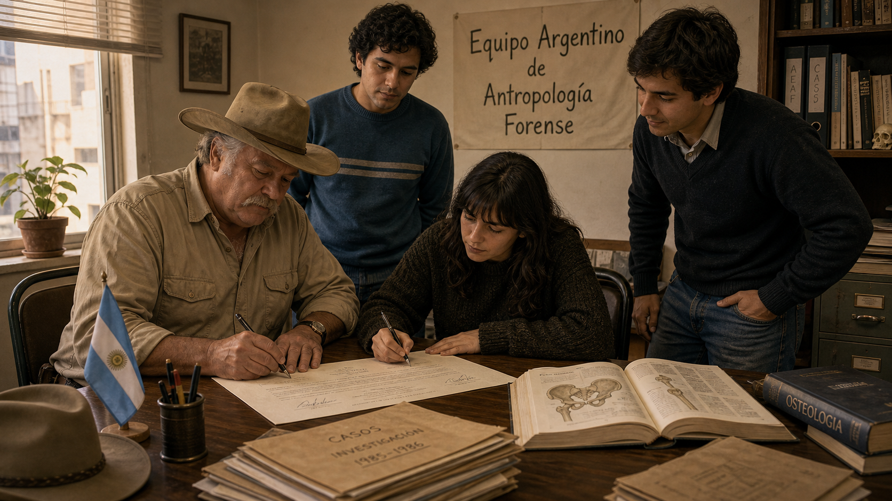

Image Prompt

(This is Panel 07. Do not include the panel number in the image.)

Please generate a 16:9 image in contemporary photorealistic illustration, somber earth tones, restrained documentary mood depicting panel 7 of 11. Make the characters and style consistent with the prior panels. The scene should include Clyde Snow seated at a table in a modest Buenos Aires office, 1986, signing a document alongside three young Argentine students — the same students from earlier panels — who stand or sit around the table with him. One of the students, a young woman with dark hair and earnest eyes, also signs with a pen; the others watch with quiet pride. On the wall behind them, a simple hand-lettered sign in Spanish reads "Equipo Argentino de Antropología Forense" — the Argentine Forensic Anthropology Team (EAAF). A small Argentine flag stands in a desk cup nearby. The room has the modest look of a new nonprofit office: mismatched chairs, a second-hand metal desk, bookshelves with anatomy texts and binders. Afternoon light comes through a single window. Color palette: warm indoor tones of amber and cream, the deep burgundy-brown of old wood furniture, and the pale blue and white of the Argentine flag as a small accent. Emotional tone: historic, earnest, quietly triumphant — a beginning. Visual details include the signatures on the document, a stack of case files on the desk, an open textbook showing a diagram of a human pelvis, Snow's hat resting on the corner of the desk, the students' calm determined expressions, and a single potted plant on the windowsill.

Generate the image immediately without asking clarifying questions.

In 1986, Snow and his students formally established the Argentine Forensic Anthropology Team — known by its Spanish initials, EAAF. It was the first organization of its kind anywhere in the world: a team of trained forensic scientists dedicated specifically to documenting human rights abuses through rigorous skeletal analysis and archaeological excavation. The students Snow had recruited — including Patricia Bernardi, Mercedes Doretti, and Luis Fondebrider — were barely out of their undergraduate studies, but they had learned their craft from one of the world's best, and they would spend their careers proving it.

---

## Panel 8: The Bones Speak in the Lab

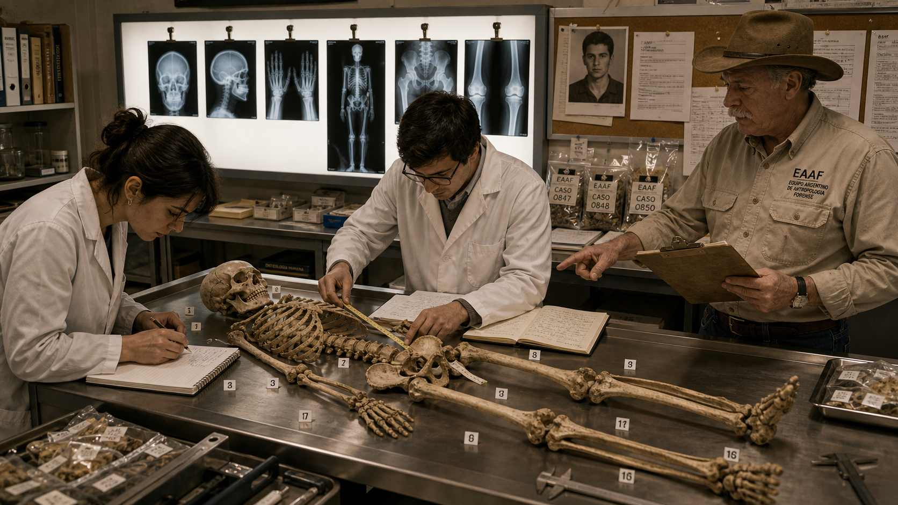

Image Prompt

(This is Panel 08. Do not include the panel number in the image.)

Please generate a 16:9 image in contemporary photorealistic illustration, somber earth tones, restrained documentary mood depicting panel 8 of 11. Make the characters and style consistent with the prior panels. The scene should include the interior of the EAAF laboratory in Buenos Aires, Argentina, circa 1987. A long stainless steel table holds a complete skeleton laid out in careful anatomical order, with small numbered tags placed beside specific bones. Two young Argentine EAAF researchers — a young woman with dark hair in a lab coat and a young man with glasses — stand on opposite sides of the table, each working with calipers or a measuring tape, recording numbers in notebooks. A wall-mounted light box behind them shows several X-ray images clipped in a row. On a side counter, labeled evidence bags and printed case forms are neatly stacked. An older framed photograph of a young man in his 20s is pinned to a corkboard above the counter alongside printed records. Clyde Snow stands slightly to the side, reading from a clipboard, pointing to a specific bone. Color palette: clinical white and cool steel gray, warmed by the amber glow of the lightbox and the ivory of the bones. Emotional tone: meticulous, solemn, purposeful — science in service of truth. Visual details include the measuring tape extended across the femur, the numbered evidence tags, the X-ray images on the lightbox, the corkboard photograph, the researchers' careful posture, and the detailed handwritten case notes on the clipboard.

Generate the image immediately without asking clarifying questions.

In the laboratory, each set of remains became a documented case file. The EAAF researchers analyzed skeletal indicators to estimate biological sex, age range, and stature — building a biological profile that could be cross-referenced against missing persons reports filed by families. When skeletal trauma was identified, it was recorded precisely and described in terms of what it was consistent with, never in overstated language. The evidence was specific enough to tell stories, yet disciplined enough to withstand cross-examination. For the families waiting for answers, each identification was both a loss confirmed and a lie refuted — a name given back.

---

## Panel 9: Testimony at the Trial

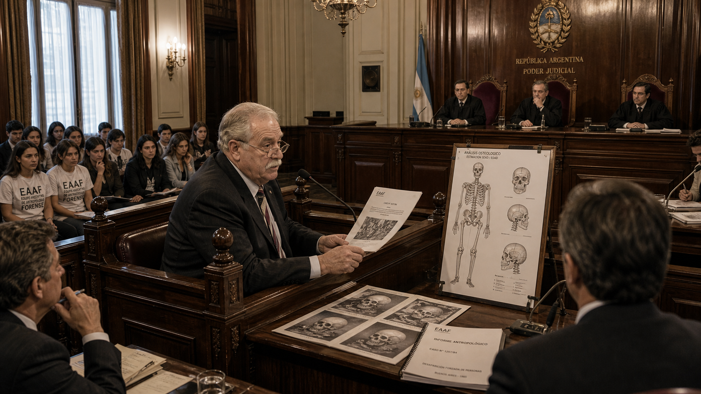

Image Prompt

(This is Panel 09. Do not include the panel number in the image.)

Please generate a 16:9 image in contemporary photorealistic illustration, somber earth tones, restrained documentary mood depicting panel 9 of 11. Make the characters and style consistent with the prior panels. The scene should include Clyde Snow — the same older man with the gray mustache, now wearing a plain dark suit jacket — seated in a witness stand in a formal Argentine courtroom, Buenos Aires, 1985. He speaks with measured composure to a panel of three judges seated at an elevated bench, robed in formal black. Before him on the witness stand, several large printed diagrams and a skeletal report document are arranged. In the gallery to one side, the EAAF students watch attentively from the seats. Defense attorneys and prosecutors are visible at their respective tables. The Argentine national seal hangs on the wall behind the judges. The room is high-ceilinged, formal, and lit by chandeliers. Color palette: dark wood paneling, deep burgundy upholstery, and cream walls, accented by the white of printed documents and the pale light from tall windows. Emotional tone: grave, historic, the weight of accountability. Visual details include the large skeletal diagram on a stand beside the witness box, Snow's reading glasses on the bridge of his nose, the judges' intent expressions, the gallery's hushed attentiveness, the printed case report in Snow's hands, and the formal carved wood detail of the witness stand.

Generate the image immediately without asking clarifying questions.

In 1985, Argentina put the leaders of the military juntas on trial in a civilian court — an extraordinary moment in South American history. Clyde Snow was among the expert witnesses called to testify. Speaking calmly from the witness stand, he explained to the judges exactly what the skeletal remains recovered by the EAAF revealed: evidence consistent with the age and sex of the missing, and physical findings consistent with the manner of their deaths. The bones, he told the court, do not remember politics. They report only what happened. The testimony helped convict five of the nine junta commanders, including former president Jorge Rafael Videla, on charges of murder, torture, and kidnapping.

---

## Panel 10: The Method Spreads

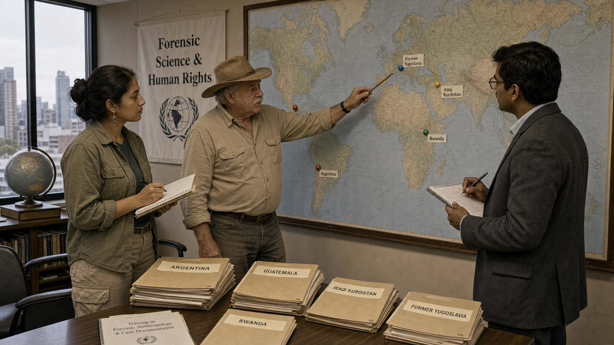

Image Prompt

(This is Panel 10. Do not include the panel number in the image.)

Please generate a 16:9 image in contemporary photorealistic illustration, somber earth tones, restrained documentary mood depicting panel 10 of 11. Make the characters and style consistent with the prior panels. The scene should include a world map mounted on a wall in a neutral office or conference room, circa 1995. Pins or markers in different colors are placed on Argentina, Guatemala, Iraqi Kurdistan, Rwanda, and the former Yugoslavia — countries where forensic anthropology teams have conducted investigations. Standing before the map are three people: Clyde Snow — the same older man with the gray mustache and cowboy hat, now slightly older and more weathered, in his late 60s — alongside two young forensic specialists from different backgrounds, one a Central American woman in field clothes, one a South Asian man in a suit jacket. Snow points to one of the pins on the map with a pencil while the others take notes. On a table nearby, stacked folders are labeled with country names. A banner on the wall reads "Forensic Science & Human Rights." Color palette: the soft blues and greens of the map, warm tan walls, the earth tones of field clothing, and muted gray of institutional furniture. Emotional tone: quiet expansion of purpose, global solidarity, hope tempered by the weight of continued need. Visual details include the colored pins on the map, the labeled country folders, Snow's pointing pencil, the banner text, a globe on the side table, notebooks open in the hands of the two specialists, and windows looking out on a city skyline.

Generate the image immediately without asking clarifying questions.

The Argentine model proved that forensic anthropology, practiced with archaeological rigor, could produce evidence capable of standing up in international courts of law. Through the 1990s and into the 2000s, Snow and his former students carried the methods they had developed in Buenos Aires to Guatemala, Iraqi Kurdistan, Rwanda, and the Balkans. Wherever governments had tried to erase the evidence of mass killings — wherever the disappeared needed a voice — teams trained in Snow's approach arrived with brushes and calipers and the same patient discipline he had taught in that seminar room in Buenos Aires. The discipline had become, in effect, a global tool for accountability.

---

## Panel 11: Legacy — Science in the Service of Truth

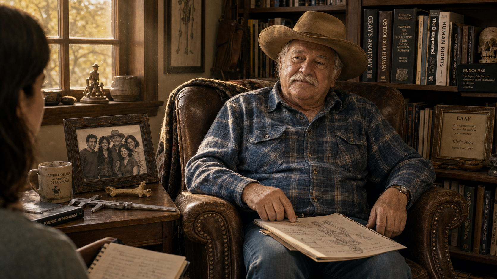

Image Prompt

(This is Panel 11. Do not include the panel number in the image.)

Please generate a 16:9 image in contemporary photorealistic illustration, somber earth tones, restrained documentary mood depicting panel 11 of 11. Make the characters and style consistent with the prior panels. The scene should include Clyde Snow — now an elderly man in his early 80s, still with the gray mustache and cowboy hat, wearing a comfortable flannel shirt — seated in a worn leather armchair in a book-lined study in the United States, circa 2010. He faces slightly toward the viewer, relaxed, reflective. On a side table beside him: his steel calipers, an open field notebook with pencil sketches of bones, and a framed black-and-white photograph of him with a group of young Argentine students, clearly from the 1980s. Through a window behind him, golden afternoon light falls across the room. On the bookshelf, spines visible: anatomy texts, volumes on human rights, a small framed award. A younger person — a student or journalist — sits across from Snow, just barely visible at the frame edge, listening. Color palette: warm amber, deep mahogany, cream, and the soft blue of Snow's flannel shirt. Emotional tone: reflective, dignified, the quiet satisfaction of a life well used. Visual details include the calipers on the side table, the framed photograph of the EAAF students, dust motes in the window light, an open notepad on Snow's knee, the student's barely visible notebook in the corner of the frame, and the titles on the book spines.

Generate the image immediately without asking clarifying questions.

Clyde Snow died in Norman, Oklahoma, on May 16, 2014, at the age of eighty-six. By then, the Argentine Forensic Anthropology Team he had founded with a handful of students had identified more than nine hundred of Argentina's disappeared and had consulted in investigations across more than sixty countries. The field of forensic anthropology — which he had helped define and which he had dedicated his later career to applying for human rights — had become a recognized and essential instrument of international justice. Snow never sought celebrity. He sought evidence, and he taught others to do the same.

---

### Epilogue – What Made Clyde Snow Different?

Clyde Snow was not the only forensic scientist of his era, but he was among the first to insist that his expertise belonged in the service of human rights as well as the courtroom. He traveled where others did not, taught where no teachers existed, and testified when speaking the truth required courage. His greatest achievement was not any single identification, but the institution — and the discipline — he left behind.

| Challenge | How Snow Responded | Lesson for Today |
|---|---|---|
| No trained forensic anthropologists existed in Argentina | Recruited and trained university students from scratch, on-site and in the field | Expertise can be built anywhere when someone is willing to teach |
| Rushed, unscientific exhumations were destroying evidence | Insisted on archaeological grid methods, photography, and meticulous documentation before any bone was removed | Method is not bureaucracy — it is the difference between evidence and noise |
| Governments denied that killings had occurred | Let skeletal analysis produce objective biological profiles that no official denial could erase | Science does not take sides, but the truth it reveals can decide them |
| The scale of abuse spanned entire continents | Helped his students replicate the model in Guatemala, the Balkans, and beyond | A disciplined method, once learned, can travel and multiply |

---

### Call to Action

The work begun by Clyde Snow and the EAAF continues today. Thousands of Argentina's disappeared have been identified; thousands more remain anonymous. If this story moved you, learn more about the Argentine Forensic Anthropology Team at eaaf.org, and consider what it means to live in a society where science and justice are allowed to work together.

---

*"Bones make good witnesses. They speak softly, but they never lie and they never forget."*
—Clyde Snow

*"I'm just a simple bone doctor. But the dead — they have a way of talking to me."*
—Clyde Snow

## References

1. **Clyde Snow — Wikipedia**: Background, career, and major identifications. <https://en.wikipedia.org/wiki/Clyde_Snow>

2. **Argentine Forensic Anthropology Team (EAAF) — Wikipedia**: History, founding, and global reach of the team Snow established. <https://en.wikipedia.org/wiki/Argentine_Forensic_Anthropology_Team>

3. **Forensic Anthropology — Wikipedia**: Overview of the discipline, methods, and applications. <https://en.wikipedia.org/wiki/Forensic_anthropology>

4. **"Clyde Snow, Who Used Bones to Identify Rights Victims, Dies at 86" — The New York Times (May 21, 2014)**: Obituary covering Snow's career and legacy. <https://www.nytimes.com/2014/05/22/us/clyde-snow-forensic-anthropologist-dies-at-86.html>

5. **Argentine Forensic Anthropology Team — Official Website (EAAF)**: The organization Snow founded, with current case updates and historical background. <https://eaaf.org/about-eaaf/>
