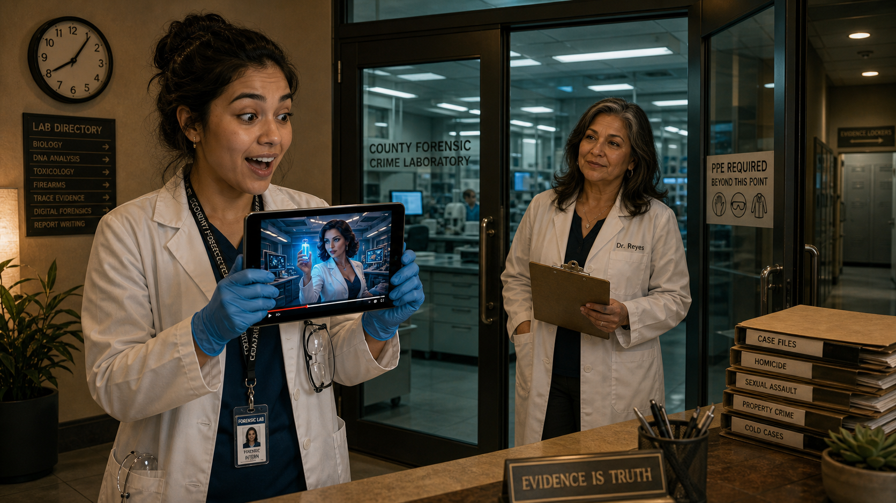
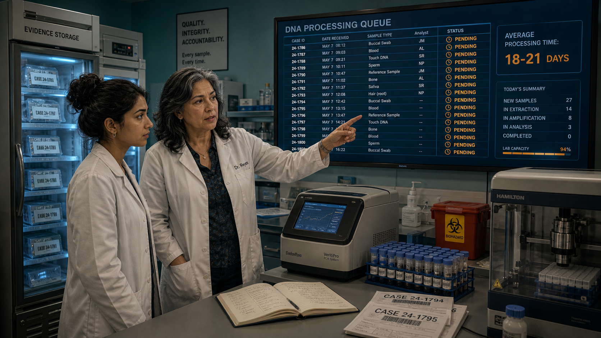
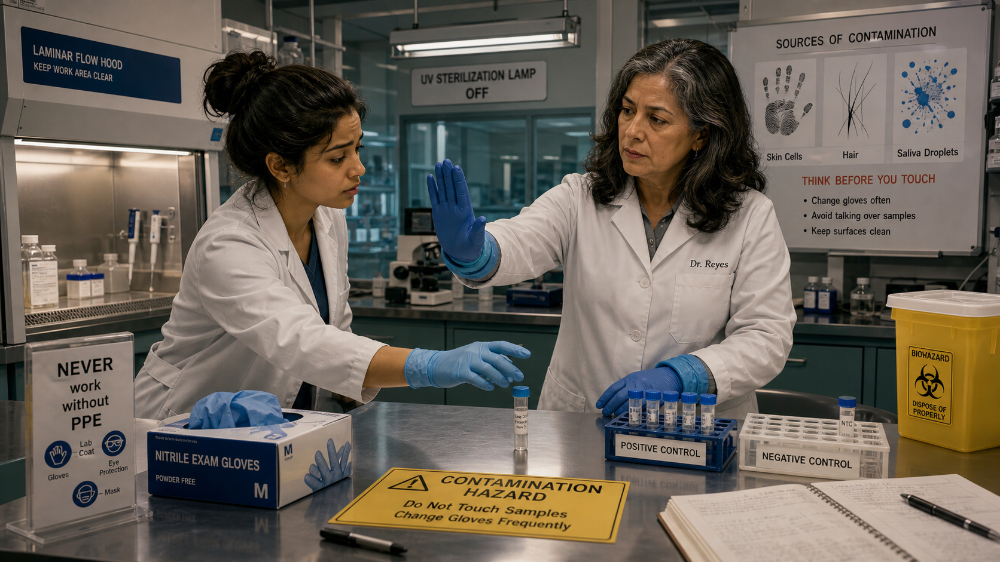
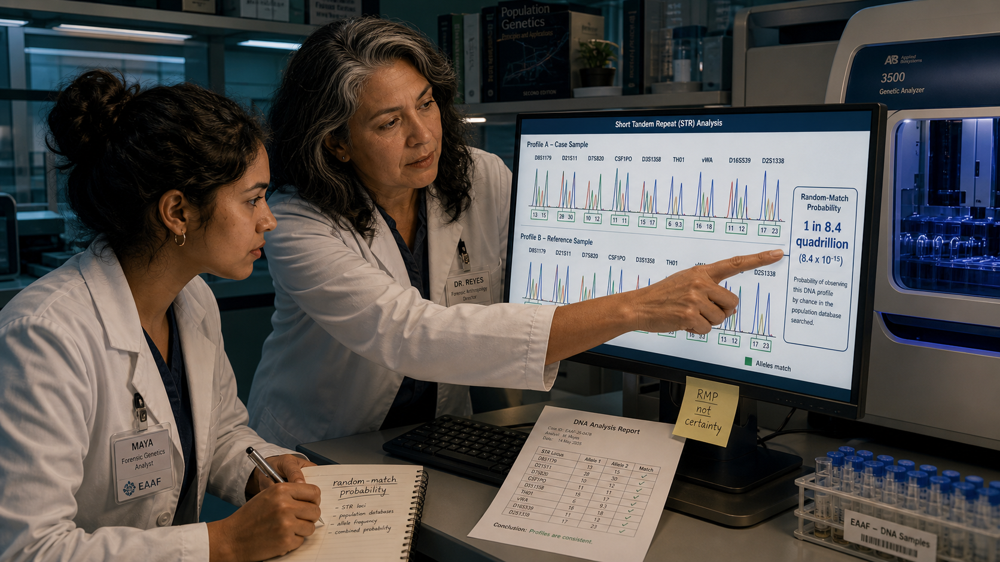
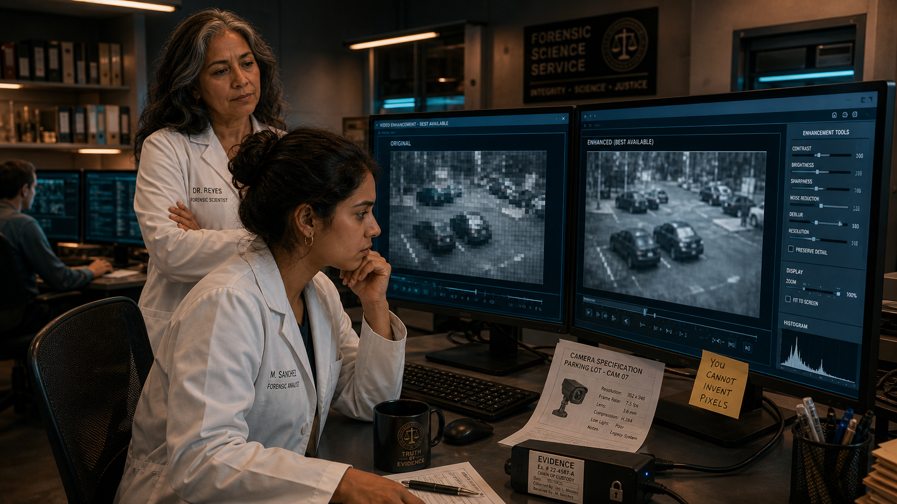
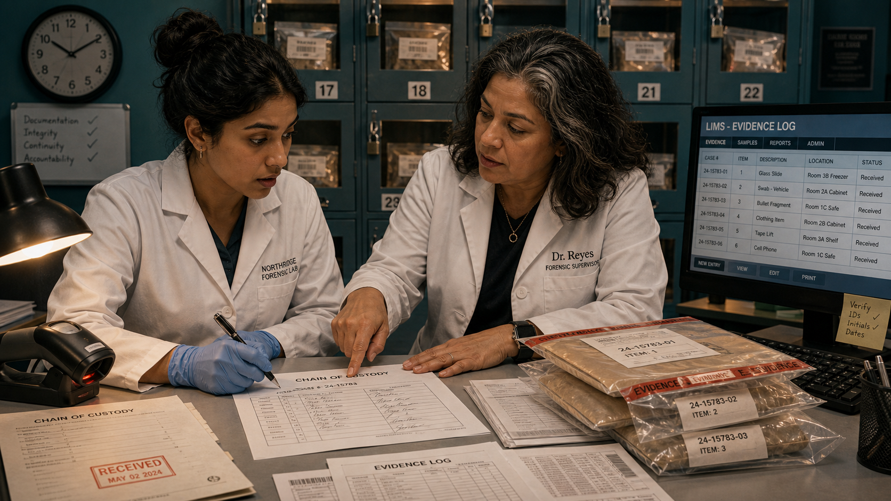
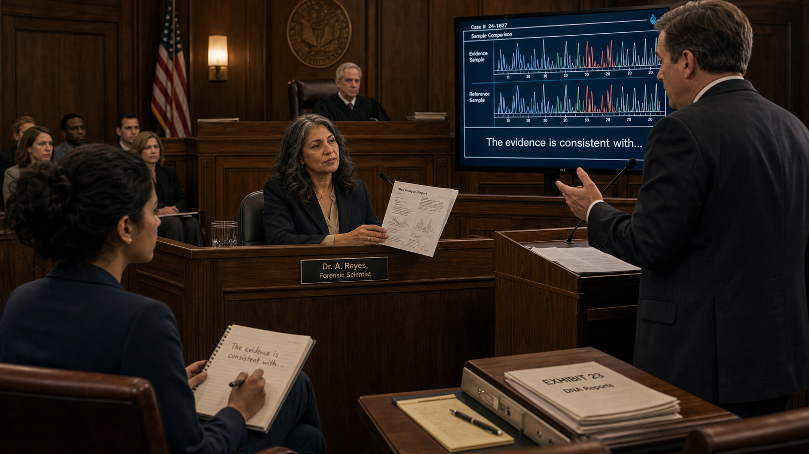
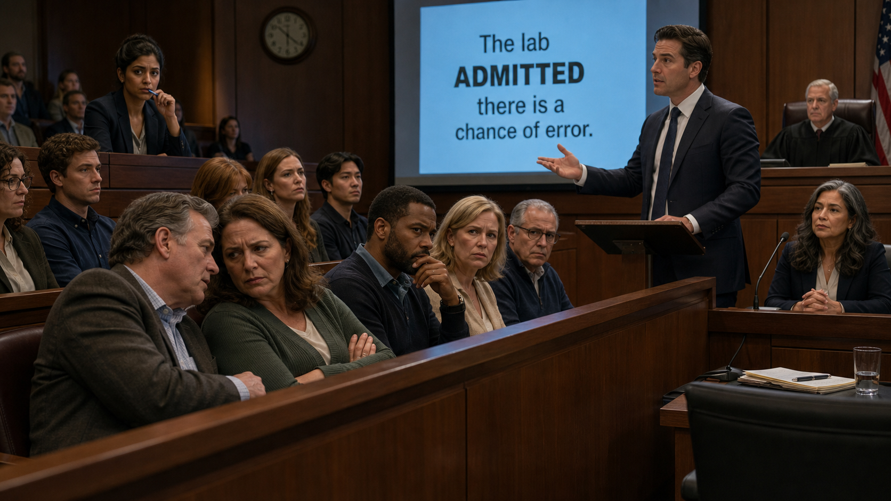
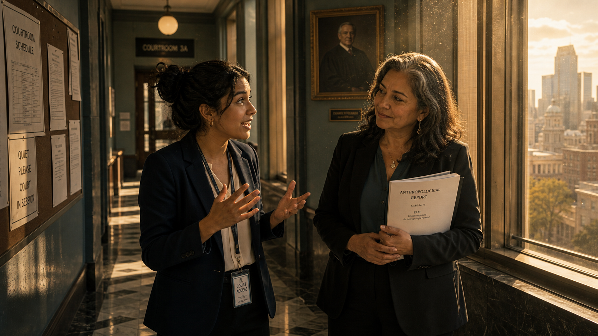
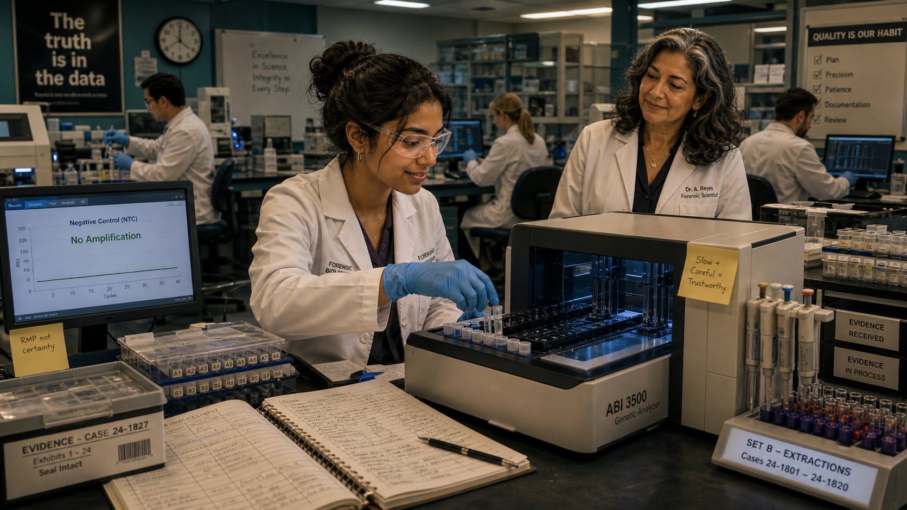

# The CSI Effect: When TV Science Meets Real Science

Cover Image Prompt

(This is the Cover Image. Do not include this label in the image.)

A split composition showing two contrasting worlds side by side: on the left, a glamorous fictional TV forensics scene — a stylishly dressed scientist in dramatic blue lighting holding up a glowing test tube with a gleaming modern lab backdrop; on the right, a real modern forensic crime laboratory — a focused young woman named Maya (early 20s, brown skin, dark hair pulled back in a bun, wearing a white lab coat, blue nitrile gloves, and safety glasses) working methodically at a PCR machine under fluorescent lighting, stacks of case files visible beside her. In the center foreground, a bold title in a clean modern sans-serif typeface reads "The CSI Effect." The palette transitions from cool electric blue and neon purple on the TV side to honest teal-and-amber tones on the real-lab side. A veteran scientist Dr. Reyes (50s, Latina woman, silver-streaked hair, patient expression, white lab coat) stands in the background of the real lab. The overall tone is educational, cinematic, and slightly wry — inviting rather than alarming. Clean contemporary illustration style.

Generate the image immediately without asking clarifying questions.

Narrative Prompt

This is a fictional teaching story for a high-school (grades 9–12) Forensic Science intelligent textbook. The story's central theme is the gap between glamorized TV forensics — sometimes called the "CSI effect" — and the actual practice of real forensic science. The story demonstrates why the real, slower, more honest, statistical approach is actually MORE impressive and trustworthy than TV magic.

**Setting:** A present-day modern forensic crime laboratory in a mid-sized American city, plus a courthouse. The lab is clean and organized, with PCR machines, a mass spectrometer, laminar flow hoods, LIMS (Laboratory Information Management System) terminals, rows of evidence lockers, and fluorescent overhead lighting. The courthouse is a standard contemporary government building with wood-paneled courtrooms.

**Main Characters (must appear consistently across all panels):**
- **Maya** — An eager college-age intern (early 20s, brown skin, dark hair pulled back in a bun, slim build). In the lab she wears a white lab coat, blue nitrile gloves, and safety glasses. In the courthouse she wears business casual — a navy blazer and slacks. She grew up binge-watching crime dramas and arrives with high expectations.
- **Dr. Reyes** — A patient, veteran forensic scientist (50s, Latina woman, silver-streaked dark hair worn loose to her shoulders, medium build, warm but no-nonsense expression). She wears a white lab coat in the lab and a dark blazer in the courthouse. She has a calm, methodical manner and a dry sense of humor.

**Story arc:** Maya enters the lab imagining the glamour she's seen on TV. One by one, Dr. Reyes walks her through the realities: backlogs, contamination controls, probability statistics, the limits of video enhancement, the importance of chain of custody and documentation, and the careful, honest language used when testifying. Maya watches the "CSI effect" cause a problem in court — then has a realization that honest uncertainty, communicated clearly, is more powerful than any TV illusion. By the final panel, she's fallen in love with the real thing.

**Tone:** Engaging, educational, slightly cinematic wit. No graphic violence or gore. All scientific detail is accurate and appropriate for high-school students.

**Character consistency note:** Maya and Dr. Reyes must appear physically identical in every panel in which they appear. Maya always has her dark hair in a bun when in the lab; Dr. Reyes always has silver-streaked dark hair worn loose. Their clothing follows the lab/courthouse distinction described above in every panel.

### Prologue – Everything She Knew Was Wrong

Maya had watched hundreds of episodes of crime dramas before she ever set foot in an actual forensic lab. She could describe, in perfect detail, how a fictional scientist would swab a surface, feed the sample into a glowing machine, and have a full DNA profile — complete with a dramatic musical sting — in about forty-five seconds. She knew the lighting, the confident walk, the moment the scientist points at the screen and says "We've got our guy." What she did not know, walking into the Regional Forensic Science Center on a sunny Monday morning, was that every single one of those scenes had taught her almost nothing about forensic science.

---

## Panel 1: Expectations vs. Reality

Image Prompt

(This is Panel 01. Do not include the panel number in the image.)

I am about to ask you to generate a series of images for a graphic novel. Please make the images have a consistent style and consistent characters. Do not ask any clarifying questions. Just generate the image immediately when asked.

Please generate a 16:9 image in clean contemporary illustration, modern crime-lab setting, slightly cinematic teal-and-amber palette depicting panel 1 of 10. The scene should include Maya (early 20s, brown skin, dark hair in a bun, wearing a white lab coat and blue nitrile gloves, excited wide-eyed expression), set in the lobby of a modern forensic crime laboratory. She is holding a small tablet showing a paused scene from a glamorous fictional crime-drama (stylized, colorful, dramatic — a fictional TV scientist in a gleaming hi-tech lab holding a glowing blue vial). Through the large glass doors behind Maya we see the real lab: fluorescent lighting, rows of beige equipment, filing cabinets, stacks of case binders. Dr. Reyes (50s, Latina, silver-streaked dark hair loose to shoulders, white lab coat, clipboard in hand, calm knowing expression) stands just inside the door watching Maya with a patient half-smile. Color palette: warm amber tones for the lobby, cooler teal tones through the glass toward the real lab. Emotional tone: anticipation tinged with gentle irony. Visual details: a security badge lanyard around Maya's neck, an evidence locker hallway visible in the background, a wall clock reading 8:05 AM, a "PPE Required Beyond This Point" sign on the door, safety glasses hanging from Maya's coat pocket, a stack of case files on the reception desk.

Generate the image immediately without asking clarifying questions.

Maya stepped through the security door with a grin on her face and a tablet in her hand, certain she was walking into the most exciting job on earth. She had replayed her favorite crime-drama opening credits that morning just to get pumped up. The lobby smelled of disinfectant and recycled air, not the subtle cologne she had imagined. Dr. Reyes, the senior forensic scientist assigned to supervise her internship, glanced at the paused TV clip on Maya's tablet and simply said, "We should talk about that."

---

## Panel 2: The Backlog

Image Prompt

(This is Panel 02. Do not include the panel number in the image.)

Please generate a 16:9 image in clean contemporary illustration, modern crime-lab setting, slightly cinematic teal-and-amber palette depicting panel 2 of 10. Make the characters and style consistent with the prior panels. The scene should include Dr. Reyes (50s, Latina, silver-streaked dark hair loose, white lab coat) gesturing at a large digital dashboard screen on the wall of a DNA processing room. The dashboard displays a queue of case numbers, timestamps, and status indicators — a long scrolling list with most items marked "PENDING" in amber. Maya (early 20s, brown skin, dark hair in a bun, white lab coat, slightly deflated expression) stands beside her, staring at the screen. The room contains a thermal cycler/PCR machine, a refrigerated evidence storage unit, and a robotic liquid-handling station. Color palette: teal and amber, fluorescent overhead lighting, the dashboard casting a soft blue glow. Emotional tone: sobering realization. Visual details: a digital counter on the screen reading "Average processing time: 18–21 days," stacked sample tubes in a rack on the bench, a lab notebook open beside the machine, printed case labels with barcode stickers, a biohazard waste bin nearby, safety signage on the wall.

Generate the image immediately without asking clarifying questions.

Dr. Reyes's first stop was the DNA intake room, where a floor-to-ceiling digital display showed the lab's current case queue — 214 samples ahead of the newest submission, with an average processing time of eighteen to twenty-one days. Maya stared at the number in silence. "But on the show they have results in the same episode," she finally said. Dr. Reyes nodded without surprise: "On the show, they also have no rent to pay and infinite reagents." Real forensic labs across the country carry substantial backlogs because every case is real, every result matters in court, and corners cannot be cut to meet a TV deadline.

---

## Panel 3: The Contamination Threat

Image Prompt

(This is Panel 03. Do not include the panel number in the image.)

Please generate a 16:9 image in clean contemporary illustration, modern crime-lab setting, slightly cinematic teal-and-amber palette depicting panel 3 of 10. Make the characters and style consistent with the prior panels. The scene should include Dr. Reyes (50s, Latina, silver-streaked dark hair, white lab coat) standing inside a bright forensic DNA laboratory, holding up a gloved hand to stop Maya from touching a sample tube on the bench. Maya (early 20s, brown skin, dark hair in a bun, white lab coat, caught mid-reach with an apologetic expression) is just about to touch the tube without a second pair of gloves. On a side bench, a large illustrated diagram is pinned to the wall showing sources of contamination: skin cells, hair, saliva droplets. A laminar flow hood is open nearby, and positive and negative control sample racks are visible and labeled. Color palette: clean white and teal with amber warning highlights. Emotional tone: alert and instructive, not accusatory. Visual details: a box of blue nitrile gloves prominently displayed, a "CONTAMINATION HAZARD" notice on the bench, two layers of gloves on Dr. Reyes's hands, a sign reading "NEVER work without PPE," a negative control tube labeled "NTC" in a rack, UV sterilization lamp visible overhead in the off position, lab coat snap buttons clearly visible.

Generate the image immediately without asking clarifying questions.

Dr. Reyes stopped Maya's hand an inch from a sample tube. "One touch," she said quietly, "and your DNA is in the evidence — forever." Contamination is the ever-present enemy of forensic DNA analysis: a single skin cell, a stray hair, a microscopic saliva droplet from a cough can introduce foreign genetic material that corrupts a result or, worse, sends investigators chasing the wrong person. That was why every analyst wore two pairs of gloves, changed them between samples, worked under laminar flow hoods, and ran negative controls alongside every batch to catch any contamination that crept through. The unglamorous discipline of contamination prevention, Dr. Reyes explained, was what made the results trustworthy enough to use in court.

---

## Panel 4: A Match Is a Probability

Image Prompt

(This is Panel 04. Do not include the panel number in the image.)

Please generate a 16:9 image in clean contemporary illustration, modern crime-lab setting, slightly cinematic teal-and-amber palette depicting panel 4 of 10. Make the characters and style consistent with the prior panels. The scene should include Dr. Reyes (50s, Latina, silver-streaked dark hair, white lab coat) pointing at a large monitor displaying a DNA electropherogram — a series of colored peaks representing STR allele peaks. Beside the graph is a text box showing a random-match probability statistic: "1 in 8.4 quadrillion." Maya (early 20s, brown skin, dark hair in a bun, white lab coat, thoughtful expression, pen and notebook in hand) is studying the screen carefully. The room is a DNA analysis station with a capillary electrophoresis instrument visible. Color palette: teal and amber, the monitor glow casting soft blue light. Emotional tone: precise and intellectually engaged. Visual details: two DNA profiles side by side on the screen with matching allele peaks highlighted in green, a printed report beside the keyboard, a sticky note reading "RMP ≠ certainty," Dr. Reyes's finger pointing at the statistical notation on screen, a population genetics reference binder on a nearby shelf, Maya's notebook showing the words "random-match probability" written in her handwriting, lab ID badges visible on both characters.

Generate the image immediately without asking clarifying questions.

The electropherogram on screen showed two near-identical profiles: the crime-scene sample and the reference sample. "So it's a match — case closed?" Maya asked. Dr. Reyes shook her head and pointed to the line beneath the graph: *Random-match probability: 1 in 8.4 quadrillion.* "What that number tells us," she explained, "is the probability that a randomly chosen unrelated person would share this profile by chance — which is astronomically small, but it is still a probability." A DNA result is powerful statistical evidence, not a magical declaration of guilt; the analyst's job is to calculate and honestly report that probability, because the jury — not the scientist — decides what it means. Maya wrote "RMP ≠ certainty" on her notepad, and underlined it twice.

---

## Panel 5: No Magic Enhance Button

Image Prompt

(This is Panel 05. Do not include the panel number in the image.)

Please generate a 16:9 image in clean contemporary illustration, modern crime-lab setting, slightly cinematic teal-and-amber palette depicting panel 5 of 10. Make the characters and style consistent with the prior panels. The scene should include Maya (early 20s, brown skin, dark hair in a bun, white lab coat) sitting in front of a digital forensics workstation with two large monitors. One monitor shows a blurry, pixelated security-camera image of a parking lot; the other shows the same image after the best available enhancement — still blurry and indistinct, just slightly less noisy. Maya's expression is disappointed but thoughtful. Dr. Reyes (50s, Latina, silver-streaked dark hair, white lab coat) stands behind her, arms crossed, calm expression. Color palette: teal and dark blue glow from the monitors, amber ambient light from the overhead lamps. Emotional tone: reality-check, grounded. Visual details: a digital forensics software interface visible on screen with enhancement sliders, a sticky note on the monitor frame reading "You cannot invent pixels," a printed spec sheet for a low-resolution parking-lot camera, a locked evidence drive plugged into the workstation, a chain-of-custody label on the drive, a second workstation visible in the background with another analyst working.

Generate the image immediately without asking clarifying questions.

The security footage from the case had been shot by a parking-lot camera with a resolution of 480 pixels — and no amount of clicking "enhance" was going to change that. Maya watched Dr. Reyes run the image through the lab's forensic enhancement software, which reduced noise and sharpened edges to the mathematical limit of what the pixels actually contained. The result was a slightly less blurry blur. "You cannot create information that was never captured," Dr. Reyes said. "Every pixel you see is all you get." On TV, the magic zoom-and-enhance button works because someone wrote a script saying it works; in reality, digital forensic examiners are bound by the physics of the original capture, and honest analysts document exactly what the image can and cannot show.

---

## Panel 6: The Paperwork That Protects Everyone

Image Prompt

(This is Panel 06. Do not include the panel number in the image.)

Please generate a 16:9 image in clean contemporary illustration, modern crime-lab setting, slightly cinematic teal-and-amber palette depicting panel 6 of 10. Make the characters and style consistent with the prior panels. The scene should include Dr. Reyes (50s, Latina, silver-streaked dark hair, white lab coat) sitting at a desk covered in chain-of-custody forms, evidence log printouts, and a LIMS (Laboratory Information Management System) terminal. She is guiding Maya (early 20s, brown skin, dark hair in a bun, white lab coat) through filling out a chain-of-custody form on paper, the form partially completed. Maya looks focused and somewhat surprised by the volume of documentation. In the background, an evidence locker wall with numbered, sealed, labeled bags is visible. Color palette: warm amber desk lamp light against teal background. Emotional tone: meticulous, purposeful. Visual details: a barcode scanner on the desk, a stack of sealed evidence bags with tamper-evident tape and case number labels, a printed chain-of-custody form with multiple signature lines, a large wall clock showing time, a LIMS screen showing evidence log entries, a red stamp reading "RECEIVED" on a document, Dr. Reyes's finger pointing to a signature line on the form, Maya's pen poised to sign.

Generate the image immediately without asking clarifying questions.

Chain of custody is the documented record of every person who handled a piece of evidence from the moment it was collected to the moment it was presented in court — and Dr. Reyes treated it like a sacred text. Every transfer was logged, every seal photographed, every receipt signed and timestamped in the LIMS. "This paperwork," Dr. Reyes told Maya, tapping the form, "is what stands between a valid result and a defense attorney's field day." If a defense lawyer could show that evidence had been handled without documentation, that it might have been tampered with or confused with another sample, the most technically perfect DNA analysis in the world could be thrown out. The paperwork was, in its own way, as important as the science.

---

## Panel 7: Testifying Honestly

Image Prompt

(This is Panel 07. Do not include the panel number in the image.)

Please generate a 16:9 image in clean contemporary illustration, modern crime-lab setting, slightly cinematic teal-and-amber palette depicting panel 7 of 10. Make the characters and style consistent with the prior panels. The scene should include Dr. Reyes (50s, Latina, silver-streaked dark hair, now wearing a dark blazer instead of a lab coat) seated in the witness box of a wood-paneled contemporary courtroom. She is speaking calmly, holding a printed report. Maya (early 20s, brown skin, dark hair in a bun, navy blazer and slacks) sits in the public gallery watching intently, taking notes. An attorney in a suit stands at a podium, cross-examining Dr. Reyes. A large evidence monitor in the courtroom displays a DNA electropherogram. Color palette: warm amber wood tones of the courtroom, teal lighting from overhead, the evidence screen glowing blue. Emotional tone: composed, precise, professional. Visual details: a nameplate reading "Dr. A. Reyes, Forensic Scientist" in front of the witness box, the judge's bench in the background, jurors partially visible in the jury box, the printed DNA report in Dr. Reyes's hands, a speech bubble or caption showing her words: "The evidence is consistent with…", Maya's notepad in her lap with the phrase written down, American flag in the corner of the courtroom.

Generate the image immediately without asking clarifying questions.

Three weeks later, Maya sat in the public gallery of Courtroom 4 and watched Dr. Reyes testify. She was composed and precise, and she chose every word with the care of someone who knew that words become part of the permanent legal record. When the prosecutor asked whether the DNA conclusively proved the defendant was at the scene, Dr. Reyes did not say yes — she said: "The evidence is consistent with the defendant being the source, and the random-match probability makes an alternative explanation extremely unlikely." She acknowledged the lab's known error rates and proficiency test results when asked, without flinching. Honest testimony, Maya realized, was its own kind of courage.

---

## Panel 8: The Juror's Frustration

Image Prompt

(This is Panel 08. Do not include the panel number in the image.)

Please generate a 16:9 image in clean contemporary illustration, modern crime-lab setting, slightly cinematic teal-and-amber palette depicting panel 8 of 10. Make the characters and style consistent with the prior panels. The scene should include a close view of the jury box in the same contemporary wood-paneled courtroom. One juror (middle-aged, arms crossed, skeptical frown) leans toward another juror and appears to be whispering. A defense attorney (standing at a podium, sharply dressed) gestures toward the jury, a large projected slide visible on a screen behind him reading: "The lab ADMITTED there is a chance of error." In the background, Maya (early 20s, brown skin, dark hair in a bun, navy blazer) watches from the gallery with a concerned expression. Dr. Reyes is partially visible in the witness box, hands folded calmly. Color palette: warm amber courtroom tones, the projection screen in cool blue. Emotional tone: tense, ironic, educational. Visual details: other jurors looking uncertain or puzzled, the defense attorney's confident body language, the projected slide visible with the word "ADMITTED" in bold, courtroom benches, a clock on the wall, Maya biting the end of her pen while watching, the judge looking on neutrally.

Generate the image immediately without asking clarifying questions.

The defense attorney's cross-examination leaned hard into the word "consistent with." He projected a single slide: "The lab ADMITTED there is a chance of error." Several jurors shifted uncomfortably; one crossed her arms and frowned. Maya recognized what was happening — the attorney was exploiting the very honesty that made Dr. Reyes's testimony trustworthy, using it to plant doubt in jurors who had been conditioned by decades of TV forensics to expect absolute certainty. The "CSI effect" runs in two directions: sometimes jurors expect technology that doesn't exist; sometimes they distrust real evidence precisely because it doesn't sound like a TV confession. Either way, the gap between television and reality had just walked into a real courtroom.

---

## Panel 9: The Realization

Image Prompt

(This is Panel 09. Do not include the panel number in the image.)

Please generate a 16:9 image in clean contemporary illustration, modern crime-lab setting, slightly cinematic teal-and-amber palette depicting panel 9 of 10. Make the characters and style consistent with the prior panels. The scene should include Maya (early 20s, brown skin, dark hair in a bun, navy blazer) and Dr. Reyes (50s, Latina, silver-streaked dark hair, dark blazer) standing together in a courthouse hallway after the day's testimony. Maya is animated, gesturing with her hands as she speaks; Dr. Reyes listens with a warm expression. Through a tall corridor window, the city is visible in late afternoon amber light. Color palette: warm amber afternoon light through windows, teal corridor walls, the two figures silhouetted in half-light. Emotional tone: breakthrough, warmth, intellectual excitement. Visual details: marble corridor floor, a framed portrait of a judge on the wall, Maya's lanyard badge still around her neck, Dr. Reyes holding her printed report folder, a bulletin board with legal notices in the background, dust motes visible in the shaft of light from the window, Maya's expression showing a genuine "aha" moment, Dr. Reyes's slight smile of satisfaction.

Generate the image immediately without asking clarifying questions.

In the courthouse hallway after testimony, Maya finally said it out loud: "The honest uncertainty isn't the weakness — it's the proof that the science is real." Dr. Reyes nodded slowly. Any analyst can claim certainty; certainty is cheap. What costs something — what actually means something in a court of law — is quantified probability, acknowledged error rates, rigorous controls, and documentation thorough enough to survive cross-examination. The reason forensic science is trusted, Maya understood, is precisely because real scientists say "consistent with" instead of "proves," and because they mean it. That transparency was not a gap between TV and reality. It was the whole point.

---

## Panel 10: Falling in Love with the Real Thing

Image Prompt

(This is Panel 10. Do not include the panel number in the image.)

Please generate a 16:9 image in clean contemporary illustration, modern crime-lab setting, slightly cinematic teal-and-amber palette depicting panel 10 of 10. Make the characters and style consistent with the prior panels. The scene should include Maya (early 20s, brown skin, dark hair in a bun, white lab coat, blue nitrile gloves, safety glasses, confident and happy expression) working independently at a capillary electrophoresis instrument in the forensic DNA lab. She is carefully loading sample tubes into the instrument, her expression focused and deeply satisfied. Dr. Reyes (50s, Latina, silver-streaked dark hair, white lab coat) stands a few steps away at her own workstation, glancing over with an approving smile. The lab around them is busy and bright with quiet purpose: other analysts working in the background, evidence racks labeled and organized, equipment humming. Color palette: warm teal-and-amber, bright forensic lab fluorescent lighting, instruments lit with soft instrument-panel glow. Emotional tone: fulfillment, quiet pride, professional joy. Visual details: a chain-of-custody log open on the bench beside Maya, a completed negative control result showing "No Amplification" on a nearby monitor, a lab notebook filled with neat annotations, Maya's safety glasses slightly fogged from leaning close to the instrument, a sticky note on the instrument reading "Slow + Careful = Trustworthy," a motivational poster on the wall reading "The truth is in the data," the background lab scene showing organized teamwork and quiet competence.

Generate the image immediately without asking clarifying questions.

Six weeks into her internship, Maya no longer looked up the TV show for inspiration before coming to work. She loaded her sample tubes into the electrophoresis instrument with practiced care, checked her negative controls, logged each step in the LIMS, and felt something she had not expected: pride in the slowness. Pride in the rigor. Pride in the fact that the result she would report in two days would be defensible, honest, and real — not a narrative convenience timed to a commercial break. Dr. Reyes caught her eye across the lab and gave a small nod. Maya had arrived expecting magic; what she found instead was something harder, truer, and far more satisfying — science.

---

### Epilogue – TV vs. Reality

Forensic science on television is a narrative tool: compressed, dramatic, and designed to entertain. Real forensic science is a disciplined process: slow, statistical, and designed to be honest. The gap between them — sometimes called the "CSI effect" — shapes public expectations, juror behavior, and even the pressure analysts sometimes feel to overstate their findings. Understanding the difference is not just a matter of trivia; it affects the outcome of real cases and the lives of real people. The good news, as Maya discovered, is that the real version is more impressive, not less.

| On TV | In the Real Lab | Why It Matters |
|---|---|---|
| DNA results in minutes or hours | Results take days to weeks; labs carry backlogs of hundreds of cases | Rushed analysis increases error rates and undermines court admissibility |
| "It's a match — definitive proof" | A DNA match is expressed as a random-match probability statistic (e.g., 1 in 8.4 quadrillion) | Overstating certainty misleads jurors; probability is the honest, scientifically correct framing |
| Magic "enhance" reveals hidden details | Digital enhancement is limited to what pixels were originally captured; no new information can be created | Analysts who claim more than the data supports can be impeached on cross-examination |
| Chain of custody barely mentioned | Every transfer of evidence is logged, signed, and timestamped; gaps can invalidate results | Without documented custody, defense attorneys can argue evidence was contaminated or swapped |

---

### Call to Action

The next time you watch a crime drama, notice what it leaves out: the backlog, the paperwork, the careful statistical language, the months of waiting. Then consider how those omissions shape what real jurors expect when they walk into a real courtroom. Learning the difference between TV forensics and real forensic science is not just for future scientists — it is for every citizen who might someday sit on a jury.

---

*"Real science does not promise certainty — it earns trust, one documented step at a time."*
—Dr. Reyes

*"I came in expecting the TV version. What I found was better: something I could actually believe in."*
—Maya

## References

1. [CSI Effect — Wikipedia](https://en.wikipedia.org/wiki/CSI_effect): Overview of how crime-drama television has shaped public and juror expectations about forensic evidence, with documented cases where the effect influenced verdicts.

2. [DNA Profiling — Wikipedia](https://en.wikipedia.org/wiki/DNA_profiling): Comprehensive explanation of how forensic DNA analysis works, including STR profiling, random-match probability, contamination risks, and laboratory procedures.

3. [Chain of Custody — Wikipedia](https://en.wikipedia.org/wiki/Chain_of_custody): Definition and legal significance of chain of custody in criminal evidence handling, including what happens when it is broken.

4. [Forensic Science — National Institute of Justice (NIJ)](https://nij.ojp.gov/topics/forensics): The U.S. Department of Justice's primary research office on forensic science, covering DNA analysis standards, laboratory accreditation, backlogs, and ongoing research into error rates and reliability.

5. [Innocence Project — DNA Exonerations in the United States](https://innocenceproject.org/dna-exonerations-in-the-united-states/): Documents cases where faulty forensic testimony, misapplied DNA evidence, or other forensic errors contributed to wrongful convictions — and how correcting the science corrected the injustice.
