# Every Contact Leaves a Trace

Cover Image Prompt

(This is the Cover Image. Do not include this label in the image.)
A Belle Époque illustrated cover in the style of a French scientific journal circa 1910. In the center stands Edmond Locard: a slender man in his early thirties with neatly parted dark hair, a thin dark mustache, a charcoal three-piece suit, and a white laboratory coat worn open over it. He holds a brass-barreled magnifying glass raised to eye level, peering at a glass slide that catches the light. Behind him, a cramped attic laboratory is visible through an archway: low sloped ceilings, wooden beams, a heavy wooden workbench crowded with glass beakers, retorts, and leather-bound ledgers. A narrow dormer window reveals rooftop chimneys of Lyon, France, and a pale morning sky. Soft amber gaslight warms the scene from a single wall sconce. The title text "Every Contact Leaves a Trace" is rendered across the top in ornate Art Nouveau lettering with fine serif flourishes. A subtitle in smaller period typeface reads "The Story of Edmond Locard, 1877–1966." The color palette is warm sepia, ivory, muted slate blue, and touches of deep burgundy. The overall emotional tone is intellectual wonder mixed with quiet determination. Fine ink linework defines every edge; cross-hatching provides depth and shadow in the manner of early 20th-century French scientific illustration. At least six visual details visible: dust motes floating in the window light, a glass vial containing fine pink powder on the bench, a dog-eared copy of a Sherlock Holmes story partially visible under a ledger, a framed portrait of Alexandre Lacassagne on the wall, a brass microscope at the corner of the bench, and typed labels pinned to specimen envelopes.
Generate the image immediately without asking clarifying questions.

Narrative Prompt

This is a 12-panel graphic novel about Edmond Locard (1877–1966), the French criminologist known as "the Sherlock Holmes of Lyon," who founded one of the world's first police forensic laboratories in Lyon, France, and articulated the principle that every contact between two objects leaves a trace. The story is set primarily in Lyon, France, between approximately 1895 and the 1930s.

Art style for all panels: early 20th-century French Belle Époque illustration with fine ink linework, soft sepia and muted laboratory tones. Color palette throughout: warm sepia, aged ivory, muted slate blue, pale ochre, and occasional deep burgundy accents. No bright or saturated modern colors.

Character consistency — Edmond Locard: slender build, dark neatly parted hair, thin dark mustache. Before ~1910 (student years) he wears a dark academic coat and waistcoat; from 1910 onward he wears a charcoal three-piece suit with a white laboratory coat open over it. He is always shown with either a magnifying glass, a brass microscope, or both nearby. His expression ranges from curious to quietly triumphant but is never melodramatic.

Supporting character — Alexandre Lacassagne: an older, bearded professor with silver hair, a formal dark frock coat, and a commanding but kindly bearing.

Settings alternate between Lyon streets and interiors: a university lecture hall with tiered wooden benches; a cramped attic laboratory at Lyon police headquarters with sloped ceilings, wooden beams, and crowded workbenches; microscope close-ups with specimen slides; and stylized courtroom or interrogation scenes.

Every panel should feel like a page from a finely illustrated French scientific or literary journal of the early 1900s. Fine cross-hatching, no photorealism, no modern digital aesthetics.

### Prologue – The Man Who Listened to Dust

In Lyon, France, at the turn of the twentieth century, detectives solved crimes the way they always had: by pressing suspects hard until someone confessed. Physical evidence was an afterthought — if it was considered at all. One young scientist believed there was a better way, a more honest way, rooted not in intimidation but in the silent testimony of the material world. His name was Edmond Locard, and he was about to teach the world to listen to dust.

---

## Panel 1: A Boy and His Heroes

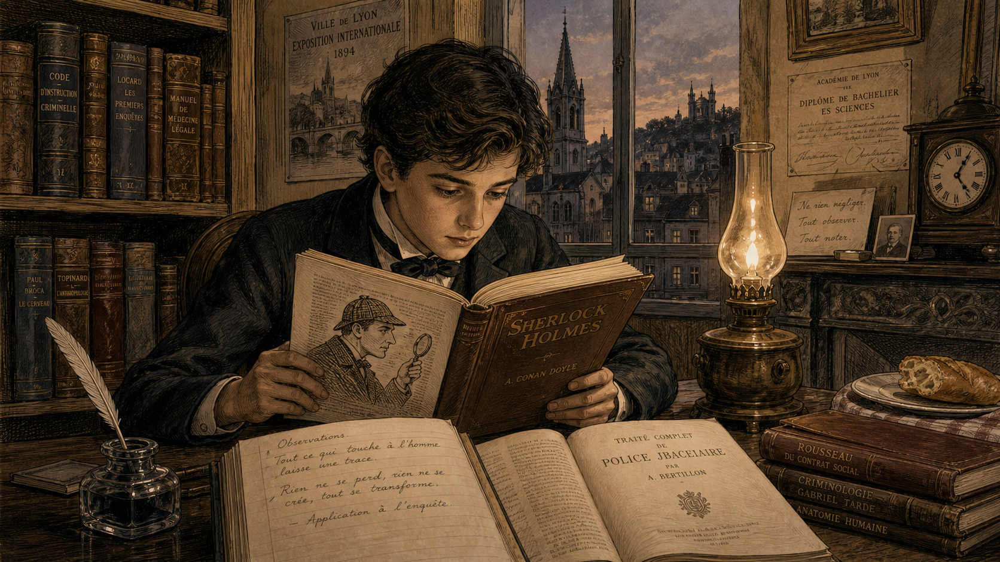

Image Prompt

(This is Panel 01. Do not include the panel number in the image.)
I am about to ask you to generate a series of images for a graphic novel. Please make the images have a consistent style and consistent characters. Do not ask any clarifying questions. Just generate the image immediately when asked.
Please generate a 16:9 image in early 20th-century French Belle Époque illustration with fine ink linework, soft sepia and muted laboratory tones depicting panel 1 of 12. The scene shows a teenage Edmond Locard — slender, dark-haired, around sixteen years old — seated at a heavy wooden desk in a modest Lyon study, circa 1893. He is leaning over an open book, reading intently by warm lamplight. The book's pages show a line drawing of Sherlock Holmes examining a magnifying glass. On the desk beside the book: a second open volume, a handwritten notebook, a quill pen, and a glass inkwell. A bookshelf behind him holds leather-bound volumes with French spines. Through a small window, the rooftops and church spires of Lyon are faintly visible at dusk. The color palette is warm sepia and ivory with soft amber lamplight. The emotional tone is wonder and intellectual hunger. At least six visual details: the Holmes illustration visible on the page, the title "Sherlock Holmes" legible on the book cover, a penciled annotation in the notebook margin, a ticking clock on the mantelpiece, a half-eaten baguette on a side table, and the reflection of the lamp flame in the inkwell glass.
Generate the image immediately without asking clarifying questions.

Growing up in Lyon in the 1890s, young Edmond Locard devoured the Sherlock Holmes stories of Arthur Conan Doyle. Holmes did not guess — he *deduced*, reading a person's entire history from a callus, a stain, a worn coat-cuff. To Locard, those stories were not fantasy. They were a blueprint. He was convinced that a real investigator, with the right training and the right tools, could do exactly the same thing.

---

## Panel 2: Learning from the Master

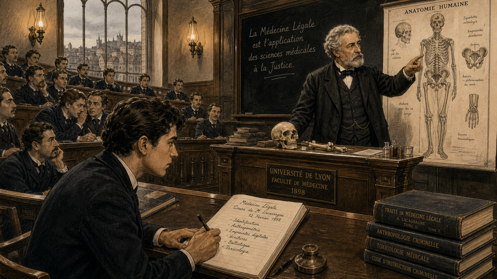

Image Prompt

(This is Panel 02. Do not include the panel number in the image.)
Please generate a 16:9 image in early 20th-century French Belle Époque illustration with fine ink linework, soft sepia and muted laboratory tones depicting panel 2 of 12. Make the characters and style consistent with the prior panels. The scene shows a university lecture hall in Lyon, France, circa 1898. A commanding older professor — Alexandre Lacassagne — stands at a large wooden lectern before a tiered hall of male students in dark coats. Lacassagne has silver swept-back hair and a full beard; he wears a formal dark frock coat. He gestures toward a large illustrated chart on the wall showing a human figure with annotations. In the front row, a young Edmond Locard — dark hair, intent expression, student's dark academic coat — leans forward with a pencil poised over his notebook, completely absorbed. Other students are visible in the tiers behind, some taking notes, one or two looking less attentive. Gas-lit wall sconces cast warm amber light. The color palette is sepia, slate blue, and ivory. The emotional tone is reverence and discipleship. At least six visual details: the anatomical chart on the wall, a skull specimen on the lectern, a blackboard with a French phrase about forensic medicine, Locard's notebook open with fresh handwriting, a student in the background whispering to his neighbor, and the tall arched windows admitting gray Lyon daylight.
Generate the image immediately without asking clarifying questions.

At the University of Lyon, Locard found his mentor: Dr. Alexandre Lacassagne, one of Europe's most respected medical examiners and a founding figure of forensic medicine. Lacassagne taught that the body and the crime scene were documents — they recorded events in their own language, and it was the scientist's job to translate. Under his guidance, Locard studied medicine, law, and the emerging science of criminalistics. The mentor's lesson was simple and transformative: the evidence does not lie; the investigator must simply learn to ask it the right questions.

---

## Panel 3: Frustration in the Prefecture

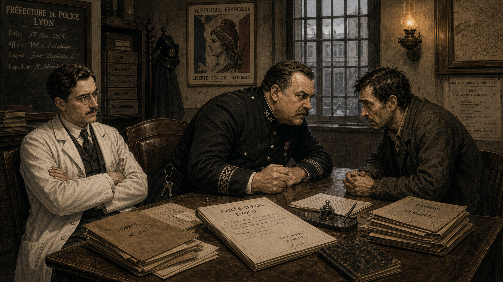

Image Prompt

(This is Panel 03. Do not include the panel number in the image.)
Please generate a 16:9 image in early 20th-century French Belle Époque illustration with fine ink linework, soft sepia and muted laboratory tones depicting panel 3 of 12. Make the characters and style consistent with the prior panels. The scene is a police prefecture office in Lyon, France, circa 1908. A heavyset police inspector in a dark uniform sits across a large desk from a frightened, disheveled male suspect. The inspector is leaning forward with a clenched fist on the desk, clearly applying pressure through intimidation. Standing to one side, Edmond Locard — now in his late twenties, dark hair and mustache, charcoal three-piece suit, white lab coat open over it — watches the scene with his arms folded, his expression troubled and skeptical. Papers and dossiers are stacked haphazardly on the desk. A gas lamp on the wall provides dim amber light. The color palette is muted sepia, dark slate, and ivory. The emotional tone is moral unease and frustration. At least six visual details: a confession form visible on the desk, a ring of keys hanging from the inspector's belt, a barred window in the background, Locard's white coat pocket holding a small glass vial, a framed portrait of the French Republic on the wall, and the suspect's clasped hands trembling on the table edge.
Generate the image immediately without asking clarifying questions.

By his late twenties, Locard was working alongside the Lyon police — and what he saw troubled him deeply. Detectives relied almost entirely on witness testimony, informants, and aggressive interrogations designed to produce confessions. Physical evidence gathered at crime scenes was routinely ignored or mishandled, and suspects were sometimes pressed to confess to crimes they had not committed. Locard understood, with growing certainty, that every crime scene contained a silent record of what had actually happened — if anyone would bother to read it.

---

## Panel 4: Two Attic Rooms

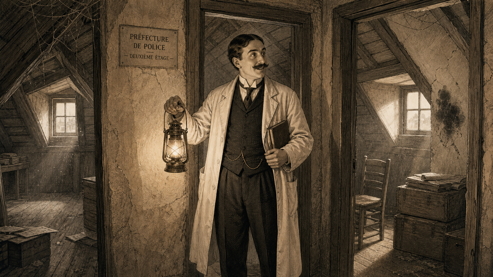

Image Prompt

(This is Panel 04. Do not include the panel number in the image.)
Please generate a 16:9 image in early 20th-century French Belle Époque illustration with fine ink linework, soft sepia and muted laboratory tones depicting panel 4 of 12. Make the characters and style consistent with the prior panels. The scene shows two small, bare attic rooms at Lyon police headquarters, France, in 1910. The ceilings slope steeply; exposed wooden roof beams run overhead. The rooms are empty except for dust and cobwebs. Edmond Locard stands in the doorway between the two rooms, holding a lantern in one hand and looking around with a wide, almost gleeful expression — the look of a person who sees possibility where others see nothing. He still wears his charcoal three-piece suit and white lab coat. A narrow dormer window lets in a shaft of gray daylight, illuminating dust motes hanging in the air. One cracked plaster wall has a smudge of old soot. The color palette is sepia, pale gray, and dusty ivory. The emotional tone is determined optimism mixed with the slight absurdity of the situation. At least six visual details: the sloped ceiling beams, cobwebs in the upper corner, the dust motes caught in the shaft of light, Locard's small notebook tucked under one arm, a single bare wooden chair left by a previous occupant, and the distant sound of the police station below suggested by a muffled typeset text label or caption "Préfecture de Police — deuxième étage."
Generate the image immediately without asking clarifying questions.

In 1910, the Lyon police chief finally relented — a little. He could not offer Locard a proper laboratory, but he could offer space: two small, dusty attic rooms at police headquarters on the top floor of the Palais de Justice building. No running water. No electricity. No dedicated budget to speak of. Most scientists would have been insulted. Locard was delighted. He moved in immediately, hauled up a secondhand microscope, a few glass vials, and a wooden workbench, and declared it the Institut de Criminalistique de Lyon.

---

## Panel 5: The Principle Spoken Aloud

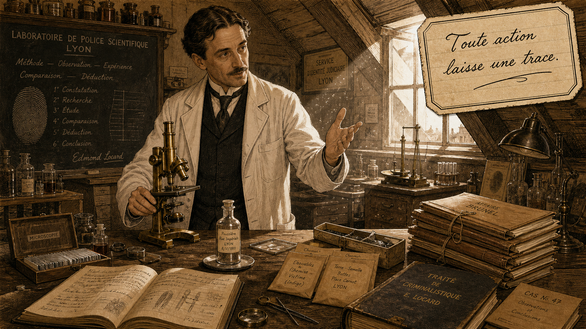

Image Prompt

(This is Panel 05. Do not include the panel number in the image.)
Please generate a 16:9 image in early 20th-century French Belle Époque illustration with fine ink linework, soft sepia and muted laboratory tones depicting panel 5 of 12. Make the characters and style consistent with the prior panels. The scene shows Locard's attic laboratory in Lyon, France, circa 1910–1912. The low-ceilinged room is now furnished: a heavy wooden workbench covered with microscopes, glass vials, specimen envelopes, and leather ledgers. Locard stands at the workbench, turned slightly toward the viewer, one hand resting on a brass microscope and the other gesturing expressively. He is speaking — clearly articulating an idea. A speech bubble or inset caption panel (styled as a handwritten label in the manner of a scientific field notebook) reads: "Toute action d'un individu, et a fortiori l'action violente qu'est un crime, ne peut pas se dérouler sans laisser quelque trace." A soft shaft of dormer-window light catches the dust floating above the workbench. The color palette is warm sepia, ochre, and ivory. The emotional tone is conviction and clarity. At least six visual details: the brass microscope on the bench, a glass vial of fine dust on a stand, a handwritten specimen label, a stack of case files with string ties, the sloped attic ceiling, and the dust motes suspended in the window light.
Generate the image immediately without asking clarifying questions.

From his cramped attic, Locard gave the field of forensic science its first universal law. He articulated what would become known as Locard's Exchange Principle: every contact between a criminal and a crime scene is bidirectional — the perpetrator leaves traces behind, and carries traces away. Dust, fibers, skin cells, pollen, paint flakes, soil — all of it transferred with every touch, every step, every breath. The world, Locard argued, is covered in an unbroken record of every contact that has ever occurred. The scientist's job is simply to find it.

---

## Panel 6: The Case of the Pink Powder

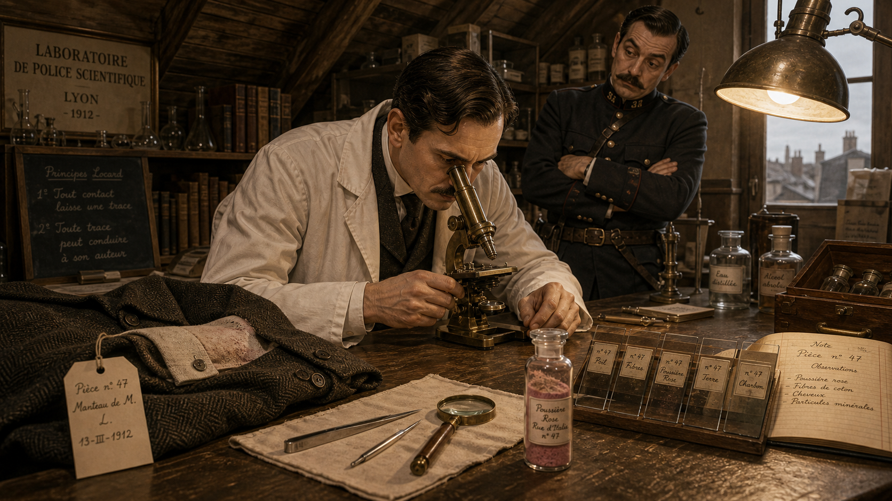

Image Prompt

(This is Panel 06. Do not include the panel number in the image.)
Please generate a 16:9 image in early 20th-century French Belle Époque illustration with fine ink linework, soft sepia and muted laboratory tones depicting panel 6 of 12. Make the characters and style consistent with the prior panels. The scene shows Locard's attic laboratory in Lyon, France, circa 1912. Locard sits on a wooden stool at the workbench, leaning over a brass microscope with intense focus. On the bench before him: a man's coat and shirt cuff laid flat and carefully labeled with a specimen tag; a small glass vial containing fine pink powder; forceps; tweezers; and a series of small labeled glass slides arranged in a row. A detective in a dark uniform stands slightly behind Locard, watching over his shoulder with arms crossed, his expression somewhere between skeptical and curious. The lamp above casts a focused circle of amber light on the workbench. The color palette is warm sepia and amber with a faint rose tint on the glass vial and powder. The emotional tone is methodical concentration. At least six visual details: the coat cuff with a visible fine dust residue, the pink-tinted glass vial with a handwritten label, the row of glass slides, forceps resting on a linen square, the skeptical detective's raised eyebrow, and Locard's magnifying glass set to one side while he uses the microscope.
Generate the image immediately without asking clarifying questions.

The principle was not merely theoretical. A case came to Locard's laboratory involving a young woman who had been strangled. A suspect had been identified but denied any contact with the victim. Rather than rely on the suspect's alibi, Locard asked for the man's clothing — and in particular, the material beneath his fingernails and trapped in the fabric of his coat cuffs. Under the microscope, the trace material told a different story. Mixed among ordinary dust were tiny particles of a distinctive pink face powder.

---

## Panel 7: The Powder Speaks

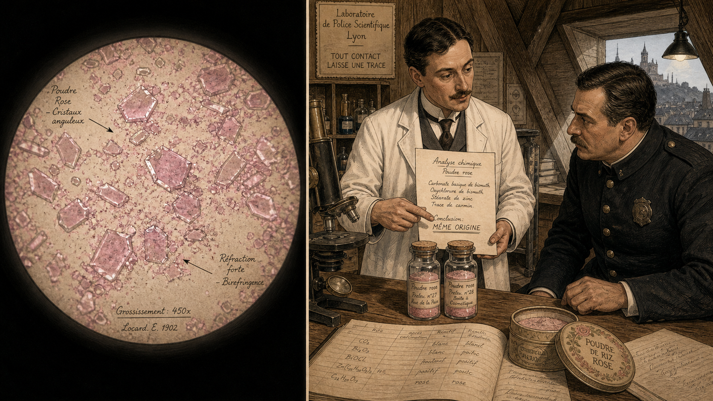

Image Prompt

(This is Panel 07. Do not include the panel number in the image.)
Please generate a 16:9 image in early 20th-century French Belle Époque illustration with fine ink linework, soft sepia and muted laboratory tones depicting panel 7 of 12. Make the characters and style consistent with the prior panels. The scene is split as a diptych within a single 16:9 frame. Left half: a close-up illustration of a microscope's eyepiece view — a highly detailed circular field showing fine crystalline pink powder particles magnified, rendered with fine ink linework and labeled with small annotation arrows. Right half: a wider view of Locard's laboratory — Locard stands at his workbench holding a written analysis report, pointing to the pink powder vial and speaking to a police detective. On the workbench: a second glass vial containing pink powder taken from a decorative tin of the victim's cosmetic. The two vials are side by side with hand-lettered specimen labels. A ledger is open showing chemical notations. The detective's expression has shifted from skepticism to serious attention. Color palette: sepia, ivory, pale rose, amber. The emotional tone is the quiet drama of a significant finding. At least six visual details: the two labeled pink powder vials side by side, the open chemical analysis ledger, Locard's written report with underlining, the microscope still on the bench, the detective's changed expression, and through the dormer window a sliver of Lyon rooftop under a gray sky.
Generate the image immediately without asking clarifying questions.

Analysis of the pink particles revealed a specific mineral and organic composition that matched, component for component, the rare cosmetic powder the victim was known to use — a formula not widely available. This physical evidence was consistent with direct contact between the suspect and the victim; combined with other findings, it implicated the suspect in a way that an alibi alone could not explain away. Faced with the material record Locard had assembled, the suspect confessed. It was not magic, and it was not a single definitive proof — but the silent testimony of dust had pointed unmistakably toward the truth.

---

## Panel 8: The Science of Dust

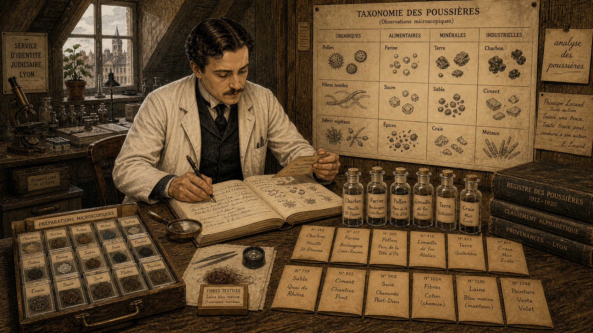

Image Prompt

(This is Panel 08. Do not include the panel number in the image.)
Please generate a 16:9 image in early 20th-century French Belle Époque illustration with fine ink linework, soft sepia and muted laboratory tones depicting panel 8 of 12. Make the characters and style consistent with the prior panels. The scene shows Locard's attic laboratory circa 1912–1920 during a methodical cataloguing session. Locard sits at his workbench surrounded by dozens of small labeled specimen envelopes and glass vials, each containing a different kind of dust sample: coal dust, flour, pollen, metal filings, soil from different Lyon neighborhoods, chalk, and textile fibers. He is recording findings in a large leather ledger with neat handwritten French annotations. A large handmade wall chart behind him shows a taxonomy of dust types with ink illustrations of each particle type as seen under a microscope. Several glass slides are arranged in a systematic grid on the bench. A second smaller workbench in the background has been added, holding more equipment. The color palette is sepia, ochre, muted green-gray, and ivory. The emotional tone is painstaking systematic science — methodical, unhurried, cumulative. At least six visual details: the wall chart of dust taxonomy, the rows of labeled specimen envelopes, the leather ledger open to a page of annotated particle drawings, a textile fiber sample under a small hand lens, a small potted plant on the windowsill (an anomalous touch of life), and a handwritten sticky label reading "analyse des poussières" pinned to the chart.
Generate the image immediately without asking clarifying questions.

Locard systematized what he called *l'analyse des poussières* — the analysis of dust — developing it into a methodical discipline. He catalogued dust by type: mineral particles, textile fibers, pollen grains, metal filings, chalk, flour, coal, paint chips, and dozens more. Each type carried information about where a person had been and what they had handled. A person's clothing, Locard wrote, was a kind of autobiography — worn, silent, and completely honest. The work was painstaking, requiring patience and a willingness to look closely at things the rest of the world swept away.

---

## Panel 9: The World Comes to Lyon

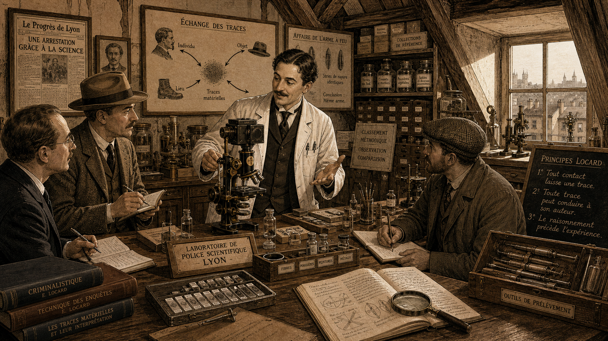

Image Prompt

(This is Panel 09. Do not include the panel number in the image.)
Please generate a 16:9 image in early 20th-century French Belle Époque illustration with fine ink linework, soft sepia and muted laboratory tones depicting panel 9 of 12. Make the characters and style consistent with the prior panels. The scene shows the attic laboratory in Lyon, France, circa 1920s — now expanded and better equipped, though still under sloped wooden beams. The room is busier: two or three visiting investigators from different countries are present, indicated by slightly different hat and coat styles (one in a British-style overcoat, one with a Belgian-style uniform cap on the table). Locard stands at the center, demonstrating technique at the main microscope, his expression animated and generous. The workbench is larger and more organized, with additional microscopes, a camera attachment on one instrument, shelving with labeled reference specimens, and framed case-study diagrams on the walls. Visitors take notes in their own notebooks. The dormer window now has a cleaner pane, and the morning light is clear. The color palette is the established sepia and ivory but with slightly more warmth and light than earlier panels, reflecting prosperity and prestige. The emotional tone is collegial pride and intellectual generosity. At least six visible details: the camera-equipped microscope, the international visitors' different coats and hats, organized shelving with labeled reference specimens, a framed French newspaper clipping on the wall, Locard's white lab coat with two breast pocket pens, and a large case-study wall diagram labeled "Échange des traces."
Generate the image immediately without asking clarifying questions.

Word spread. By the 1920s, the Institut de Criminalistique was no longer just two dusty attic rooms — it had grown into a proper laboratory, and investigators were traveling from Great Britain, Belgium, Germany, and the United States to study Locard's methods. What had begun as a shoestring operation was becoming the model for forensic science laboratories worldwide. Locard taught willingly and without jealousy; he believed the methods should belong to everyone, because the goal — accurate justice — was universal.

---

## Panel 10: Writing the Exchange Principle

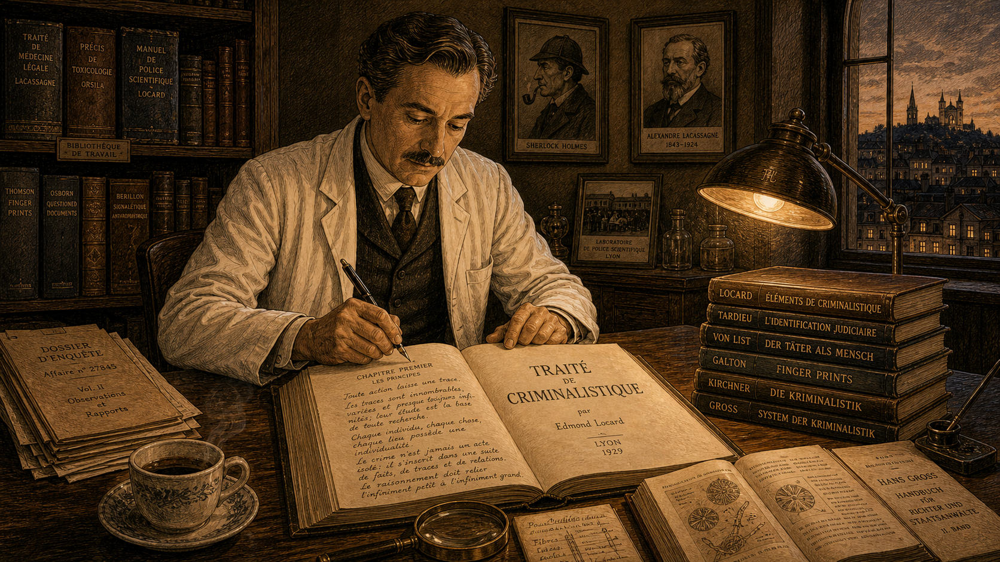

Image Prompt

(This is Panel 10. Do not include the panel number in the image.)
Please generate a 16:9 image in early 20th-century French Belle Époque illustration with fine ink linework, soft sepia and muted laboratory tones depicting panel 10 of 12. Make the characters and style consistent with the prior panels. The scene shows Locard at a writing desk in a comfortable Lyon study, circa late 1920s. He is older now — perhaps early fifties — but recognizable: same dark hair (with a touch of silver at the temples), same mustache, same white lab coat over a waistcoat. He is writing with a steel-nib pen in a large leather-bound manuscript — his multi-volume work "Traité de criminalistique." Open reference books, case files, and previous notebook pages surround him. The desk lamp casts a warm golden circle. Through the window: a Lyon evening, rooftop lights. A tall bookshelf holds volumes from many countries in many languages — the spines show French, German, and English titles. A framed portrait of Sherlock Holmes hangs on the wall beside a framed photograph of Lacassagne. The color palette is warm amber, sepia, and deep burgundy. The emotional tone is mature accomplishment and intellectual legacy. At least six visible details: the open manuscript with visible French text, the steel-nib pen in his hand, the dual frames of Holmes and Lacassagne on the wall, the multi-language bookshelf, a magnifying glass on the desk as a constant companion, and a coffee cup cooling at the desk's edge.
Generate the image immediately without asking clarifying questions.

Locard did not keep his methods in his head or in unpublished notebooks. Beginning in the 1920s, he worked steadily on his monumental *Traité de criminalistique* — a multi-volume forensic science encyclopedia that codified trace evidence analysis, document examination, fingerprint science, and dozens of other investigative techniques. He wrote in a clear, systematic style, drawing on real cases to illustrate every principle. The *Traité* became foundational reading for forensic scientists across Europe and beyond, translating the work of the laboratory into a universal language.

---

## Panel 11: The Honest Limits of a Trace

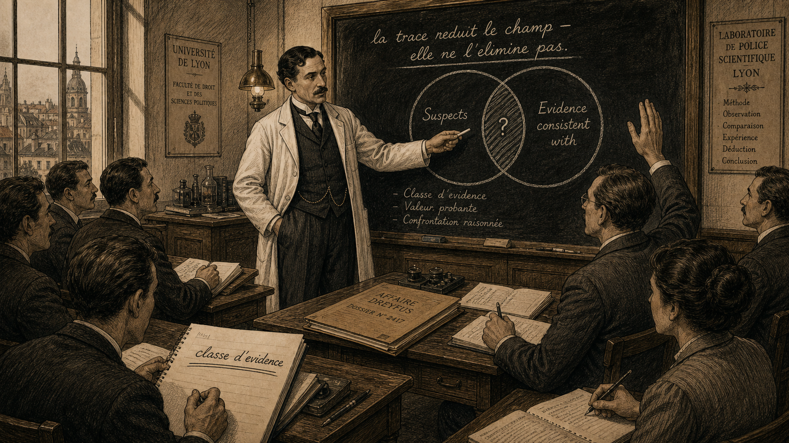

Image Prompt

(This is Panel 11. Do not include the panel number in the image.)
Please generate a 16:9 image in early 20th-century French Belle Époque illustration with fine ink linework, soft sepia and muted laboratory tones depicting panel 11 of 12. Make the characters and style consistent with the prior panels. The scene is a classroom or seminar room in Lyon, circa late 1920s. Locard stands before a small group of six or seven advanced students, pointing to a blackboard diagram. The diagram shows two overlapping circles (a Venn-diagram-style illustration in chalk) labeled "Suspects" and "Evidence consistent with" — the overlap zone is shaded but not filled completely, with a small question mark in the center. Locard's expression is serious and careful, emphasizing a nuanced point. One student's notebook shows the words "classe d'evidence" underlined. Another student raises a hand with a questioning look. The chalkboard also has a phrase: "la trace réduit le champ — elle ne l'élimine pas." The color palette is sepia, slate, and ivory with chalk-white highlights on the board. The emotional tone is intellectual honesty and rigor. At least six visible details: the Venn-diagram circles on the blackboard, the question mark in the overlap, the student's notebook with underlined text, the raised hand of a questioning student, Locard's chalk-dusted fingers, and a case-study file folder on the front desk labeled with a case number.
Generate the image immediately without asking clarifying questions.

Locard was clear-eyed about what trace evidence could and could not do. He understood that most trace evidence is *class evidence* — it narrows the field of possibilities, it is consistent with a particular source, but it rarely, on its own, identifies one specific individual to the exclusion of all others. Fiber evidence says "this fiber could have come from that garment." Dust evidence says "this composition is consistent with this location." That is powerful — it corroborates, it focuses, it eliminates — but it must be interpreted with care, weighed alongside other evidence, and never overstated to a jury. Locard's principle generates leads; science and honesty do the rest.

---

## Panel 12: The Legacy in Every Modern Lab

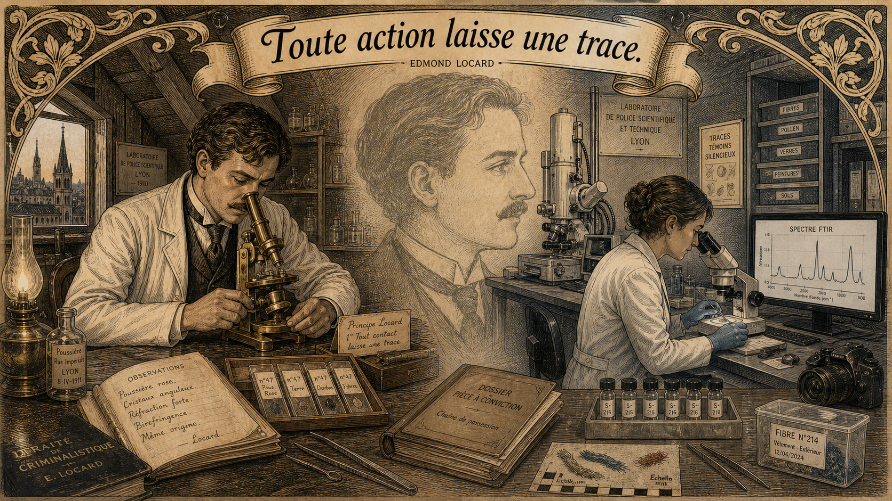

Image Prompt

(This is Panel 12. Do not include the panel number in the image.)
Please generate a 16:9 image in early 20th-century French Belle Époque illustration with fine ink linework, soft sepia and muted laboratory tones depicting panel 12 of 12. Make the characters and style consistent with the prior panels. The scene is a diptych or composite image within one 16:9 frame — styled as a Belle Époque illustrated plate that juxtaposes past and legacy. On the left: a sepia vignette of Locard in his attic Lyon laboratory circa 1910, examining a specimen slide under his brass microscope by lamplight, alone and absorbed. On the right: a stylized, still-Belle-Époque-illustrated (not modern-photographic) image of a contemporary forensic trace-evidence laboratory — a clean, organized bench with modern equipment styled in the same ink-linework manner but with sleeker shapes, including a scanning electron microscope silhouette, a computer screen showing a spectrum graph, and a forensic analyst in a modern lab coat examining fiber samples under a stereoscope. A decorative banner across the top of the composite reads (in the same Art Nouveau lettering as the cover): "Toute action laisse une trace." The color palette echoes the full story: sepia, ivory, slate blue, ochre. The emotional tone is quiet, enduring legacy. At least six visual details: the brass microscope on the left, the SEM silhouette on the right, the spectrum graph on the screen, the fiber sample on the right-side bench, the decorative banner with the French phrase, and a faint ghost-image of Locard's profile watermarked in the background center connecting both sides.
Generate the image immediately without asking clarifying questions.

Edmond Locard died in 1966 at the age of 89, having spent nearly sixty years building, teaching, and refining the science he had helped create. Today, every trace-evidence unit in every forensic laboratory in the world operates on the foundation he laid in those two attic rooms in Lyon. When an analyst examines a fiber under a comparison microscope, collects soil from a suspect's shoe, or recovers paint transfer from a hit-and-run vehicle, they are doing exactly what Locard envisioned: reading the unbroken record that every contact leaves behind. The dust never lies.

---

### Epilogue – What Made Locard Different?

Locard was not the only scientist of his era studying physical evidence. What set him apart was his combination of scientific rigor, institutional persistence, and a deeply moral conviction that the justice system owed its defendants something better than a forced confession. He built a laboratory when no one offered him one, published methods when no one asked him to, and trained investigators who went on to build laboratories in their own countries. His insight — that the physical world is a continuous, faithful witness to everything that happens within it — turned forensic science from a collection of clever tricks into a principled discipline.

| Challenge | How Locard Responded | Lesson for Today |
|---|---|---|
| Police relied on confession, not evidence | Built a laboratory and demonstrated results on real cases | Physical evidence protects the innocent as well as identifying the guilty |
| No institutional support or budget | Used two bare attic rooms and secondhand equipment | Scientific rigor depends on method, not resources |
| Findings could be overstated in court | Taught explicitly that trace evidence narrows possibilities, not eliminates doubt | Forensic scientists must communicate uncertainty honestly to juries |
| Knowledge siloed in one laboratory | Wrote comprehensive textbooks; trained international visitors | Open publication and training multiplies the benefit of any discovery |

---

### Call to Action

The next time you pick up a piece of clothing — your jacket, your backpack strap, your sneaker sole — remember that it is carrying a record of everywhere you have been and everything you have touched. That record is there whether anyone reads it or not. Learning to read it carefully, honestly, and without overstating what it says is the work of forensic science, and it is work that matters. As you study trace evidence in this course, you are joining a tradition that Locard started with a brass microscope, two dusty rooms, and an absolute faith in what the material world can tell us.

---

*"Every criminal passes through the scene of the crime, and leaves traces of his presence there. Conversely, he takes with him — on his body or his clothing — traces of the place and of the victim."*
— Edmond Locard

*"The microscopic debris that covers our clothing and bodies are the mute witnesses, sure and faithful, of all our movements and all our encounters."*
— Edmond Locard

## References

1. [Edmond Locard — Wikipedia](https://en.wikipedia.org/wiki/Edmond_Locard) — Overview of Locard's life, career, and the founding of the Institut de Criminalistique in Lyon.
2. [Locard's exchange principle — Wikipedia](https://en.wikipedia.org/wiki/Locard%27s_exchange_principle) — Explanation and history of the foundational forensic principle that every contact leaves a trace.
3. [Trace evidence — Wikipedia](https://en.wikipedia.org/wiki/Trace_evidence) — Overview of trace evidence types, collection methods, and the role of class versus individual characteristics.
4. [Edmond Locard — Encyclopaedia Britannica](https://www.britannica.com/biography/Edmond-Locard) — Concise biography and assessment of Locard's significance to forensic science from Encyclopaedia Britannica.
5. [Locard's Exchange Principle — Forensic Science International (Oxford Academic overview)](https://academic.oup.com/fsr/article/doi/10.1093/fsr/owaa020/5879244) — Peer-reviewed discussion of the application and modern interpretation of Locard's exchange principle in forensic casework.
