# Truth in a Nutshell

Cover Image Prompt

(This is the Cover Image. Do not include this label in the image.)
A wide-landscape 16:9 cover image in 1930s–40s Art Deco American illustration style, warm muted palette, fine miniature-diorama detailing. The central figure is Frances Glessner Lee: a dignified woman in her late sixties, silver hair pinned neatly under a small brimmed hat, wearing a tailored charcoal-and-ivory wool suit with pearl buttons, and wire-rimmed spectacles. She is leaning over a long worktable, holding a pair of silver jeweler's tweezers above a dollhouse-scale room — a miniature living room with tiny upholstered furniture, a minuscule braided rug, and lace curtains no larger than a thumbnail. The worktable is lit by a warm banker's lamp casting amber light. The background is a richly appointed study in a Chicago mansion, circa 1944, with dark wood paneling, floor-to-ceiling shelves holding dozens of labeled wooden dollhouse crates, and framed architectural drawings on the wall. The title text "Truth in a Nutshell" is set at the top in a period Art Deco serif typeface with gold leaf detailing; a subtitle beneath reads "The Story of Frances Glessner Lee, 1878–1962." Color palette: warm amber, ivory, charcoal, deep forest green, and touches of gold. Emotional tone: focused intelligence, quiet determination, patrician grace. Six or more specific visual details: the silver jeweler's tweezers, the dollhouse-scale braided rug, tiny lace curtains visible at the model window, labeled wooden crates on the shelves, a magnifying glass resting beside the model, and Frances's wire-rimmed spectacles reflecting the amber lamp.
Generate the image immediately without asking clarifying questions.

Narrative Prompt

This is an 11-panel graphic novel about Frances Glessner Lee (1878–1962), a wealthy Chicago heiress who was denied a formal scientific education because of her gender and family disapproval, and who late in life used her inherited fortune to fund Harvard's Department of Legal Medicine and to build the "Nutshell Studies of Unexplained Death" — a series of dollhouse-scale crime-scene dioramas that revolutionized investigator training by teaching systematic observation before any conclusion is drawn. The story is set primarily in Chicago, Illinois, and New England, between the 1890s and the 1950s.

Art style for all panels: 1930s–40s Art Deco American illustration, warm muted palette, fine miniature-diorama detailing. Rich wood-paneled interiors, warm amber and ivory light, architectural precision, period clothing with careful tailoring detail. No photorealism; the aesthetic is that of a beautifully illustrated American magazine of the 1940s — the Saturday Evening Post meets a scientific monograph. Color palette throughout: warm amber, ivory, charcoal, deep forest green, muted rose, and occasional gold accents. No bright, saturated modern colors.

Character consistency — Frances Glessner Lee: a woman of presence and refinement. In her youth (panels 1–2, circa 1895–1900) she is a slender young woman in her late teens to mid-twenties, dark hair in an upswept Gibson-girl style, wearing high-collared Edwardian blouses and dark skirts. From panel 3 onward, she is depicted in her forties through her seventies: silver or white hair always neatly pinned, wire-rimmed spectacles, tailored wool suits in charcoal, navy, or dark green — always pearl buttons, always elegant. She is often shown with jeweler's tweezers, a magnifying glass, or small tools appropriate to detailed handcraft work.

Supporting character — George Burgess Magrath: a broad-shouldered, confident man in his forties, with short dark hair and a neat dark mustache, always in a dark suit and tie, carrying an air of professional seriousness offset by warmth when speaking with Frances.

Settings: the grand Glessner House in Chicago (Prairie Avenue, south side, stone-and-brick Romanesque exterior, richly furnished interior); Harvard Medical School buildings in Boston; wood-paneled seminar rooms and conference tables; and the worktable where the Nutshell dioramas are built — always the center of dramatic focus when it appears.

Every panel should feel like a page from a handsomely produced 1940s American illustrated magazine. Precise architectural detail, period-accurate clothing and props, warm natural light. Fine linework throughout.

### Prologue – The Woman Who Taught Detectives to See

In the middle of the twentieth century, American death investigations were a mess. Coroners were often untrained politicians. Detectives followed hunches instead of evidence. Crime scenes were trampled, and the truth about how people died was routinely buried under assumption. One woman — denied a formal education because of her gender, working with her own hands in her family's mansion — built the tools that began to fix it. Her name was Frances Glessner Lee, and her weapon of choice was a dollhouse.

---

## Panel 1: The Curious Girl Who Was Told No

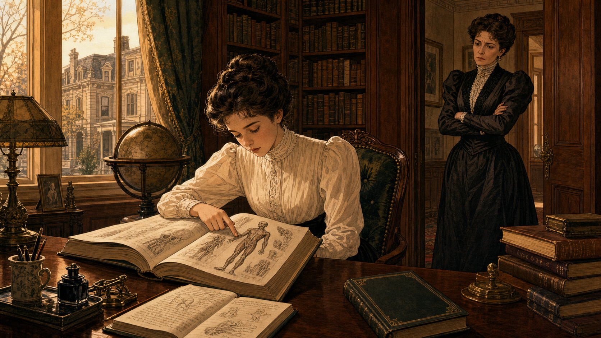

Image Prompt

(This is Panel 01. Do not include the panel number in the image.)
I am about to ask you to generate a series of images for a graphic novel. Please make the images have a consistent style and consistent characters. Do not ask any clarifying questions. Just generate the image immediately when asked.

Please generate a 16:9 image in 1930s–40s Art Deco American illustration, warm muted palette, fine miniature-diorama detailing depicting panel 1 of 11. The scene shows a teenage Frances Glessner Lee — a slender young woman of about sixteen, dark hair in an upswept Gibson-girl style, wearing a high-collared ivory Edwardian blouse and a dark skirt — seated at a grand mahogany desk in the Glessner family's library in Chicago, Illinois, circa 1894. She is reading intently from a large illustrated medical or anatomy textbook, one finger tracing a diagram of a human figure. Stacked beside her on the desk are more books: a natural science volume, a notebook filled with her own neat handwriting, and a mystery novel lying face-down. Through the tall window behind her, the stone facade of a neighboring Chicago mansion on Prairie Avenue is visible in the golden afternoon light. The room is richly furnished: dark wood paneling, floor-to-ceiling bookshelves, a globe on a stand. A second figure — her mother, a well-dressed Gilded Age matron in a dark taffeta gown with a high lace collar — stands in the doorway, arms crossed, looking at Frances with a mixture of disapproval and concern. Color palette: warm amber, deep mahogany, ivory, dark green. Emotional tone: intellectual hunger meeting quiet constraint. At least six specific visual details: the open anatomy textbook with a visible human-figure diagram, Frances's finger tracing the page, the notebook with handwritten observations, the mystery novel face-down on the corner of the desk, the mother's disapproving posture in the doorway, and the tall Prairie Avenue window with afternoon light.
Generate the image immediately without asking clarifying questions.

Frances Glessner was born in 1878 into one of Chicago's most prominent families — her father, John Jacob Glessner, had made a fortune in farm machinery, and the family's Prairie Avenue mansion was one of the grandest on the South Side. From childhood, Frances was drawn to science and to mysteries, filling notebooks with careful observations of the natural world. When she expressed a wish to study medicine or attend university, the answer was swift and firm: young women of her station did not do such things. She would marry, manage a household, and put her curiosity to more acceptable uses.

---

## Panel 2: The Brother's Friend Who Changed Everything

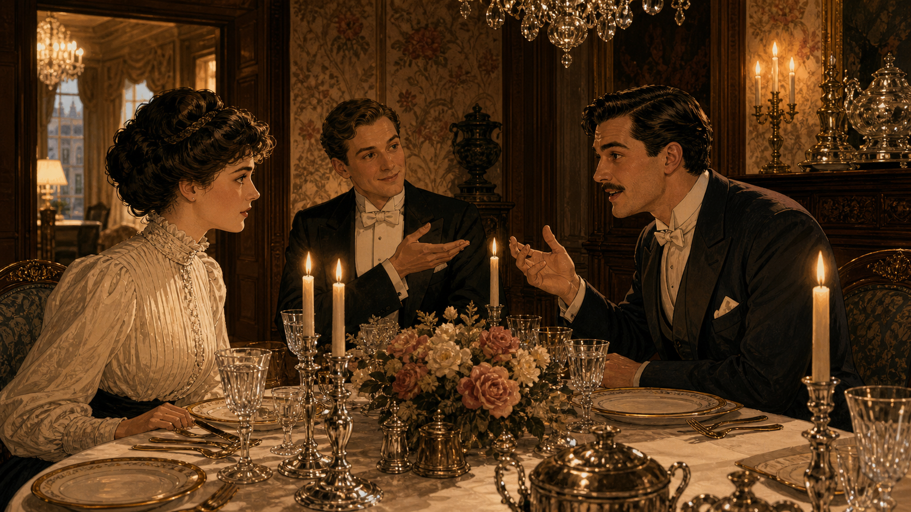

Image Prompt

(This is Panel 02. Do not include the panel number in the image.)
Please generate a 16:9 image in 1930s–40s Art Deco American illustration, warm muted palette, fine miniature-diorama detailing depicting panel 2 of 11. Make the characters and style consistent with the prior panels. The scene shows an elegant dining room in the Glessner House on Prairie Avenue, Chicago, circa 1898–1900. A formal dinner is in progress. Frances Glessner — now in her early twenties, dark hair upswept, ivory high-collared blouse, attentive expression — is seated across a polished mahogany table from a confident young man in his late twenties: George Burgess Magrath, broad-shouldered, dark hair neatly parted, a neat dark mustache, wearing a dark suit and white tie. He speaks with animation, leaning slightly forward. To his left sits Frances's brother, George Glessner, a young man in a dark dinner jacket, smiling and gesturing as if making an introduction. Fine silver candlesticks, crystal glasses, and white linen adorn the table. The room has dark wainscoting, floral wallpaper, and an ornate chandelier. The color palette is warm amber from candlelight, ivory, mahogany, charcoal. Emotional tone: the spark of an unexpected intellectual connection. At least six specific visual details: the polished silver candlesticks, the crystal glasses reflecting candlelight, George Burgess Magrath's animated gesture, Frances's focused listening expression, the brother's relaxed introductory gesture, and a floral centerpiece between the dinner guests.
Generate the image immediately without asking clarifying questions.

Her brother George brought home from Harvard a friend named George Burgess Magrath — a medical student training to become a medical examiner. Over dinner on Prairie Avenue, Magrath spoke about his work with a frankness that was unusual in polite society: he described the chaos of American death investigations, the political incompetence of elected coroners, and the certainty that innocent people were being convicted while guilty ones walked free. Frances listened with complete attention. She had found, at last, someone who took the problem seriously — and who spoke to her as an intellectual equal.

---

## Panel 3: A System Built on Guesswork

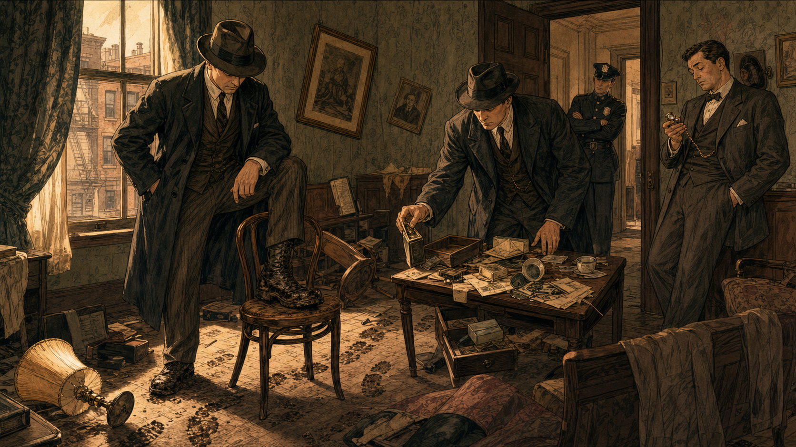

Image Prompt

(This is Panel 03. Do not include the panel number in the image.)
Please generate a 16:9 image in 1930s–40s Art Deco American illustration, warm muted palette, fine miniature-diorama detailing depicting panel 3 of 11. Make the characters and style consistent with the prior panels. The scene shows a disordered room in a modest apartment building, Chicago, circa 1910. Two plainclothes detectives in dark overcoats and fedoras are moving carelessly through the space — one has his foot on a chair that should not be disturbed, the other is picking up an object from a table with bare hands and no documentation. Neither is writing anything down. In the corner, a third figure — a city coroner in a rumpled suit, visibly inexperienced — is consulting a pocket watch and looking bored. On the floor, a spilled cup, a tipped-over lamp, and an overturned side table suggest a story no one is reading. Through an open door, a uniformed police officer leans against the doorframe watching without interest. The room is rendered in the muted palette but with intentional visual disorder: askew furniture, curtains half-pulled, muddy footprints tracking across the floor. Emotional tone: negligence, systemic failure, the tragedy of evidence being destroyed before it can speak. At least six specific visual details: the detective's muddy boot on the chair, the object lifted without gloves or documentation, the coroner consulting his pocket watch, the muddy footprint track, the tipped-over lamp, and a window with afternoon light falling uselessly on the disordered scene.
Generate the image immediately without asking clarifying questions.

What Magrath described, Frances eventually saw for herself: American death investigation was not a science, it was a series of guesses performed by undertrained officials with political appointments. Elected coroners had no medical training. Detectives worked on instinct, pressed witnesses for confessions, and frequently trampled the very evidence that could have told them what actually happened. Crime scenes were not treated as documents to be read carefully — they were treated as inconveniences to be cleared. The truth about how and why people died was disappearing under the weight of human carelessness.

---

## Panel 4: Decades of Waiting, a Lifetime of Learning

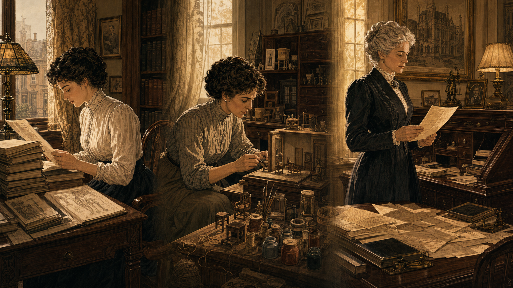

Image Prompt

(This is Panel 04. Do not include the panel number in the image.)
Please generate a 16:9 image in 1930s–40s Art Deco American illustration, warm muted palette, fine miniature-diorama detailing depicting panel 4 of 11. Make the characters and style consistent with the prior panels. The scene is a quiet montage within a single 16:9 frame, divided softly by light rather than hard borders — three vignettes showing Frances at different life stages, all in the Glessner House in Chicago. Left vignette (1900s): Frances as a young woman in her twenties, seated at a writing desk, reading a stack of medical journals. Center vignette (1910s): Frances in her thirties, crouched at a workbench surrounded by miniature craft materials — tiny wooden furniture pieces, paint pots, fine thread — constructing something with great care. Right vignette (circa 1929): Frances in her fifties, now with silver hair, standing before a large mahogany secretary desk covered with papers, a letter in her hand — the look on her face is one of resolution, of having finally made a decision. The color palette shifts from warm amber at left to a slightly brighter, clearer ivory-and-gold at right, suggesting the passage of time toward purpose. Emotional tone: patience, private preparation, the slow accumulation of purpose. At least six specific visual details: the stack of medical journals in the left vignette, the tiny wooden furniture pieces in the center vignette, the fine thread and paint pots, the silver hair in the right vignette, the letter in her hand, and the large mahogany secretary desk with papers spread across it.
Generate the image immediately without asking clarifying questions.

Frances spent the next three decades doing what she had been told women did: she married, raised children, and managed a household. But she never stopped reading. She studied legal medicine, toxicology, and criminology through books, correspondence, and long conversations with Magrath, who had become one of New England's most respected medical examiners. When her marriage ended and her children grew up, when her father died and left her the Glessner fortune, Frances found herself in her mid-fifties with independent wealth, no institutional barriers above her, and a lifetime of preparation waiting to be used.

---

## Panel 5: A Fortune Put to Work

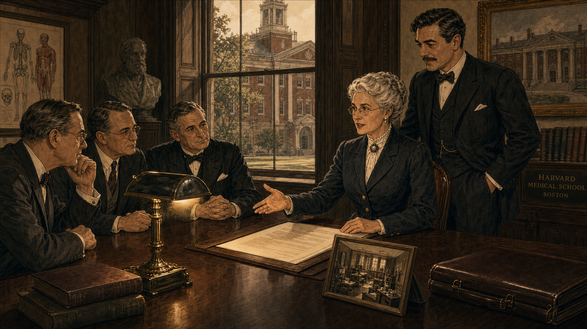

Image Prompt

(This is Panel 05. Do not include the panel number in the image.)
Please generate a 16:9 image in 1930s–40s Art Deco American illustration, warm muted palette, fine miniature-diorama detailing depicting panel 5 of 11. Make the characters and style consistent with the prior panels. The scene is a formal meeting room at Harvard Medical School in Boston, Massachusetts, circa 1931. Frances Glessner Lee — now in her early fifties, silver hair pinned neatly, wire-rimmed spectacles, tailored charcoal wool suit with pearl buttons — sits across a long conference table from three Harvard Medical School administrators in dark suits. She is presenting with confidence, gesturing to a document before her: a formal proposal for funding a new Department of Legal Medicine. Beside her stands George Burgess Magrath — now in his late forties, still broad-shouldered and neat-mustached in his dark suit — lending his professional credibility to her proposal. On the table: the formal document, a leather briefcase, and a small framed photograph of a model room (hinting at what is to come). The administrators are leaning forward with expressions of respectful attention. Through tall windows, the Georgian brick architecture of Harvard Yard is visible. Color palette: charcoal, ivory, forest green, and warm amber from a brass desk lamp. Emotional tone: measured authority, historic momentum. At least six specific visual details: the formal funding proposal document, Frances's wire-rimmed spectacles, Magrath's supportive stance, the small framed photograph of a model room on the table, the leather briefcase, and the Georgian architecture visible through the windows.
Generate the image immediately without asking clarifying questions.

In 1931, Frances Glessner Lee took decisive action. She made a substantial donation to Harvard Medical School to establish the country's first Department of Legal Medicine — the academic home that would train medical examiners as the professionals the justice system desperately needed. She also endowed a library of forensic science texts. George Burgess Magrath, her friend of thirty years, became the department's first chair. She had been denied a university education because she was a woman; she had responded, in middle age, by funding a university department. The system had not made room for her, so she built a room of her own.

---

## Panel 6: The Bold Idea — A Crime Scene in Miniature

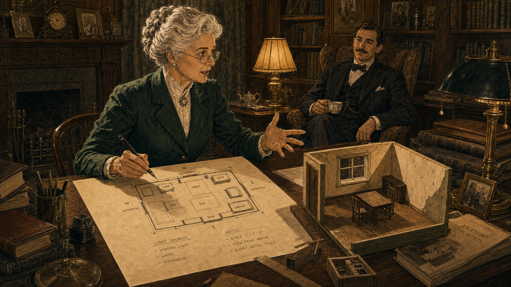

Image Prompt

(This is Panel 06. Do not include the panel number in the image.)
Please generate a 16:9 image in 1930s–40s Art Deco American illustration, warm muted palette, fine miniature-diorama detailing depicting panel 6 of 11. Make the characters and style consistent with the prior panels. The scene is a richly furnished private study in the Glessner House or a similar Chicago mansion, circa 1942–1943. Frances Glessner Lee — now in her mid-sixties, silver hair pinned, wire-rimmed spectacles, dark green tailored suit — sits at a large worktable with an expression of animated inspiration. In front of her is a rough sketch on drafting paper: a plan-view drawing of a dollhouse-scale room layout, with small labeled squares for furniture, windows marked with compass directions, and notes about light sources. Her pen is still in her hand; she has been drawing rapidly. On one corner of the table, a small prototype — a rough early-stage dollhouse room, perhaps 25 cm across — shows the beginning of the concept: tiny walls, a miniature window frame, the beginnings of a tiny wooden floor. George Burgess Magrath is visible in the background, seated in an armchair with a cup of tea, listening and nodding as Frances explains the idea. Color palette: forest green, warm amber, ivory, charcoal. Emotional tone: creative exhilaration, a plan coming together. At least six specific visual details: the drafting-paper floor plan with labeled furniture squares, the pen still in Frances's hand, compass-direction marks on the window, the rough prototype model on the table corner, the tiny wooden floor visible in the prototype, and Magrath in the background with his cup of tea.
Generate the image immediately without asking clarifying questions.

Training investigators to read crime scenes was the goal — but how do you give them the experience of reading one? Real crime scenes were messy, temporary, and legally constrained. Photographs lost scale. Written descriptions lost spatial relationships. Frances's answer was radical in its simplicity: build miniature versions of death scenes, exact in every physical detail, at one-inch-to-one-foot scale. Investigators could examine these models with magnifying glasses and flashlights, spending as long as they needed, working as a group, returning to look again. No pressure. No clock. Just the scene, the details, and the discipline of systematic observation.

---

## Panel 7: Crafted with Obsession

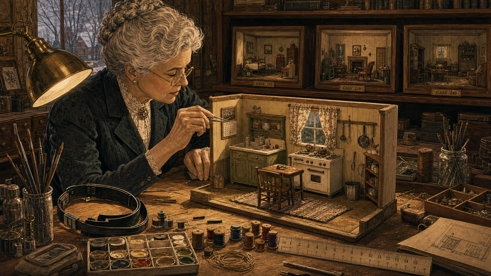

Image Prompt

(This is Panel 07. Do not include the panel number in the image.)
Please generate a 16:9 image in 1930s–40s Art Deco American illustration, warm muted palette, fine miniature-diorama detailing depicting panel 7 of 11. Make the characters and style consistent with the prior panels. The scene is Frances Glessner Lee's dedicated workroom in her New Hampshire home, Rock Maple Farm, circa 1944–1945. The room is a craftsperson's paradise: the large worktable under a pool of bright lamp light holds a nearly completed dollhouse-scale room — a miniature kitchen scene, approximately 40 cm wide, with tiny cabinets, a minuscule stove, curtains made of real fabric no larger than a thumb, a tiny hand-woven rag rug on the floor, and miniature utensils hanging on the wall. Frances leans over the model with silver jeweler's tweezers, positioning a tiny calendar on a miniature wall — the calendar has actual printed text visible on it. Around the worktable are the tools of her craft: a magnifying headband, fine-gauge wire, a palette of miniature paint pots, spools of thread no larger than a fingertip, and a ruler marked in centimeters. On a shelf behind her, three completed model boxes in wooden frames are lined up, labeled with case numbers. Her expression is one of total absorbed concentration. Color palette: warm amber lamp light, ivory, natural wood tones, with vivid small accents from the miniature fabrics. Emotional tone: obsessive craftsperson's focus, the pleasure of perfect detail. At least six specific visual details: the silver jeweler's tweezers positioning the tiny calendar, the real-fabric miniature curtains, the tiny hand-woven rag rug, the miniature utensils on the wall, the completed models on the shelf behind her, and the magnifying headband resting on the table edge.
Generate the image immediately without asking clarifying questions.

Frances built the Nutshell Studies of Unexplained Death by hand, over years, with a craftsperson's perfectionism. Each model featured working locks on miniature doors — real mechanisms, scaled down. Tiny hand-written letters, legible under magnification. Fabrics cut from actual materials and sewn to fit. Window blinds that could be raised or lowered. Burn marks and stains and wear patterns placed with deliberate and precise intent. She researched each scenario from real case files, consulting with medical examiners about the physical facts, and then rendered those facts in miniature with an accuracy that no photograph could match. The models were not decorations. They were instruments.

---

## Panel 8: Detectives at the Nutshells

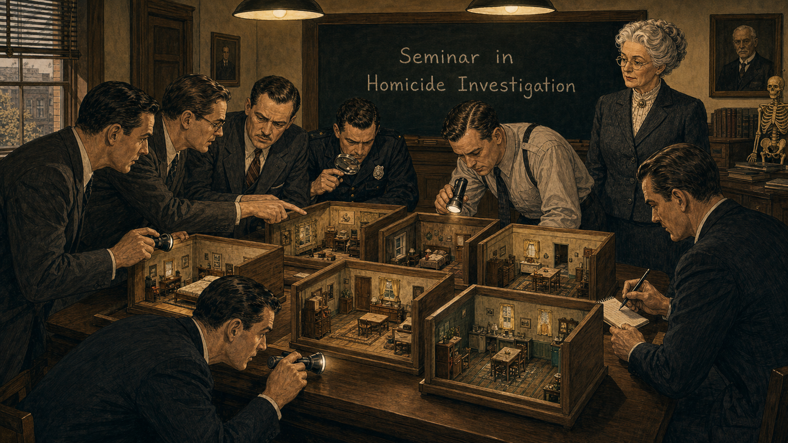

Image Prompt

(This is Panel 08. Do not include the panel number in the image.)
Please generate a 16:9 image in 1930s–40s Art Deco American illustration, warm muted palette, fine miniature-diorama detailing depicting panel 8 of 11. Make the characters and style consistent with the prior panels. The scene shows a seminar room at Harvard Medical School in Boston, Massachusetts, circa 1945–1948. Several men — police investigators and detectives in dark suits and ties, some in uniform shirts — are gathered around a long table on which six or seven Nutshell Study models are displayed, each in its own open wooden frame. The investigators are leaning in with small flashlights and magnifying glasses, studying the dioramas with intense concentration. One crouches to get eye level with a model; another points to something in one model and speaks quietly to his neighbor; a third writes notes on a small pad. At the head of the room, Frances Glessner Lee — silver hair, wire-rimmed spectacles, tailored charcoal suit — stands to one side watching, arms at her sides, with the quiet authority of a professor. A blackboard behind her reads "Seminar in Homicide Investigation" in chalk. The color palette is charcoal, warm amber, ivory, and natural wood tones of the model boxes. Emotional tone: focused intellectual rigor, the seminar atmosphere of serious study. At least six specific visual details: the open wooden-frame model boxes on the table, investigators using flashlights and magnifying glasses, the crouching investigator at eye level with a model, the notepad and pen in one detective's hand, Frances watching from the side with quiet authority, and the blackboard reading "Seminar in Homicide Investigation."
Generate the image immediately without asking clarifying questions.

Beginning in 1945, Frances hosted her "Seminars in Homicide Investigation" at Harvard — week-long intensive courses for experienced investigators from across the United States and Canada. The Nutshell dioramas were the centerpiece. Investigators were given a set amount of time — typically ninety minutes — to study each model with only a flashlight and a magnifying glass. The rule was firm and foundational: they were not asked to solve the case. They were asked to observe systematically, to document every detail they noticed, and to resist the pull toward any premature conclusion. The models were designed to reward patience and penalize assumptions.

---

## Panel 9: The Captain's Star

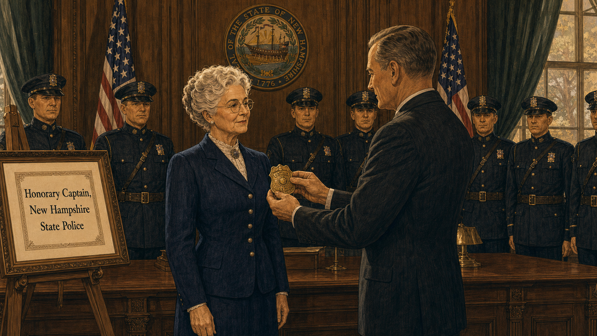

Image Prompt

(This is Panel 09. Do not include the panel number in the image.)
Please generate a 16:9 image in 1930s–40s Art Deco American illustration, warm muted palette, fine miniature-diorama detailing depicting panel 9 of 11. Make the characters and style consistent with the prior panels. The scene is a formal ceremony in a state government building in Concord, New Hampshire, circa 1943. Frances Glessner Lee — silver hair, wire-rimmed spectacles, tailored navy wool suit with pearl buttons — stands at attention in the center of the frame, facing a state official in a dark suit who is presenting her with a brass police captain's badge. A small group of uniformed New Hampshire State Police officers stands in the background in two rows, in formal dark uniforms with peaked caps, at parade rest. American flags flank the group on either side. A framed citation visible on an easel to the side reads "Honorary Captain, New Hampshire State Police." Frances's expression is composed and dignified but with a trace of private satisfaction. The room has dark wood-paneled walls, a New Hampshire state seal on the wall, and tall formal windows. Color palette: charcoal, navy, ivory, brass-gold, and the dark green of the formal drapes. Emotional tone: dignified honor, a small but meaningful vindication. At least six specific visual details: the brass police captain's badge being presented, Frances's composed dignified expression with a trace of satisfaction, the New Hampshire State Police officers in two formal rows, the American flags, the framed citation on the easel, and the state seal on the wall.
Generate the image immediately without asking clarifying questions.

In 1943, the State of New Hampshire appointed Frances Glessner Lee an honorary captain in the New Hampshire State Police — making her one of the first women in American history to hold a police captain's rank. The appointment was not ceremonial in the ordinary sense; it reflected genuine professional respect from investigators who had attended her seminars and who recognized that the sixty-five-year-old woman with the tweezers and the dollhouses had taught them more about working a death scene than any formal training they had previously received. She wore the captain's star with characteristic dignity.

---

## Panel 10: Find the Truth in a Nutshell

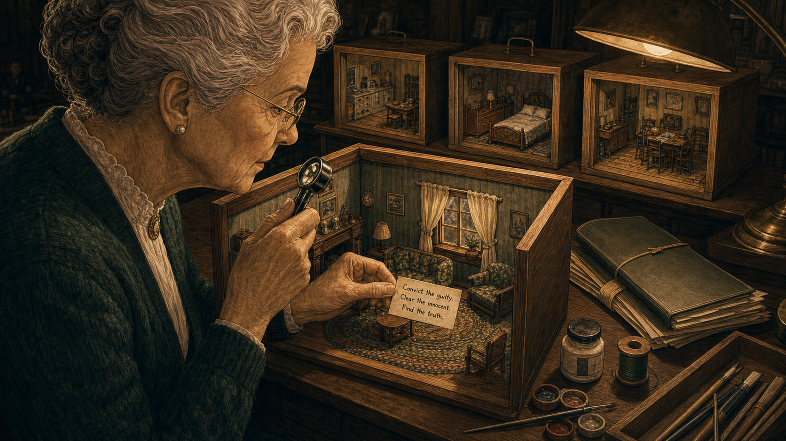

Image Prompt

(This is Panel 10. Do not include the panel number in the image.)
Please generate a 16:9 image in 1930s–40s Art Deco American illustration, warm muted palette, fine miniature-diorama detailing depicting panel 10 of 11. Make the characters and style consistent with the prior panels. The scene is a close, intimate view of Frances Glessner Lee at her worktable at Rock Maple Farm in New Hampshire, circa 1947. She sits in profile, in her late sixties, silver hair neatly pinned, wire-rimmed spectacles, a dark green wool cardigan over a white blouse. With her right hand she holds a jeweler's magnifying loupe over the interior of a completed Nutshell model — a miniature parlor scene with tiny furniture, a braided rug, and a window with real-fabric curtains. With her left hand she holds a tiny hand-lettered card between two fingers, about to place it inside the model: the card, legible under magnification, reads "Convict the guilty. Clear the innocent. Find the truth." On the worktable behind the model: a reference file folder, a small paint pot, a spool of thread, and a row of three completed models in their wooden frames. The light is warm, focused, lamp-lit against a darker room. The color palette is deep amber, ivory, forest green, and warm natural wood. Emotional tone: purposeful clarity, the union of craft and principle. At least six specific visual details: the jeweler's magnifying loupe, the tiny hand-lettered card in her left hand with legible text, the miniature parlor furniture inside the model, the real-fabric curtains on the model's window, the braided rug inside the model, and the row of completed models in wooden frames on the worktable behind.
Generate the image immediately without asking clarifying questions.

Frances guided her seminars with a motto she had chosen carefully and believed completely: "Convict the guilty, clear the innocent, and find the truth in a nutshell." The three goals were inseparable in her mind — an investigator who only cared about conviction would manufacture guilt; one who only cared about clearing suspects would ignore real evidence. The truth — arrived at through patient, systematic, unbiased observation — was the only standard that served justice. The Nutshell models were built to train investigators toward that standard, one tiny detail at a time.

---

## Panel 11: Still Teaching, Decades Later

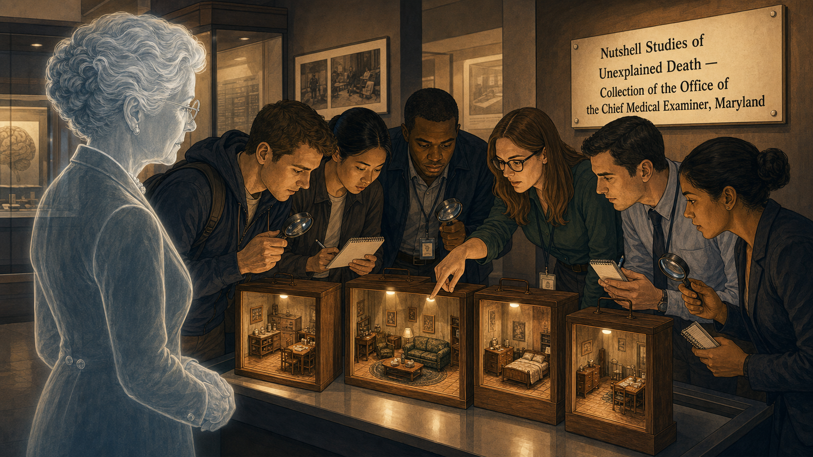

Image Prompt

(This is Panel 11. Do not include the panel number in the image.)
Please generate a 16:9 image in 1930s–40s Art Deco American illustration, warm muted palette, fine miniature-diorama detailing depicting panel 11 of 11. Make the characters and style consistent with the prior panels. The scene is a museum display or training facility, styled in the same Art Deco illustration manner as all prior panels but representing the present day through subtle visual cues — modern clothing on the observers, institutional signage with contemporary typography, updated lighting. A group of six forensic science students or professional investigators — men and women of varied backgrounds — stands around a display of the Nutshell Studies at what is clearly a formal exhibition or training institution. Each model sits in its wooden frame under a focused display light. The observers hold magnifying glasses and small notebooks; several lean in closely. One points to something inside a model and speaks to a colleague. A wall-mounted interpretive panel beside the display reads "Nutshell Studies of Unexplained Death — Collection of the Office of the Chief Medical Examiner, Maryland." In the foreground, a ghost or silhouette image of Frances Glessner Lee — rendered in lighter, slightly transparent lines in the same Art Deco style — stands beside the models as if watching, her silver hair, spectacles, and pearl-buttoned suit unmistakable. Color palette: warm amber display lighting, charcoal, ivory, with the natural wood of the model frames. Emotional tone: living legacy, the enduring relevance of a disciplined idea. At least six specific visual details: the wooden model frames under display lighting, observers with magnifying glasses and notebooks, the figure pointing at a detail, the wall-mounted interpretive panel with the readable text, the ghost silhouette of Frances watching, and her wire-rimmed spectacles and pearl buttons visible in the ghost image.
Generate the image immediately without asking clarifying questions.

Frances Glessner Lee died in 1962 at the age of eighty-three, having built nineteen Nutshell dioramas over nearly twenty years. Today, eighteen of them survive in the collection of the Office of the Chief Medical Examiner of Maryland, and they are still actively used to train forensic investigators. The medical examiners and homicide detectives who gather around these dollhouse-scale rooms with their magnifying glasses and flashlights are following an exercise designed before any of them were born — because the lesson it teaches does not age: look first, look systematically, look at everything, and do not decide what the scene means until you have seen all of it.

---

### Epilogue – What Made Frances Glessner Lee Different?

Frances Glessner Lee faced every obstacle the early twentieth century placed in the path of a scientifically minded woman and converted each one into a resource. Denied a formal education, she educated herself. Barred from professional institutions, she built new ones. Told that her craft interests were acceptable but her scientific interests were not, she fused the two until they became inseparable. Her central insight — that an investigator who rushes to a conclusion before fully observing a scene is not an investigator but a storyteller — remains the bedrock of forensic casework. She was in her sixties before the world gave her the platform she deserved, and she used every minute of it.

| Challenge | How She Responded | Lesson for Today |
|---|---|---|
| Denied university education because she was a woman | Self-educated over decades through reading and expert mentorship | Knowledge has no formal prerequisite; curiosity and rigor are the real requirements |
| American death investigation was unscientific and politically compromised | Funded Harvard's Department of Legal Medicine with her own fortune | Systemic change sometimes requires someone willing to invest in the infrastructure, not just the criticism |
| Investigators solved cases by hunch, not evidence | Built physical training tools that made systematic observation the only method available | Training shapes behavior; if you want investigators to observe carefully, give them practice observing carefully |
| The models could not be patented or protected | Shared them freely as a training resource | The goal is better justice, not proprietary credit; freely shared tools do more good |

---

### Call to Action

Every forensic investigation begins with a choice: do you look at the scene and see what you expect to find, or do you look and see what is actually there? Frances Glessner Lee built nineteen miniature rooms to force that choice — to train a generation of investigators to slow down, to look again, to resist the comfortable story in favor of the accurate one. As you learn to examine physical evidence in this course, carry her motto with you: convict the guilty, clear the innocent, and find the truth. That sequence is not decoration. It is a discipline.

---

*"Convict the guilty, clear the innocent, and find the truth in a nutshell."*
— Frances Glessner Lee

*"The investigation of a death scene requires careful and systematic observation of everything present — not a selection of what seems to matter, but everything."*
— Frances Glessner Lee

---

## References

1. [Wikipedia: Frances Glessner Lee](https://en.wikipedia.org/wiki/Frances_Glessner_Lee) — Biography of the American heiress and forensic science pioneer who founded the Harvard Department of Legal Medicine and created the Nutshell Studies of Unexplained Death.
2. [Wikipedia: Nutshell Studies of Unexplained Death](https://en.wikipedia.org/wiki/Nutshell_Studies_of_Unexplained_Death) — History, description, and current status of the nineteen dollhouse-scale crime-scene dioramas Frances Glessner Lee built between 1943 and 1959.
3. [Wikipedia: Legal medicine](https://en.wikipedia.org/wiki/Legal_medicine) — Overview of the field of legal medicine and its relationship to forensic pathology, medical examination, and death investigation that Frances Glessner Lee helped professionalize in the United States.
4. [Smithsonian American Art Museum: Murder Is Her Hobby — Frances Glessner Lee and The Nutshell Studies of Unexplained Death](https://americanart.si.edu/exhibitions/nutshell) — Official exhibition page for the Smithsonian's 2017–2018 display of the Nutshell Studies, including scholarly commentary on Lee's life, methods, and legacy.
5. [Encyclopaedia Britannica: Frances Glessner Lee](https://www.britannica.com/biography/Frances-Glessner-Lee) — Concise overview of Lee's life and her contributions to forensic science education and the professionalization of death investigation in the United States.
