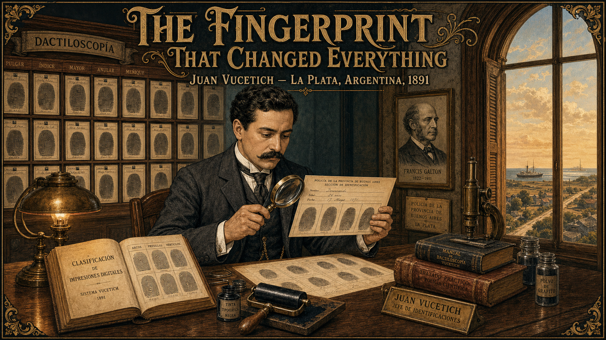
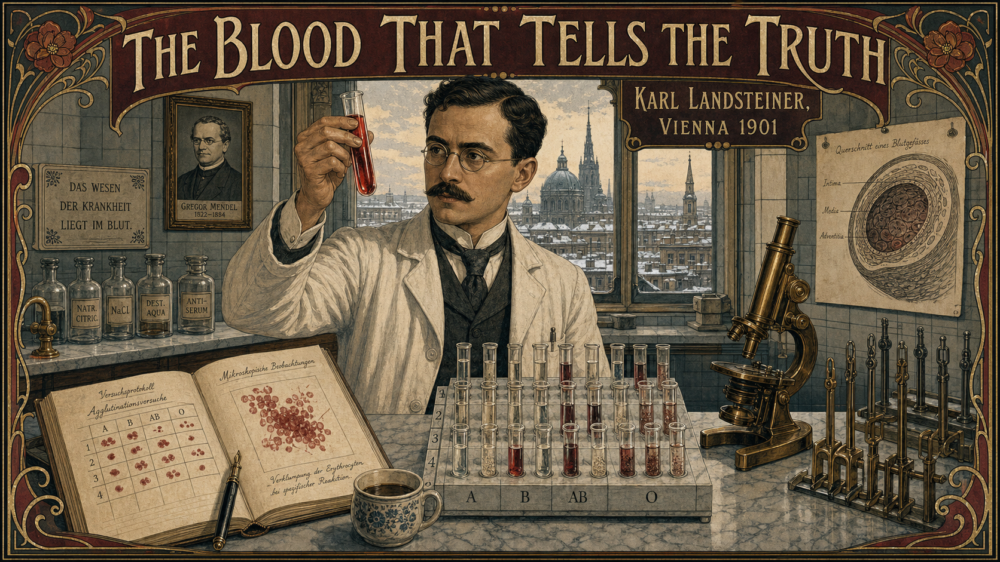
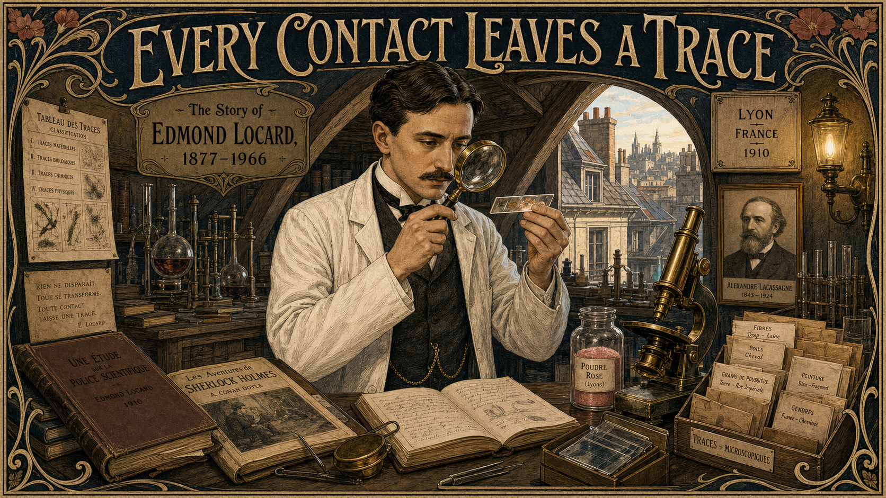
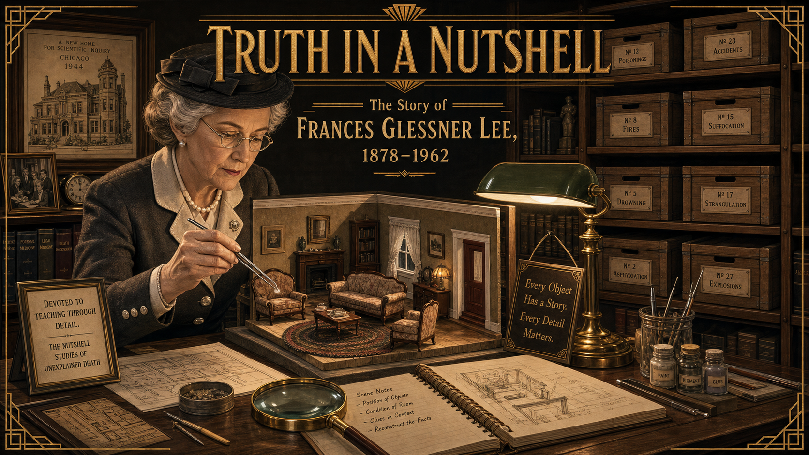
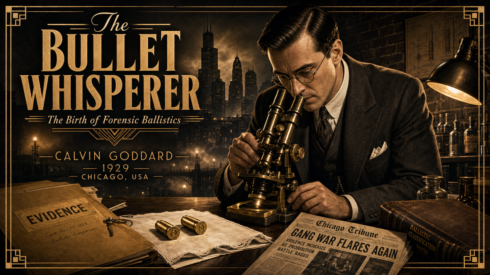
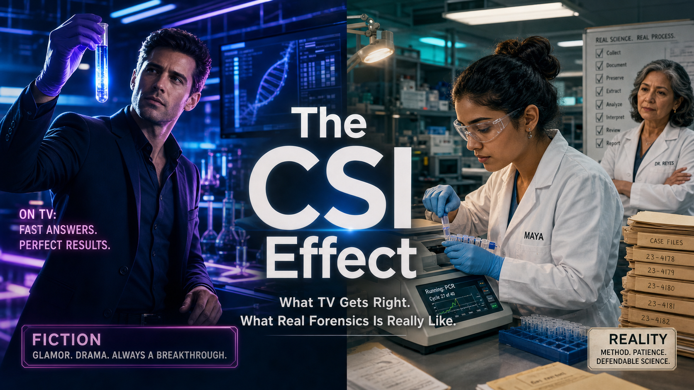
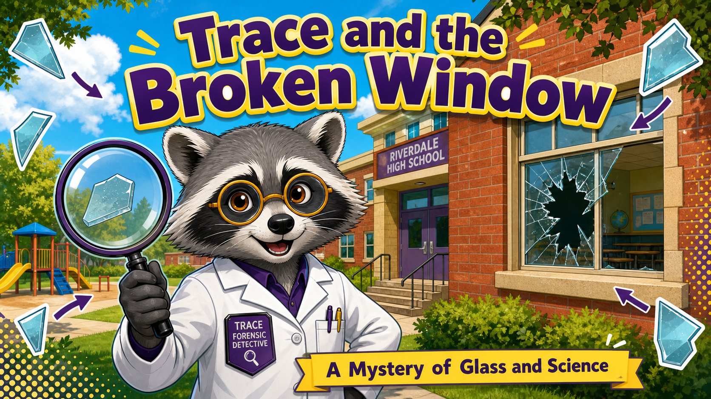

# Stories

Forensic science is a story of people: curious, stubborn, and unwilling to
guess when they could measure. These mini graphic novels introduce the
scientists who built the field — from a 13th-century Chinese investigator
who solved a murder with blowflies to the modern lab that reads a genetic
barcode in a single cell — alongside fictional cases that help us tell the
glamorized world of crime-drama television apart from the patient,
evidence-driven reality of the crime lab.

Each story is short, illustrated, and built around a single idea: the
**scientific method** — observe, hypothesize, test, and be willing to admit
when you were wrong.

## Start Here

- **[Story Ideas](story-ideas.md)** — twelve mini graphic-novel concepts
  ready to be generated, balancing real forensic pioneers with fictional
  "fiction vs. fact" case studies.

## Stories

- **[The Washing Away of Wrongs](song-ci/index.md)**

    
    In 13th-century Song Dynasty China, judge and physician Song Ci writes the world's first forensic manual — solving a murder with blowflies and launching a tradition of evidence-based investigation eight centuries before the modern crime lab.

- **[A Drop of Poison](mathieu-orfila/index.md)**

    
    Born in Menorca and trained in Paris, Mathieu Orfila transforms toxicology from folklore into rigorous science — and his 1840 courtroom testimony in the Lafarge arsenic case becomes the template for expert witness evidence.

- **[The Bloody Thumbprint](juan-vucetich/index.md)**

    
    In 1892 Argentina, police statistician Juan Vucetich uses his new fingerprint classification system to solve a double murder — making it the first criminal conviction in history based on fingerprint evidence.

- **[The Blood That Tells the Truth](karl-landsteiner/index.md)**

    
    Wondering why some blood transfusions killed and others saved, Karl Landsteiner designs an elegant 1901 grid experiment that reveals the ABO blood groups — a discovery that transforms medicine and gives forensic serology its most durable tool for class evidence.

- **[Every Contact Leaves a Trace](edmond-locard/index.md)**

    
    Working in two borrowed attic rooms in Lyon in 1910, Edmond Locard insists that every criminal leaves something at a scene and takes something away — and proves it by solving a counterfeiting case with microscopic dust from a suspect's fingernails.

- **[Truth in a Nutshell](frances-glessner-lee/index.md)**

    
    Barred from a scientific education because she was a woman, Frances Glessner Lee builds exquisite dollhouse-scale crime scenes — the Nutshell Studies — to teach investigators to observe before they conclude. Her tiny rooms still train detectives today.

- **[The Bullet Whisperer](calvin-goddard/index.md)**

    
    Calvin Goddard turns courtroom guesswork about bullets into rigorous science with the comparison microscope. After the 1929 St. Valentine's Day Massacre, his careful striation analysis shows the murder weapons were not police guns — and launches the first independent U.S. crime lab.

- **[The Bones Never Lie](clyde-snow/index.md)**

    
    "Bones make good witnesses — they never lie and they never forget." Forensic anthropologist Clyde Snow trains a brave team of students to exhume and identify Argentina's disappeared, turning careful osteology into evidence that helps bring a dictatorship to justice.

- **[The Barcode in Your Blood](alec-jeffreys/index.md)**

    
    On the morning of 10 September 1984, a British geneticist pulled an X-ray film from a developing tank and invented DNA fingerprinting. Its first use in a criminal case did not convict a killer — it freed an innocent man before identifying the real one. A story about science serving the truth, not the verdict.

- **[The CSI Effect](csi-effect/index.md)**

    
    Maya starts her lab internship expecting TV-style instant answers — and discovers the real thing: weeks-long DNA backlogs, contamination risks, and "matches" that are probabilities, not certainties. A story about why honest, careful science beats the magic of crime drama.

- **[Reasonable Doubt](reasonable-doubt/index.md)**

    
    Analyst Dev reopens a decades-old conviction built on a confident microscopic hair "match" — and uses DNA to prove the science was overstated. A fictional story grounded in real exonerations about the bravest thing a scientist can do: admit a method failed.

- **[Trace and the Broken Window](trace-broken-window/index.md)**

    
    When a classroom window shatters and everyone blames the obvious suspect, Trace the Raccoon refuses to guess. Reading the radial and concentric cracks in the glass, Trace proves the rock came from inside the room — and shows that the scientific method is a superpower anyone can use.

