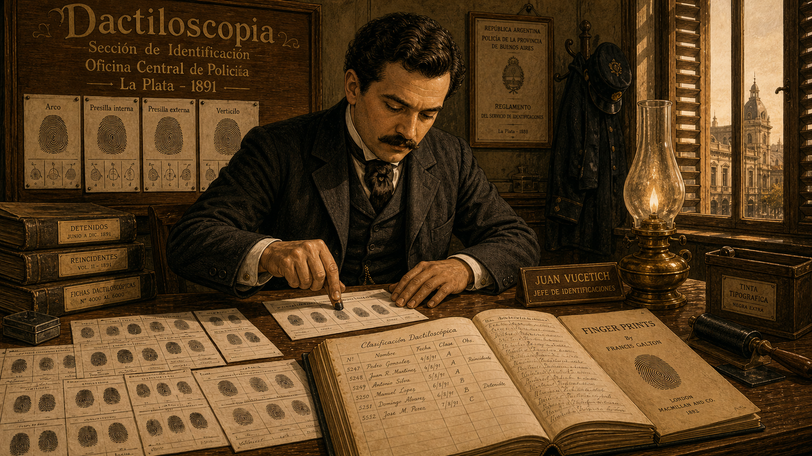
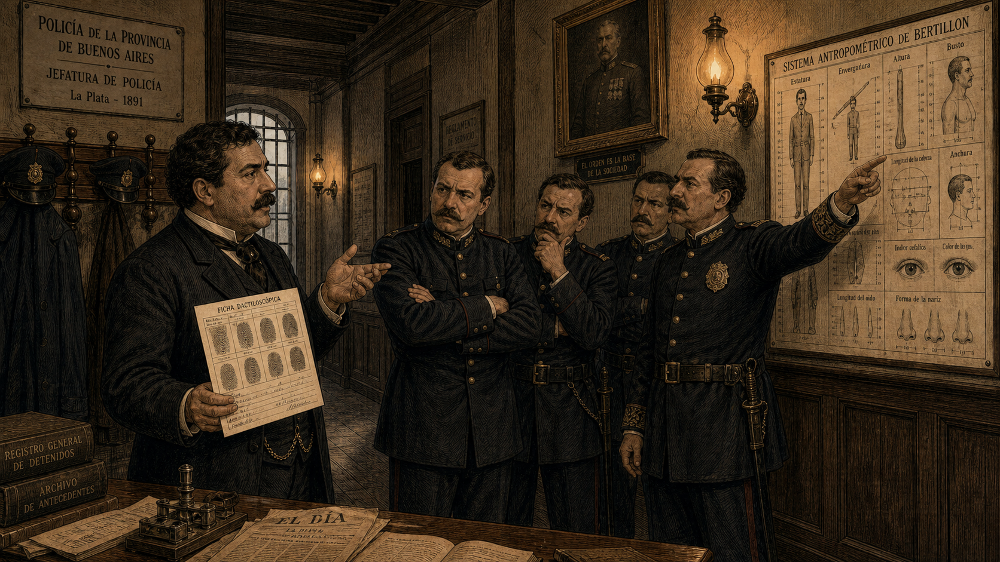
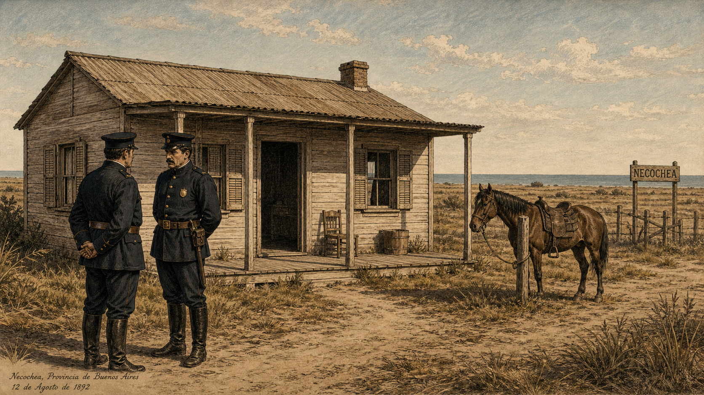
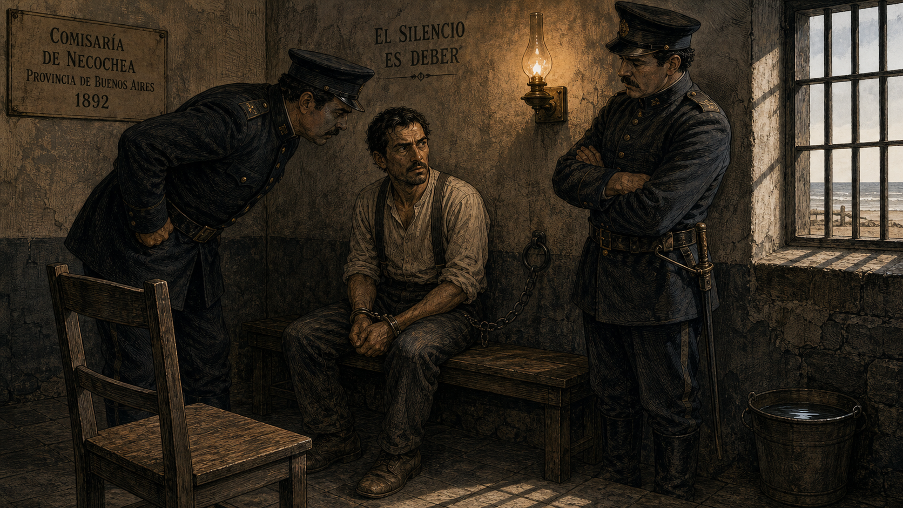
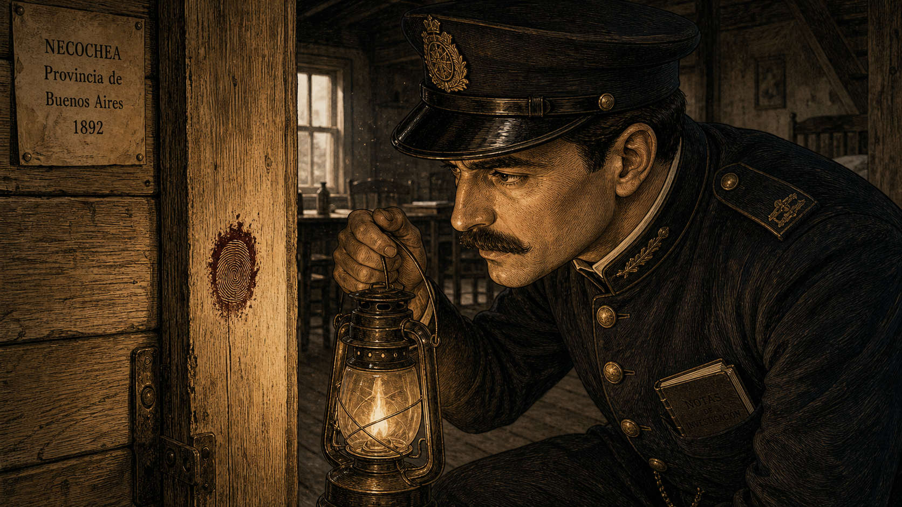
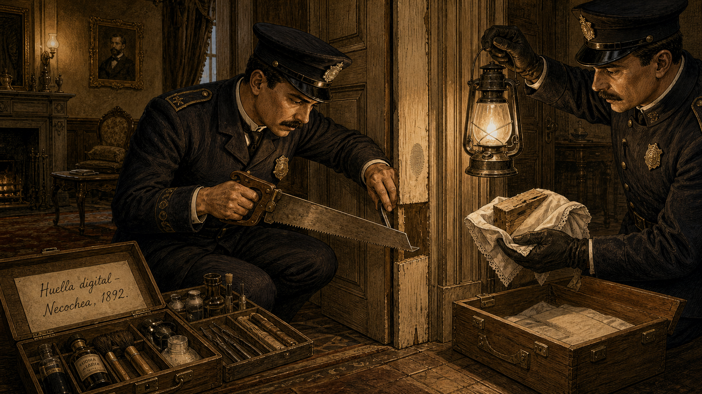
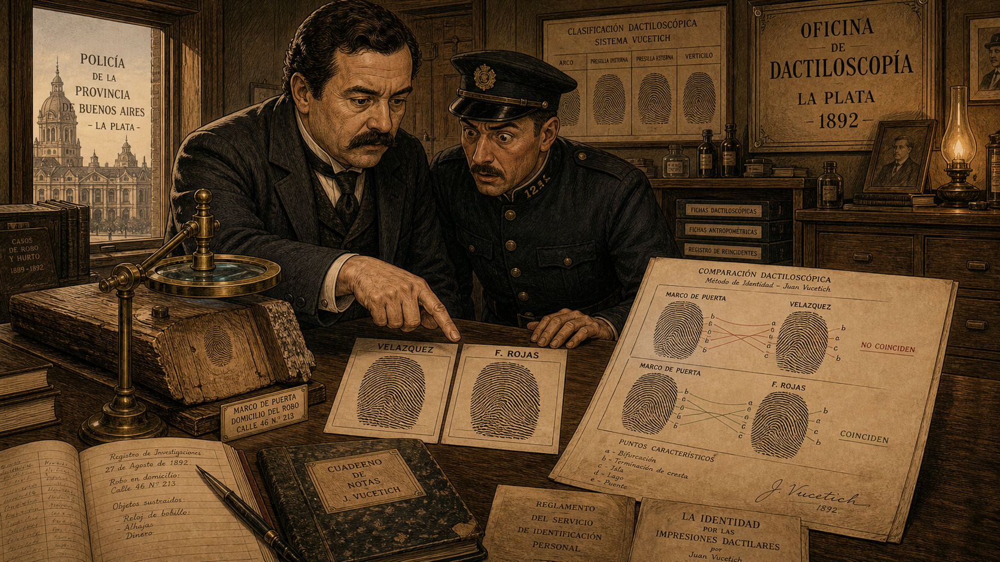
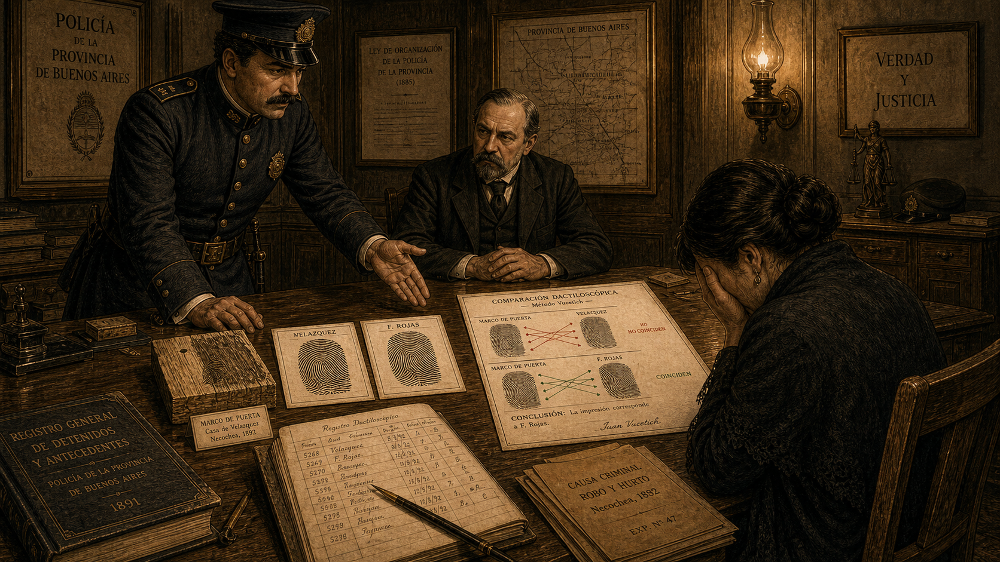
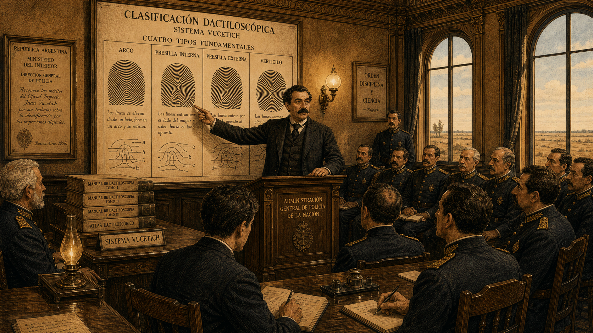

# The Fingerprint That Changed Everything

Cover Image Prompt

(This is the Cover Image. Do not include this label in the image.)
A late-19th-century Latin American Gilded Age realist illustration styled as the cover of a period Argentine scientific journal, circa 1892. In the center stands Juan Vucetich: a stocky man in his early thirties with thick dark hair, a full dark mustache, and a well-cut period suit in dark charcoal wool with a white high-collar shirt and a cravat. He holds a magnifying glass over a large ink-rolled fingerprint card on a wooden desk. Behind him, a wall-mounted wooden panel displays rows of fingerprint cards organized in a grid under a banner reading "Dactiloscopía." Through a tall arched window, the flat coastal plains and distant ocean of La Plata Province, Argentina, are visible in the warm late-afternoon light. The title text "The Fingerprint That Changed Everything" is rendered across the top in ornate Gilded Age typeface with fine serif flourishes. A subtitle in smaller period typeface reads "Juan Vucetich — La Plata, Argentina, 1891." The color palette is warm amber, terracotta, ivory, and muted teal. The overall emotional tone is quiet authority and historic significance. Fine ink linework defines every edge; rich cross-hatching provides depth in the manner of late-19th-century Argentine scientific illustration. At least six visual details visible: a fingerprint card with visible loop and whorl patterns in Vucetich's hand, an ink roller on the desk, a leather-bound classification ledger open to a page of ridge diagrams, a small bronze desk lamp casting warm light, a framed portrait of Francis Galton on the wall, and a ship visible on the distant horizon through the window.
Generate the image immediately without asking clarifying questions.

Narrative Prompt

This is a 9-panel graphic novel about Juan Vucetich (1858–1925), a Croatian-born Argentine police official who developed the world's first practical fingerprint classification system — which he called dactiloscopía — and who presided over the first criminal case in history solved by fingerprint evidence, in Necochea, Argentina, in 1892.

Art style for all panels: late-19th-century Latin American Gilded Age realist illustration, warm gaslit interior tones, fine detail. Fine ink linework, rich cross-hatching, warm amber and terracotta tones throughout. No bright or saturated modern colors. The aesthetic should feel like a high-quality illustrated Argentine newspaper or scientific journal from the 1890s.

Character consistency — Juan Vucetich: stocky build, thick dark hair, full dark mustache. He wears a dark charcoal period suit with a white high-collar shirt and cravat. His expression is methodical and determined but not theatrical. He is often shown with fingerprint cards, ink rollers, or magnifying glass nearby.

Supporting characters:
— Inspector Eduardo Alvarez: a lean, serious Argentine police inspector in a dark uniform with brass buttons and a peaked cap, clean-shaven, sharp eyes.
— Velázquez (the accused neighbor): a working-class man, lean and weathered, wearing plain laborer's clothing — dark trousers, suspenders, a collarless shirt. His expression is frightened but resolute.
— Francisca Rojas: not depicted graphically; referenced only through the fingerprint evidence.

Settings: the Central Police Bureau in La Plata, Argentina (wood-paneled rooms, gas lamps, tall shuttered windows); the coastal town of Necochea (a simple wooden structure, flat coastal landscape); a magistrate's office (heavy wooden desk, bookcases, formal setting).

Every panel should feel like a page from a finely illustrated Argentine scientific journal of the 1890s. Warm realist tones, no photorealism, no modern digital aesthetics.

### Prologue – The Ridge and the Whorl

In La Plata, Argentina, in 1891, a Croatian immigrant named Juan Vucetich was doing something no police department in the world had ever successfully done: cataloguing the tiny ridges on human fingertips and turning them into a workable system for identifying people. His colleagues thought he was wasting time. Within a year, a single bloody fingerprint on a wooden doorframe would prove them wrong — and change the course of criminal justice forever.

---

## Panel 1: Building Dactiloscopía

Image Prompt

(This is Panel 01. Do not include the panel number in the image.)
I am about to ask you to generate a series of images for a graphic novel. Please make the images have a consistent style and consistent characters. Do not ask any clarifying questions. Just generate the image immediately when asked.
Please generate a 16:9 image in late-19th-century Latin American Gilded Age realist illustration, warm gaslit interior tones, fine detail depicting panel 1 of 9. The scene shows the Central Police Bureau in La Plata, Argentina, in 1891. Juan Vucetich — a stocky man in his early thirties with thick dark hair and a full dark mustache, wearing a dark charcoal period suit, white high-collar shirt, and cravat — sits at a heavy wooden desk covered with large ink-rolled fingerprint cards arranged in rows. He presses an inked fingertip carefully onto a fresh card, his expression focused and methodical. On the wall behind him, a large hand-lettered wooden board reads "Dactiloscopía" in ornate lettering, with rows of fingerprint reference diagrams pinned beneath. An open leather-bound ledger shows neat handwritten classification entries. A brass desk lamp burns beside the fingerprint cards. Tall shuttered windows let in warm late-afternoon Argentine light. The color palette is warm amber, terracotta, ivory, and muted teal. Emotional tone: methodical determination, the quiet intensity of building something new from scratch. At least six visual details: the inked fingerprint card on the desk, the "Dactiloscopía" board on the wall, the open classification ledger, a small ink roller on the desk corner, a Francis Galton reference pamphlet visible among the papers, and motes of dust floating in the warm window light.
Generate the image immediately without asking clarifying questions.

Building on the ridge-pattern research published by the English scientist Francis Galton in 1892, Vucetich devised a simpler, more practical classification system — one that a police bureau could actually use every day. He called it *dactiloscopía*, from the Greek for "finger" and "observation." Working methodically at the Central Police Bureau in La Plata, he ink-rolled the fingertips of every person brought in, assigned each print to one of four pattern types — arches, loops, whorls, and composites — and filed the results in a growing master ledger. No one had done it this way before. No one in South America had done anything like it at all.

---

## Panel 2: The Skeptics

Image Prompt

(This is Panel 02. Do not include the panel number in the image.)
Please generate a 16:9 image in late-19th-century Latin American Gilded Age realist illustration, warm gaslit interior tones, fine detail depicting panel 2 of 9. Make the characters and style consistent with the prior panels. The scene is a wood-paneled police bureau corridor or common room in La Plata, Argentina, 1891. Vucetich — dark hair, full mustache, charcoal suit — stands to one side holding a fingerprint classification card and gesturing toward it, trying to explain its value. Three or four police colleagues in dark uniforms stand across from him: their arms are folded, their expressions skeptical and dismissive. One colleague points instead at a large Bertillon anthropometric measurement chart on the wall — a competitor identification system showing body measurements — as if to argue "we already have something that works." Gas lamps on the wall flicker in warm amber. A framed portrait of a senior official watches from above. The color palette is amber, sepia, dark slate, and ivory. Emotional tone: frustration and stubborn conviction meeting bureaucratic inertia. At least six visual details: the Bertillon chart on the wall, the fingerprint card in Vucetich's hand, the folded arms of the skeptics, the gas lamps on the plaster wall, a heavy wooden coat rack with police hats, and a barred window at the far end of the corridor.
Generate the image immediately without asking clarifying questions.

The reaction from Vucetich's colleagues was not enthusiasm. The dominant identification system of the day was Bertillonage — a French method that measured eleven body dimensions and catalogued physical descriptions. Most police officials across Latin America and Europe trusted it, and many resented the suggestion that loops and whorls on fingertips were more reliable than precise caliper measurements. Why catalog something as trivial as a fingerprint, they asked, when established science already existed? Vucetich kept filing his cards and building his ledger, certain that the answer would eventually make itself plain.

---

## Panel 3: Necochea, 1892

Image Prompt

(This is Panel 03. Do not include the panel number in the image.)
Please generate a 16:9 image in late-19th-century Latin American Gilded Age realist illustration, warm gaslit interior tones, fine detail depicting panel 3 of 9. Make the characters and style consistent with the prior panels. The scene shows the exterior and immediate surroundings of a simple wooden house on the flat coastal plains near Necochea, Argentina, in 1892. This is a wide exterior shot — no victims, no violence, nothing graphic. The house is a modest single-story wooden structure with a low porch, plain shuttered windows, and a dirt path leading to the door. Two Argentine police officers in dark uniforms and peaked caps stand outside in the bright coastal light, speaking quietly to each other. The flat pampas landscape stretches in the background; a distant glimmer of ocean horizon is faintly visible. The atmosphere is tense and subdued — the officers' postures convey that something very serious has occurred, though nothing disturbing is shown. A riderless horse is tied to a post nearby. The color palette is muted dusty gold, pale blue sky, warm terracotta, and ivory. Emotional tone: grave solemnity, the weight of a serious crime. At least six visual details: the simple wooden house facade, the two officers conferring outside, the flat pampas landscape, the tied horse at the post, a plain wooden sign with "Necochea" lettering on a distant fence post, and the distant faint line of ocean on the horizon.
Generate the image immediately without asking clarifying questions.

In June 1892, news reached the La Plata police bureau from the coastal town of Necochea: two children had been killed. The crime was devastating, the community was shaken, and local authorities were under intense pressure to identify who was responsible. They quickly focused their suspicion on a neighbor named Velázquez. The case looked simple to them. It was not.

---

## Panel 4: An Innocent Man

Image Prompt

(This is Panel 04. Do not include the panel number in the image.)
Please generate a 16:9 image in late-19th-century Latin American Gilded Age realist illustration, warm gaslit interior tones, fine detail depicting panel 4 of 9. Make the characters and style consistent with the prior panels. The scene is a dim police holding room in Necochea, Argentina, 1892. A lean, weathered working-class man — Velázquez, in worn dark trousers, suspenders, and a collarless shirt — sits on a wooden bench with his wrists in iron cuffs attached to a wall ring. Two police officers loom over him in dark uniforms, one leaning close, the other standing with arms crossed, both clearly applying heavy pressure. Velázquez's expression is frightened but resolute — his jaw is set, his eyes direct. He is not confessing because he has nothing to confess. A single barred window high on the wall casts a narrow stripe of pale coastal light across the stone floor. An oil lamp on a wall bracket provides additional amber light. The color palette is dark slate, amber, and muted ivory with heavy shadow. Emotional tone: tension and injustice — the quiet courage of an innocent man who refuses to lie. At least six visual details: the iron wall cuffs, the barred window with coastal light, the two officers in uniform leaning in, Velázquez's set jaw and direct gaze, an empty wooden chair facing him (an interrogation prop), and a bucket of water on the floor near the wall.
Generate the image immediately without asking clarifying questions.

Police detained Velázquez and subjected him to prolonged, brutal interrogation, certain that pressure would produce a confession. He refused. He had not committed the crime, and no amount of intimidation could make him say he had. Days passed. Velázquez remained in custody. The investigation had stalled, built on assumption rather than evidence. A just outcome required something the officers had not yet thought to look for: physical proof.

---

## Panel 5: A Mark on the Doorframe

Image Prompt

(This is Panel 05. Do not include the panel number in the image.)
Please generate a 16:9 image in late-19th-century Latin American Gilded Age realist illustration, warm gaslit interior tones, fine detail depicting panel 5 of 9. Make the characters and style consistent with the prior panels. The scene is the interior doorway of the simple wooden house in Necochea, Argentina, 1892. Inspector Eduardo Alvarez — a lean, serious Argentine police inspector in a dark uniform with brass buttons and peaked cap — crouches low beside a wooden doorframe, holding a small oil lantern close to the wood surface. His expression is sharply attentive; he has noticed something. On the wooden doorframe, clearly visible in the warm lantern light, is a single fingerprint pressed in a dark reddish-brown substance — the print is rendered in detail, showing clear ridge patterns. Alvarez does not touch it; he examines it carefully from inches away. The doorframe is plain unfinished wood. The rest of the interior is simple and shadowed. Dust motes float in the lamplight. The color palette is warm amber and deep shadow, ivory wood grain, dark slate uniform. Emotional tone: sharp discovery — the pivotal moment when a case changes direction. At least six visual details: the single fingerprint visible on the doorframe wood with visible ridge patterns, Alvarez's lantern held close, his intense focused expression, the plain wooden interior construction of the house, dust motes in the lamplight, and a small notebook tucked in Alvarez's breast pocket.
Generate the image immediately without asking clarifying questions.

Inspector Eduardo Alvarez, examining the scene with fresh eyes, crouched beside the doorframe and held his lantern close. There, pressed into the wood, was a single fingerprint. Alvarez recognized immediately what he was looking at: a ridge impression, clear enough to be read, left in a substance that had since dried on the wood. He had heard of Vucetich's work. He knew that ridge patterns could be classified and compared. And he knew this print had to be preserved and taken to La Plata.

---

## Panel 6: Preserving the Evidence

Image Prompt

(This is Panel 06. Do not include the panel number in the image.)
Please generate a 16:9 image in late-19th-century Latin American Gilded Age realist illustration, warm gaslit interior tones, fine detail depicting panel 6 of 9. Make the characters and style consistent with the prior panels. The scene shows Inspector Alvarez inside the Necochea house, carefully removing a section of the wooden doorframe using a handsaw and a small pry tool, assisted by another officer who holds a lantern steady. Alvarez works with great care, his expression focused and deliberate, clearly trying not to damage the section bearing the fingerprint. The marked section of the wood is wrapped carefully in a clean cloth by the second officer before being placed in a flat wooden carrying box. Nearby on the floor, a handwritten evidence label in an open evidence kit reads "Huella digital — Necochea, 1892." The wood grain and the fingerprint on the doorframe are visible in the lamplight. The color palette is warm amber, ivory wood grain, dark uniform. Emotional tone: precise, methodical care — the serious work of preserving fragile evidence for science to evaluate. At least six visual details: the handsaw mid-cut in the doorframe wood, the second officer with the lantern, the cloth wrapping being placed around the section, the wooden carrying box on the floor, the evidence label with handwritten text, and the careful delicate posture of Alvarez during the cutting.
Generate the image immediately without asking clarifying questions.

Alvarez did not try to copy the print or sketch it. He carefully cut away the section of the doorframe bearing the impression and wrapped it for transport to La Plata. Evidence handling in 1892 had no formal protocols — this was improvised, intelligent, and precisely right. The wooden section traveled with him on the return journey, protected from damage, and arrived at the police bureau where Vucetich's classification system was waiting to do what it had been built to do.

---

## Panel 7: The Print Does Not Match

Image Prompt

(This is Panel 07. Do not include the panel number in the image.)
Please generate a 16:9 image in late-19th-century Latin American Gilded Age realist illustration, warm gaslit interior tones, fine detail depicting panel 7 of 9. Make the characters and style consistent with the prior panels. The scene is the fingerprint bureau in La Plata, Argentina, 1892. Juan Vucetich and Inspector Alvarez stand side by side at a large wooden examination table. On the table: the wooden doorframe section with the visible fingerprint impression, a magnifying glass on a stand held over it, and two large printed fingerprint comparison cards side by side — one labeled "Velázquez" and one labeled with a woman's name (partially readable as "F. Rojas"). Vucetich points firmly at the two cards, his expression decisive and serious. The ridge patterns on the doorframe print clearly do not align with the Velázquez card but do align with the other. Alvarez leans in, his expression shifting from tense expectation to shock. A large hand-drawn comparison diagram on paper beside the cards shows ridge pattern annotations with matching lines drawn on one pair and crossed lines on the other. The color palette is warm amber, ivory, terracotta. Emotional tone: pivotal revelation — the moment the truth becomes visible in the evidence. At least six visual details: the doorframe section with the preserved fingerprint, the two comparison cards side by side, Vucetich's pointing finger, Alvarez's expression of shock, the large comparison diagram with annotations, and the magnifying glass stand over the doorframe section.
Generate the image immediately without asking clarifying questions.

The comparison was methodical and decisive. Vucetich placed the ridge pattern from the doorframe alongside the inked fingerprints taken from the accused neighbor. The patterns were inconsistent — they did not match. He then compared the doorframe print to the recorded prints of Francisca Rojas, the children's mother. The ridge characteristics were consistent, point for point, with the print of Rojas. The evidence did not implicate Velázquez. It implicated her. Fingerprint identification depends on examiner judgment and the quality of the prints, but in this case the comparison was clear and unmistakable.

---

## Panel 8: Confrontation and Confession

Image Prompt

(This is Panel 08. Do not include the panel number in the image.)
Please generate a 16:9 image in late-19th-century Latin American Gilded Age realist illustration, warm gaslit interior tones, fine detail depicting panel 8 of 9. Make the characters and style consistent with the prior panels. The scene is a magistrate's office or formal police interview room in Necochea or La Plata, Argentina, 1892. A heavy wooden desk dominates the center. Inspector Alvarez stands at one side of the desk, laying the comparison fingerprint evidence — the doorframe section, the two fingerprint cards, and the annotated comparison chart — flat on the desk surface and gesturing toward them calmly. A woman (Francisca Rojas) sits across the desk, her face half-turned away, her posture collapsing inward — the body language of someone whose denial has failed. She is not depicted graphically; the scene focuses on the evidence on the desk and the weight of the moment. A magistrate or senior official sits behind the desk observing. The comparison evidence is prominently displayed. A gas lamp on the wall lights the room in warm amber. The color palette is warm amber, dark wood, ivory, deep shadow. Emotional tone: the grave weight of justice — an innocent man will go free, and the physical evidence has done what coercion could not. At least six visual details: the doorframe fingerprint section on the desk, the two comparison cards, the annotated comparison chart, Alvarez's calm authoritative posture, the woman's collapsed posture, and the magistrate's grave observing expression.
Generate the image immediately without asking clarifying questions.

When Francisca Rojas was confronted with the physical evidence — the fingerprint on the doorframe, the comparison cards, the ridge-by-ridge analysis — she confessed. Velázquez, who had endured days of brutal interrogation without breaking because he was innocent, was immediately released. The case was the first in recorded history in which fingerprint evidence played the decisive role in a criminal conviction. It had taken not a forced confession but a small section of a wooden doorframe and a careful comparison of ridge patterns to reach the truth.

---

## Panel 9: A System for the World

Image Prompt

(This is Panel 09. Do not include the panel number in the image.)
Please generate a 16:9 image in late-19th-century Latin American Gilded Age realist illustration, warm gaslit interior tones, fine detail depicting panel 9 of 9. Make the characters and style consistent with the prior panels. The scene is a wide, formal chamber at the Argentine national police administration, circa 1896–1900. Vucetich — older now, perhaps early forties, same thick mustache and formal suit — stands at a central podium before a roomful of police officials and administrators in dress uniforms. He gestures to a large illustrated wall chart showing the four dactiloscopía pattern types with detailed ridge diagrams. Officials in the audience lean forward with interest; some take notes. On a side table, a stack of printed classification manuals is displayed — a small label reads "Sistema Vucetich." Through tall arched windows, the flat Argentine plains and a pale sky are visible. The color palette is warm amber, terracotta, ivory, and muted teal. Emotional tone: earned authority and historic significance — the moment that Argentina, and then the world, officially adopted fingerprinting as a primary identification system. At least six visual details: the large dactiloscopía wall chart with four pattern type diagrams, the stack of printed classification manuals on the side table, the attentive audience of officials in dress uniform, the tall arched windows with Argentine plains beyond, a framed certificate or official document on the wall, and Vucetich's confident posture at the podium.
Generate the image immediately without asking clarifying questions.

In 1896, Argentina became the first country in the world to officially adopt fingerprint identification — Vucetich's *dactiloscopía* system — as its primary method of criminal identification, replacing Bertillonage entirely. Other nations followed. By the early twentieth century, police agencies across South America, Europe, and beyond had adopted fingerprint systems modeled on Vucetich's work. A method developed in La Plata by a Croatian immigrant who catalogued ridge patterns in the face of institutional skepticism had, quietly and permanently, changed the way the world identifies people and solves crimes.

---

### Epilogue – What Made Vucetich Different?

Vucetich was not the only scientist studying fingerprints in the 1890s — Galton in England and Henry Faulds in Scotland had laid important theoretical groundwork. What set Vucetich apart was that he did not merely study fingerprints: he built a working system, applied it to real cases, and demonstrated results when it mattered most. The Necochea case proved that fingerprint evidence could exonerate the innocent as readily as it could implicate the guilty — a principle that remains at the heart of forensic science today. His legacy is a reminder that transformative forensic science has never been the exclusive property of any one country or culture.

| Challenge | How Vucetich Responded | Lesson for Today |
|---|---|---|
| Colleagues preferred the established Bertillon system | Continued building dactiloscopía and let the evidence make the argument | Scientific methods must be validated by results, not protected by tradition |
| An innocent man was being coerced toward a false confession | The fingerprint comparison directly cleared Velázquez | Physical evidence protects the innocent as readily as it implicates the guilty |
| Fingerprint identification requires careful examiner judgment | Developed a clear classification system to standardize comparison | Documented methods and acknowledged error rates reduce the risk of misidentification |
| A powerful forensic innovation risked staying regional | Argentina adopted the system nationally; Vucetich shared his methods broadly | Open scientific communication multiplies the benefit of any discovery |

---

### Call to Action

The next time you press a fingertip to a glass surface and notice the faint smudge you leave behind, remember that in 1892 a single impression like that — on a wooden doorframe in a small coastal town in Argentina — freed an innocent man and identified the truth. Fingerprint evidence is powerful, but that power demands care: every comparison requires trained judgment, honest reporting of uncertainty, and the humility to follow where the evidence leads rather than where the pressure points.

---

*"The key to identification is the immutable configuration of the ridges on each fingertip — patterns that neither time nor circumstance can alter."*
— Juan Vucetich

*"Dactiloscopía is not merely a tool for the state — it is a guarantee for the individual, because it cannot be made to lie."*
— Juan Vucetich

## References

1. [Juan Vucetich — Wikipedia](https://en.wikipedia.org/wiki/Juan_Vucetich) — Biography of Vucetich, the development of dactiloscopía, and the Francisca Rojas case that established the first fingerprint conviction.
2. [Francisca Rojas — Wikipedia](https://en.wikipedia.org/wiki/Francisca_Rojas) — The 1892 Necochea murder case involving Francisca Rojas, the first criminal case solved using fingerprint evidence.
3. [Dactyloscopy — Wikipedia](https://en.wikipedia.org/wiki/Dactyloscopy) — Overview of fingerprint identification science, its history, classification systems, and limitations including examiner error rates.
4. [Juan Vucetich — Encyclopaedia Britannica](https://www.britannica.com/biography/Juan-Vucetich) — Encyclopaedia Britannica's concise biography of Vucetich and his contribution to forensic identification science.
5. [The History of Fingerprints — Nora Fenton, Science Museum Group Journal](https://journal.sciencemuseum.ac.uk/browse/issue-14/) — Historical overview of how fingerprint identification developed across multiple countries and researchers, including Vucetich's pioneering role in the Global South.
