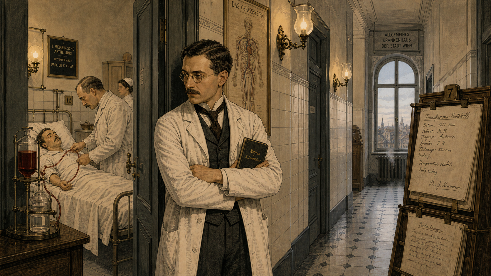
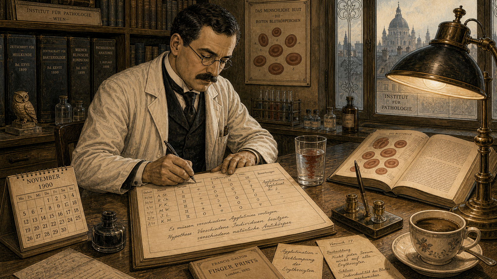
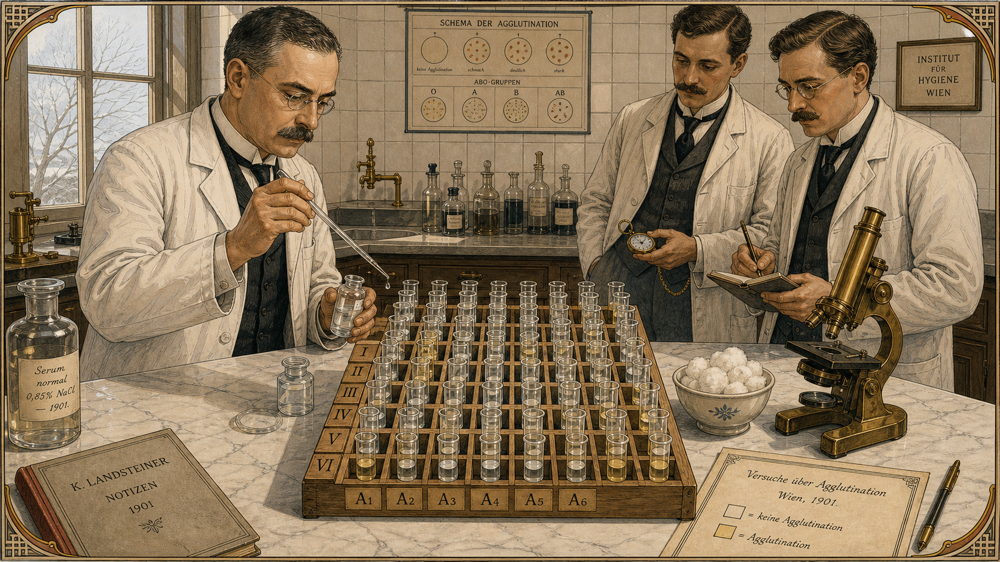
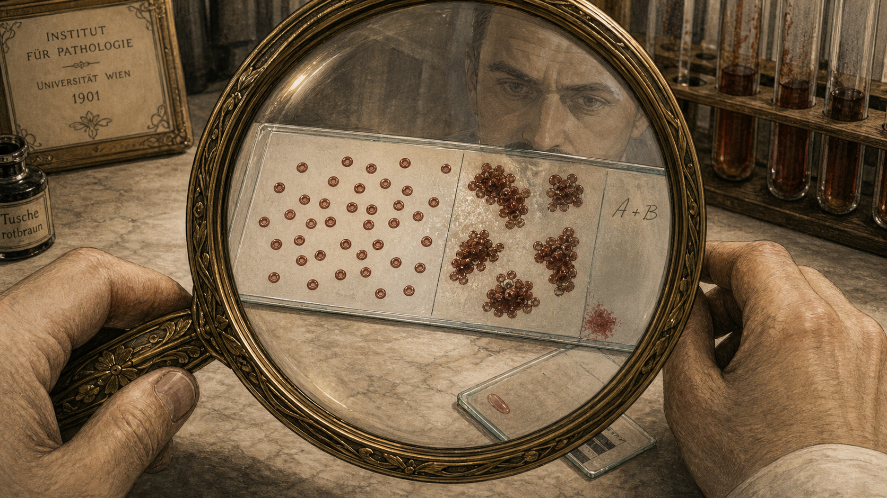
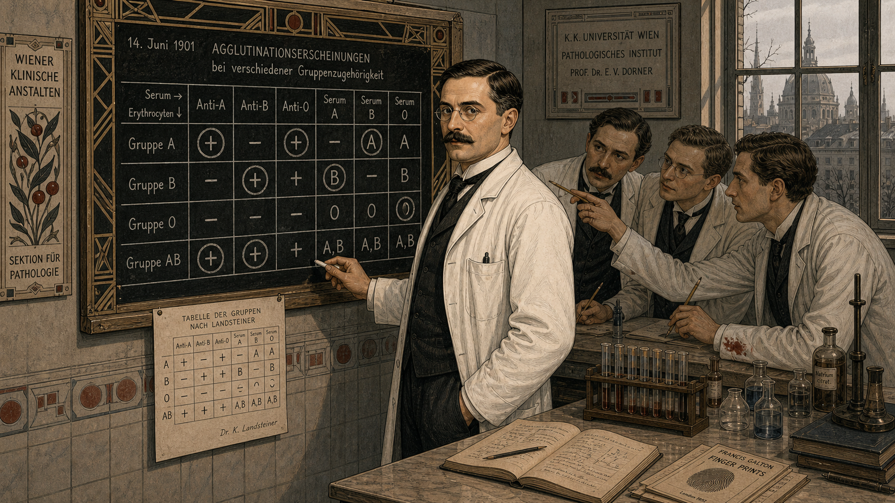
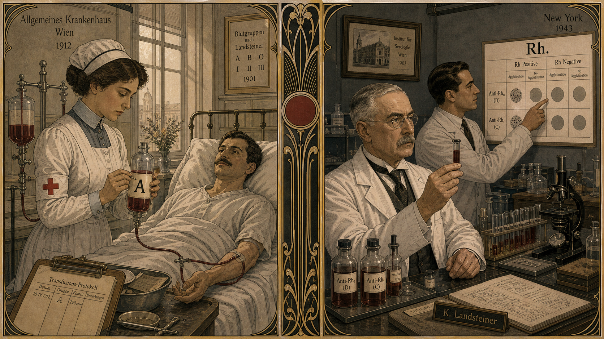
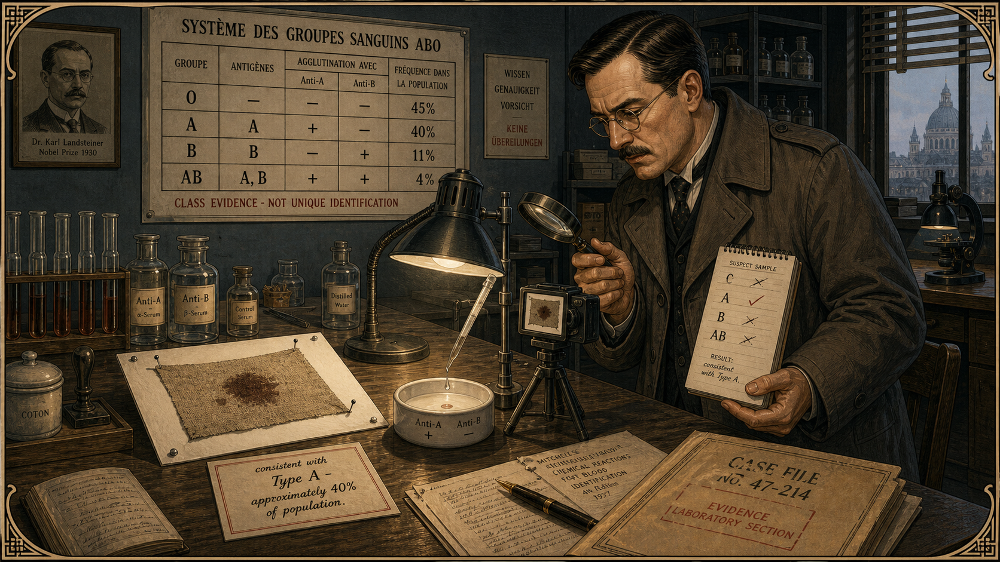
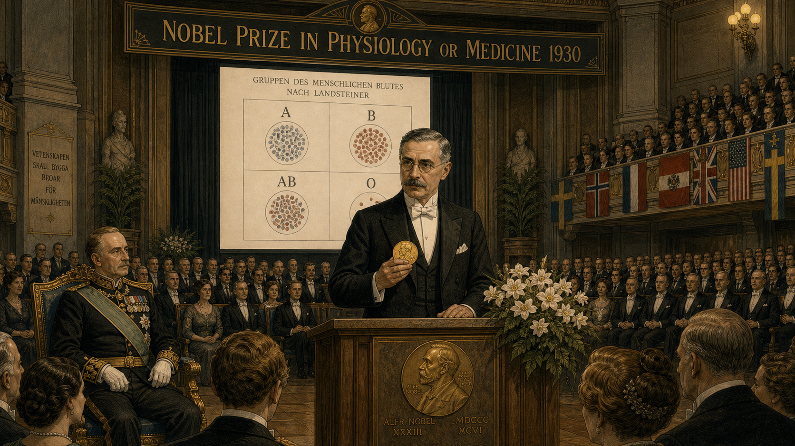

# The Blood That Tells the Truth

Cover Image Prompt

(This is the Cover Image. Do not include this label in the image.)
A Vienna Secession / Art Nouveau early-modern illustration cover in the style of a turn-of-the-century Viennese scientific journal, circa 1901. In the center stands Karl Landsteiner: a compact man in his early thirties with round wire-framed glasses, a neat dark mustache, and a spotless white laboratory coat worn over a dark waistcoat and cravat. He holds up a glass test tube of deep red liquid at eye level, studying it intently; the tube catches the light and casts a small ruby glow on his face. Behind him, a tiled Viennese hospital laboratory is visible: a long marble workbench covered with a 4×4 grid of small glass test tubes arranged in neat rows, some contents clear, some visibly clumped. An ornate brass microscope stands at the corner of the bench. Tall casement windows reveal a pale winter Vienna skyline, its baroque rooftops dusted with snow. The title text "The Blood That Tells the Truth" arcs across the top in elegant Art Nouveau lettering with geometric vine ornament. A subtitle in period typeface reads "Karl Landsteiner, Vienna 1901." The color palette is deep crimson, ivory, cool slate grey, and pale gold. Emotional tone: disciplined curiosity and quiet intellectual triumph. Fine elegant linework, flat-color areas with minimal shading in the Vienna Secession mode. At least six specific visual details: a handwritten laboratory notebook open to a grid diagram, an ink sketch of clumped red cells visible on one page, a small framed portrait of Gregor Mendel on the wall, a ceramic mug of cooling coffee beside the notebook, a pen-and-ink anatomical cross-section of a blood vessel pinned to the wall, and test-tube clamps arranged in geometric precision on the bench.
Generate the image immediately without asking clarifying questions.

Narrative Prompt

This is an 8-panel graphic novel about Karl Landsteiner (1868–1943), the Austrian physician and immunologist who discovered the ABO blood group system in Vienna in 1900–1901, later helped discover the Rh factor, and received the Nobel Prize in Physiology or Medicine in 1930. The story is set primarily in Vienna, Austria, 1900–1901, with a later beat showing the 1930 Nobel ceremony in Stockholm, Sweden.

Art style for all panels: Vienna Secession / Art Nouveau early-modern illustration, clean elegant linework, warm clinical palette. Flat color areas, minimal but precise cross-hatching, geometric ornament influenced by Gustav Klimt's era. Color palette throughout: deep crimson, ivory, cool slate grey, pale gold, and muted sage green. No bright modern digital colors; no photorealism.

Character consistency — Karl Landsteiner: compact build, early-to-mid thirties in the Vienna panels, round wire-framed glasses, neat dark mustache, white laboratory coat over a dark waistcoat and cravat. He is always calm, precise, and slightly formal in bearing. His expression is methodical and quietly curious — never theatrical.

Supporting figures: laboratory colleagues (unnamed, period dress — dark coats, rolled shirtsleeves, some with mustaches), a hospital patient in a white gown seen at a distance in early panels, and a ceremony hall audience in formal 1930s attire for the Nobel panel. A forensic investigator figure in Panel 7 should wear a 1940s-style belted overcoat and carry a notepad.

Settings alternate between: a tiled early-1900s Viennese hospital laboratory with tall casement windows and white ceramic tile; a transfusion bedside scene glimpsed through a doorway; the laboratory bench grid experiment close-ups; and a grand Scandinavian concert-hall interior for the Nobel ceremony.

Every panel should feel like a plate from a finely illustrated Viennese scientific or literary journal of 1900–1930. Elegant geometric borders on each panel in the Vienna Secession style.

### Prologue – A Question Worth Asking

In the hospitals of Vienna in 1900, blood transfusion was little more than a gamble. Some patients recovered; others died within minutes, their bodies convulsing as if poisoned. The doctors had no explanation — some blamed "bad blood," others shrugged and called it God's will. One thirty-one-year-old researcher at the Vienna Pathological Institute refused to accept that answer. He suspected the blood itself was the mystery, and he had a grid of test tubes and an idea simple enough to test on a Tuesday morning.

---

## Panel 1: The Gamble at the Bedside

Image Prompt

(This is Panel 01. Do not include the panel number in the image.)
I am about to ask you to generate a series of images for a graphic novel. Please make the images have a consistent style and consistent characters. Do not ask any clarifying questions. Just generate the image immediately when asked.
Please generate a 16:9 image in Vienna Secession / Art Nouveau early-modern illustration, clean elegant linework, warm clinical palette depicting panel 1 of 8. The scene shows a Viennese hospital ward, Vienna, Austria, circa 1900. Through a half-open doorway in the foreground, we see a patient lying in a white hospital bed, a physician bending over the bedside with a rubber transfusion tube. Karl Landsteiner — compact, round wire-framed glasses, neat dark mustache, white laboratory coat over a dark waistcoat and cravat — stands in the hallway watching through the doorway, arms folded, expression troubled and thoughtful. Around him, a narrow hospital corridor with white ceramic tile walls, gas-lit wall sconces, and a wooden chart rack with papers. Through a tall casement window at the corridor's end, a pale winter Viennese sky is visible. Color palette: ivory, slate grey, pale crimson accents. Emotional tone: unease and intellectual urgency. At least six visual details: the rubber transfusion tube connecting two glass vessels, a nurse in a white cap visible in the background of the ward, a medical chart hanging on the wall with handwritten German text, Landsteiner's notebook tucked under one arm, a small framed anatomical illustration of the circulatory system on the corridor wall, and steam rising from a floor-level heating grate.
Generate the image immediately without asking clarifying questions.

In Vienna's hospitals at the turn of the twentieth century, blood transfusions were performed with no system and no certainty. A patient who needed blood simply received it — from whoever was willing to donate. Sometimes the transfusion saved a life. Sometimes it ended one, swiftly and terribly, with the recipient's own immune system treating the donated blood as an enemy. Landsteiner watched these unpredictable outcomes and refused to call them bad luck. He was certain there was a pattern hiding inside the red cells, waiting to be found.

---

## Panel 2: A Hunch About Difference

Image Prompt

(This is Panel 02. Do not include the panel number in the image.)
Please generate a 16:9 image in Vienna Secession / Art Nouveau early-modern illustration, clean elegant linework, warm clinical palette depicting panel 2 of 8. Make the characters and style consistent with the prior panels. The scene shows Karl Landsteiner at a tall writing desk in his Vienna laboratory, 1900, writing in a laboratory notebook. He wears round glasses, neat dark mustache, white coat over dark waistcoat. The open notebook page shows a hand-drawn table — rows labeled with names, columns labeled with question marks — suggesting an experiment in planning. On the desk beside the notebook: a glass of water with a few drops of red dye swirling to show mixing, a small anatomy textbook open to a diagram of red blood cells, and a brass pen stand. Bookshelves behind him hold volumes of pathology journals. Through a frosted glass window, the silhouette of a Vienna rooftop is visible. A gas lamp on the desk casts a focused warm circle of light. Color palette: ivory, pale gold, slate grey. Emotional tone: methodical concentration and growing hypothesis. At least six visual details: the grid layout in the notebook (rows labeled with initials, columns with symbols), a calendar on the wall showing November 1900, an inkwell beside the notebook, a stack of loose papers covered in German handwriting, a small ceramic figurine of an owl on the bookshelf, and a half-drunk cup of coffee with a thin skin forming on the surface.
Generate the image immediately without asking clarifying questions.

Landsteiner's hypothesis was radical in its simplicity: perhaps blood was not uniform across all human beings. Perhaps it came in distinct types — and perhaps mixing the wrong types was exactly what killed patients. He had read scattered reports of clumping reactions between different blood samples, but no one had organized the observations into a coherent system. At the end of 1900 he sat down at his desk and designed an experiment that would take just a few days, a few colleagues, and a very carefully drawn grid.

---

## Panel 3: The Grid Experiment

Image Prompt

(This is Panel 03. Do not include the panel number in the image.)
Please generate a 16:9 image in Vienna Secession / Art Nouveau early-modern illustration, clean elegant linework, warm clinical palette depicting panel 3 of 8. Make the characters and style consistent with the prior panels. The scene shows Karl Landsteiner's laboratory bench in Vienna, 1901, viewed from slightly above. On the white marble bench surface sits a perfect geometric grid of small glass test tubes held in a wooden rack: six rows, six columns, each tube labeled with a letter-number code. Some tubes contain clear liquid, some pale yellow serum. Landsteiner stands to the left — round glasses, white coat, precise expression — holding a glass pipette delicately, about to add a single drop from one small vial to a specific tube. Two laboratory colleagues stand on the right side of the bench, watching closely: one with a pocket watch, one with a notebook and pencil. A brass microscope waits at the corner of the bench. Tall white-tiled walls and a casement window with pale winter light behind. Color palette: ivory, cool grey, pale crimson drops of blood in small vials arranged to the side, pale gold glass. Emotional tone: precision and anticipation. At least six visual details: the pipette catching the light with one hanging droplet, a handwritten label on the wooden tube rack reading "I / II / III," a ring of condensation on the bench from a cold vial, a small ceramic bowl of cotton wool beside the pipette tray, the colleague's pocket watch open in his palm, and fine printed labels on each of the test tubes.
Generate the image immediately without asking clarifying questions.

In early 1901, Landsteiner drew a few milliliters of blood from himself and from five laboratory colleagues. He separated each sample into its two main components: the liquid serum and the red blood cells. Then, working with the methodical patience of a cartographer mapping a new continent, he mixed each person's serum against every other person's red cells — a six-by-six grid of tiny test tubes — and watched to see which combinations clumped and which did not. The experiment was elegant, humble, and entirely decisive.

---

## Panel 4: Agglutination — The Clumping Moment

Image Prompt

(This is Panel 04. Do not include the panel number in the image.)
Please generate a 16:9 image in Vienna Secession / Art Nouveau early-modern illustration, clean elegant linework, warm clinical palette depicting panel 4 of 8. Make the characters and style consistent with the prior panels. The scene shows an extreme close-up view of a glass microscope slide on a laboratory bench in Vienna, 1901, as seen through Karl Landsteiner's magnifying glass held in the foreground — the circular lens frames the central image. On the slide, red blood cells are clearly visible: in the left half of the slide, cells float freely and evenly in pale liquid, orderly and separate. In the right half of the same slide, cells have clumped into visible dark irregular clusters — agglutination — like tiny lumpy islands. Karl Landsteiner's hands (in the foreground, wearing a white coat sleeve) hold the magnifying glass. His face is reflected faintly and in miniature in the glass lens. In the background, soft-focus: the laboratory bench with more test tubes in the rack. Color palette: ivory, deep crimson, pale gold lens glass, cool grey background. Emotional tone: discovery and recognition — the "aha" moment. At least six visual details: the sharp contrast between the free cells on the left and the clumped cells on the right, the hairline scratch on the slide edge suggesting careful lab handling, the brass rim of the magnifying glass with an Art Nouveau floral engraving, a second slide waiting on the bench, a smear of red at the edge of the slide where the sample was applied, and a faint handwritten label on the slide's frosted end reading "A+B."
Generate the image immediately without asking clarifying questions.

When Landsteiner held the slides under his magnifying glass and microscope, the pattern was unmistakable. Some combinations of serum and red cells stayed perfectly smooth; others clumped into visible islands of cells — a reaction called agglutination. The clumping was not random. It followed a precise, repeatable rule: certain serums attacked certain cells, and certain serums left others completely alone. The blood was sorting itself into groups, and Landsteiner was the first person in history to read that map.

---

## Panel 5: Naming the Groups — A, B, O

Image Prompt

(This is Panel 05. Do not include the panel number in the image.)
Please generate a 16:9 image in Vienna Secession / Art Nouveau early-modern illustration, clean elegant linework, warm clinical palette depicting panel 5 of 8. Make the characters and style consistent with the prior panels. The scene shows Karl Landsteiner at a wall-mounted blackboard in his Vienna laboratory, 1901, chalk in hand. On the blackboard he has drawn a large grid table with columns and rows; in the cells of the grid he has written large letter symbols — A, B, O — some circled, some with a plus sign, some with a minus sign. He turns slightly toward the viewer, chalk dust on his fingers, expression calm and certain — the look of a man who has just organized chaos into clarity. Behind him, three laboratory colleagues stand near the bench, studying the board and pointing at specific cells of the grid with pencils; their faces show animated discussion. Through the laboratory window, late winter Vienna light. Color palette: slate grey blackboard, ivory chalk marks, crimson accent in the circled letters, pale gold in the window light. Emotional tone: intellectual clarity and quiet excitement. At least six visual details: the chalk grid on the board showing the ABO pattern clearly, a small smear of red on one colleague's cuff, the test-tube rack still on the bench behind the group, a printed copy of the grid on paper tacked below the blackboard, Landsteiner's neat dark mustache and round glasses visible in profile, and a Vienna Secession geometric border decorating the upper edge of the chalkboard frame.
Generate the image immediately without asking clarifying questions.

In his landmark 1901 paper, Landsteiner described three distinct blood groups — which he labeled A, B, and O — defined by which antigens sat on the surface of the red cells and which antibodies swam in the serum. A fourth group, AB, would be identified shortly afterward by two of his colleagues. The rule for safe transfusion suddenly had a foundation: a patient's immune system would tolerate blood from a compatible group and attack blood from an incompatible one. The guesswork was over. A simple, systematic test before every transfusion could prevent catastrophe.

---

## Panel 6: Decades of Saved Lives and the Rh Factor

Image Prompt

(This is Panel 06. Do not include the panel number in the image.)
Please generate a 16:9 image in Vienna Secession / Art Nouveau early-modern illustration, clean elegant linework, warm clinical palette depicting panel 6 of 8. Make the characters and style consistent with the prior panels. The scene is a split composition showing two moments: on the left side, a 1910s Viennese hospital — a nurse in period uniform carefully labels a glass bottle of blood with a large letter "A" before connecting it to a transfusion apparatus at a patient's bedside; the mood is calm and orderly. On the right side, a 1940s New York hospital laboratory — an older Karl Landsteiner, now in his early seventies with silver-streaked hair but still wearing round glasses and white coat, stands at a bench examining a vial while a younger colleague points to a new chart on the wall labeled "Rh." A dividing Art Nouveau ornamental column separates the two scenes. Color palette: ivory, slate grey, deep crimson label on the blood bottle, pale gold in the laboratory lighting. Emotional tone: the quiet accumulation of lifesaving progress over decades. At least six visual details: the large inked letter "A" on the glass blood bottle on the left, the patient's relieved expression in the left scene, the Rh chart on the wall in the right scene, a framed photograph of the Vienna laboratory on the wall of the New York lab, a small typed nameplate reading "K. Landsteiner" on the right-side bench, and fine geometric ornament on the dividing column.
Generate the image immediately without asking clarifying questions.

The ABO system spread through hospitals across Europe and America over the next decade, transforming transfusion from a lottery into a medical procedure grounded in reliable evidence. Hundreds of thousands of lives were saved in the decades that followed, particularly during the mass casualties of two World Wars. Landsteiner himself never stopped asking questions. Working in New York in 1937, now nearly seventy, he and his colleagues discovered a second layer of the blood's identity — the Rh factor — revealing yet another antigenic difference between individuals that could, left unmatched, prove just as fatal as an ABO mismatch.

---

## Panel 7: The Forensic Payoff — Blood as Class Evidence

Image Prompt

(This is Panel 07. Do not include the panel number in the image.)
Please generate a 16:9 image in Vienna Secession / Art Nouveau early-modern illustration, clean elegant linework, warm clinical palette depicting panel 7 of 8. Make the characters and style consistent with the prior panels. The scene shows a 1940s forensic laboratory interior — a long wooden bench under focused laboratory lamps. On the bench surface: a piece of fabric with a dark dried stain is pinned to a clean white card; beside it, a small ceramic test dish with a pipette above it shows a clear result. A forensic investigator in a 1940s belted overcoat stands at the bench, examining the result with a magnifying glass; a notepad in his other hand shows a written column of blood-type letters — A, B, O, AB — with some checked and some crossed out. A wall chart behind him shows the ABO blood group system with frequency percentages and a prominent note in block lettering reading "CLASS EVIDENCE — NOT UNIQUE IDENTIFICATION." A printed note on a card reads "consistent with Type A — approximately 40% of population." Color palette: ivory, slate grey, pale crimson details, cool blue-white laboratory lamp light. Emotional tone: careful, methodical, honest about the limits of the evidence. At least six visual details: the fabric stain on the pinned card, the frequency chart on the wall, the investigator's notepad with the typed blood-type list, the result visible in the ceramic dish, a small camera on a tripod photographing the evidence, and a case-file folder with stamped text at the corner of the bench.
Generate the image immediately without asking clarifying questions.

By the 1940s, Landsteiner's discovery had quietly migrated from the hospital ward into the crime laboratory. Forensic serologists found that blood, saliva, and other biological fluids left at crime scenes could be typed using the ABO system — even from dried stains weeks or months old. This was powerful information, but investigators were trained to be precise about what it meant: a bloodstain typed as group A was *consistent with* any of the roughly forty percent of the population who carry that type. It could *narrow the field* of possible sources significantly. It could *exclude* a suspect entirely if their type did not match. But it could not, by itself, identify a single unique individual. Blood type was — and remains — **class evidence**, not individual evidence. That crucial distinction between eliminating suspects and naming one would wait for DNA profiling, still decades away.

---

## Panel 8: The Nobel Prize and a Modest Legacy

Image Prompt

(This is Panel 08. Do not include the panel number in the image.)
Please generate a 16:9 image in Vienna Secession / Art Nouveau early-modern illustration, clean elegant linework, warm clinical palette depicting panel 8 of 8. Make the characters and style consistent with the prior panels. The scene shows Stockholm, Sweden, 1930 — the grand interior of a ceremonial hall. Karl Landsteiner stands at a podium center-stage, now in his early sixties: round glasses, silver-streaked dark hair, neat mustache, a formal black evening suit. He holds a small gold medal. Before him, a vast audience in formal 1930s attire fills tiered seats; a banner above the stage reads "Nobel Prize in Physiology or Medicine 1930" in elegant period lettering. Landsteiner's expression is not triumphant but composed and quietly moved — the look of a man who is slightly embarrassed by fuss. Behind the podium, a large projected diagram on a screen shows the ABO blood group grid — four quadrants labeled A, B, AB, O — the same simple grid he drew on a Viennese laboratory blackboard thirty years before. The hall lighting is warm gold against the cool Scandinavian grey of stone pillars. Color palette: deep ivory, charcoal, pale gold medal glow, cool stone grey. Emotional tone: understated dignity and the weight of three decades of consequence. At least six visual details: the gold Nobel medal in Landsteiner's hand, the ABO grid diagram projected on the screen, a bouquet of white flowers on the podium edge, the formal black-tie audience stretching back to dim distance, an official in ceremonial dress to Landsteiner's left, and a small Austrian flag among the international pennants decorating the balcony rail.
Generate the image immediately without asking clarifying questions.

In 1930, thirty years after a Tuesday morning's worth of pipetting in a Vienna laboratory, Karl Landsteiner received the Nobel Prize in Physiology or Medicine for the discovery of the ABO blood group system. He accepted the honor in his characteristic style — briefly, graciously, and without dramatics. He spoke not of his own genius but of the importance of patient, systematic observation, and of never dismissing a question just because the answer seemed too simple to matter. He died in 1943 at the age of seventy-five, still at his laboratory bench in New York, still asking questions. The quiet grid he drew in 1901 had by then become one of the most frequently consulted diagnostic tools in human history.

---

### Epilogue – What Made Landsteiner Different?

Karl Landsteiner did not stumble upon his discovery. He engineered it: a small, elegant, completely reproducible experiment designed to test a specific hypothesis. He asked a question that his era's medical culture had effectively dismissed — *why do some transfusions kill?* — and answered it with a grid of test tubes rather than an opinion. His career is also a lesson in the long reach of careful work: a laboratory finding that seemed purely biological in 1901 became a forensic tool in the 1940s, and the conceptual framework he built for classifying biological variation by its markers is the intellectual ancestor of DNA profiling itself.

| Challenge | How Landsteiner Responded | Lesson for Today |
|---|---|---|
| Transfusion failures were unexplained and accepted as inevitable | Designed a systematic mixing experiment instead of accepting "bad luck" as an answer | Look for the pattern inside the chaos before concluding there isn't one |
| His peers lacked a framework for blood variation | Built the framework himself from first principles, naming what he found | When the vocabulary doesn't exist yet, invent it — carefully |
| The discovery took thirty years to earn Nobel recognition | Kept working and expanding the science (Rh factor, virus research) rather than waiting for validation | Impact is not always immediate; stay curious anyway |
| Forensic application was not his intent | His rigorous characterization of ABO antigens made forensic serology possible without any extra steps | Basic science done well creates tools that downstream fields can pick up |

---

### Call to Action

The next time a forensic report says a bloodstain is "consistent with" a blood type, remember that the phrase carries exactly the weight Landsteiner's experiment earned for it — no more, no less. Class evidence matters: it can eliminate innocent people and focus an investigation. But precision about what evidence *can* and *cannot* say is itself a form of honesty, and honesty is what the laboratory owes to every courtroom. If you find yourself curious about what a single biological fact can and cannot prove, you are already thinking the way Karl Landsteiner thought.

---

*"I believe that the work of the scientific investigator consists not so much in introducing new facts as in correlating the existing data and finding new relations between them."*
—Karl Landsteiner

*"The solution of the transfusion problem depended on a simple experiment."*
—Karl Landsteiner

## References

1. [Wikipedia: Karl Landsteiner](https://en.wikipedia.org/wiki/Karl_Landsteiner) — Biography of the Austrian physician and immunologist who discovered the ABO blood group system and received the 1930 Nobel Prize in Physiology or Medicine.
2. [Wikipedia: ABO blood group system](https://en.wikipedia.org/wiki/ABO_blood_group_system) — Detailed article on the ABO system, its antigens and antibodies, discovery history, and clinical and forensic applications.
3. [Wikipedia: Forensic serology](https://en.wikipedia.org/wiki/Forensic_serology) — Overview of how biological fluids including blood are typed as class evidence in criminal investigations, including the role of ABO typing.
4. [Nobel Prize: Karl Landsteiner — Biographical](https://www.nobelprize.org/prizes/medicine/1930/landsteiner/biographical/) — Official Nobel Prize biography detailing Landsteiner's life, the 1901 experiment, and his continued contributions to immunology.
5. [Encyclopaedia Britannica: Karl Landsteiner](https://www.britannica.com/biography/Karl-Landsteiner) — Curated reference overview of Landsteiner's life, discovery of blood groups, and scientific legacy.
