# The Poison Hunter — Mathieu Orfila and the Birth of Forensic Toxicology

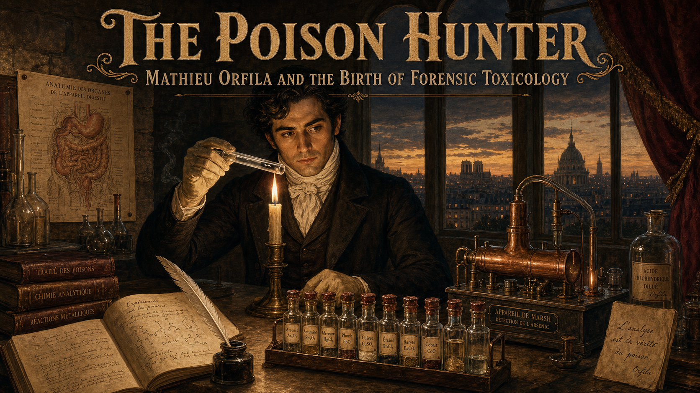

Cover Image Prompt

(This is the Cover Image. Do not include this label in the image.)
A dramatic cover illustration in Romantic-era French academic oil-painting style with candlelit chiaroscuro. In the center stands Mathieu Orfila: a young man in his late twenties with thick dark hair swept back, olive Mediterranean complexion, sharp dark eyes, and a distinguished black frock coat with a high white cravat. He stands at a stone laboratory bench crowded with glass retorts, flasks, and a gleaming copper Marsh test apparatus. In one gloved hand he holds a glass tube toward a candle flame; a faint metallic mirror deposit is just visible inside it. Behind him, tall arched windows reveal the Paris skyline at dusk, approximately 1813. The title text "The Poison Hunter" is rendered across the top in bold Romantic-era serif lettering with classical flourishes; a subtitle below reads "Mathieu Orfila and the Birth of Forensic Toxicology." Color palette: deep amber candlelight, rich burgundy drapes, warm ivory, smoke-grey stone, and gleaming copper. Emotional tone: intellectual triumph mixed with grave responsibility. At least six visual details: an open leather-bound notebook with handwritten formulas, a rack of glass vials sealed with wax, a human anatomical diagram pinned to the stone wall, a bronze mortar and pestle, smoke curling from the candle, and a period quill pen resting in an inkwell on the bench.
Generate the image immediately without asking clarifying questions.

Narrative Prompt

This is a 10-panel graphic novel about Mathieu Orfila (1787–1853), born on the island of Menorca, Spain, who became a celebrated physician and chemist in Paris and founded the science of forensic toxicology. The story spans roughly 1807 to 1840, set in Paris, France — inside a university chemistry laboratory, a crowded lecture hall, and a packed Assize Court.

Art style for all panels: Romantic-era / early Victorian French academic oil-painting style with candlelit chiaroscuro and rich detail. Color palette throughout: deep amber candlelight, warm ivory, burgundy, aged stone grey, and copper and brass instrument highlights. No bright or saturated modern colors.

Character consistency — Mathieu Orfila: medium build, thick dark hair swept back from a high forehead, olive complexion, sharp dark eyes, clean-shaven. As a student (panels 1–2) he wears a plain dark waistcoat and cravat over a white shirt. As a professor and expert witness (panels 4–10) he wears a formal black frock coat, high white cravat, and occasionally white cotton laboratory gloves. His bearing is precise and confident but never arrogant; his expression ranges from intense concentration to measured, calm authority.

Supporting characters — Marie Lafarge: a young woman in her mid-twenties, pale, dark-haired, wearing a dark mourning dress and a lace collar, visible in the courtroom scenes (panels 6–9). Local chemists (panels 7–8): two middle-aged men in rumpled frock coats, visibly flustered. The presiding judge (panels 7–9): an older man in a black robe and white court wig, seated at an elevated bench.

Settings: a dimly lit university chemistry laboratory in Paris with stone arches, wooden benches, glass apparatus, and candle brackets on the walls; a wood-paneled lecture hall; a stone-walled French Assize Courtroom with tiered public galleries packed with spectators in period dress.

Every panel should feel like a richly painted Romantic-era French academic illustration — warm, detailed, candlelit, with deep shadows and golden highlights. Fine brushwork, no photorealism, no modern digital aesthetics.

### Prologue – The Era of the Perfect Poison

In the early nineteenth century, arsenic was known throughout Europe as "inheritance powder." Colorless, nearly tasteless, and easy to obtain from any apothecary, it caused symptoms so similar to natural illness that physicians regularly signed death certificates without a second thought. If someone wanted to murder quietly and walk away clean, arsenic was the instrument of choice — and there was almost nothing a court of law could do about it. That changed because of one fiercely curious young doctor from an island most Parisians could barely find on a map.

---

## Panel 1: The Student from Menorca

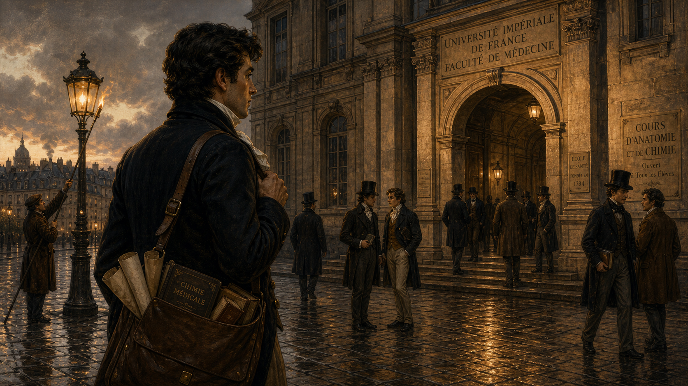

Image Prompt

(This is Panel 01. Do not include the panel number in the image.)
I am about to ask you to generate a series of images for a graphic novel. Please make the images have a consistent style and consistent characters. Do not ask any clarifying questions. Just generate the image immediately when asked.
Please generate a 16:9 image in Romantic-era / early Victorian French academic oil-painting style, candlelit chiaroscuro, rich detail depicting panel 1 of 10. The scene shows a young Mathieu Orfila — medium build, thick dark hair swept back, olive complexion, sharp dark eyes, wearing a plain dark waistcoat and white cravat — arriving on foot at a broad Parisian boulevard, circa 1807. He carries a worn leather satchel over one shoulder. Before him, the imposing stone facade of a Parisian university building rises under a grey winter sky. Other students in period frock coats and top hats pass by on the cobblestones. The color palette is cool stone grey, warm amber from street lanterns just beginning to glow at dusk, and muted ivory. Emotional tone: determination and barely contained excitement. At least six visual details: the cobblestone street glistening with recent rain, a gas lamp being lit by a lamplighter in the background, a stack of rolled papers and books visible in the open top of the satchel, other students in animated conversation near the entrance archway, a carved stone inscription above the archway, and a distant glimpse of Parisian rooftops and chimney smoke.
Generate the image immediately without asking clarifying questions.

In 1807, twenty-year-old Mathieu Orfila stepped off a coach into the grey, rain-slicked streets of Paris. He had left the sun-warmed island of Menorca on a scholarship, armed with boundless ambition and a gift for chemistry that his professors back home had never quite known what to do with. Paris was the center of the scientific world, and Orfila intended to make his mark on it. He had no idea that his mark would reshape the relationship between science and justice forever.

---

## Panel 2: Arsenic — The Invisible Killer

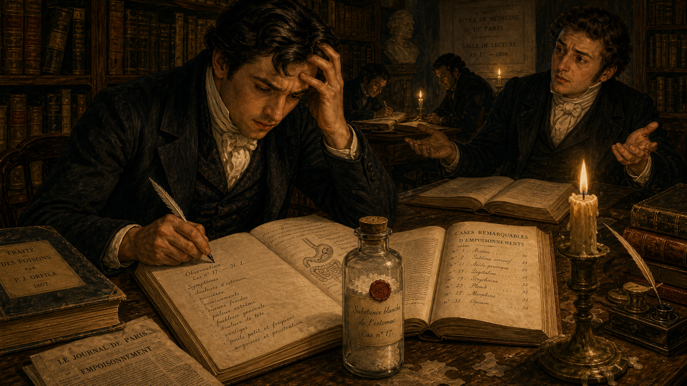

Image Prompt

(This is Panel 02. Do not include the panel number in the image.)
Make the characters and style consistent with the prior panels.
Please generate a 16:9 image in Romantic-era / early Victorian French academic oil-painting style, candlelit chiaroscuro, rich detail depicting panel 2 of 10. The scene shows Mathieu Orfila as a young medical student, seated at a heavy wooden library table in a candlelit Parisian university reading room, circa 1809. He leans forward over a thick open medical casebook, his expression troubled and frustrated. The pages of the casebook show handwritten symptom lists and a small anatomical sketch. On the table beside him: a corked glass vial of pale white powder labeled in French script, a second open book showing a list of poison cases, and a half-burned candle in a brass holder. Bookshelves filled with leather-bound volumes line the shadowy walls behind him. Another student sits across the table, shrugging with palms upturned — a gesture of helplessness. The color palette is deep amber candlelight, aged ivory, and dark oak brown. Emotional tone: frustration and intellectual urgency. At least six visual details: the handwritten French symptom list legible on the casebook page, the wax seal on the vial of white powder, a quill pen held in Orfila's right hand, candle wax dripped on the table surface, a folded newspaper nearby with the word "empoisonnement" (poisoning) partially visible in the headline, and deep shadow filling the corners of the room.
Generate the image immediately without asking clarifying questions.

As he advanced through his medical studies, Orfila became troubled by a glaring gap in scientific knowledge. Arsenic poisoning was suspected in dozens of suspicious deaths every year, yet no reliable chemical test existed that a court could accept as proof. Symptoms mimicked gastroenteritis; physicians disagreed; juries were left to decide based on gossip and rumor rather than evidence. Orfila could not let that stand. He began reading every case record and chemical paper he could find on the subject, and the more he read, the more he understood that the problem was not hopeless — it was simply unsolved.

---

## Panel 3: Experiments in the Dark

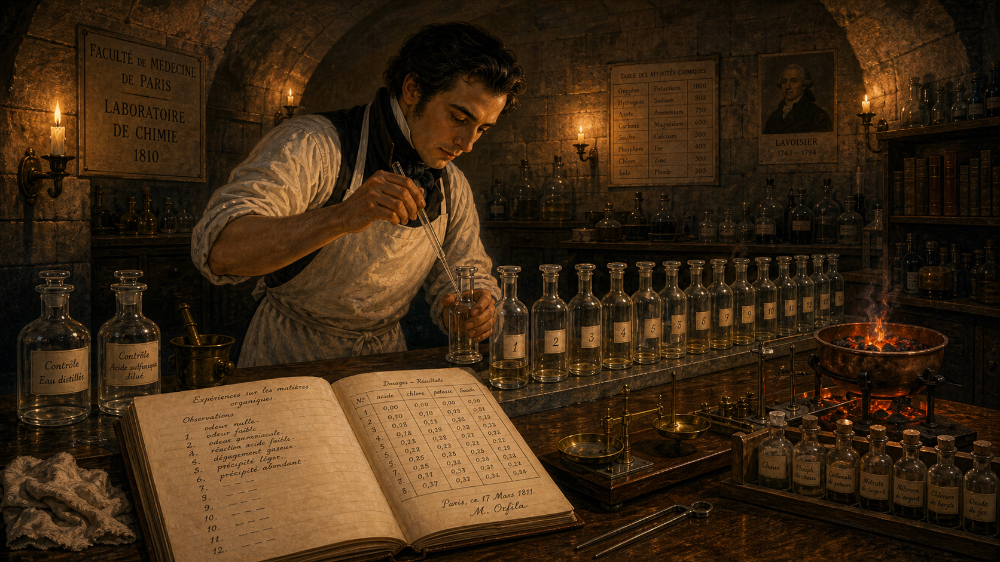

Image Prompt

(This is Panel 03. Do not include the panel number in the image.)
Make the characters and style consistent with the prior panels.
Please generate a 16:9 image in Romantic-era / early Victorian French academic oil-painting style, candlelit chiaroscuro, rich detail depicting panel 3 of 10. The scene shows Mathieu Orfila alone in a stone-walled Paris university chemistry laboratory late at night, circa 1810–1812. He stands at a long wooden bench lit by a cluster of candles in iron brackets on the wall. He wears a plain white cotton laboratory apron over his dark waistcoat and cravat, and his sleeves are rolled up. He carefully pipettes a measured amount of liquid from a glass flask into a smaller test vessel, his face close and focused. On the bench: a systematic row of identical glass vessels each labeled with a small paper tag, an open laboratory notebook filled with precise handwritten observations and measurements, a brass balance scale, a rack of sealed glass vials, and a small copper heating brazier glowing orange. The color palette is deep amber and orange candlelight against grey stone, with ivory and copper highlights. Emotional tone: intense, methodical concentration. At least six visual details: the numbered paper tags on each glass vessel in the row, handwritten metric measurements visible in the open notebook, the glowing coals in the copper brazier, candle shadows playing on the arched stone ceiling, a cloth rag and a pair of tongs on the bench, and small handwritten control labels beside two reference vessels at the end of the row.
Generate the image immediately without asking clarifying questions.

Night after night, Orfila set up experiments that no one had run so carefully before. He dosed animal tissues with precisely measured amounts of arsenic — recording the dose, the preparation method, and the results in meticulous detail. He ran controls: test samples that contained no arsenic at all, to check whether his chemical reagents were producing false signals. He repeated each trial until the results were consistent. This was not guesswork; it was systematic science, and it was building toward something that would change the courtroom forever.

---

## Panel 4: The Treatise That Founded a Science

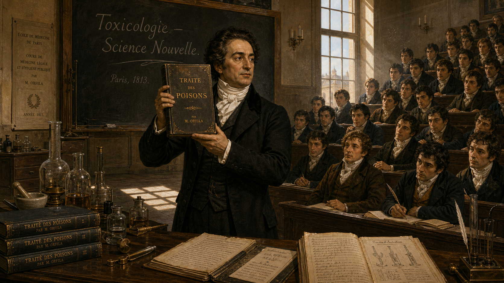

Image Prompt

(This is Panel 04. Do not include the panel number in the image.)
Make the characters and style consistent with the prior panels.
Please generate a 16:9 image in Romantic-era / early Victorian French academic oil-painting style, candlelit chiaroscuro, rich detail depicting panel 4 of 10. The scene shows Mathieu Orfila in 1813, now in his mid-twenties and wearing a formal black frock coat and high white cravat, standing before a packed university lecture hall in Paris. He holds up a newly printed thick book — the cover reads "Traité des Poisons" — toward the audience of young medical students in tiered wooden benches. His expression is confident and proud. A large chalkboard behind him has the words "Toxicologie — Science Nouvelle" (Toxicology — New Science) written in chalk. Morning light streams through tall windows on one side, casting long bright rectangles across the stone floor. The color palette is warm amber, ivory, dusty chalkboard grey, and deep black. Emotional tone: triumph and intellectual authority. At least six visual details: the book cover title "Traité des Poisons" legible in large period type, the chalk lettering on the blackboard, students leaning forward with interest in the tiered gallery, a table at the front bearing a glass apparatus and open notebooks, a row of candle sconces unlit along the side wall, and morning dust motes hanging in the beams of window light.
Generate the image immediately without asking clarifying questions.

In 1813, Orfila published the *Traité des Poisons* — the "Treatise on Poisons" — a two-volume work that systematically described the chemistry, symptoms, and post-mortem signs of every known toxic substance. It was the first book to treat toxicology as a scientific discipline in its own right, separate from medicine and from pharmacy. The work was translated across Europe and made Orfila famous almost overnight, earning him a professorship in Paris and establishing the foundational vocabulary that toxicologists still use today.

---

## Panel 5: A New Tool — The Marsh Test

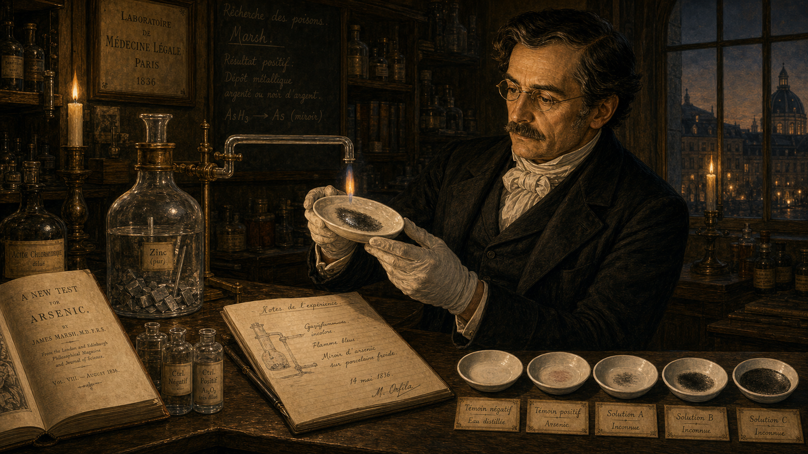

Image Prompt

(This is Panel 05. Do not include the panel number in the image.)
Make the characters and style consistent with the prior panels.
Please generate a 16:9 image in Romantic-era / early Victorian French academic oil-painting style, candlelit chiaroscuro, rich detail depicting panel 5 of 10. The scene shows Mathieu Orfila in his Paris laboratory, circa 1836, now in his late forties, lean, with the same thick dark hair now beginning to show a few threads of silver. He stands at a stone bench examining a newly assembled Marsh test apparatus — a glass flask with a zinc insert connected by a glass tube bent at an angle, over which a small flame burns. Where the arsenic-bearing gas has passed through the flame and struck a cold porcelain dish held in Orfila's gloved hand, a distinctive silver-black metallic mirror deposit is just forming. His expression is one of careful, controlled satisfaction. The apparatus is lit by two candles in brass holders and by the blue-orange glow of a small spirit lamp. On the bench: an open journal article in English titled "A New Test for Arsenic" by James Marsh, a notebook open to a fresh page, and a row of control dishes for comparison. The color palette is deep amber, blue spirit-lamp flame, warm ivory, and the steely glint of metallic arsenic on white porcelain. Emotional tone: quiet, precise excitement. At least six visual details: the metallic arsenic mirror deposit visible on the white porcelain dish, the bent glass tube of the apparatus, zinc pieces inside the reaction flask, the journal article author name "Marsh" legible, the spirit lamp's blue flame, and handwritten comparison notes beside the control dishes.
Generate the image immediately without asking clarifying questions.

In 1836, British chemist James Marsh published a powerful new technique. When tissue suspected to contain arsenic was dissolved in acid and passed over heated zinc, any arsenic present was converted to arsine gas; when that gas was ignited and directed onto a cold surface, it deposited a distinctive silver-black metallic mirror. The deposit could be weighed and compared to known standards. Orfila recognized the Marsh test immediately for what it was: the first chemical method for detecting arsenic that was sensitive, reproducible, and could be explained clearly to a jury. He adopted it, refined it, and made it the centerpiece of his expert witness work.

---

## Panel 6: Murder in the Provinces — The Lafarge Affair

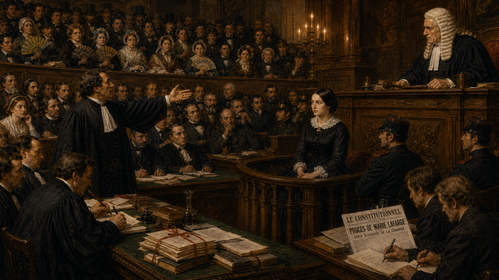

Image Prompt

(This is Panel 06. Do not include the panel number in the image.)
Make the characters and style consistent with the prior panels.
Please generate a 16:9 image in Romantic-era / early Victorian French academic oil-painting style, candlelit chiaroscuro, rich detail depicting panel 6 of 10. The scene shows a tense, crowded French Assize Courtroom in 1840, packed with spectators in tiered public galleries dressed in period clothes — bonnets, top hats, dark coats. At the defendant's dock sits Marie Lafarge: a young woman in her mid-twenties, pale, dark-haired, wearing a black mourning dress with a white lace collar, her hands folded, her expression composed but strained. The presiding judge — an older man in a black robe and white court wig — leans forward at his elevated bench. The prosecution lawyer gestures dramatically toward the public gallery. The color palette is warm amber from hanging lanterns, dark wood paneling, and ivory. Emotional tone: high drama and public spectacle, a room crackling with tension. At least six visual details: the spectator gallery packed shoulder to shoulder, ladies holding folded fans, newspaper reporters at a side bench scribbling notes, a bundle of legal documents tied with ribbon on the barrister's table, the carved wooden dock railing in front of Marie Lafarge, and the judge's raised gavel resting on the bench.
Generate the image immediately without asking clarifying questions.

In 1840, all of France was riveted by the case of Marie Lafarge, a young noblewoman accused of poisoning her husband Charles with arsenic-laced cakes and drinks after an unhappy arranged marriage. The trial was a sensation: the public galleries were packed, reporters telegraphed daily dispatches to Paris newspapers, and opinion was bitterly divided. The case turned on a single question that science, not gossip, would have to answer: was arsenic actually present in Charles Lafarge's body?

---

## Panel 7: The Chemists Bungle It

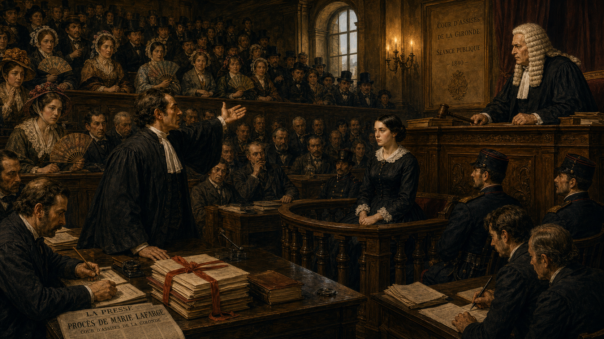

Image Prompt

(This is Panel 07. Do not include the panel number in the image.)
Make the characters and style consistent with the prior panels.
Please generate a 16:9 image in Romantic-era / early Victorian French academic oil-painting style, candlelit chiaroscuro, rich detail depicting panel 7 of 10. The scene shows two local provincial chemists — middle-aged men in rumpled frock coats, visibly agitated and flustered — standing at a makeshift laboratory bench inside the French Assize Courtroom, 1840. Their Marsh test apparatus has produced inconsistent results: one porcelain dish shows a faint smear, another shows nothing. The two chemists lean together in whispered argument, gesturing at their equipment. The presiding judge in his black robe and white wig leans down from the elevated bench with an expression of stern confusion. The packed public gallery buzzes with unrest — spectators lean toward one another, mouths open, arms gesturing. At the barristers' table, lawyers on both sides hold up papers in dispute. The color palette is amber lantern light, dark wood, ivory, and shadow. Emotional tone: chaos, confusion, institutional embarrassment. At least six visual details: the contradictory Marsh test dishes side by side showing different results, the two chemists' flustered body language, the judge's skeptical forward lean, a dropped paper on the stone floor, a barrister on his feet gesturing toward the apparatus, and a reporter in the gallery scribbling furiously.
Generate the image immediately without asking clarifying questions.

The local chemists assigned to perform the Marsh test produced a disaster. Working without proper controls, without standardized reagents, and under enormous public pressure, they returned contradictory results: one set of tests suggested arsenic; a second set found nothing. The courtroom erupted. Defense lawyers accused the prosecution of fabricating evidence; the prosecution accused the defense of interference. The judge was at a loss. Someone with genuine expertise and unimpeachable authority was needed — and there was only one obvious candidate.

---

## Panel 8: Orfila Arrives

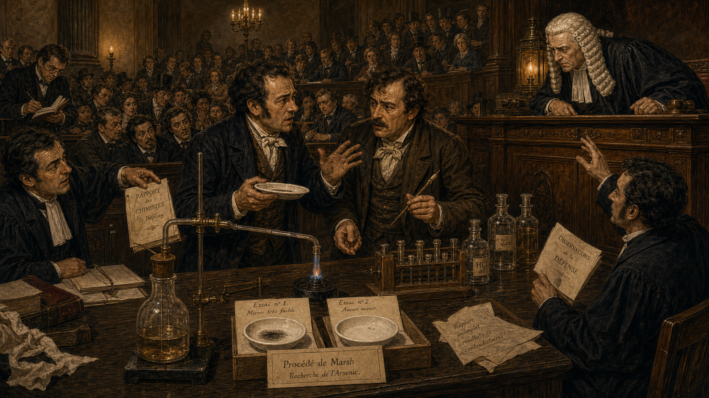

Image Prompt

(This is Panel 08. Do not include the panel number in the image.)
Make the characters and style consistent with the prior panels.
Please generate a 16:9 image in Romantic-era / early Victorian French academic oil-painting style, candlelit chiaroscuro, rich detail depicting panel 8 of 10. The scene shows Mathieu Orfila — now in his early fifties, lean, dark hair with silver at the temples, wearing a formal black frock coat and white cravat — working methodically at a stone laboratory bench in a side chamber of the French court building, 1840. He wears white cotton gloves and holds a glass test vessel steady as his assistant pours a carefully measured liquid from a calibrated flask. On the bench before him: the reassembled Marsh test apparatus — the glass flask, zinc pieces, connected glass tube, and spirit lamp — all arranged with military precision. Beside it: a row of clearly labeled specimen vessels containing tissue samples from the exhumed body of Charles Lafarge, and a separate row of blank control vessels containing only clean tissue. A court official in a dark coat stands at the doorway, watching in silence. The color palette is deep amber and cool grey stone, with the blue glow of the spirit lamp and copper-gold highlights on the apparatus. Emotional tone: calm, methodical authority. At least six visible details: the labeled specimen vessels with handwritten French tags, the blank control vessel row beside the specimens, the calibrated measuring flask in the assistant's hand, the court official's silhouette at the doorway, a clean white cloth laid under the apparatus, and Orfila's white cotton gloves.
Generate the image immediately without asking clarifying questions.

Orfila traveled from Paris to the courtroom at Tulle, where he immediately requested permission to repeat the tests under controlled conditions. He prepared each specimen separately, ran blank tissue controls alongside every test sample, verified the purity of his zinc and his acid, and documented every step in writing. When a faint but unmistakable metallic mirror appeared in the test vessels and not in the controls, he did not leap to conclusions. He checked again. The science had to be sound before he would open his mouth in public.

---

## Panel 9: Testimony — Measured, Not Theatrical

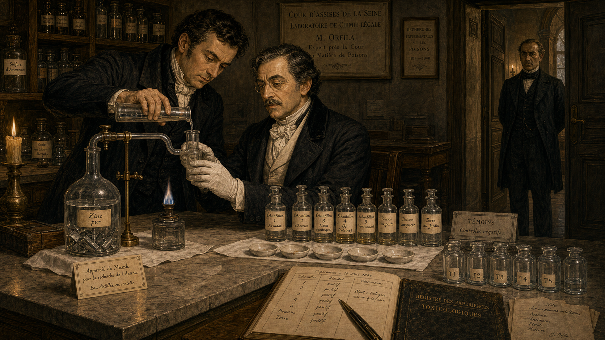

Image Prompt

(This is Panel 09. Do not include the panel number in the image.)
Make the characters and style consistent with the prior panels.
Please generate a 16:9 image in Romantic-era / early Victorian French academic oil-painting style, candlelit chiaroscuro, rich detail depicting panel 9 of 10. The scene shows Mathieu Orfila standing at the witness stand of the French Assize Courtroom, 1840. He wears his formal black frock coat and white cravat, standing upright with one hand resting on the wooden rail of the witness box and the other holding a single sheet of handwritten notes. He faces the judge, speaking calmly and precisely — not gesturing dramatically, not playing to the gallery. On a small table beside the witness stand, the Marsh test porcelain dish with its distinct metallic deposit and a blank control dish are both visible as exhibits. The packed gallery listens in complete silence, leaning forward. Marie Lafarge in the defendant's dock watches Orfila intently, her face pale. The judge leans forward attentively, quill poised over paper. The color palette is warm amber lantern light, dark polished wood, deep shadow, and ivory. Emotional tone: grave, measured authority; the stillness of a room holding its breath. At least six visual details: the metallic mirror deposit visible on the exhibit dish, the blank control dish beside it for comparison, Orfila's handwritten notes held precisely in one hand, the absolute silence conveyed by the closed mouths and still postures of the gallery, the judge's quill poised over the court record, and Marie Lafarge's intense watchful expression in the dock.
Generate the image immediately without asking clarifying questions.

Standing in the witness box, Orfila spoke with the calm precision of a scientist rather than the fire of an advocate. He explained his method step by step. He described his controls and what they showed. And then, in words that became famous in the history of forensic science, he stated his conclusion: the results were consistent with the presence of arsenic in the body of Charles Lafarge — not a certainty, he emphasized, but a scientific finding that the court could weigh alongside all other evidence. The gallery was utterly silent. He had changed the meaning of expert testimony in a single appearance.

---

## Panel 10: The Science Lives On

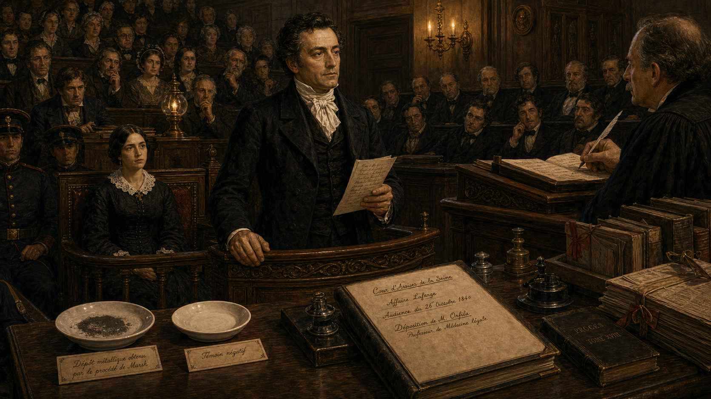

Image Prompt

(This is Panel 10. Do not include the panel number in the image.)
Make the characters and style consistent with the prior panels.
Please generate a 16:9 image in Romantic-era / early Victorian French academic oil-painting style, candlelit chiaroscuro, rich detail depicting panel 10 of 10. The scene is a montage-style composition divided into three overlapping vignettes within one 16:9 frame, all rendered in the same warm candlelit oil-painting style. Left vignette: a young 1840s student in a university lecture hall, carefully copying a diagram of the Marsh test apparatus from a blackboard while other students do the same. Center vignette: Mathieu Orfila — lean, silver-templed, dignified in his black frock coat — seated at his university desk in Paris surrounded by stacked volumes of the Traité des Poisons, his portrait by an unseen painter just visible in the upper right corner. Right vignette: a stylized view of a modern-looking (but still Romantic-era illustrated in style) forensic laboratory, with a row of glass vessels, a balance scale, and an open casebook — a symbolic nod to the laboratories that followed. In the background across all three vignettes, faint text in period type reads: "Toxicologie." The color palette is unified warm amber, ivory, copper, and deep shadow. Emotional tone: legacy, continuity, quiet triumph. At least six visual details: the Marsh test diagram on the chalkboard, the stacked volumes of the Traité des Poisons, the balance scale in the laboratory vignette, the portrait in the corner, a quill and inkwell on Orfila's desk, and a single metallic mirror on a porcelain dish glinting in the candlelight.
Generate the image immediately without asking clarifying questions.

Marie Lafarge was convicted and sentenced to life imprisonment with hard labor — a verdict that divided France for decades and is still debated by historians today. What was not debatable was the effect of Orfila's testimony on the legal system. Within a generation, courts across Europe and North America expected forensic scientists to be present at major poisoning trials. The impartial expert witness — someone who worked for neither prosecution nor defense but for the truth — had become a permanent fixture of the modern courtroom.

---

### Epilogue – What Made Orfila Different?

Orfila's greatest contribution was not a single test or a single trial. It was a set of habits: measure carefully, run controls, document everything, and never overstate what the evidence shows. He insisted that a toxicologist's first loyalty was to accuracy, not to the side that called them to the stand. In an era when courtroom experts routinely told juries whatever the paying party wanted to hear, that stance was radical. The principles he modeled are written into the ethics codes of forensic scientists to this day.

| Challenge | How Orfila Responded | Lesson for Today |
|---|---|---|
| No reliable chemical test for arsenic | Ran systematic, documented experiments with controls to validate methods | Forensic methods must be validated before courtroom use |
| Local chemists produced contradictory results | Repeated tests under controlled conditions with blank controls alongside each specimen | Controls are not optional — they are what separates science from guesswork |
| Pressure to deliver a dramatic verdict | Stated only that results were "consistent with" arsenic presence; explained limitations openly | Expert witnesses serve the truth, not the party that hired them |
| Toxicology had no textbook or common language | Published the *Traité des Poisons*, systematizing the field | A science that cannot be taught and replicated is not yet a science |

---

### Call to Action

The next time you hear the word "toxicology" — in a news story, a courtroom drama, or a forensic science class — remember that this discipline did not exist before one determined young doctor from Menorca decided that poison should no longer be undetectable. Consider what other areas of human knowledge are still waiting for someone to apply the same rigor. Science advances when individuals refuse to accept that an important question simply cannot be answered.

---

*"The duty of the expert witness is not to serve the party by whom he is called, but to assist the court in the investigation of truth."*
—Mathieu Orfila

*"It is not sufficient to detect a substance in the organs; one must establish by rigorous experiment that the method employed is capable of revealing that substance and no other."*
—Mathieu Orfila

---

## References

1. [Mathieu Orfila — Wikipedia](https://en.wikipedia.org/wiki/Mathieu_Orfila) — Biographical overview of Orfila's life, work, and role in founding forensic toxicology, including the Lafarge trial.
2. [Marsh test — Wikipedia](https://en.wikipedia.org/wiki/Marsh_test) — Explanation of the chemical principles, apparatus, and forensic history of the arsenic detection test Orfila used at the Lafarge trial.
3. [Marie Lafarge — Wikipedia](https://en.wikipedia.org/wiki/Marie_Lafarge) — Detailed account of the 1840 poisoning trial, including Orfila's involvement as expert witness and the controversy that followed.
4. [Mathieu Orfila — Encyclopaedia Britannica](https://www.britannica.com/biography/Mathieu-Orfila) — Concise scholarly biography covering Orfila's major publications, his professorship in Paris, and his significance to forensic medicine.
5. [The History of Forensic Toxicology — National Library of Medicine / PMC](https://pmc.ncbi.nlm.nih.gov/articles/PMC4768627/) — Peer-reviewed historical survey of forensic toxicology's development, with substantial discussion of Orfila's foundational contributions.
