# Reasonable Doubt

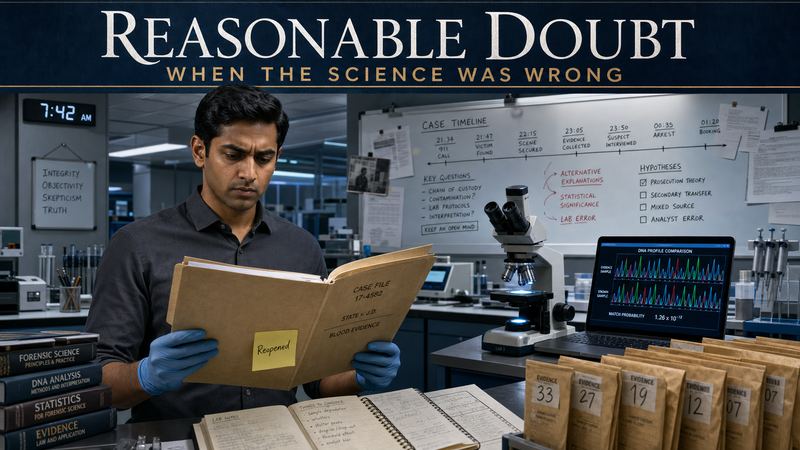

Cover Image Prompt

(This is the Cover Image. Do not include this label in the image.)
A contemporary photorealistic illustration serving as the cover of a forensic science graphic novel titled "Reasonable Doubt." The central figure is Dev, a South Asian man in his early thirties with short black hair, clean-shaven, wearing a pressed charcoal dress shirt and nitrile gloves, standing in a modern forensic laboratory. He holds an open manila case file folder under cool white LED overhead lights. Behind him, a sleek lab bench displays a compound microscope, a laptop screen showing a DNA electropherogram trace, and rows of sealed evidence envelopes. On the far wall, a whiteboard is covered with handwritten notes and a timeline. The title text "Reasonable Doubt" appears at the top of the image in a clean, serious serif typeface in white against a deep slate-blue band. A subtitle reads "When the Science Was Wrong." Color palette: cool slate blue, forensic white, steel grey, with a single warm amber accent from the open case folder. Emotional tone: serious, determined, quietly urgent. At least six specific visual details: the glowing DNA electropherogram on the laptop, a sticky note on the folder reading "Reopened," the microscope stage lit with a cool blue-white ring light, sealed brown evidence envelopes numbered in black marker, a wall clock reading 7:42 AM, and Dev's furrowed brow as he reads.
Generate the image immediately without asking clarifying questions.

Narrative Prompt

This is a 10-panel fictional graphic novel set in the present day at a modern regional forensic science laboratory and an appeals courtroom in the United States. The story is entirely fictional but is grounded in real documented history: the 2009 National Academy of Sciences report "Strengthening Forensic Science in the United States," which questioned the scientific validity of many forensic disciplines, and the 2015 FBI/Department of Justice review that found forensic examiners had overstated microscopic hair comparison "matches" in the vast majority of reviewed cases, contributing to wrongful convictions. Several wrongful convictions based on overstated hair testimony have since been vacated following mitochondrial DNA testing.

The fictional characters are: Dev, a conscientious South Asian forensic analyst in his early thirties (short black hair, clean-shaven, charcoal or navy dress shirts, nitrile gloves in lab scenes); Marcus, a fictional exoneree in his late fifties (grey-streaked close-cropped hair, lean build, dignified bearing, casual clothing); and Elena, a defense attorney in her mid-forties (dark curly hair pulled back, dark blazer, reading glasses worn on a chain). No real exoneree's name is used.

Art style for all panels: contemporary photorealistic illustration, courtroom and laboratory settings, cool restrained palette. Color palette throughout: cool slate blue, forensic white, steel grey, and warm amber accents in courtroom and file-review scenes. No graphic violence, wounds, crime-scene gore, or victim imagery of any kind — depict only the laboratory, microscopes, evidence files, courtroom, and human faces and emotions.

Character consistency: Dev always appears with short black hair, clean-shaven, charcoal or navy dress shirt, gloves in lab scenes; Marcus always appears lean with grey-streaked close-cropped hair and a quiet dignity; Elena always appears with dark curly hair and a dark blazer. Props recur: the manila case folder with a "Reopened" sticky note, the compound microscope, the DNA electropherogram laptop screen, the courtroom evidence placard, and the heavy oak appellate courtroom doors.

The tone throughout is measured, educational, and quietly urgent — the tension of discovering institutional failure, the moral courage of admitting it, and the irreplaceable value of scientific self-correction.

### Prologue – A File That Should Have Stayed Closed

Late on a Tuesday morning, Dev slid a manila folder out of a metal storage cabinet in the regional forensic lab's cold-case unit. The folder was thin and older than his career. Someone had stapled a single typed note to the inside cover: "Conviction based primarily on hair examination testimony." Dev set the folder on his bench under the white LED light and opened it. He did not know yet that this folder was about to cost him several sleepless nights — or that fixing what he found inside would be the most important work of his professional life.

---

## Panel 1: The Cold Case File

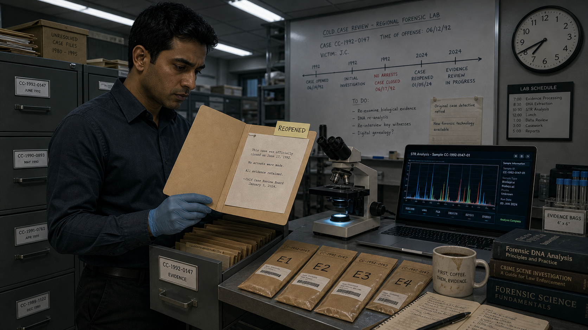

Image Prompt

(This is Panel 01. Do not include the panel number in the image.)
I am about to ask you to generate a series of images for a graphic novel. Please make the images have a consistent style and consistent characters. Do not ask any clarifying questions. Just generate the image immediately when asked.
Please generate a 16:9 image in contemporary photorealistic illustration, courtroom and laboratory settings, cool restrained palette depicting panel 1 of 10. The scene is a modern forensic laboratory cold-case storage room, early morning. Dev — a South Asian man in his early thirties, short black hair, clean-shaven, wearing a charcoal dress shirt and nitrile gloves — stands beside a row of grey metal filing cabinets under cool white LED overhead lighting. He has just pulled open a manila folder and is reading its interior under the light. A typed note is visibly stapled to the inside cover. The bench beside him holds a compound microscope with a cool blue-white ring light, a laptop showing a DNA analysis interface, and a row of sealed brown evidence envelopes numbered in black permanent marker. A clock on the wall reads 7:42 AM. A whiteboard in the background is covered with handwritten case notes and a linear timeline. Color palette: cool slate blue, forensic white, steel grey, warm amber from the open folder. Emotional tone: focused curiosity tinged with unease. At least six specific visual details: the "Reopened" sticky note on the folder's tab, the dim glow of the laptop's DNA trace screen, the metal filing cabinet drawer left open behind Dev, a half-finished coffee cup at the bench corner, overhead fluorescent light tubes in a drop ceiling, and the hint of older typewritten text visible on the interior note.
Generate the image immediately without asking clarifying questions.

The case was twenty-three years old. A man named Marcus had been convicted of a burglary and assault based largely on the word of one expert: a forensic examiner who told the jury that a microscopic hair recovered at the scene "matched" Marcus with what the examiner called near-certainty. There had been no DNA testing — the technology existed but was not applied. Marcus had maintained his innocence from day one, exhausted his appeals, and eventually been released on parole after serving eighteen years. The case had never been formally re-examined. Dev spread the contents of the folder on his bench and read every page.

---

## Panel 2: The Old Testimony

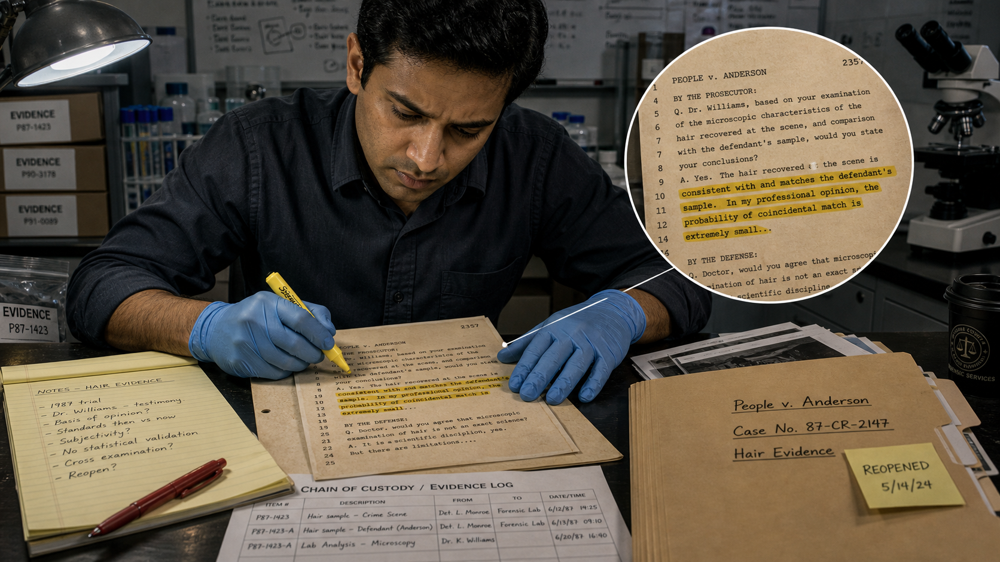

Image Prompt

(This is Panel 02. Do not include the panel number in the image.)
Make the characters and style consistent with the prior panels.
Please generate a 16:9 image in contemporary photorealistic illustration, courtroom and laboratory settings, cool restrained palette depicting panel 2 of 10. The scene depicts Dev seated at a laboratory desk, leaning close over a photocopy of a decades-old trial transcript. The transcript pages are slightly yellowed and covered in dense typed text. Dev uses a yellow highlighter to mark a specific passage, his brow furrowed. A zoomed-in inset view shows the highlighted transcript text reading: "...the hair recovered at the scene is consistent with and matches the defendant's sample. In my professional opinion, the probability of coincidental match is extremely small..." Dev's expression shows quiet alarm. The desk is organized with a legal pad of handwritten notes, a red pen, and the open manila case folder. The lab's cool white overhead lighting casts sharp shadows. A second document — a chain-of-custody evidence log — is partially visible under the transcript. Color palette: cool white desk surface, aged ivory transcript paper, yellow highlight accent, steel-grey surroundings. Emotional tone: growing unease, the recognition of a serious problem. At least six visual details: the yellow highlighter marks on the transcript text, Dev's nitrile-gloved right hand pressing flat on the page, the handwritten margin notes on the legal pad, the chain-of-custody log partially visible, the case file folder tab with "Reopened" sticky note, and the cool LED light casting a shadow from Dev's bent head.
Generate the image immediately without asking clarifying questions.

The trial transcript was unambiguous and deeply troubling. The original forensic examiner had testified that the questioned hair "matched" Marcus's reference sample, and had gone further — using language like "consistent with to a near-certainty" and "extremely unlikely to be coincidental." Dev read those phrases twice. He recognized the problem immediately: microscopic hair comparison is class evidence. It can narrow a pool of possible sources, but it cannot identify one unique individual. The original examiner had presented it as though it could, and the jury had believed them. That gap between what the science actually shows and what the jury was told was not a minor discrepancy. It was the entire case.

---

## Panel 3: The 2009 Reckoning

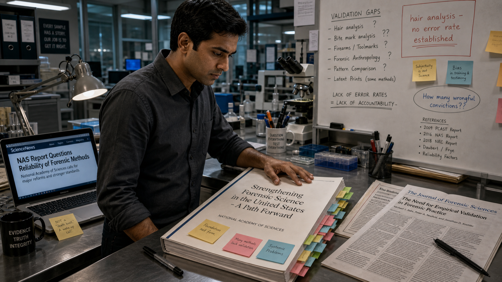

Image Prompt

(This is Panel 03. Do not include the panel number in the image.)
Make the characters and style consistent with the prior panels.
Please generate a 16:9 image in contemporary photorealistic illustration, courtroom and laboratory settings, cool restrained palette depicting panel 3 of 10. The scene shows Dev at a standing workstation in the forensic laboratory, reading a large printed research report on the bench in front of him. The report's cover is clearly visible and reads "Strengthening Forensic Science in the United States — A Path Forward, National Academy of Sciences." The document is thick, its pages marked with colored sticky tabs. Dev has his laptop open beside it, showing a webpage article with a headline partially visible: "NAS Report Questions Reliability of Forensic Methods." Post-it notes in yellow and blue cover sections of the report. A highlighter and several pens are scattered nearby. The lab whiteboard in the background now shows additional notes with question marks and references to "hair analysis" and "error rates." Color palette: cool slate blue and forensic white, warm accent of the sticky tabs, deep navy of the report cover. Emotional tone: grim recognition, the weight of institutional failure. At least six visual details: the thick National Academy of Sciences report cover visible in full, colored sticky-note tabs marking multiple sections, Dev's open hand pressing on one page, the laptop screen showing a news headline, the whiteboard notes with "hair analysis — no error rate established" written in red marker, and a second printed article folded beside the report.
Generate the image immediately without asking clarifying questions.

Dev had studied the 2009 National Academy of Sciences report in graduate school, but reading it again now, with Marcus's folder open beside it, it landed differently. The NAS had surveyed the state of forensic science across disciplines and found serious gaps: many methods lacked rigorous scientific validation, error rates were undefined, and courtroom testimony routinely outran what the underlying science could support. Hair analysis was specifically named. The report had been a call to reform — to bring forensic practice into alignment with scientific standards. Dev looked at the date on the transcript. The conviction predated the report by more than a decade. The examiner had not been a bad person; they had simply repeated what everyone in the field was doing at the time. That, Dev thought, was the most disturbing part.

---

## Panel 4: The FBI Review

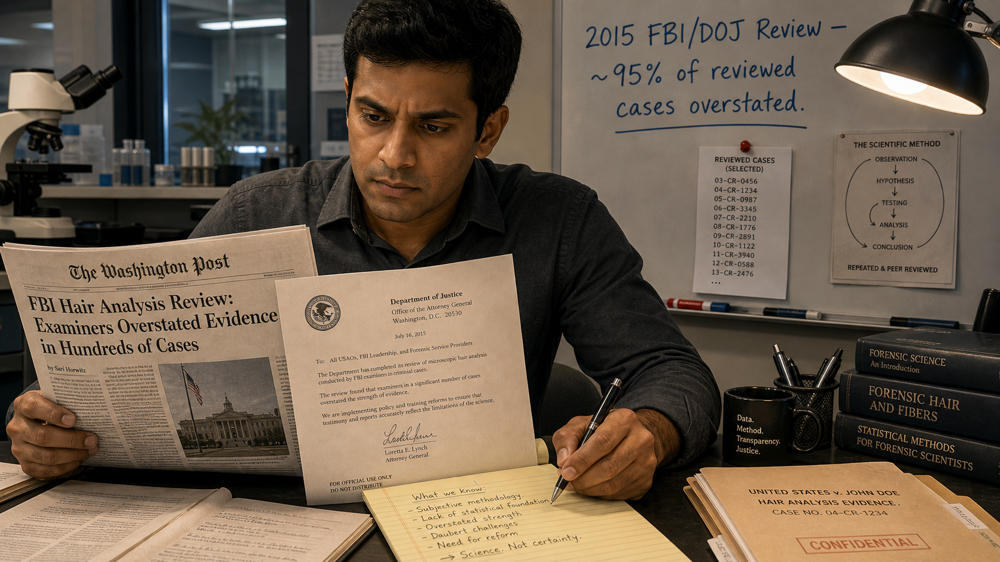

Image Prompt

(This is Panel 04. Do not include the panel number in the image.)
Make the characters and style consistent with the prior panels.
Please generate a 16:9 image in contemporary photorealistic illustration, courtroom and laboratory settings, cool restrained palette depicting panel 4 of 10. The scene shows Dev sitting at his lab desk, reading a printed news article and a government document side by side. The news article's headline is partially visible and reads "FBI Hair Analysis Review: Examiners Overstated Evidence in Hundreds of Cases." The government document beside it shows a Department of Justice letterhead. Dev's expression has shifted from unease to resolved determination. He has a legal pad open and is writing bullet points with a pen. The manila case folder is open at the edge of the desk. On the whiteboard behind him, new text has been added in blue marker: "2015 FBI/DOJ Review — ~95% of reviewed cases overstated." A second printed document — a list of case numbers — is pinned to the board with a red pushpin. Color palette: cool white and steel grey dominant, navy blue accent from the DOJ document header, warm amber from the case folder. Emotional tone: determined gravity, the point where concern hardens into responsibility. At least six visual details: the visible DOJ letterhead on the government document, the handwritten bullet points on Dev's legal pad, the whiteboard statistic in blue marker, the red pushpin on the case list, the open manila folder at the desk edge, and Dev's pen moving across the legal pad.
Generate the image immediately without asking clarifying questions.

In 2015, the FBI and the Department of Justice launched a formal review of microscopic hair analysis testimony in cases where FBI examiners had testified. The results had shaken the field: in the vast majority of cases reviewed, examiners had made statements that exceeded what the science supported — overstating the significance of "matches," failing to disclose error rates, or implying near-certainty where none existed. The review had prompted notifications to defendants across the country. Dev checked the notification list against Marcus's case number. There was no record of any notification ever reaching Marcus's legal team. Dev put down his pen and looked at the ceiling for a long moment. Then he reached for the evidence envelope.

---

## Panel 5: The Hair Under the Microscope

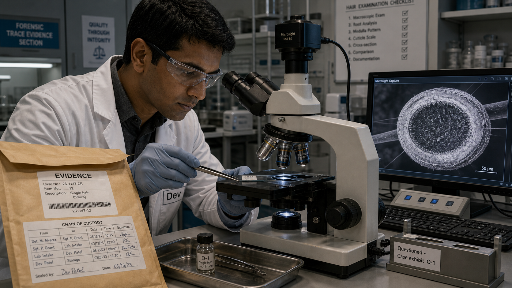

Image Prompt

(This is Panel 05. Do not include the panel number in the image.)
Make the characters and style consistent with the prior panels.
Please generate a 16:9 image in contemporary photorealistic illustration, courtroom and laboratory settings, cool restrained palette depicting panel 5 of 10. The scene shows Dev in the forensic laboratory at the microscope workstation. He is wearing a white lab coat over his charcoal shirt and fresh nitrile gloves, and is carefully placing a prepared microscope slide onto the stage of a modern compound microscope using fine-tipped forceps. A sealed brown evidence envelope is open beside him, its chain-of-custody label visible. On the bench to his right, a second microscope slide holder is labeled "Questioned — Case exhibit Q-1." A small glass vial containing the original questioned hair sample is visible in a metal evidence tray. The microscope's eyepiece and objective are visible; a digital camera port connects the microscope to a monitor showing a magnified hair cross-section view in shades of grey. Color palette: cool forensic white and steel grey, blue-white ring light glow from the microscope stage, amber from the evidence envelope. Emotional tone: methodical precision, focused attention. At least six visual details: the chain-of-custody label on the evidence envelope, the magnified hair cross-section on the monitor screen, the forceps gripping the slide edge, the evidence tray with the glass vial, the compound microscope's objective turret showing multiple magnification lenses, and Dev's focused expression through his safety glasses.
Generate the image immediately without asking clarifying questions.

The original questioned hair was still in the evidence archive, properly sealed under chain of custody. Dev prepared it for examination under the compound microscope, then submitted a portion of it — following strict protocols — for mitochondrial DNA analysis. Mitochondrial DNA testing works differently from nuclear DNA: it is inherited maternally and is present in high copy numbers, making it recoverable from shed hairs that lack a root. It cannot uniquely identify an individual the way nuclear DNA can, but it can definitively exclude one. If the hair belonged to someone whose mitochondrial DNA sequence differed from Marcus's, the hair did not come from Marcus. The result would not be a "match" in either direction — it would be an exclusion or a non-exclusion. That distinction, Dev knew, was everything.

---

## Panel 6: The Exclusion

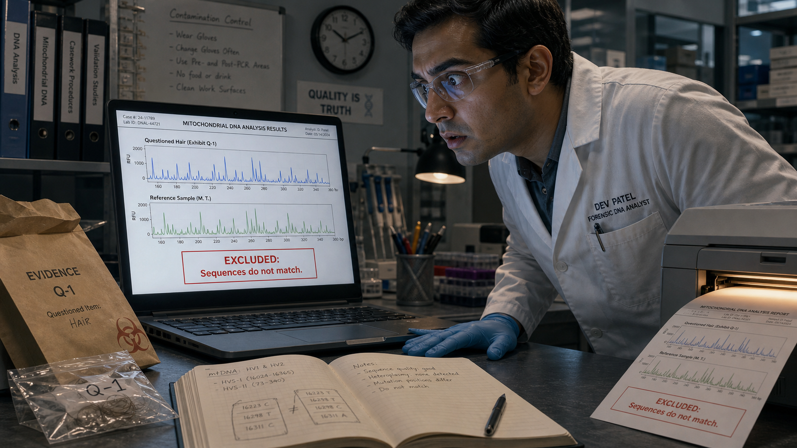

Image Prompt

(This is Panel 06. Do not include the panel number in the image.)
Make the characters and style consistent with the prior panels.
Please generate a 16:9 image in contemporary photorealistic illustration, courtroom and laboratory settings, cool restrained palette depicting panel 6 of 10. The scene shows Dev standing at his laboratory workstation, staring intently at a laptop screen showing a DNA analysis results page. The screen displays two mitochondrial DNA electropherogram traces stacked vertically: the top trace labeled "Questioned Hair (Exhibit Q-1)" and the bottom trace labeled "Reference Sample (M. T.)." The two traces are visibly different — their peak patterns do not align — and a red annotation box on the screen reads "EXCLUDED: Sequences do not match." Dev's gloved hand is pressed flat on the bench beside the laptop; his posture is tense, eyes wide with the significance of what he sees. A printout is emerging from a lab printer at the edge of the bench. Color palette: cool slate-blue lab environment, the warm amber glow of the printer light, the crisp white of the laptop screen, with the red annotation box as a focal accent. Emotional tone: stunned revelation, the weight of a life-altering result. At least six visual details: the two non-matching electropherogram traces on screen, the red "EXCLUDED" annotation box, the printout emerging from the printer, Dev's pressed-flat hand on the bench, the evidence envelope still open beside the laptop, and the reflection of the screen glow on Dev's safety glasses.
Generate the image immediately without asking clarifying questions.

The mitochondrial DNA result came back within the week. The sequence extracted from the questioned hair — the hair that had helped send Marcus to prison for eighteen years — did not match Marcus's reference sample. The hair was an exclusion. Whatever biological source it came from, it was not Marcus. Dev read the report three times, cross-checked the quality metrics, and consulted the lab's technical leader. The result was solid and reproducible. The hair did not come from Marcus. The forensic evidence that the original jury had been told was near-certain proof was, in fact, evidence that pointed away from him. Dev sat at his bench for a long time with the lights humming above him before he picked up the phone.

---

## Panel 7: The Hard Report

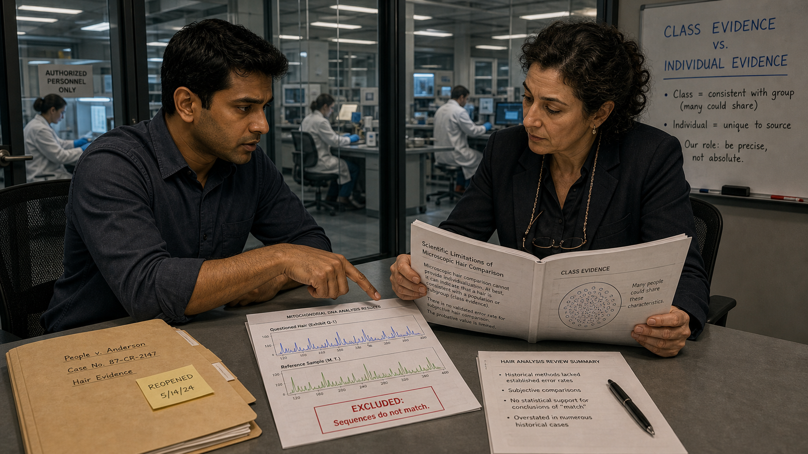

Image Prompt

(This is Panel 07. Do not include the panel number in the image.)
Make the characters and style consistent with the prior panels.
Please generate a 16:9 image in contemporary photorealistic illustration, courtroom and laboratory settings, cool restrained palette depicting panel 7 of 10. The scene shows Dev seated at a conference table in a small, glass-walled meeting room inside the forensic laboratory. Across the table is a woman — Elena, a defense attorney in her mid-forties with dark curly hair pulled back, wearing a dark blazer and reading glasses on a chain around her neck. She is leaning forward, reviewing a thick printed report. On the table between them: the open case folder, the DNA results printout, and a stapled summary document. Dev's posture is earnest and direct; he is pointing to a specific section of the report with his finger. The glass wall behind them shows the rest of the lab, with other analysts working at benches. A small whiteboard on the meeting-room wall has the words "Class Evidence vs. Individual Evidence" written in neat block letters. Color palette: cool grey-white meeting room, the warm amber of the folder, the deep navy of Elena's blazer. Emotional tone: serious, collaborative urgency, the shared weight of the discovery. At least six visual details: the DNA results printout on the table with visible electropherogram images, Elena's reading glasses on their chain, the whiteboard heading "Class Evidence vs. Individual Evidence," the case folder with the "Reopened" sticky note visible, Dev's pointing finger on the report page, and the glass partition showing the larger lab behind them.
Generate the image immediately without asking clarifying questions.

Dev contacted the Conviction Integrity Unit and a defense attorney named Elena, who had been seeking post-conviction review for Marcus for years. The meeting was not easy. Reporting that a case built in part on work from his own field contained scientifically unsupported testimony required Dev to put the finding in writing, under his professional signature, knowing exactly what it would mean. He explained the distinction between class evidence and individual evidence carefully: microscopic hair analysis can say that hairs share observable characteristics, placing them in the same broad category — it cannot say they came from the same person. The original examiner's testimony had crossed that line. And the mitochondrial DNA result crossed it definitively in the other direction. Dev handed Elena the report. She read the first page and looked up. "How long has this been sitting in storage?" she asked. Dev did not answer, because the answer was in the folder.

---

## Panel 8: The Appeals Court

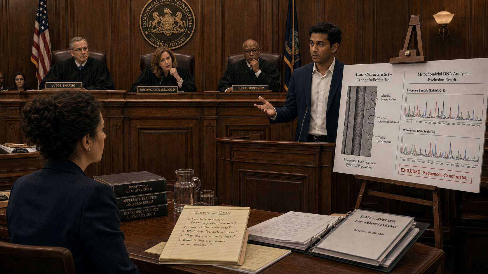

Image Prompt

(This is Panel 08. Do not include the panel number in the image.)
Make the characters and style consistent with the prior panels.
Please generate a 16:9 image in contemporary photorealistic illustration, courtroom and laboratory settings, cool restrained palette depicting panel 8 of 10. The scene is the interior of a formal appellate courtroom. Dev stands at the witness stand — a raised wooden enclosure — wearing a dark navy suit over a white dress shirt, no tie, looking calm and precise. He is gesturing toward a large evidence display board on an easel beside the stand. The board shows two side-by-side printed images: on the left, a labeled diagram of microscopic hair features titled "Class Characteristics — Cannot Individualize"; on the right, the two non-matching DNA electropherogram traces labeled "Mitochondrial DNA Analysis — Exclusion Result." Three robed appellate judges sit at an elevated bench in the background, one leaning forward with a question. Elena stands at the attorney's table in the foreground, facing Dev, a legal pad open in front of her. The courtroom has oak wood paneling, a state seal on the wall, and rows of spectator benches. Color palette: warm wood tones of the oak paneling contrasting with the cool slate-blue suits and robes, the white evidence board as a focal point. Emotional tone: formal gravity, measured authority, the careful weight of truth being placed on record. At least six visual details: the two-panel evidence board on the easel, the state seal on the wall above the judges' bench, Elena's legal pad with handwritten questions, one judge leaning forward with a question, the wooden witness stand enclosure, and the spectator benches in the background.
Generate the image immediately without asking clarifying questions.

Standing in the appellate courtroom, Dev presented the findings methodically. He explained what microscopic hair analysis can and cannot show — that it is a comparative technique producing class-level associations, not individual identifications, and that the original testimony's language of "near-certainty" had no scientific foundation. He cited the 2009 NAS report and the 2015 FBI/DOJ review. He explained the Daubert standard — the requirement that expert testimony rest on methods that are scientifically validated, with known and disclosed error rates — and noted that no accepted error rate for microscopic hair comparison had been established at the time of the original trial, or since. Then he presented the mitochondrial DNA result: the questioned hair excluded Marcus. The judges asked careful questions. Dev answered each one precisely, using the language of the science: "consistent with," "cannot exclude," "excludes." Never "proves." The word "proves" did not appear in his testimony once.

---

## Panel 9: Walking Free

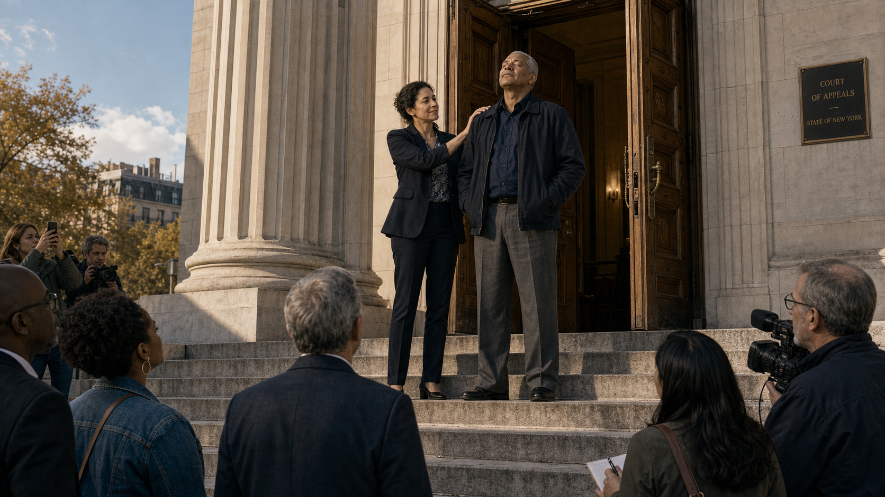

Image Prompt

(This is Panel 09. Do not include the panel number in the image.)
Make the characters and style consistent with the prior panels.
Please generate a 16:9 image in contemporary photorealistic illustration, courtroom and laboratory settings, cool restrained palette depicting panel 9 of 10. The scene is the wide stone steps outside the appellate courthouse on a clear afternoon. Marcus — a lean man in his late fifties with grey-streaked close-cropped hair and a quiet, dignified bearing, wearing a dark navy jacket and grey trousers — has just emerged through the heavy oak doors at the top of the steps. He is standing still for a moment, eyes closed, face tilted slightly upward, breathing in the open air. Elena, in her dark blazer, stands one step behind him, her hand briefly on his shoulder. A small group of people — supporters, a few journalists at a respectful distance — watches from the bottom of the steps. The courthouse facade of pale stone and columns is visible behind the figures. The afternoon light is clean and clear. Color palette: pale stone of the courthouse, afternoon warm light on Marcus's face, cool sky blue above, deep navy of both figures' clothing. Emotional tone: profound quiet, the immense emotional weight of freedom after injustice. At least six visual details: the heavy oak courthouse doors held open behind Marcus, Elena's hand on his shoulder, the small group at the bottom of the steps, afternoon light on Marcus's upturned face, stone courthouse columns on either side of the doors, and the empty step between Marcus and the bottom of the staircase — a symbolic threshold.
Generate the image immediately without asking clarifying questions.

The court vacated the conviction unanimously. The judges' written opinion noted that the original expert testimony had "materially overstated the evidentiary significance of the hair comparison result" and that the mitochondrial DNA exclusion constituted newly available scientific evidence that, properly presented at trial, might have produced a different verdict. Marcus walked out of the courthouse on a clear afternoon after twenty-three years of a wrongful conviction shadowing his life. He stood on the top step for a moment with his eyes closed, not moving, just breathing. Elena stood beside him. Dev was not there — he was back in the lab, writing the formal case review that would go into the file. But he had watched the live news broadcast on his phone, sitting at his bench, and he had felt something settle in his chest that had been tight since the morning he first opened the folder.

---

## Panel 10: What Science Owes

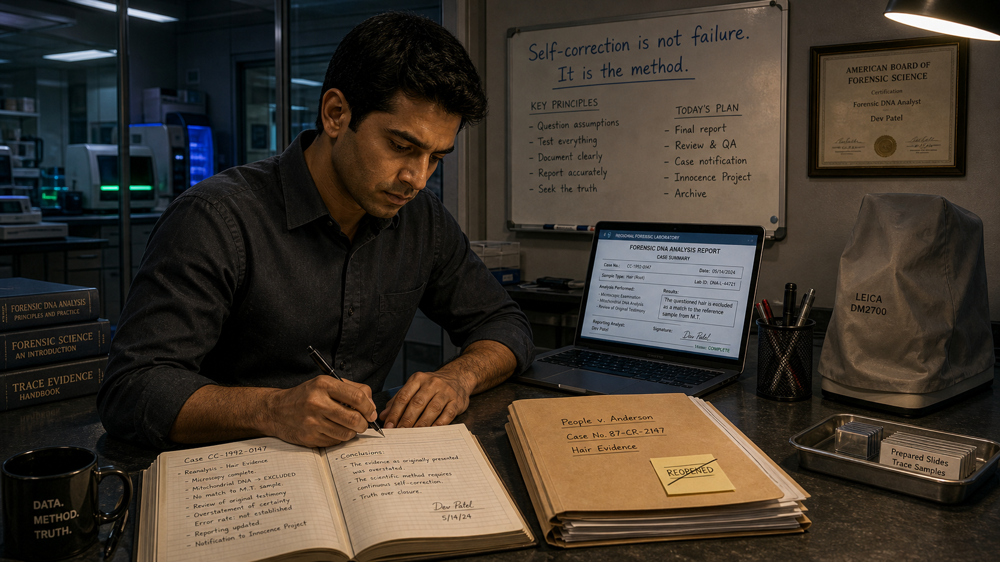

Image Prompt

(This is Panel 10. Do not include the panel number in the image.)
Make the characters and style consistent with the prior panels.
Please generate a 16:9 image in contemporary photorealistic illustration, courtroom and laboratory settings, cool restrained palette depicting panel 10 of 10. The scene returns to the forensic laboratory, evening. Dev is alone at his bench under warm overhead light, writing in a lab notebook by hand. The bench is organized: the manila case folder is closed and neatly stacked, the "Reopened" sticky note now crossed off with a single line. The compound microscope is covered. The laptop screen shows a completed report form. On the whiteboard behind him, the prior notes have been updated; now the top line reads, in clean printed letters: "Self-correction is not failure. It is the method." A framed professional certificate is visible on the wall beside the whiteboard. Through the laboratory's glass partition, the rest of the empty lab is lit by standby instrument lights in blue and green. Color palette: warm amber of the evening overhead light contrasting with the cool blue-green standby glow through the partition, the white notebook page as a focal point. Emotional tone: quiet resolution, earned calm, the peace of having done a necessary and difficult thing. At least six visual details: the whiteboard statement in clean printed letters, the closed and crossed-off case folder, the microscope under its cover, the completed report on the laptop screen, the framed professional certificate on the wall, and the blue-green glow of standby instrument lights through the glass partition.
Generate the image immediately without asking clarifying questions.

Dev finished the formal case review that evening and filed it. He then drafted a recommendation to the lab's quality assurance team: that all cases in the archive with convictions resting primarily on pre-2009 microscopic hair analysis testimony be identified and systematically reviewed for potential re-testing. It was more work — a lot more work — and he knew some of his colleagues would find it uncomfortable. Science admitting it had gotten something wrong is never a simple event; it carries consequences for real people, for professional reputations, for institutions. But those consequences, Dev believed, were not a reason to look away. They were the reason to look more carefully. He closed the notebook, capped the pen, and switched off the bench light.

---

### Epilogue – The Bravest Thing a Scientist Can Do

Science is not a collection of certainties — it is a process of testing, correcting, and refining. When that process works, it produces something more reliable than any single expert's confidence ever could. When it fails — when a method is presented as more certain than the evidence supports, when error rates go unstated, when a jury hears "near-certainty" where the science only allows "consistent with" — the consequences fall on real people who did not choose to be part of the experiment. The bravest thing a forensic scientist can do is look at a case that went wrong, tell the truth about why, and refuse to look away. That is not a betrayal of the field. That is the field working exactly as it should.

| The Old Certainty | What the Science Actually Showed | Lesson for Today |
|---|---|---|
| Microscopic hair "match" presented as near-certain identification | Hair microscopy produces class associations, not individual identifications; no validated error rate existed | Expert testimony must stay within validated scientific limits; class evidence is not identification evidence |
| Confidence of the examiner treated as a proxy for scientific certainty | Examiner confidence is not a scientific measurement; the Daubert standard requires validated methods with known error rates | Courts and juries must evaluate the method, not just the witness's certainty |
| DNA testing not applied because it was unfamiliar or unavailable | Mitochondrial DNA analysis can exclude a contributor; exclusion is as powerful as inclusion | New validated methods must be applied to old convictions when they can speak to the evidence |
| Institutional silence after the 2009 NAS report and 2015 review | Many defendants were never notified that the basis for their conviction had been formally questioned | Forensic agencies have an ethical obligation to act on known scientific failures, not merely acknowledge them |

---

### Call to Action

Every case built on forensic evidence deserves a foundation of validated science with disclosed error rates and honest, bounded testimony. If you are studying forensic science, learn the difference between what a method can show and what a witness says it can show — that gap is where injustice lives. The reform of forensic practice is ongoing, and it depends on scientists who are willing to say, plainly and on the record, when the science was not good enough.

---

*"The report doesn't say we failed. It says we found out we were wrong and we fixed it. That's not the same thing."*
*—Dev*

*"I spent twenty years learning to say what the evidence can't tell you. That's the hardest sentence in forensic science: I don't know. It's also the most important one."*
*—Dev*

---

## References

1. **Microscopic hair comparison — Wikipedia**: Overview of the history, scientific limitations, and legal consequences of microscopic hair analysis as forensic evidence, including the 2015 FBI/DOJ review.
   <https://en.wikipedia.org/wiki/Microscopic_hair_comparison>

2. **Daubert standard — Wikipedia**: Explanation of the federal legal standard governing the admissibility of expert testimony, requiring scientific validity and known error rates.
   <https://en.wikipedia.org/wiki/Daubert_standard>

3. **Innocence Project — Wikipedia**: Background on the organization that has used DNA testing to exonerate more than 200 wrongfully convicted people in the United States, many of whose convictions involved flawed forensic evidence.
   <https://en.wikipedia.org/wiki/Innocence_Project>

4. **"Strengthening Forensic Science in the United States: A Path Forward" (2009) — National Academies Press**: The full text of the landmark 2009 National Academy of Sciences report that systematically evaluated forensic science disciplines and found widespread gaps in scientific validation, including for hair analysis.
   <https://nap.nationalacademies.org/catalog/12589/strengthening-forensic-science-in-the-united-states-a-path-forward>

5. **FBI/DOJ Microscopic Hair Comparison Analysis Review — FBI.gov**: The official FBI page describing the 2015 review of microscopic hair analysis testimony, which found that examiners overstated evidence in a substantial majority of reviewed cases, and the resulting notification process for affected defendants.
   <https://www.fbi.gov/services/laboratory/scientific-analysis/fbidoj-microscopic-hair-comparison-analysis-review>
