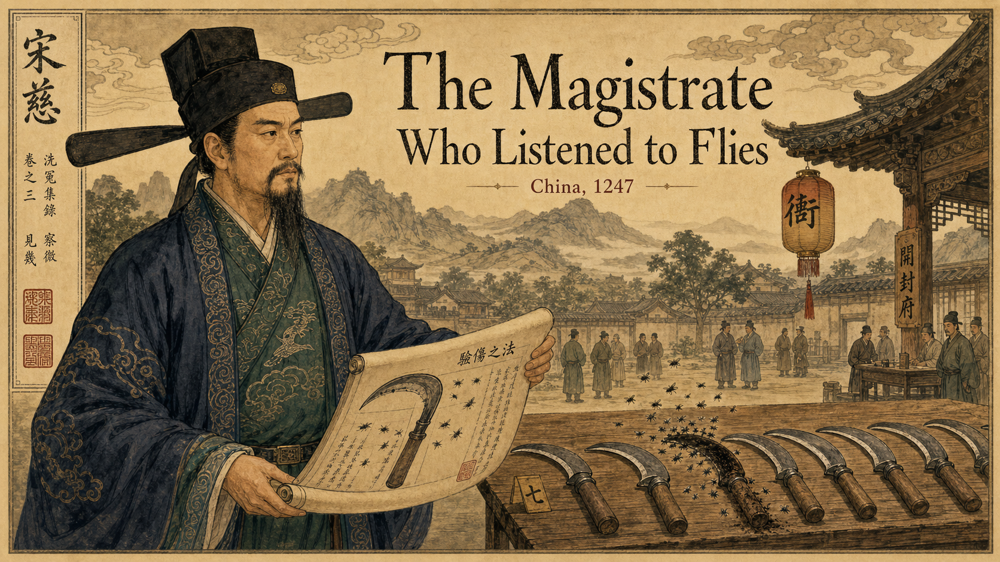
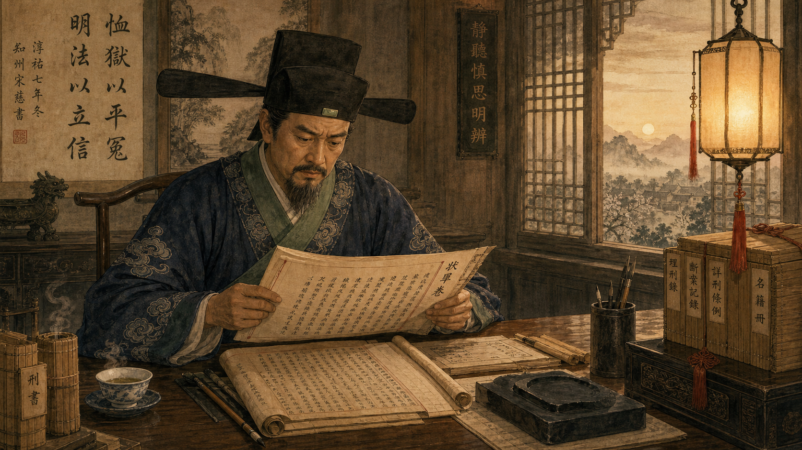
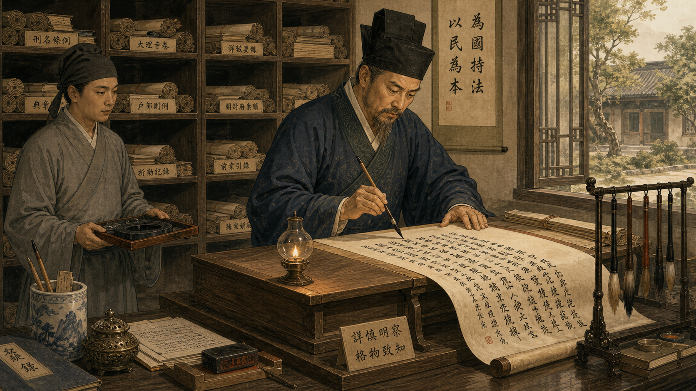
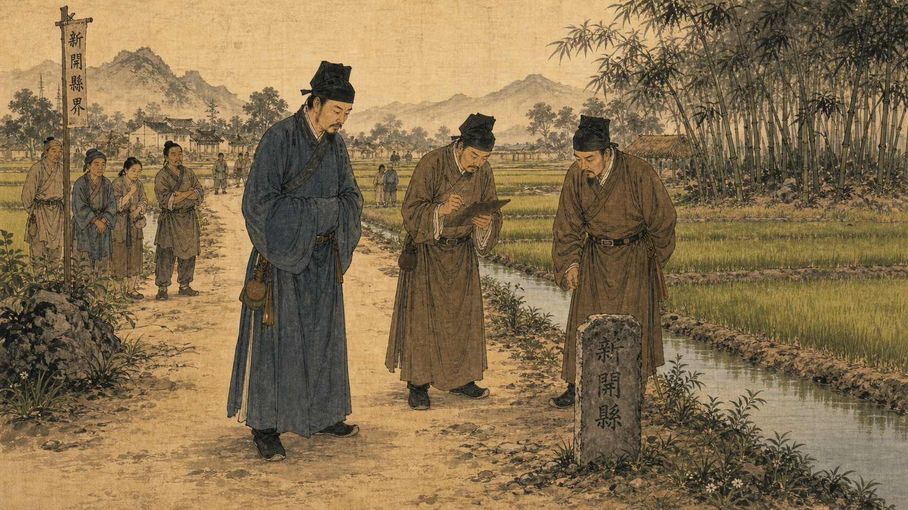
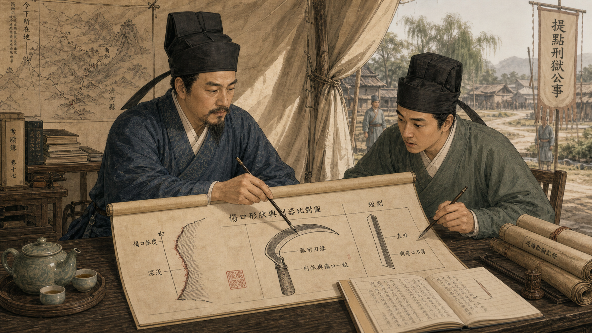
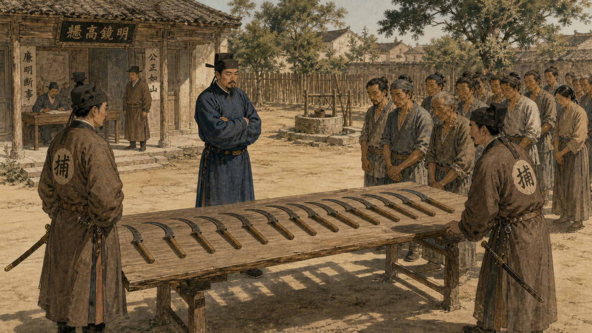
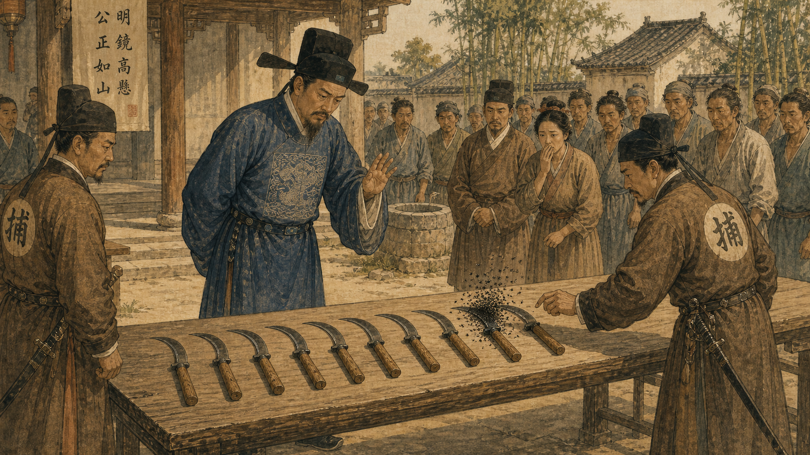
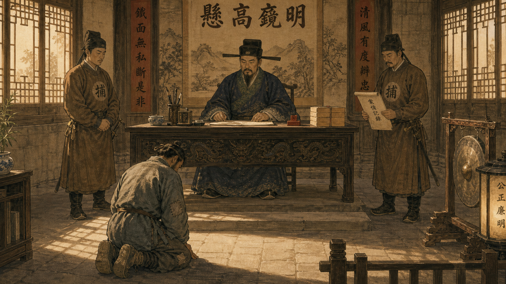
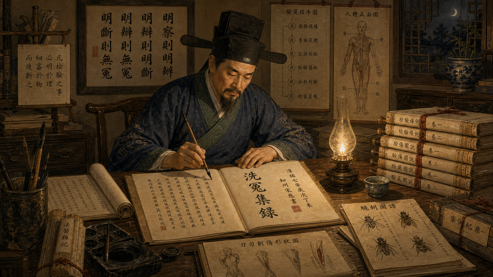
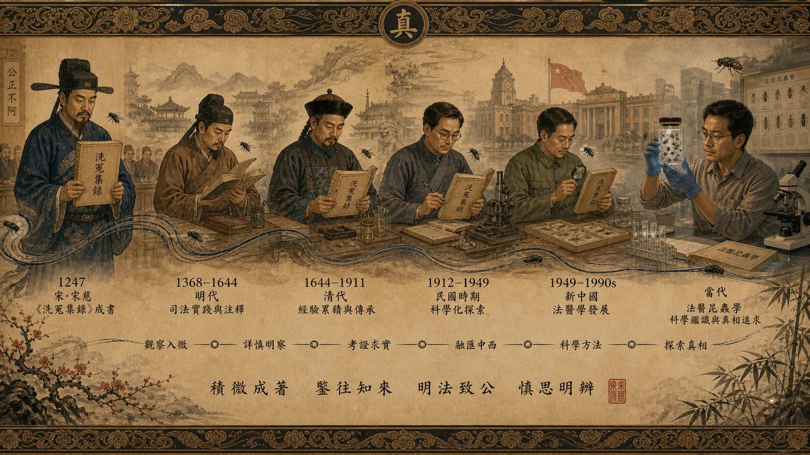

# The Magistrate Who Listened to Flies

Cover Image Prompt

(This is the Cover Image. Do not include this label in the image.)
A majestic cover illustration for a graphic-novel story titled "The Magistrate Who Listened to Flies." A Song Dynasty scholar-official in his fifties, Song Ci, stands in three-quarter view dressed in full court robes of deep indigo and jade green with a black gauze official's hat (futou). He holds an open hand-painted scroll, partially unfurled, revealing diagrams of a sickle and tiny flying insects. Behind him, a sunlit village courtyard shows a row of iron sickles laid on a wooden table in the foreground, with a cloud of dark blowflies hovering over one blade. The sky is pale gold with wisps of ink-brush clouds. The title text "The Magistrate Who Listened to Flies" appears in the upper portion in an elegant period-style Chinese-inspired serif typeface, accompanied by smaller text reading "China, 1247." Color palette: muted earth tones — ochre, rust, sage green, soft black ink washes, ivory parchment backgrounds. Tone: scholarly, suspenseful, respectful. Art style: classical Song Dynasty Chinese ink-and-brush painting, muted earth tones, delicate brushwork, scroll-like composition. Specific visual details: (1) Song Ci's official futou hat with two stiff side wings; (2) flowing robe hem with embroidered cloud patterns; (3) the single sickle with a visible cloud of dark flies distinguishing it from the others; (4) distant mountains drawn in the hazy ink-wash style of Song landscape painting; (5) a lantern with red tassel hanging from a roof eave; (6) calligraphy seals in the corner border. Generate the image immediately without asking clarifying questions.

Narrative Prompt

This graphic novel tells the true story of Song Ci (1186–1249), a judicial official and pioneering forensic investigator of Song Dynasty China. The era is 13th-century rural China; settings include dusty village roads, open courtyards with wooden tables, and the interior of a magistrate's office lit by paper lanterns. Song Ci appears consistently throughout all panels as a man in his forties to sixties: calm, observant expression, warm brown skin, high cheekbones, short grey-streaked beard, dressed in indigo and jade-green scholar-official robes with embroidered cloud hems and a black futou hat. The art style is classical Song Dynasty Chinese ink-and-brush painting — muted earth tones (ochre, rust, sage green, ivory, soft black ink washes), delicate precise brushwork, compositions that echo the elongated proportions of Song-era handscroll paintings. Every panel should feel like an illustration from an ancient Chinese manuscript brought to vivid life. Maintain character consistency and art style across all nine panels. Do not ask clarifying questions; generate each image immediately when asked.

### Prologue – A World Where Guessing Cost Lives

In 13th-century Song Dynasty China, a wrongful execution was not just a tragedy — it was a debt that the state owed to heaven itself. Yet courtrooms across the empire routinely produced verdicts built on assumption, confession under duress, and the unexamined word of local officials. Song Ci, born in Jianyang in 1186, watched these miscarriages of justice accumulate over a long career as a magistrate and judicial official. He believed the remedy was not harsher laws or sterner judges, but something far more radical: a systematic, written method for examining the physical world — one that forced investigators to look before they concluded.

---

## Panel 1: A Magistrate Troubled by Wrongful Verdicts

Image Prompt

(This is Panel 1. Do not include the panel number in the image.)
I am about to ask you to generate a series of images for a graphic novel. Please make the images have a consistent style and consistent characters. Do not ask any clarifying questions. Just generate the image immediately when asked.

Please generate a 16:9 image in classical Song Dynasty Chinese ink-and-brush painting, muted earth tones, delicate brushwork, scroll-like composition depicting panel 1 of 9. The scene should include Song Ci — a Chinese scholar-official in his forties, calm and thoughtful expression, short grey-streaked beard, dressed in deep indigo official robes with embroidered cloud hems and a black futou hat — seated at a wide wooden writing desk in a lamp-lit magistrate's office in Song Dynasty China, circa 1230. He is reading a stack of legal case scrolls, his brow furrowed with concern. Beside him, a brush and inkstone. Through a latticed window behind him, a pale dawn sky glows. Color palette: muted ochre, rust, sage green, ivory parchment, soft black ink washes. The emotional tone should be somber and contemplative. Specific visual details: (1) the futou hat's two rigid black wing-extensions; (2) embroidered cloud motif on his robe sleeve; (3) stacked bamboo-strip scrolls on the desk edge; (4) a red-tasseled lantern casting warm light; (5) ink-wash style distant mountains visible through the window; (6) a teacup near his elbow, steam rising. Generate the image immediately without asking clarifying questions.

Song Ci had risen to become a judicial commissioner of the Southern Song court, responsible for reviewing capital cases across entire provinces. Case after case troubled him: confessions extracted by beatings, wounds misread by squeamish officials who examined victims only from a distance, and crucial physical evidence ignored entirely. He saw men condemned for crimes that the evidence — had anyone bothered to look — would have ruled out. "Better to let a guilty man go free than to condemn an innocent one," he would later write, but he was not content to let guilt go free either. He wanted a method that could find the truth reliably, in both directions.

---

## Panel 2: The Resolution — Evidence, Not Assumption

Image Prompt

(This is Panel 2. Do not include the panel number in the image.)
Please generate a 16:9 image in classical Song Dynasty Chinese ink-and-brush painting, muted earth tones, delicate brushwork, scroll-like composition depicting panel 2 of 9. Make the characters and style consistent with the prior panels. The scene should include Song Ci standing at a tall writing lectern in his official study, actively writing with a calligraphy brush on a long paper scroll that unrolls across the desk, his posture energized and purposeful. On shelves behind him are neatly stacked scrolls labeled with ink titles. An assistant in simpler grey robes stands nearby holding an inkstone tray. Setting: a well-ordered magistrate's scriptorium in Song Dynasty China, circa 1240. Color palette: muted ochre, sage green, ivory, rust, soft black ink. The emotional tone should be determined and focused. Specific visual details: (1) Song Ci's futou hat and indigo robes consistent with Panel 1; (2) calligraphic Chinese characters visible on the unfurled scroll he writes; (3) pigeonhole shelves filled with rolled documents; (4) a window showing a sunlit garden courtyard; (5) brush rack with multiple brushes of different sizes; (6) an oil lamp on the lectern illuminating his work. Generate the image immediately without asking clarifying questions.

Song Ci resolved to do what no one before him had done: compile every reliable forensic procedure he could find or devise into a single reference manual, so that any examining official — even an inexperienced one — would know exactly how to look at a wound, a body, a suspected poison, or a contested scene. He gathered centuries of scattered Chinese medical knowledge, interviewed experienced coroners, and began writing what would become the *Xǐ Yuān Jí Lù* (洗冤集錄) — "Collected Cases of Injustice Rectified," sometimes translated as "The Washing Away of Wrongs." He intended it to be a practical field guide, not a theoretical treatise, and he filled it with the kind of procedural specificity that separated observation from guesswork.

---

## Panel 3: The Case — A Man Found Slashed on a Rural Road

Image Prompt

(This is Panel 3. Do not include the panel number in the image.)
Please generate a 16:9 image in classical Song Dynasty Chinese ink-and-brush painting, muted earth tones, delicate brushwork, scroll-like composition depicting panel 3 of 9. Make the characters and style consistent with the prior panels. The scene should include Song Ci and two local officials in lower-rank brown robes standing on a dusty rural road lined with rice paddies, examining a scene respectfully from a short distance. No body is visible — instead the focus is on the three officials looking gravely at the ground near a road marker stone. Bystander villagers in simple peasant clothing observe from several meters away. Setting: a rural road in Song Dynasty China, summer morning, circa 1240s. Color palette: golden morning light, dusty ochre road, vivid green rice fields, muted ink tones. The emotional tone should be grave and attentive. Specific visual details: (1) Song Ci's indigo robes and futou hat; (2) road marker stone carved with characters; (3) irrigation channels between rice paddies; (4) bamboo grove in the background in ink-wash style; (5) a crow perched on a fence post; (6) one official writing observations on a portable wooden tablet. Generate the image immediately without asking clarifying questions.

A man had been found dead on a rural road not far from a farming village. The local constable's first assumption was robbery — a plausible verdict that would conveniently spare the village any deeper scrutiny. But when Song Ci reviewed the scene record, something did not fit: the wounds were clean, precise cuts, not the ragged slashes of a hurried roadside attack. Nothing of value had actually been confirmed missing. He ordered a proper physical examination of the wound characteristics, applying the systematic principles he had been codifying: look at the shape of a wound before deciding what made it.

---

## Panel 4: The Deduction — A Sickle, Not a Robber's Blade

Image Prompt

(This is Panel 4. Do not include the panel number in the image.)
Please generate a 16:9 image in classical Song Dynasty Chinese ink-and-brush painting, muted earth tones, delicate brushwork, scroll-like composition depicting panel 4 of 9. Make the characters and style consistent with the prior panels. The scene should include Song Ci seated at a field table examining a detailed diagram scroll showing the shape and curvature of a wound alongside an illustration of different blade types — a curved farm sickle prominently labeled, and a straight short sword. He points with his brush to the sickle diagram while a younger official leans in, understanding dawning on his face. Setting: a temporary outdoor official's tent near the village, daytime, Song Dynasty China. Color palette: muted ochre, sage, ivory, rust, ink wash. The emotional tone should be focused and revelatory. Specific visual details: (1) the diagram clearly shows a curved sickle outline matching a wound curve; (2) Song Ci's expression calm and methodical; (3) ink diagrams of blade shapes on the scroll visible to viewer; (4) a rolled canvas tent wall tied back to let in light; (5) the younger official's brush poised to take notes; (6) a teapot and cups on the corner of the field table. Generate the image immediately without asking clarifying questions.

The wound's arc matched the curved blade of a farming sickle — the tool of a field worker, not the straight short-sword a traveling robber would carry. This single observation transformed the investigation entirely: the killer was almost certainly someone local, someone who worked the land. Song Ci also noted that the nature of the cut was consistent with a deliberate swing rather than a frantic struggle, suggesting a perpetrator who had returned home calmly afterward, perhaps washing their tool. The evidence was not pointing toward a stranger on the road; it was pointing toward a neighbor.

---

## Panel 5: The Test — Every Villager Brings Their Sickle

Image Prompt

(This is Panel 5. Do not include the panel number in the image.)
Please generate a 16:9 image in classical Song Dynasty Chinese ink-and-brush painting, muted earth tones, delicate brushwork, scroll-like composition depicting panel 5 of 9. Make the characters and style consistent with the prior panels. The scene should include a wide village courtyard in bright summer sun, with a long wooden table or rack on which a dozen iron sickles have been laid out in a neat row. Farmers and villagers in simple peasant clothing stand in an orderly line at the side, having just deposited their tools. Song Ci stands at the head of the table in his official robes and futou hat, arms folded, watching. Two constables in brown official uniforms stand at either end of the table. Setting: a village gathering square, midday sun, Song Dynasty China, 1240s. Color palette: intense sunlight, bleached ochre earth, dusty grey-brown iron tools, muted green and brown clothing. The emotional tone should be tense and expectant. Specific visual details: (1) twelve or more sickles with curved blades laid flat in a row; (2) sunlight casting sharp shadows of the sickle handles; (3) villagers' anxious expressions; (4) Song Ci's authoritative but calm posture; (5) a well or water trough in the courtyard background; (6) a cockerel in the background near a fence. Generate the image immediately without asking clarifying questions.

Song Ci issued a direct order: every farmer in the village was to bring their sickle to the courtyard at midday and lay it on the communal table. No exceptions. The villagers obeyed — some bewildered, some uneasy — and soon a row of perhaps a dozen curved iron blades gleamed in the summer heat. Song Ci had offered no explanation for the order, and the silence in the courtyard as the blades were laid down one by one had the quality of a held breath. He stepped back and waited, knowing that nature — if given the right conditions — would soon do what no interrogation could.

---

## Panel 6: The Flies Testify

Image Prompt

(This is Panel 6. Do not include the panel number in the image.)
Please generate a 16:9 image in classical Song Dynasty Chinese ink-and-brush painting, muted earth tones, delicate brushwork, scroll-like composition depicting panel 6 of 9. Make the characters and style consistent with the prior panels. The scene should include the same courtyard table from Panel 5, now with a dramatic focal point: a dense, dark swarm of blowflies hovering and settling over exactly ONE sickle among the row of clean blades. The surrounding sickles have no flies at all. Villagers and officials stare at the single sickle in stunned silence. Song Ci leans slightly forward, expression unreadable but eyes sharp, one hand raised as if to say "observe." The flies should be rendered as an ink-wash cloud of tiny dark marks, slightly impressionistic, above the one blade. Setting: same sunlit village courtyard. Color palette: warm sunlight, dark ink-cloud of flies over the single blade, contrasting blank clean sickles. The emotional tone should be electrifying and revelatory — a moment of silent, undeniable proof. Specific visual details: (1) the swarm of flies rendered in detailed ink-brush stippling above one blade only; (2) the guilty sickle visually indistinguishable from the others to the human eye except for the flies; (3) one villager's hands visibly trembling at his sides; (4) Song Ci's sharp, attentive gaze directed at the sickle; (5) a constable's hand hovering near the guilty sickle ready to mark it; (6) a crow on the roof above watching the scene. Generate the image immediately without asking clarifying questions.

Within minutes, the blowflies arrived. They ignored eleven clean blades entirely and descended in a visible, unmistakable swarm on a single sickle near the end of the row. To the eye, that blade looked no different from its neighbors — its owner had cleaned it. But the flies detected microscopic traces of blood and organic matter that no amount of washing had fully removed. Blowflies are drawn to protein residues with a sensitivity that no human investigator of that era could match; they had no interest in politics or convenience. The courtyard fell into complete silence. Everyone present understood what they were seeing, including the man who had laid down that sickle.

---

## Panel 7: The Confession

Image Prompt

(This is Panel 7. Do not include the panel number in the image.)
Please generate a 16:9 image in classical Song Dynasty Chinese ink-and-brush painting, muted earth tones, delicate brushwork, scroll-like composition depicting panel 7 of 9. Make the characters and style consistent with the prior panels. The scene should include the interior of the village magistrate's receiving hall: a man in plain farmer's clothing is kneeling on the stone floor in a posture of submission before Song Ci, who sits elevated on the official's chair behind a wide official table. Two constables stand at respectful attention to either side. The farmer's head is bowed. Song Ci's expression is solemn and composed — neither triumphant nor cruel. Setting: a Song Dynasty magistrate's hall, late afternoon light through latticed windows, 1240s. Color palette: deep ochre walls, dark timber beams, warm lantern light, muted grey and brown clothing. The emotional tone should be solemn and serious, justice meeting its moment without gloating. Specific visual details: (1) official magistrate's table with carved dragons on the apron; (2) Song Ci's official seal and inkstone on the table; (3) the kneeling farmer's rough-woven clothing with patched knees; (4) a constable holding a written record scroll; (5) latticed wooden windows with afternoon light; (6) a ceremonial gong on a stand in the corner of the hall. Generate the image immediately without asking clarifying questions.

Faced with the silent, impartial testimony of the flies, the sickle's owner broke. He confessed to the killing — a dispute over a debt, not a robbery at all — and the full truth of the case came out without a single blow being struck in the interrogation room. Song Ci noted this outcome carefully: the flies had done what coercion could not, and had done it cleanly, without creating a false confession or condemning the wrong person. The method was the point. The flies were not magic; they were biology, operating according to reliable principles that any investigator could deliberately invoke again.

---

## Panel 8: Writing It All Down

Image Prompt

(This is Panel 8. Do not include the panel number in the image.)
Please generate a 16:9 image in classical Song Dynasty Chinese ink-and-brush painting, muted earth tones, delicate brushwork, scroll-like composition depicting panel 8 of 9. Make the characters and style consistent with the prior panels. The scene should include Song Ci in his official study late at night, surrounded by the accumulated materials of a life's work: open scrolls on the desk and floor, diagrams of human anatomy, insect illustrations, wound diagrams, and detailed procedural notes all in classical Chinese brushwork style. He is writing the final pages of his manual, his expression one of quiet satisfaction and deep concentration. A single oil lamp burns near him. Setting: Song Ci's personal study, Song Dynasty China, 1247. Color palette: warm amber lamplight, deep shadows, ivory scroll paper, black ink, small splashes of red seal-ink. The emotional tone should be warm, purposeful, and historic — a man completing a life's most important work. Specific visual details: (1) an open scroll prominently showing Chinese characters for 洗冤集錄 (Washing Away of Wrongs) in ink; (2) anatomical diagrams of the human torso on a nearby scroll; (3) a small ink illustration of blowflies on one corner document; (4) Song Ci's aged but steady hand holding a calligraphy brush; (5) stacks of completed scroll volumes tied with silk ribbon beside the desk; (6) a framed calligraphic motto on the wall above him. Generate the image immediately without asking clarifying questions.

In 1247, Song Ci completed the *Xǐ Yuān Jí Lù* — five volumes containing procedures for examining wounds, distinguishing drowning from strangulation, identifying signs that an injury occurred before or after death, detecting poisoning, and much more. He included the blowfly sickle case and dozens of others, always with the reasoning made explicit so a reader could apply the principle, not just memorize a single outcome. He described how to prepare and protect a scene, how to question witnesses, and how to avoid the confirmation bias that causes investigators to look for evidence that supports a preferred verdict rather than evidence that reveals the actual truth.

---

## Panel 9: Six Centuries of Influence

Image Prompt

(This is Panel 9. Do not include the panel number in the image.)
Please generate a 16:9 image in classical Song Dynasty Chinese ink-and-brush painting, muted earth tones, delicate brushwork, scroll-like composition depicting panel 9 of 9. Make the characters and style consistent with the prior panels. The scene should show a symbolic montage in the style of a classical Chinese panorama scroll: at the far left, Song Ci in his court robes holds his completed manual. Moving rightward along a timeline, successive figures in period-appropriate clothing of different Chinese dynasties — Ming, Qing, and then transitioning to more modern dress — each hold or study a copy of the same scroll or a derived text, with the visual detail of blowflies subtly present in each vignette as a recurring motif. At the far right, a modern forensic entomologist in plain clothing examines a jar containing insects at a laboratory bench, holding it up to the light. Setting: a panoramic horizontal composition spanning 1247 to the present. Color palette: the Song Dynasty left side in muted ink-wash earth tones gradually warming and brightening toward the modern right, creating a sense of illumination through time. The emotional tone should be awe-inspiring and triumphant, underscoring an unbroken chain of knowledge. Specific visual details: (1) the manual's title 洗冤集錄 visible on the scroll at the left; (2) a subtle thread or river of ink connecting all figures across the panorama; (3) tiny blowflies dotting the composition as a recurring symbol; (4) Song Ci's expression of calm satisfaction as he hands knowledge forward; (5) the modern forensic scientist's lab jar catching the light; (6) a Chinese calligraphic character for "truth" (真) subtly integrated into the decorative border. Generate the image immediately without asking clarifying questions.

Song Ci's manual was not forgotten. It became the official reference for forensic examination across the Chinese legal system, used and reprinted continuously through the Yuan, Ming, and Qing dynasties — a span of more than six hundred years. It was translated into Korean, Japanese, Dutch, French, and English; the Dutch translation entered European legal literature in the 18th century, carrying Song Ci's principles into a world that would later build the formal discipline of forensic science. His blowfly case is now recognized as the earliest recorded application of forensic entomology — the use of insect behavior as evidence — a field that today helps investigators establish time of death and reconstruct crime scenes around the world.

---

### Epilogue – What Made Song Ci Different?

Song Ci did not possess special powers or unique genius unavailable to his contemporaries. What he possessed was a refusal to accept *convenient* conclusions and the discipline to write down *why* a method worked so that others could replicate it. He understood that the value of evidence lies not in what it suggests to one clever investigator on one lucky day, but in whether it can be applied reliably and systematically by any trained examiner across any jurisdiction. In this way he anticipated the core principle of modern forensic science — reproducibility — more than seven centuries before the term existed.

| Challenge | How Song Ci Responded | Lesson for Today |
|---|---|---|
| Officials relied on confession under duress rather than physical evidence | He documented physical examination procedures that could establish facts independently of testimony | Forensic evidence should corroborate or challenge testimony, never simply confirm it |
| Wound characteristics were ignored or misread | He wrote detailed guides to wound shape, edge quality, and direction to identify weapon types | Wound-pattern analysis remains a core skill in modern forensic pathology |
| No systematic way to distinguish different causes of death | His manual described observable differences between drowning, strangulation, and natural death | Modern autopsy protocols trace a direct lineage to this kind of systematic differentiation |
| One investigator's insight could not outlast their career | He published a written, distributable manual that could be taught and transmitted | Codified protocols and peer-reviewed literature are how forensic science improves across generations |

---

### Call to Action

The next time you encounter a mystery — a discrepancy in a story, an unexplained pattern in data, an assumption everyone around you seems to accept — ask yourself: *what would Song Ci do?* He would walk up to the row of sickles and wait for the flies. He would look at the actual evidence rather than the convenient narrative. The tools have changed enormously in eight centuries; the discipline of looking carefully before concluding has not changed at all.

---

*"Better a case go unresolved than that an innocent person be condemned. A hair's-breadth error at the beginning can mean the difference between life and death at the end."*
— Song Ci

*"Those who investigate the deaths of others must examine with utmost care, seeking always the truth of what happened rather than the verdict that is easiest to reach."*
— Song Ci

## References

1. [Song Ci — Wikipedia](https://en.wikipedia.org/wiki/Song_Ci) — Biography of Song Ci (1186–1249), his career as a judicial official, and the significance of his forensic manual.
2. [The Washing Away of Wrongs — Wikipedia](https://en.wikipedia.org/wiki/The_Washing_Away_of_Wrongs) — Overview of the *Xǐ Yuān Jí Lù* (1247), its contents, translations, and lasting influence on forensic practice.
3. [Forensic Entomology — Wikipedia](https://en.wikipedia.org/wiki/Forensic_entomology) — Explains how insect behavior, particularly blowfly activity, is used in modern forensic investigation of time and circumstances of death.
4. [Song Ci and the Origin of Forensic Science — Encyclopaedia Britannica](https://www.britannica.com/biography/Song-Ci) — Britannica article on Song Ci's life, his manual, and his place in the history of science and law.
5. [The History of Forensic Science — American Academy of Forensic Sciences](https://www.aafs.org/students/considering-forensic-science-as-a-career/history-of-forensic-science/) — Overview of forensic science history from ancient roots through modern development, contextualizing Song Ci's contribution within the broader field.
