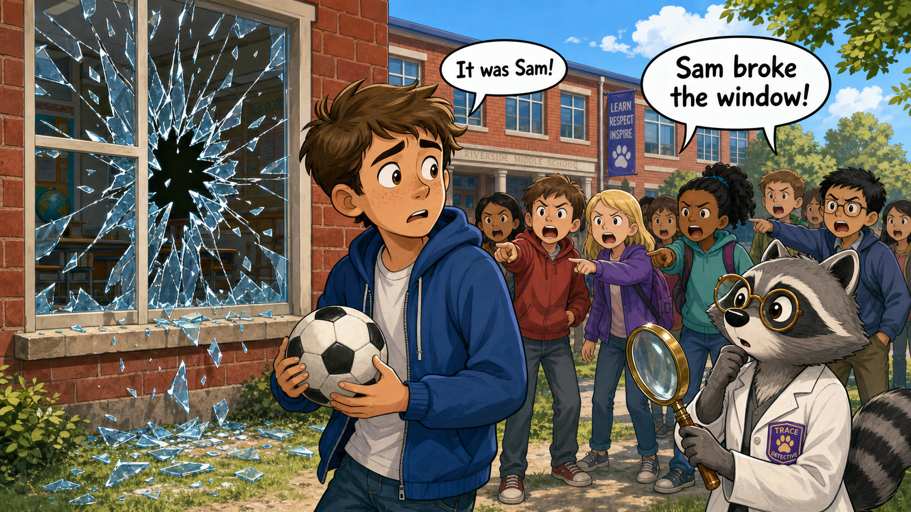
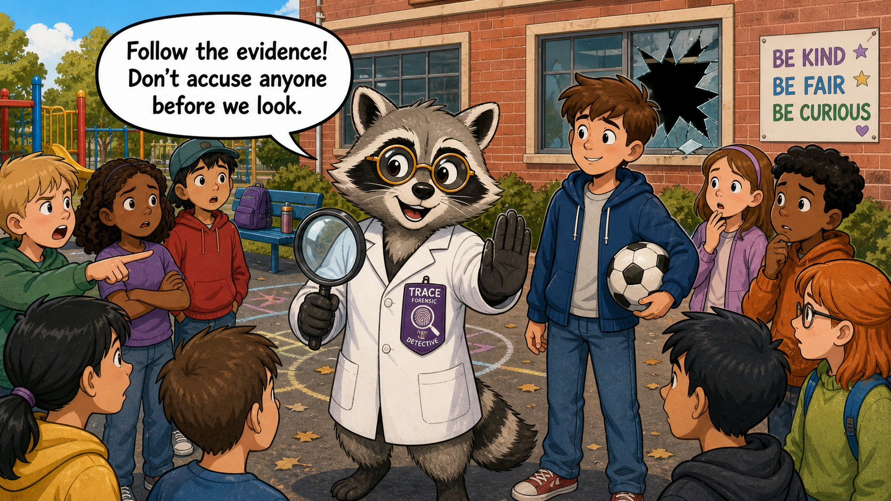
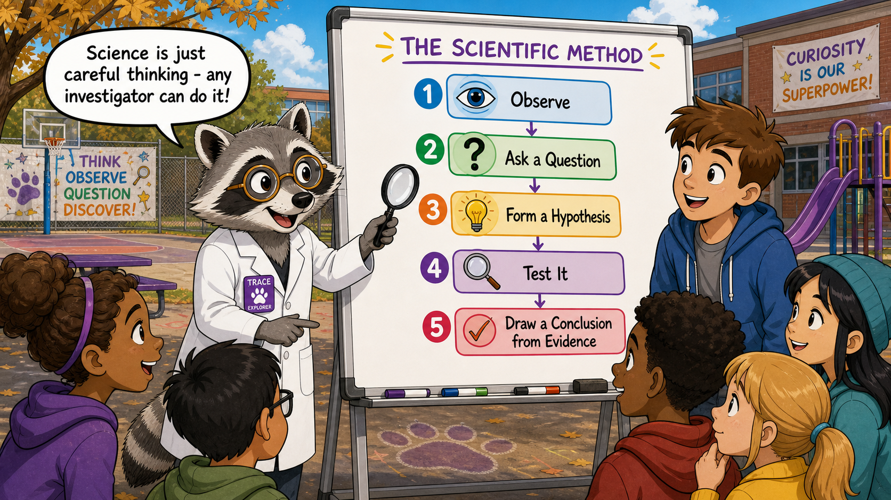
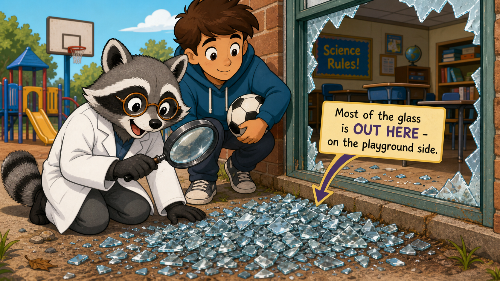
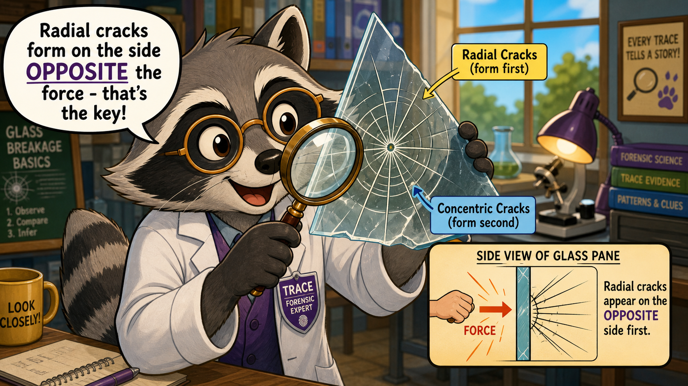
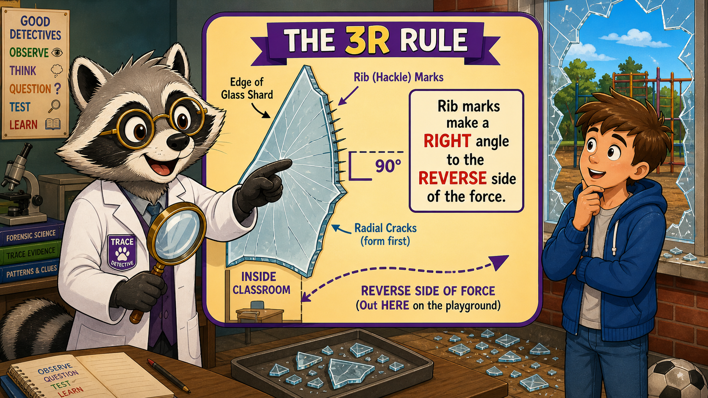
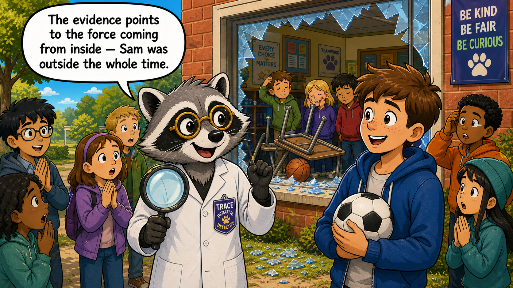
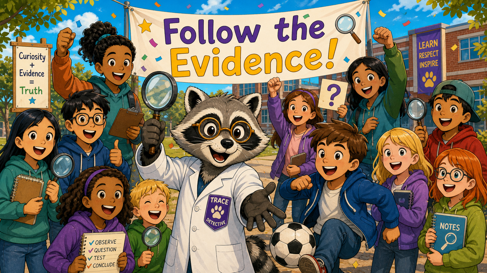

# Trace and the Broken Window: A Mystery of Glass and Science

Cover Image Prompt

(This is the Cover Image. Do not include this label in the image.)

A cheerful, bright cover illustration featuring Trace the raccoon detective standing confidently in front of a school building with a cracked classroom window visible behind them. Trace is a medium-gray raccoon with a distinctive black eye-mask and white facial accents, wearing a crisp white forensic lab coat with a deep-purple detective badge on the chest, amber-tinted round spectacles, and holding up a large magnifying glass through which a fragment of broken glass is visible. The school setting is sunny and present-day — a red-brick building, green lawn, playground equipment in the background. The title text "Trace and the Broken Window" appears at the top in a friendly, rounded, bold typeface in deep purple with a bright yellow drop shadow. Small illustrated glass shards with arrows pointing inward add visual energy around the border. The color palette is bright and cheerful: warm yellows, sky blues, grass greens, and the raccoon's purple-accented coat. A small yellow banner at the bottom reads "A Mystery of Glass and Science." Art style: bright friendly children's picture-book cartoon style, bold clean outlines, cheerful saturated palette.

Generate the image immediately without asking clarifying questions.

Narrative Prompt

This is a graphic novel story for a high-school forensic science intelligent textbook, aimed at grades 9–12. The tone is warm, fun, and encouraging — it is an on-ramp story showing that anyone can think like a scientist.

**Setting:** A present-day middle/high school — classrooms, hallways, a playground outside, a sunny day.

**Mascot — Trace (use this description in EVERY panel, consistently):** Trace is a medium-gray raccoon with a distinctive black eye-mask and white facial accents around the muzzle and eye areas. Trace wears a crisp white forensic lab coat with a deep-purple detective badge pinned to the left breast pocket. Trace's amber-tinted round spectacles sit on their nose. Trace carries a large magnifying glass in one paw. Trace's pronoun is they/them. Trace is clever, curious, precise, and playful — with an encouraging, upbeat demeanor. Trace's catchphrases are "Follow the evidence!" and "What does the data tell us?"

**Supporting character — Sam:** A friendly, slightly nervous teenager (could be any ethnicity — draw them as warm and relatable), wearing casual school clothes (jeans, a hoodie), holding a soccer ball. Sam is clearly not a villain — just a kid who got unfairly blamed.

**Theme:** The scientific method (observe → question → hypothesize → test → conclude) solves a schoolyard mystery. The physics of glass fracture — specifically that radial cracks form on the side OPPOSITE the force, and rib marks on crack edges reveal the force direction — reveals that the window was broken from the INSIDE, clearing Sam who was outside.

**Character-consistency note:** Trace must look identical in every panel: same gray fur, black eye-mask, white facial accents, white lab coat with deep-purple badge, amber round spectacles, magnifying glass. The art style must be consistent across all panels: bright friendly children's picture-book cartoon style, bold clean outlines, cheerful saturated palette.

### Prologue – The Blame Game Begins

It was a perfectly ordinary Tuesday recess when the sound of shattering glass rang out across Westbrook Middle School's playground. A classroom window had shattered — broken clean through. Heads turned. Fingers pointed. And almost immediately, the crowd settled on a suspect: Sam, the kid who had been kicking a soccer ball just outside. But had anyone actually checked the evidence? That is where Trace comes in.

---

## Panel 1: Crash!

Image Prompt

(This is Panel 1. Do not include the panel number in the image.)

I am about to ask you to generate a series of images for a graphic novel. Please make the images have a consistent style and consistent characters. Do not ask any clarifying questions. Just generate the image immediately when asked.

Please generate a 16:9 image in bright friendly children's picture-book cartoon style, bold clean outlines, cheerful saturated palette depicting panel 1 of 8. The scene shows the exterior of a present-day school building on a sunny day. A classroom window has just shattered — glass shards radiate outward dramatically. Outside the window on the playground, Sam, a friendly teenager in jeans and a hoodie, holds a soccer ball and looks startled and worried. A crowd of students behind Sam are all pointing accusingly at Sam with frowning faces and speech bubbles reading "It was Sam!" and "Sam broke the window!" Sam's expression is wide-eyed and innocent. Broken glass glitters on the ground. The school building is red brick with green grass. The color palette is bright: sky blue, warm yellow sunlight, greens, and a hint of dramatic red in the cracked window frame. Emotional tone: surprised, a little chaotic, but not scary — almost cartoonish in energy.

Generate the image immediately without asking clarifying questions.

CRASH! Glass rained onto the playground, and the whole school seemed to hold its breath for a second before the accusations started flying. Sam froze, soccer ball tucked under one arm, staring at the broken window in disbelief. "I didn't even kick it that direction!" Sam protested — but no one was listening. The crowd had already made up their minds.

---

## Panel 2: Trace Arrives

Image Prompt

(This is Panel 2. Do not include the panel number in the image.)

Please generate a 16:9 image in bright friendly children's picture-book cartoon style, bold clean outlines, cheerful saturated palette depicting panel 2 of 8. Make the characters and style consistent with the prior panels. The scene shows Trace the raccoon detective arriving at the playground scene with a confident, cheerful stride. Trace is a medium-gray raccoon with a black eye-mask, white facial accents, wearing a crisp white forensic lab coat with a deep-purple detective badge, amber-tinted round spectacles, and carrying a large magnifying glass. Trace holds up one paw with a friendly "stop — let's think" gesture toward the accusatory crowd. A speech bubble from Trace reads: "Follow the evidence! Don't accuse anyone before we look." Sam stands nearby looking relieved and hopeful. The broken window looms behind the group. The color palette stays bright and cheerful. Emotional tone: calm, curious, reassuring — Trace is in control and friendly.

Generate the image immediately without asking clarifying questions.

"Follow the evidence!" Trace called out, stepping through the crowd with a friendly wave of their magnifying glass. "We do not accuse anyone before we look at what the data tells us — that is rule number one for every investigator." The students fell quiet, curious despite themselves. Sam shot Trace a grateful look. Maybe, just maybe, someone was finally going to listen.

---

## Panel 3: The Scientific Method — Mapped Out

Image Prompt

(This is Panel 3. Do not include the panel number in the image.)

Please generate a 16:9 image in bright friendly children's picture-book cartoon style, bold clean outlines, cheerful saturated palette depicting panel 3 of 8. Make the characters and style consistent with the prior panels. Trace the raccoon (medium-gray, black eye-mask, white facial accents, white lab coat with deep-purple badge, amber round spectacles, magnifying glass) stands in front of a portable chalkboard or whiteboard that has appeared on the playground. On the board Trace has drawn a large colorful flowchart showing the five steps of the scientific method: 1. Observe, 2. Ask a Question, 3. Form a Hypothesis, 4. Test It, 5. Draw a Conclusion from Evidence. Each step is in a bright rounded box with a cheerful icon (eye, question mark, lightbulb, magnifying glass, checkmark). Trace points at the chart with their magnifying glass. Several curious students lean in to look, including Sam. Speech bubble from Trace: "Science is just careful thinking — any investigator can do it!" Emotional tone: educational, enthusiastic, encouraging. Bright colors — purple, yellow, sky blue.

Generate the image immediately without asking clarifying questions.

Trace uncapped a marker and sketched five steps on the nearest whiteboard: Observe, Ask a Question, Form a Hypothesis, Test It, and Conclude from the Evidence. "What does the data tell us? That is always the question," Trace said, tapping each step with one claw. "Science is not magic — it is just a careful way of asking the universe a question." Around the playground, students started to look less like an angry mob and more like curious investigators.

---

## Panel 4: Glass on the Outside

Image Prompt

(This is Panel 4. Do not include the panel number in the image.)

Please generate a 16:9 image in bright friendly children's picture-book cartoon style, bold clean outlines, cheerful saturated palette depicting panel 4 of 8. Make the characters and style consistent with the prior panels. The scene is a close-up view of the area right outside the broken classroom window. Trace the raccoon (medium-gray, black eye-mask, white facial accents, white lab coat with deep-purple badge, amber round spectacles, magnifying glass) kneels on the playground and peers closely at a large pile of broken glass on the ground OUTSIDE the window. Trace uses the magnifying glass. A helpful annotation arrow or banner in the image points to the glass pile and reads: "Most of the glass is OUT HERE — on the playground side." On the inside of the window frame (visible through the broken opening), there is noticeably very little glass. Sam stands beside Trace looking curious. Trace's expression is delighted with discovery. Emotional tone: curious, energetic, the joy of a scientific observation. Bright playground setting, sunny day.

Generate the image immediately without asking clarifying questions.

Step one: observe. Trace crouched on the pavement and swept the magnifying glass in a slow arc. Most of the glass — big jagged chunks and tiny glittering chips alike — was here on the playground, outside the window. Trace peeked through the broken frame and saw only a thin scatter of glass on the classroom floor inside. "Interesting," Trace murmured, amber spectacles glinting in the sunlight. "The evidence is already asking us a very important question — which direction did the force travel?"

---

## Panel 5: Reading the Cracks

Image Prompt

(This is Panel 5. Do not include the panel number in the image.)

Please generate a 16:9 image in bright friendly children's picture-book cartoon style, bold clean outlines, cheerful saturated palette depicting panel 5 of 8. Make the characters and style consistent with the prior panels. Trace the raccoon (medium-gray, black eye-mask, white facial accents, white lab coat with deep-purple badge, amber round spectacles) holds up a large triangular glass shard, examining it through their magnifying glass. The shard is illustrated in a stylized way showing two types of cracks clearly labeled: long straight cracks radiating outward from a center point labeled "Radial Cracks (form first)" and curved cracks circling around the center labeled "Concentric Cracks (form second)." The cracks have a friendly cartoon style. A small inset diagram floats in a rounded box nearby showing a side view of a glass pane: a fist hitting from the left side, and an arrow showing radial cracks appearing on the RIGHT (opposite) side first. A speech bubble from Trace reads: "Radial cracks form on the side OPPOSITE the force — that's the key!" Emotional tone: excited, educational. Warm bright colors.

Generate the image immediately without asking clarifying questions.

Trace lifted a shard gently with gloved paws and held it up to the light. The cracks told a story — if you knew how to read them. "See these long lines shooting outward from the point of impact? Those are radial cracks, and they form first," Trace explained, tracing one with a claw. "And these curved lines that circle around? Concentric cracks — they form second." Most importantly, Trace continued, radial cracks form on the side of the glass that is opposite to where the force struck — a principle every forensic glass examiner relies on.

---

## Panel 6: The 3R Rule Reveals All

Image Prompt

(This is Panel 6. Do not include the panel number in the image.)

Please generate a 16:9 image in bright friendly children's picture-book cartoon style, bold clean outlines, cheerful saturated palette depicting panel 6 of 8. Make the characters and style consistent with the prior panels. Trace the raccoon (medium-gray, black eye-mask, white facial accents, white lab coat with deep-purple badge, amber round spectacles, magnifying glass) stands next to a large floating diagram that illustrates the "3R Rule" in simple, friendly terms. The diagram shows a cross-section edge of a glass shard with tiny ridge-like hackle marks on the edge of a radial crack. An arrow indicates that these rib marks meet the glass surface at a right angle, and the right-angle side points TOWARD the side OPPOSITE the force — meaning the force came from inside the room, not outside. The diagram has clear labels: "Rib marks make a RIGHT angle to the REVERSE side of the force." A dotted arrow sweeps from INSIDE the classroom outward. Trace points to the diagram with a "lightbulb" expression. Outside the window Sam looks on with growing understanding. Emotional tone: the thrill of discovery, a eureka moment. Bright purples, yellows, blues.

Generate the image immediately without asking clarifying questions.

"Now here is where it gets really interesting," Trace said, adjusting their amber spectacles for dramatic effect. On the edge of the shard's radial crack, tiny ridge-like marks — called rib marks or hackle marks — ran perpendicular to the crack surface. "The 3R Rule: Radial cracks form a Right angle on the Reverse side of the force," Trace announced. "These rib marks make a right angle to the inside-classroom surface of the glass — which means the force came from inside the room, not from out here on the playground." A hush fell over the crowd. The evidence had spoken.

---

## Panel 7: Sam Is Cleared

Image Prompt

(This is Panel 7. Do not include the panel number in the image.)

Please generate a 16:9 image in bright friendly children's picture-book cartoon style, bold clean outlines, cheerful saturated palette depicting panel 7 of 8. Make the characters and style consistent with the prior panels. The scene shows a warm resolution moment outside the school. Trace the raccoon (medium-gray, black eye-mask, white facial accents, white lab coat with deep-purple badge, amber round spectacles, magnifying glass) stands with Sam, both looking happy and relieved. Sam is holding the soccer ball. Behind them, visible through the broken classroom window, we can see inside the classroom: an upturned desk and a basketball rolling near the broken frame — the real culprit, an indoor accident. A few contrite-looking students inside the classroom look sheepish. A banner or speech bubble from Trace reads: "The evidence points to the force coming from inside — Sam was outside the whole time." Sam's expression is relieved joy. The crowd of students outside looks surprised and a little embarrassed. Bright, warm, sunny palette. Emotional tone: justice, relief, warmth — a happy moment.

Generate the image immediately without asking clarifying questions.

Trace turned to face the crowd and smiled gently. "The evidence points to the window being broken from the inside — and Sam was standing out here the whole time." Inside the classroom, the real story was already visible: a basketball that had been thrown indoors during the last minutes of class had careened off a desk and straight into the window. Two students inside were quietly raising their hands. Sam let out a long, shaky breath — and broke into a huge smile. "What does the data tell us?" Trace said with a wink. "Always the truth, if you're willing to look."

---

## Panel 8: Every Investigator Can Do This

Image Prompt

(This is Panel 8. Do not include the panel number in the image.)

Please generate a 16:9 image in bright friendly children's picture-book cartoon style, bold clean outlines, cheerful saturated palette depicting panel 8 of 8. Make the characters and style consistent with the prior panels. A joyful, celebratory final panel. Trace the raccoon (medium-gray, black eye-mask, white facial accents, white lab coat with deep-purple badge, amber round spectacles, magnifying glass raised in the air triumphantly) stands at the center of a large happy group of diverse middle/high-school students, all smiling and laughing together — including Sam, who is back to kicking the soccer ball happily. Some students hold magnifying glasses, notebooks, and small question-mark signs. A large banner in the background reads: "Follow the Evidence!" in bright purple and yellow letters. Trace has one paw outstretched toward the viewer, as if inviting THEM to join in. The school building is cheerful in the background with a sunny sky. Emotional tone: triumphant, inclusive, joyful, empowering. The message is clear: science belongs to everyone.

Generate the image immediately without asking clarifying questions.

Trace raised the magnifying glass high like a trophy and grinned at the entire crowd — students, teachers, Sam, everyone. "Careful observation beats jumping to blame, every single time," Trace declared. "And you do not need special powers to be an investigator — you need curiosity, a question, and the courage to follow the evidence wherever it leads." The students cheered. Sam kicked the soccer ball in a perfect arc against the (undamaged) gym wall. And somewhere in the building, two students were probably writing a very sincere apology note.

---

### Epilogue – Think Like Trace

Trace did not use magic or special equipment to solve the mystery of the broken window — just careful observation and a simple scientific principle that anyone can learn. Every time you see broken glass, you can ask the same questions Trace asked: Where is the glass? What do the crack patterns look like? What do they tell us about the force? The scientific method is not just for laboratories; it works on playgrounds, at crime scenes, and in your everyday life. You already think like a scientist more than you realize.

| The Mystery | How Trace Investigated | The Science Skill |
|---|---|---|
| Who (or what) broke the window? | Observed where the glass fell — mostly outside | Careful observation, step 1 of the scientific method |
| Which direction did the force come from? | Examined radial vs. concentric crack patterns on a glass shard | Fractography: radial cracks form opposite the force |
| Was Sam really the one who did it? | Applied the 3R Rule to rib marks on the shard edge | 3R Rule: Right angle to the Reverse side confirms force direction from inside |
| What is the broader lesson? | Followed evidence instead of assumptions | Scientific method: hypothesize, test, conclude from evidence |

---

### Call to Action

The next time you encounter a question — big or small — try writing down Trace's five steps: observe, ask, hypothesize, test, conclude. Science is a skill you build one careful question at a time, and every question you ask makes you a sharper investigator. Pick up your metaphorical magnifying glass — the evidence is waiting.

---

*"Follow the evidence! The clues are always there — you just have to be willing to look before you leap to a conclusion."*
—Trace

*"What does the data tell us? More than assumptions ever could — and the data never plays favorites."*
—Trace

---

## References

1. **Wikipedia — Scientific Method:** A comprehensive overview of the scientific method, its history, and its application across disciplines. [https://en.wikipedia.org/wiki/Scientific_method](https://en.wikipedia.org/wiki/Scientific_method)

2. **Wikipedia — Fracture:** Explains the physics of fracture mechanics, including crack propagation, radial and concentric fracture patterns, and the forces that drive them. [https://en.wikipedia.org/wiki/Fracture](https://en.wikipedia.org/wiki/Fracture)

3. **Wikipedia — Glass:** Background on the properties of glass, including its amorphous structure, brittleness, and behavior under impact — relevant to understanding why glass breaks the way it does. [https://en.wikipedia.org/wiki/Glass](https://en.wikipedia.org/wiki/Glass)

4. **Forensic Science International — Glass Evidence:** The peer-reviewed journal *Forensic Science International* publishes research on forensic glass analysis, including fracture pattern interpretation and the 3R rule used by examiners. [https://www.sciencedirect.com/journal/forensic-science-international](https://www.sciencedirect.com/journal/forensic-science-international)

5. **Khan Academy — The Scientific Method:** A free, student-friendly explanation of the scientific method with examples, suitable for grades 9–12, from a reputable educational source. [https://www.khanacademy.org/science/ap-biology/science-of-biology/biology-and-the-scientific-method/a/the-science-of-biology](https://www.khanacademy.org/science/ap-biology/science-of-biology/biology-and-the-scientific-method/a/the-science-of-biology)
