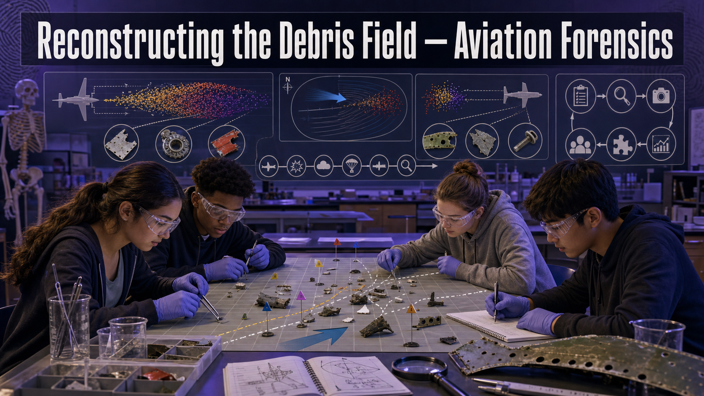

# Reconstructing the Debris Field — Aviation Forensics

!!! mascot-welcome "Welcome, Investigators!"
    { class="mascot-admonition-img"}

    An aircraft accident scatters its own story across the ground — and reading that
    scatter is one of the most demanding jobs in all of forensics. This is a
    **capstone** investigation: you'll classify a debris field, sequence the
    wreckage, follow the flight path, and run the same workflow a real crash team
    uses. Take your time. Follow the evidence!

## The Case

An aircraft has gone down. Investigators arrive to a field of wreckage spread
across the landscape, radar and **ADS-B** track logs from the final minutes, and a
set of witness reports. The central question every crash investigation must answer:
**what was the probable cause?**

Your team will work it the way the professionals do. First, read the **debris
field** — a tightly clustered scatter and a long, strung-out one tell very
different stories. Then **sequence** the wreckage to infer what came apart first.
Fold in the **flight-path data**. Finally, run the **NTSB party-system workflow**
end to end and commit to a **probable-cause hypothesis** you can defend. There is no
"case closed" until every stage agrees.

## Learning Objectives

By the end of this investigation you will be able to:

1. **Distinguish** an in-flight breakup from an intact impact using debris scatter.
2. **Sequence** wreckage to infer the order in which the aircraft came apart.
3. **Integrate** radar / ADS-B flight-path data into a probable-cause hypothesis.
4. **Evaluate** a crash using the NTSB party-system workflow end to end.

## Quick Facts

| | |
|---|---|
| **Lab type** | 💻 Virtual (capstone-scale) |
| **Group size** | 3–4 investigators (assign NTSB roles) |
| **Time** | 70–90 minutes (or two class periods) |
| **Cost** | $0 — computer-based |
| **Ties to** | [Ch 19 — Debris Field Analysis, In-Flight Breakup vs. Intact Impact, Wreckage Reconstruction, Radar/ADS-B Path Reconstruction, Probable Cause, NTSB Party System](../../chapters/19-aviation-crash-forensics/index.md) |

## Materials

Per group:

- **None — a laptop and a browser.**
- The instructor's provided crash dossier: debris-field scatter data, the ADS-B
  track log, and witness statements.
- *Assumes access to one computer per group.*

!!! mascot-warning "Hold the Hypothesis Loosely"
    { class="mascot-admonition-img"}

    - Real crash investigations take **months to years**. Never rush to a single
      cause — early theories that ignore contradicting evidence are how mistakes get
      made.
    - Aviation forensics reports a **probable cause**, not a certainty. State your
      hypothesis as the best explanation of *all* the evidence, and name what could
      still change it.
    - Treat this as a serious professional exercise. Real accidents involve real
      loss; the discipline here is respect for the evidence and the people affected.

## Background: The Ground Remembers the Sky

When an aircraft crashes **intact** — flying into terrain in one piece — it tends to
leave a **concentrated** debris field: a tight, high-energy scatter near a single
impact point. When an aircraft breaks up **in flight**, pieces separate at altitude
and fall along the flight path, producing a **long, strung-out debris field** that
can stretch for kilometres. The *shape* of the scatter is the first big clue to
what happened.

Within the field, the **distribution of specific parts** refines the story.
Components that separated first fall earliest and land farthest back along the track;
the heaviest, most-intact structure often travels farthest forward. By mapping which
pieces landed where, investigators **sequence** the break-up — reconstructing the
order in which the aircraft failed. This physical scatter is then cross-checked
against **radar and ADS-B** data, which records the aircraft's position, altitude,
and speed second by second in its final minutes.

No single investigator owns the answer. The **NTSB party system** brings together
parties with technical knowledge — the operator, the manufacturer, and others —
under NTSB coordination, each contributing expertise while the NTSB alone determines
the **probable cause**. Your team will move through three stages that mirror this
process: **field analysis → workflow roles → timeline synthesis.**

### Stage 1 — Explore: The Debris-Field Pattern Explorer

<iframe src="../../sims/debris-field-pattern-explorer/main.html" width="100%" height="500px" scrolling="no"></iframe>

Debris-Field Pattern Explorer Interactive MicroSim

Type: microsim 
**sim-id:** debris-field-pattern-explorer 
**Library:** p5.js 
**Status:** Specified

Learning Objective: Classify a debris scatter as in-flight breakup versus intact
impact and infer break-up order from part distribution (Bloom Level 4 — Analyze).

Study the scatter. Is it **concentrated** (intact impact) or **strung out**
(in-flight breakup)? Note which parts landed farthest back along the path — those
likely separated first. This classification anchors everything that follows.

### Stage 2 — Explore: The NTSB Investigation Workflow

<iframe src="../../sims/ntsb-investigation-workflow/main.html" width="100%" height="500px" scrolling="no"></iframe>

NTSB Investigation Workflow Interactive MicroSim

Type: microsim 
**sim-id:** ntsb-investigation-workflow 
**Library:** p5.js 
**Status:** Specified

Learning Objective: Trace the NTSB party-system workflow and identify each party's
role in reaching a probable cause (Bloom Level 3 — Apply).

Walk the workflow and **assign your team to the roles** — operator, manufacturer,
systems, structures, and the NTSB coordinator who owns the final finding. Notice how
each party contributes evidence but only the NTSB determines probable cause.

### Stage 3 — Explore: The Aviation Crash Investigation Timeline

<iframe src="../../sims/aviation-crash-investigation-timeline/main.html" width="100%" height="500px" scrolling="no"></iframe>

Aviation Crash Investigation Timeline Interactive MicroSim

Type: microsim 
**sim-id:** aviation-crash-investigation-timeline 
**Library:** p5.js 
**Status:** Specified

Learning Objective: Synthesize debris, flight-path, and witness data into a single
sequenced timeline supporting a probable-cause hypothesis (Bloom Level 5 —
Synthesize/Evaluate).

Lay the **ADS-B track**, the **debris sequence**, and the **witness reports** on one
timeline. Where they all point the same way, you have the spine of your probable
cause. Where they conflict, you have the questions your report must resolve.

## Procedure

**Part 1 — Classify the field.**

1. Open the debris-field explorer. Measure how **spread out** the scatter is and
   record it: concentrated or strung-out?
2. State your first classification: **in-flight breakup** or **intact impact**, and
   the specific scatter feature that supports it.
3. Note which components landed **farthest back** — candidates for what failed first.

**Part 2 — Sequence and correlate.**

4. Using part distribution, propose the **order** in which the aircraft came apart.
5. Overlay the **ADS-B / radar track**. Find the point on the path where altitude or
   speed changed abruptly and check whether it lines up with your break-up point.
6. Add the **witness reports** to the timeline. Do they corroborate the where and
   when of the break-up, or conflict?

**Part 3 — Run the NTSB workflow and conclude.**

7. Assign NTSB **party roles** across your team and step through the workflow.
8. Each role reviews the evidence from their angle and contributes one finding.
9. As a team, synthesize a single **probable-cause hypothesis** — and explicitly
   list the evidence for it *and* the one piece that could still overturn it.

## Data Collection

| Evidence stream | Key observation | What it suggests |
|-----------------|-----------------|------------------|
| Debris scatter shape | | |
| Part distribution / sequence | | |
| ADS-B / radar track | | |
| Witness statements | | |
| Combined timeline | | |

## Analysis Questions

1. Was this an **in-flight breakup** or an **intact impact**? Cite the debris-field
   feature that most strongly supports your classification.
2. What was the likely **order** of the break-up, and how did part distribution let
   you infer it?
3. Where does the **ADS-B track** agree with your debris sequence, and where (if
   anywhere) does it disagree? How do you resolve the disagreement?
4. In the NTSB party system, why does having the **operator and manufacturer** at
   the table strengthen the investigation — and why does only the **NTSB** get to
   declare probable cause?
5. State your team's **probable-cause hypothesis** in one sentence, then name the
   single piece of new evidence that would most change your conclusion.

## Deliverable

Turn in a **Probable-Cause Report** structured like an NTSB finding: (1) the debris-
field classification with its evidence, (2) the reconstructed break-up sequence,
(3) the correlation with flight-path data, (4) the party findings, and (5) a clearly
stated probable-cause hypothesis with its supporting evidence and its biggest
remaining uncertainty. Include your combined timeline.

!!! mascot-thinking "What Does the Data Tell Us?"
    { class="mascot-admonition-img"}

    The strongest crash reports aren't the ones that sound the most certain — they're
    the ones where the debris, the flight path, and the witnesses **all point the
    same direction**, and the investigator says plainly what would change their mind.
    Convergence is confidence. A lone clue is just a lead.

??? question "Extension Challenge: The Black Box Speaks"
    Real investigations add two more streams you didn't have: the **Flight Data
    Recorder** (thousands of parameters) and the **Cockpit Voice Recorder**. Research
    what each records, then write a short plan: if the recorders arrived tomorrow,
    which parts of your probable-cause hypothesis would you test *first*, and what
    result would confirm — or break — it?

## Teacher Notes

??? note "Setup, timing, and grading (click to expand)"
    - **Prep:** Assemble a crash dossier: a debris scatter (choose intact-impact or
      in-flight-breakup on purpose), an ADS-B track with one abrupt change, and 2–3
      witness statements (include one that partly conflicts, to force resolution).
      Budget two class periods for the full capstone; one period covers Stages 1–2.
    - **Assign the roles.** The NTSB party system only lands if each student *owns* a
      role and reports from that viewpoint. Rotate a coordinator who reconciles the
      findings.
    - **Differentiation:** For a shorter run, provide the debris classification and
      have teams do only sequencing + timeline. For a challenge, hand two groups the
      *same* dossier with different witness sets and compare their hypotheses.
    - **Assessment focus:** Reward **convergence reasoning** (multiple streams
      agreeing), an explicit probable-cause statement, and honest acknowledgment of
      the remaining uncertainty — not a fast, overconfident single cause.

!!! mascot-celebration "Case Closed — For Now"
    { class="mascot-admonition-img"}

    You read a story written across an entire landscape, checked it against the sky,
    and built a conclusion careful enough to defend. That's capstone-level work — the
    real thing, done with real discipline. Take a breath, investigators. **Follow the
    evidence!**
