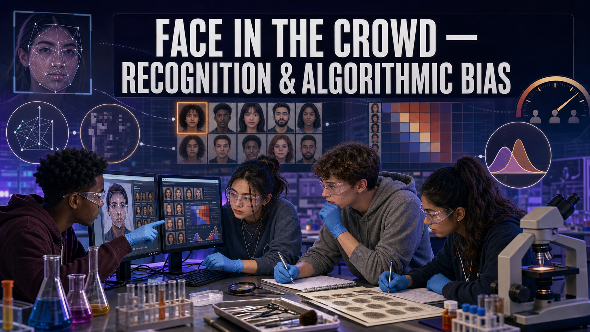

# Face in the Crowd — Recognition & Algorithmic Bias

!!! mascot-welcome "Welcome, Investigators!"
    { class="mascot-admonition-img"}

    A camera catches a face. A computer says "92% match." Case closed? Not so fast.
    Today you'll open up how facial recognition actually works, audit where it gets
    *less* reliable, and decide what a match really earns you in an investigation.
    The answer will surprise you. Follow the evidence!

## The Case

A convenience-store camera captured the face of someone the police want to identify.
Investigators run the image through a **facial-recognition** system, which returns a
ranked list of candidates with **confidence scores**. The top candidate scores high.

But a good investigator asks harder questions. *How* did the system reach that score?
And is it equally reliable for **everyone**? Independent testing has shown that many
facial-recognition systems are **less accurate** for some demographic groups than
others — which means a confidence score can mean different things for different faces.
Your job: trace the pipeline that produced the match, run an **audit** of its accuracy
across groups, and reach a defensible judgment about what this match should — and
should not — be used for.

## Learning Objectives

By the end of this investigation you will be able to:

1. **Describe** the four stages of a facial-recognition pipeline in order.
2. **Interpret** a match confidence score and a candidate ranking.
3. **Analyze** audit data showing accuracy differences across demographic groups.
4. **Evaluate** whether a face match meets the bar for evidence versus a lead.

## Quick Facts

| | |
|---|---|
| **Lab type** | 💻 Virtual |
| **Group size** | 2–3 investigators |
| **Time** | 45–55 minutes |
| **Cost** | $0 — computer-based |
| **Ties to** | [Ch 16 — Facial Recognition Overview, Face Detection Algorithms, Facial Landmark Detection, Algorithmic Bias, Facial Recognition Admissibility, CCTV Surveillance Analysis](../../chapters/16-facial-recognition/index.md) |

## Materials

Per group:

- **None — a laptop and a browser.**
- The instructor's provided sample probe image, candidate gallery, and the audit
  data table.
- *Assumes access to one computer per group.*

!!! mascot-warning "Handle This Evidence — and This Topic — With Care"
    { class="mascot-admonition-img"}

    - A facial-recognition match is an **investigative lead**, not proof of identity.
      Several people have been **wrongly arrested** after an over-trusted match —
      real cases with real harm. Treat a match as a hypothesis to verify.
    - The accuracy differences you'll examine are a documented, technical fact about
      certain systems — not a statement about any group of people. Discuss the
      **technology's** limits, respectfully and factually.
    - Use only the provided sample data. Running real people's faces through
      recognition tools without authority raises serious privacy and civil-rights
      concerns.

## Background: How a Face Becomes a Match

Facial recognition isn't magic and it isn't a photograph comparison. It's a
**pipeline** of four stages, and understanding them is the key to judging a result.

1. **Detect** — the system first finds *that* there is a face in the image and boxes
   it. Poor lighting, angle, or low-resolution CCTV can make even this first step
   fail.
2. **Landmark** — it locates key points on the face (eye corners, nose tip, mouth
   edges), which lets it align and normalize the face for comparison.
3. **Encode** — it converts the aligned face into a string of numbers, a
   **faceprint** or embedding, that summarizes the face's measurable features.
4. **Match** — it compares that faceprint against a gallery and returns the closest
   candidates, each with a **confidence score** and a rank.

Here's the part that matters most for justice. The **U.S. National Institute of
Standards and Technology (NIST)** and other researchers have tested many systems and
found that accuracy is **not uniform** — false-match rates can be substantially
higher for some demographic groups (by skin tone, sex, and age) than others. A "92%
match" is not an equally reliable number for every face. That is **algorithmic bias**:
a system performing unevenly across groups, usually because of what data it was
trained on. It's the central reason courts treat face matches cautiously and why a
match should launch an investigation, never end one.

### Explore: The Facial-Recognition Pipeline

<iframe src="../../sims/facial-recognition-pipeline/main.html" width="100%" height="500px" scrolling="no"></iframe>

Facial-Recognition Pipeline Interactive MicroSim

Type: microsim 
**sim-id:** facial-recognition-pipeline 
**Library:** p5.js 
**Status:** Specified

Learning Objective: Trace a face through the detect → landmark → encode → match
pipeline and read the resulting confidence scores, then evaluate accuracy across
demographic groups (Bloom Level 5 — Evaluate).

Step the probe image through all four stages and watch a face turn into numbers,
then into a ranked candidate list. Then switch to the **audit view** and compare the
system's accuracy across groups — that comparison is the heart of this lab.

## Procedure

**Part 1 — Trace the pipeline.**

1. Load the probe image into the pipeline MicroSim. Step through **detect →
   landmark → encode → match**, noting what each stage does.
2. Record the **top candidate** and its **confidence score**, plus the 2nd and 3rd
   candidates and their scores.
3. Note the **gap** between the top score and the next — a small gap means the
   system isn't very sure which candidate is right.

**Part 2 — Run the audit.**

4. Open the audit data. For each **demographic group**, record the system's reported
   **accuracy** (or false-match rate) from the table.
5. Identify the groups where the system is **most** and **least** accurate.
6. Re-examine your Part 1 match: which group does the probe fall into, and how
   reliable is the system *for that group*?

**Part 3 — Reach a judgment.**

7. Weigh the confidence score **together with** the group-specific accuracy. A high
   score in a low-accuracy group is weaker than it looks.
8. Decide what this match **justifies**: closing the case, making an arrest, or only
   opening a line of inquiry that needs independent corroboration.
9. Write your **admissibility judgment** — is this fit to present as evidence, or is
   it a lead to verify?

## Data Collection

| Item | Value / observation |
|------|---------------------|
| Top candidate & confidence score | |
| 2nd / 3rd candidate scores | |
| Gap between #1 and #2 | |
| Most-accurate group (audit) | |
| Least-accurate group (audit) | |
| Probe's group & system accuracy there | |

## Analysis Questions

1. List the four pipeline stages in order and say, in one line each, what could go
   wrong at each stage with a low-quality CCTV image.
2. The top candidate scored high. Given the **audit data for that group**, how much
   should that score reassure you? Explain.
3. Define **algorithmic bias** in your own words, and explain one reason a system
   might be less accurate for some groups (hint: think about training data).
4. Should this match be used to **arrest** the top candidate? Argue your position
   using both the confidence score and the group-specific accuracy.
5. Why do courts and agencies generally treat a face match as an **investigative
   lead** rather than as identification evidence? Name one piece of independent
   evidence that could turn a lead into a solid case.

## Deliverable

Turn in a **Face-Match Assessment**: the pipeline result (top candidates and scores),
the audit findings (most- and least-accurate groups), and a written **admissibility
judgment** that states plainly whether the match is fit to be treated as evidence or
only as a lead — and *why*, citing both the score and the bias data.

!!! mascot-thinking "What Does the Data Tell Us?"
    { class="mascot-admonition-img"}

    A confidence score is a number, not a verdict. The careful investigator reads it
    *alongside* how reliable the system is for that kind of face — and then treats
    even a strong match as a starting point to corroborate. Overtrusting a match has
    put innocent people in handcuffs. Precision here protects people.

??? question "Extension Challenge: The Reform Question"
    Since the 2016 PCAST report and NIST's demographic testing, agencies and courts
    have proposed rules for facial recognition — human review requirements, accuracy
    thresholds, disclosure to defendants, even outright bans in some cities. Research
    **one** real policy or reform, and write a short position: does it adequately
    address the bias problem you saw in this lab? What would you add?

## Teacher Notes

??? note "Setup, timing, and grading (click to expand)"
    - **Prep:** Provide a probe image, a small candidate gallery with confidence
      scores (make the top-vs-second gap modest so certainty is debatable), and an
      audit table showing clearly uneven accuracy across groups. Frame the audit data
      as a property of the *system*, grounded in real NIST-style findings.
    - **Set the tone.** Open by naming that this is a factual, technical topic with
      real civil-rights stakes; keep discussion focused on the technology's measured
      limits, not on people. Reference real wrongful-arrest cases if your class is
      ready for them.
    - **Differentiation:** For a shorter run, provide the pipeline result and focus
      on the audit + judgment. For a challenge, give two probes from different groups
      and have students explain why identical scores don't carry identical weight.
    - **Assessment focus:** Reward judgments that **combine** the score with the
      group-specific accuracy and that correctly land on "lead, verify further"
      rather than "identified." The reasoning matters more than the verdict.

!!! mascot-celebration "Case Closed — For Now"
    { class="mascot-admonition-img"}

    You looked past a confident-looking number and asked the question that actually
    protects people: *how reliable is this, and for whom?* That's not just good
    forensics — it's the kind of careful thinking that keeps the science honest and
    the innocent free. **Follow the evidence!**
