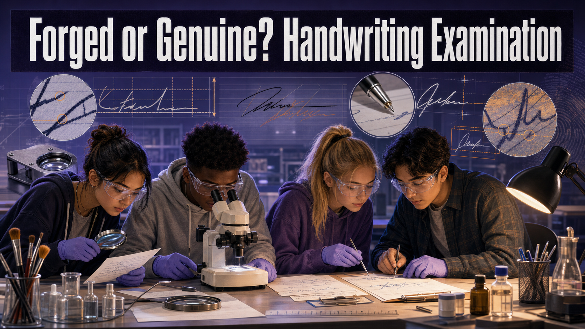

# Forged or Genuine? Handwriting Examination

!!! mascot-welcome "Welcome, Investigators!"
    { class="mascot-admonition-img"}

    Anyone can *copy* a signature. Almost nobody can copy the way it was
    **written** — the effortless speed, the steady pressure, the little habits a
    person doesn't even know they have. A forger has to draw slowly and carefully,
    and that carefulness leaves tremors and hesitations all over the page. Today
    you'll learn to spot them. Follow the evidence!

## The Case

A check for a large sum has been cashed, and the account holder swears the
**signature isn't theirs.** You've recovered **three questioned signatures** —
one may be genuine, the others may be forgeries — plus you can collect **known
writing** from the people involved. The bank needs to know which signatures to
trust.

Your job: gather proper **exemplars**, examine the questioned signatures for the
tell-tale signs of forgery, and **rank all three** from most likely forged to
most likely genuine — using features, not gut feeling.

## Learning Objectives

By the end of this investigation you will be able to:

1. **Define** the features examiners compare: line quality, slant, spacing, and
   letter formation.
2. **Collect** requested writing exemplars under fair, standardized conditions.
3. **Analyze** questioned signatures for signs of natural writing versus
   simulated forgery.
4. **Rank** three questioned signatures by likelihood of forgery and defend the
   ranking with evidence.

## Quick Facts

| | |
|---|---|
| **Lab type** | 🔀 Combination (bench examination + MicroSim) |
| **Group size** | 2–3 investigators |
| **Time** | 45–55 minutes |
| **Cost** | ≈ $6 per group (mostly paper) |
| **Ties to** | [Ch 14 — Handwriting Analysis, Line Quality, Slant and Spacing Analysis, Requested Writing Exemplars, Simulated Forgery, Traced Forgery](../../chapters/14-document-examination/index.md) |

## Materials

Per group (≈ $6):

- Exemplar collection sheets (lined paper works)
- The "questioned document" set — one check with **three** signatures, prepared
  by the teacher (one genuine + simulated forgeries)
- Ruler and protractor (for measuring slant and spacing)
- Hand magnifier or loupe (for line quality)
- The same pen for all exemplars (a fair-test control)
- *Shared:* a classroom laptop or tablet for the MicroSim

!!! mascot-warning "Ethics & Fair-Test Rules"
    { class="mascot-admonition-img"}

    - Exemplars must be collected **fairly:** same pen, same paper, same phrase,
      dictated at a **normal pace.** Rushing or coaching a writer contaminates
      the sample.
    - Never let a suspect **see the questioned document** while giving exemplars
      — that invites deliberate disguise.
    - Handwriting comparison is an **opinion of a trained examiner**, not a
      chemical test. Treat every conclusion as *"the evidence suggests,"* never
      *"this proves."*

## Background: You Can't Fake Fluency

Everyone's mature handwriting settles into a set of unconscious habits — the way
you cross a *t*, how far your letters lean, how much air you leave between words.
Document examiners compare a **questioned** writing to **known** writing across
features like **line quality** (smooth and confident vs. shaky and hesitant),
**slant** (the angle letters lean), **spacing** (gaps between letters and words),
**letter formation**, **pen lifts**, and the **baseline** the writing rides on.

The giveaway of most forgeries is **line quality.** When you write your own name,
you do it fast and smooth without thinking — the pen glides. A forger, by
contrast, has to *draw* someone else's signature slowly and deliberately,
producing tell-tale **tremor**, blunt starts and stops, and unnatural **pen
lifts** in the middle of a stroke. A **simulated forgery** (copied freehand)
often nails the overall look but fails on this fluency; a **traced forgery**
matches the shape almost perfectly but can be *too* slow and shaky, and often
sits oddly on the baseline.

One caution: everybody's writing also shows **natural variation** — you never
sign your name *exactly* the same way twice. So an examiner looks for
**consistent, meaningful differences**, not tiny wobbles. Start by learning which
features to watch.

### Explore: Handwriting Characteristics Comparison

<iframe src="../../sims/handwriting-comparison/main.html" width="100%" height="500px" scrolling="no"></iframe>

Handwriting Characteristics Comparison Interactive MicroSim

Type: microsim 
**sim-id:** handwriting-comparison 
**Library:** p5.js 
**Status:** Implemented

Learning Objective: Identify the characteristics used to compare a questioned
writing sample with a known exemplar (Bloom Level 1 — Remember).

Click each characteristic — **Line Quality, Slant, Spacing, Letter Formation,
Pen Lifts, Baseline** — to highlight it on both samples, then toggle the
questioned sample between **authentic and forged** and watch which features turn
red. Use the magnification slider to look closer. Train your eye here before you
examine the real check.

## Procedure

**Part 1 — Collect exemplars.**

1. Choose the phrase or name that appears on the check. Have each of your known
   writers copy it **several times** on the exemplar sheet, using the **same
   pen** at a **normal pace.**
2. Do **not** show writers the questioned document. Collect enough repetitions to
   see each person's **natural variation.**

**Part 2 — Examine the questioned signatures.**

3. For **each** of the three questioned signatures, measure the **slant** with a
   protractor and the **letter/word spacing** with a ruler.
4. Under the magnifier, judge **line quality:** is the stroke smooth and
   confident, or does it show **tremor**, blunt stops, or mid-stroke **pen
   lifts**?
5. Check the **baseline** — does the writing ride evenly, or drift and waver like
   a slow, careful copy?

**Part 3 — Compare and rank.**

6. Line each questioned signature up against the genuine exemplars. Note where it
   **agrees** and where it shows **consistent, meaningful differences.**
7. **Rank** the three questioned signatures from **most likely forged** to **most
   likely genuine**, and list the deciding feature for each.

## Data Collection

Fill in one row per questioned signature.

| Signature | Slant (°) | Avg. spacing (mm) | Line quality (smooth / tremor) | Pen lifts? | Baseline (steady / drifts) | Forgery likelihood (1 = most) |
|-----------|-----------|-------------------|--------------------------------|------------|----------------------------|-------------------------------|
| Exemplar (known) | | | | | | — |
| Questioned #1 | | | | | | |
| Questioned #2 | | | | | | |
| Questioned #3 | | | | | | |

## Analysis Questions

1. Which questioned signature is **most likely forged**? Cite **two** features
   (for example, tremor plus a slant difference) that led you there.
2. Which signature looks **genuine**, and how did you separate its natural
   variation from a real difference?
3. Why is **line quality** often a better forgery indicator than the overall
   *shape* of the signature?
4. A traced forgery can match the shape almost perfectly. What feature might
   still give it away, and why?
5. Handwriting examination is an examiner's **opinion**, and the 2009 NAS report
   urged more measured error rates for it. How should that shape the way you word
   your conclusion to the bank?

## Deliverable

Turn in a one-page **Questioned Document Report** that ranks the three signatures
from most to least likely forged, with the deciding feature noted for each and
your exemplar sheet attached. State conclusions as *"the evidence suggests
Questioned #__ is a simulated forgery,"* never as proof.

!!! mascot-tip "Investigator Tip"
    { class="mascot-admonition-img"}

    Collect **several** exemplars, not one. A single sample can't show you a
    person's natural range — and if you don't know their range, you can't tell a
    real difference from an ordinary day-to-day wobble. More knowns, better
    calls.

??? question "Extension Challenge: Traced vs. Simulated"
    Make **two** forgeries of the same signature: one by copying it freehand (a
    *simulated* forgery) and one by tracing it over a light source (a *traced*
    forgery). Swap with another group. Can they tell which is which? List the
    features that separate a shaky-but-accurate tracing from a smooth-but-wrong
    freehand copy.

## Teacher Notes

??? note "Setup, timing, and grading (click to expand)"
    - **Prep:** Prepare the check with three signatures — one genuine, one
      simulated forgery (freehand copy), and one traced forgery — and keep the key
      sealed. Exaggerate the tremor slightly on the forgeries so a hand lens can
      catch it.
    - **Fair exemplars:** Model the collection rules first. The most common
      student error is letting a "suspect" glance at the questioned signature —
      call it out early.
    - **The MicroSim is the trainer.** Have students toggle authentic/forged and
      name each red-flag feature before touching the real check; it front-loads
      the vocabulary.
    - **Differentiation:** For a shorter version, examine one questioned signature
      instead of three. For a challenge, add a genuine signature written by the
      account holder while injured or rushed, so natural variation is wide.
    - **Assessment focus:** Reward students who cite **specific features**, who
      distinguish natural variation from meaningful difference, and who use
      opinion-appropriate language ("the evidence suggests").

!!! mascot-celebration "Case Closed — For Now"
    { class="mascot-admonition-img"}

    You ranked three signatures without ever seeing the pen touch paper — reading
    tremor, slant, and hesitation the way a real document examiner does. A forger
    can copy a shape, but they can't copy fluency, and now you know exactly where
    to look for the crack. Sharp eyes, investigators. **Follow the evidence!**
