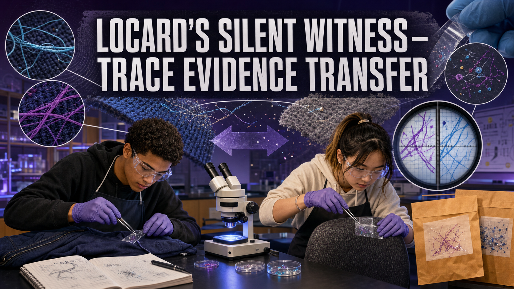
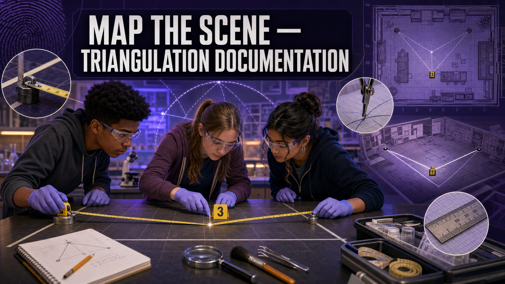
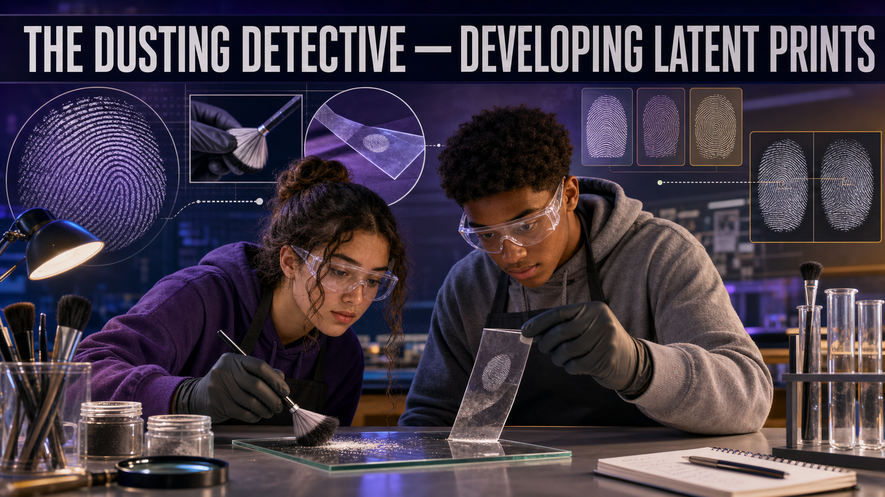
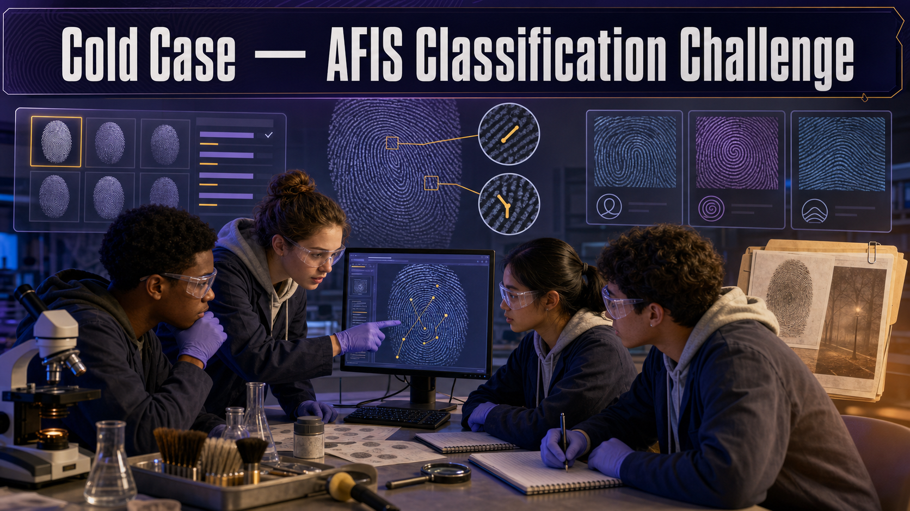
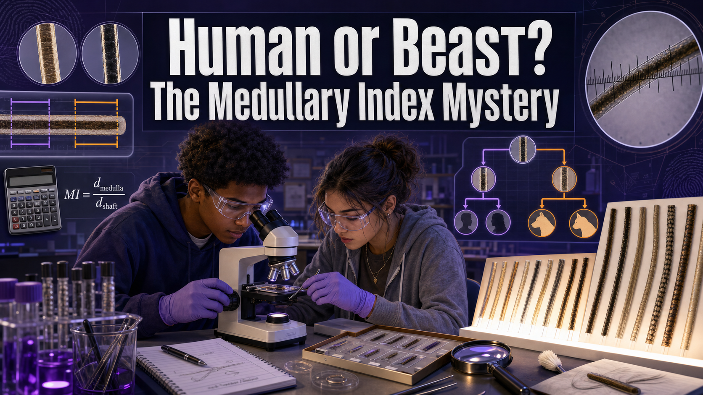
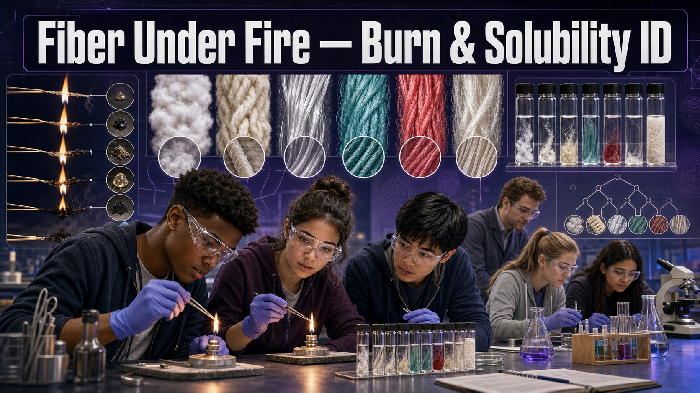
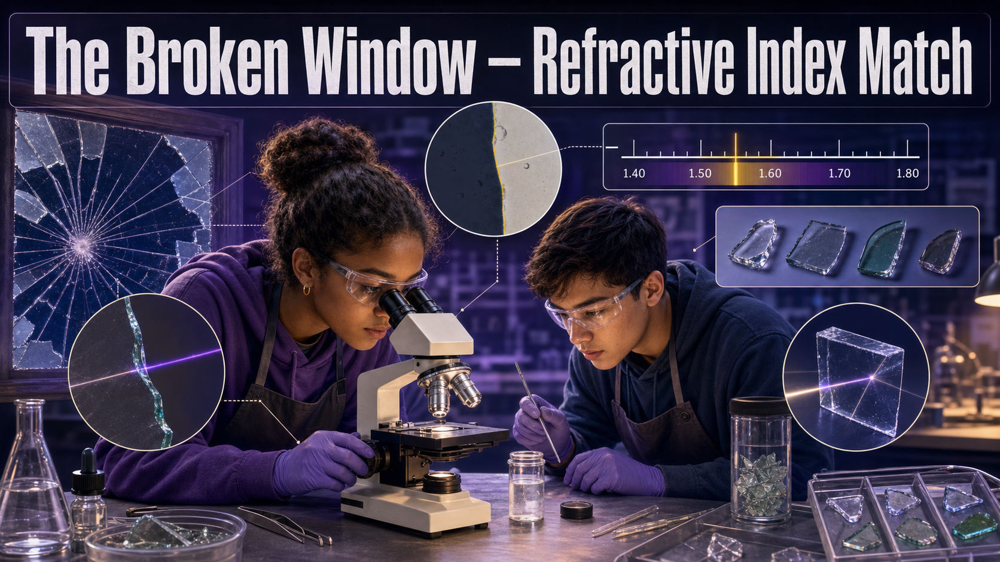
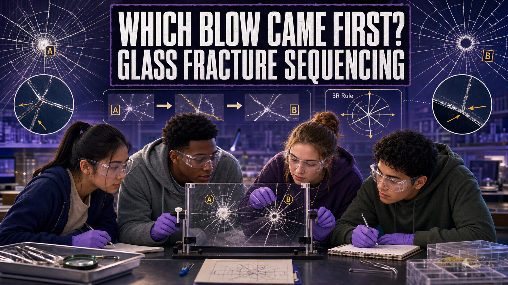
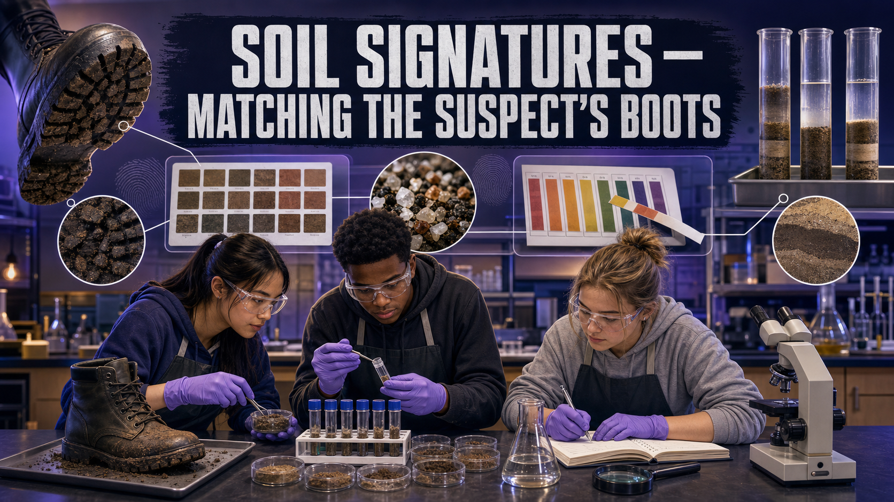
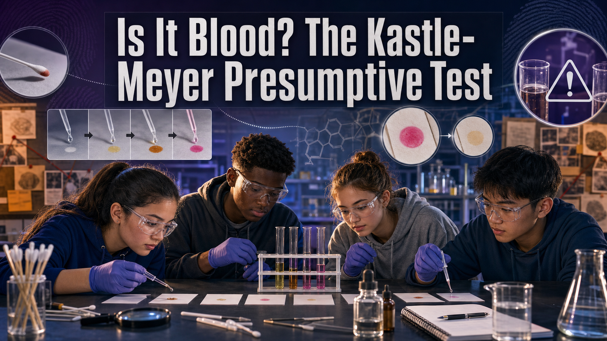

# Student Investigations

Every investigation below hands you a **mystery** and asks the evidence to
answer it. Each one is a self-contained **Hands-On Lab** a teacher can assign to
one student or a small group.

**Lab types:** 🧪 **Physical** (a real bench lab under $100 per group) · 💻
**Virtual** (solved with stories and interactive MicroSims) · 🔀 **Combination**
(a physical step plus a virtual step that simulates an expensive instrument).

!!! tip "Two labs are ready to run"
    **[Locard's Silent Witness](locard-silent-witness/index.md)** and
    **[Map the Scene](map-the-scene-triangulation/index.md)** have complete
    student handouts. The rest are on the way — see the full
    [lab-idea catalog](ideas.md) for supplies and MicroSim specs for all 28.

-   ✅ **[Locard's Silent Witness](locard-silent-witness/index.md)**

    

    🧪 Physical · Ch 1, 2, 4

    Prove every contact leaves a trace by documenting two-way fiber and glitter transfer between surfaces.

-   ✅ **[Map the Scene — Triangulation](map-the-scene-triangulation/index.md)**

    

    🧪 Physical · Ch 2

    Produce a scaled crime-scene sketch by triangulation, then prove it by reconstruction.

-   **[The Dusting Detective](dusting-detective-latent-prints/index.md)**

    

    🧪 Physical · Ch 3

    Develop latent fingerprints with powder and match them to a suspect exemplar.

-   **[Cold Case — AFIS Classification](cold-case-afis-classification/index.md)**

    

    💻 Virtual · Ch 3

    Classify a latent print and search a suspect database the way AFIS does.

-   **[Human or Beast?](human-or-beast-medullary-index/index.md)**

    

    🔀 Combination · Ch 4

    Measure hair under a microscope and compute the medullary index to sort human from animal.

-   **[Fiber Under Fire](fiber-under-fire/index.md)**

    

    🧪 Physical · Ch 4

    Identify unknown fibers by burn behavior and solubility using a dichotomous key.

-   **[The Broken Window](broken-window-refractive-index/index.md)**

    

    🔀 Combination · Ch 5

    Use the Becke line to compare glass fragments to a source window.

-   **[Which Blow Came First?](glass-fracture-sequencing/index.md)**

    

    🔀 Combination · Ch 5

    Sequence impacts on fractured glass using the 3R rule.

-   **[Soil Signatures](soil-signatures/index.md)**

    

    🧪 Physical · Ch 5

    Match boot soil to a location by color, pH, and particle layering.

-   **[Is It Blood?](kastle-meyer-blood-test/index.md)**

    

    🧪 Physical · Ch 6

    Run a presumptive blood test and reason about false positives.

-   **[Type the Blood](type-the-blood/index.md)**

    🧪 Physical · Ch 6

    Determine ABO/Rh type from agglutination to include or exclude suspects.

-   **[Reading the Spatter](reading-the-spatter-angle/index.md)**

    🔀 Combination · Ch 7

    Measure stains and calculate the impact angle from width and length.

-   **[Stringing the Scene](stringing-the-scene/index.md)**

    🔀 Combination · Ch 7

    Reconstruct the 3D area of origin of a bloodstain pattern.

-   **[From Strawberry to Suspect](dna-extraction-str-match/index.md)**

    🔀 Combination · Ch 8

    Extract real DNA, then match a simulated STR profile to a suspect.

-   **[Beat the Odds](random-match-probability/index.md)**

    💻 Virtual · Ch 8

    Apply the product rule to compute a random match probability for a jury.

-   **[Color-Test Chemistry](color-test-drug-screening/index.md)**

    🔀 Combination · Ch 9

    Screen safe unknown powders with color spot tests, then confirm by simulated GC-MS.

-   **[Point of Origin](point-of-origin-burn-pattern/index.md)**

    💻 Virtual · Ch 10

    Read V-patterns and char to locate a fire's origin and spot arson.

-   **[Bones Tell Tales](bones-tell-tales/index.md)**

    🔀 Combination · Ch 11

    Estimate biological sex and stature from skeletal measurements.

-   **[The Bug Clock](the-bug-clock-pmi/index.md)**

    🔀 Combination · Ch 12

    Estimate time of death from larval length and accumulated degree hours.

-   **[Toolmarks & Impressions](toolmarks-impressions/index.md)**

    🧪 Physical · Ch 13

    Match a pry mark to a tool by class and individual characteristics.

-   **[Which Pen Wrote the Note?](ink-chromatography/index.md)**

    🧪 Physical · Ch 14

    Separate ink pigments by chromatography to identify the pen used.

-   **[Forged or Genuine?](handwriting-examination/index.md)**

    🔀 Combination · Ch 14

    Compare questioned and known handwriting to judge authenticity.

-   **[Hash It Out](hash-it-out/index.md)**

    🔀 Combination · Ch 15

    Compute and compare cryptographic hashes to detect tampering of digital evidence.

-   **[Metadata Detective](metadata-detective-exif/index.md)**

    💻 Virtual · Ch 15, 18

    Use EXIF timestamps and GPS to break a suspect's alibi.

-   **[Locate the Phone](cell-tower-triangulation/index.md)**

    💻 Virtual · Ch 17

    Triangulate a phone from cell-tower records and state the uncertainty.

-   **[Mapping the Conspiracy](mapping-the-conspiracy/index.md)**

    💻 Virtual · Ch 18

    Build a network graph and find the ringleader using centrality.

-   **[Reconstructing the Debris Field](debris-field-reconstruction/index.md)**

    💻 Virtual · Ch 19

    Classify a crash debris field and build a probable-cause hypothesis.

-   **[Face in the Crowd](face-in-the-crowd/index.md)**

    💻 Virtual · Ch 16

    Trace a facial-recognition pipeline and evaluate its bias and admissibility.

---

Looking for supplies, safety notes, per-group costs, and MicroSim
specifications? The complete **[lab-idea catalog](ideas.md)** documents all 28
investigations in detail, plus suggested rotations and semester-long capstones.
