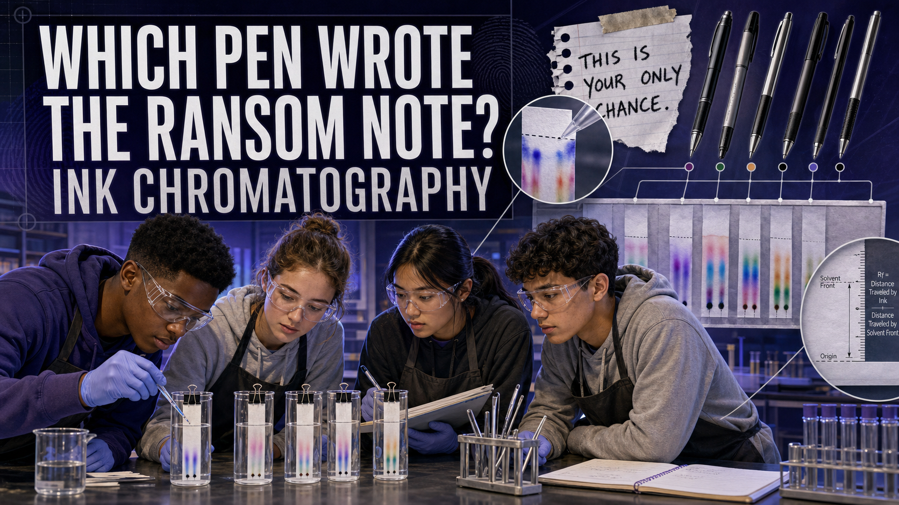

# Which Pen Wrote the Ransom Note? Ink Chromatography

!!! mascot-welcome "Welcome, Investigators!"
    { class="mascot-admonition-img"}

    Black ink is a liar — it looks like one color, but it's almost always a
    **mixture** of hidden dyes blended to look black. Give that mixture a little
    solvent and it splits apart into a rainbow of stripes, and no two brands
    split the same way. Today you'll unmask six inks and catch the one pen that
    wrote a ransom note. Follow the evidence!

## The Case

A ransom note turns up, handwritten in ordinary **black ink.** Six pens were
seized from six suspects — all of them black, all of them ordinary-looking. To
the naked eye, every stroke looks identical. But each ink is a *different recipe*
of dyes, and chromatography can pull that recipe apart.

Your job: separate each pen's ink into its component dyes, do the same to a
sample lifted from the note, and find the **one pen** whose pigment
fingerprint matches the note.

## Learning Objectives

By the end of this investigation you will be able to:

1. **Explain** how paper chromatography separates a mixture into its components.
2. **Separate** six black inks into their component dyes on chromatography paper.
3. **Calculate** an R_f value for a dye spot from its travel distance.
4. **Compare** the questioned note's dye pattern to six knowns and identify the
   pen used.

## Quick Facts

| | |
|---|---|
| **Lab type** | 🧪 Physical bench lab |
| **Group size** | 2–3 investigators |
| **Time** | 40–50 minutes |
| **Cost** | ≈ $10 per group (consumables) |
| **Ties to** | [Ch 14 — Ink Chemistry Analysis, Paper Chromatography, Thin-Layer Chromatography, Document Examination](../../chapters/14-document-examination/index.md) |

## Materials

Per group (≈ $10):

- Chromatography paper strips (or cut coffee-filter strips)
- 6 different black **water-based** markers or pens, labeled 1–6 (deliberately
  different brands)
- A "ransom note" sample written by the teacher with **one** of the six pens
- Rubbing alcohol (isopropyl) or plain water as the solvent
- 2–3 clear cups or jars
- Pencils (to suspend the strips) and tape
- Ruler with millimeter markings
- *Shared:* a hair dryer to speed drying (optional)

!!! mascot-warning "Safety & Fair-Test Rules"
    { class="mascot-admonition-img"}

    - Use **water-based** markers — permanent/solvent inks need harsher
      chemicals. If you use rubbing alcohol, keep the room ventilated, goggles on,
      and away from any flame.
    - Mark your origin spot with a **pencil**, never a pen — ink on the start
      line would run and ruin the lane.
    - Keep the origin spot **above** the solvent surface. If the solvent touches
      the ink directly, the dyes wash off instead of climbing.

## Background: One Black, Many Dyes

**Chromatography** is a family of techniques that separate a mixture by letting
its components travel at different speeds through a medium. In **paper
chromatography**, a solvent soaks up a strip of paper and carries the ink's dyes
along with it. Some dyes cling tightly to the paper and barely move; others
dissolve easily and race ahead with the solvent. Because each dye moves at its
own rate, a single black dot fans out into a **stack of colored bands** — the
ink's chemical fingerprint.

To compare fingerprints fairly, examiners measure the **R_f value** (retention
factor) of each band: the distance the dye traveled divided by the distance the
**solvent front** traveled. R_f is always between 0 and 1, and — under the same
paper and solvent — it's a repeatable property of that dye. Two inks match only
if their bands share the same **colors *and* the same R_f values.** The
professional version of this is **thin-layer chromatography (TLC)**, which uses a
coated plate instead of paper for sharper, more reproducible separation.

Before you run your strips, watch a TLC separation and practice reading R_f.

### Explore: TLC Ink Separation

<iframe src="../../sims/tlc-ink-separation/main.html" width="100%" height="500px" scrolling="no"></iframe>

TLC Ink Separation Interactive MicroSim

Type: microsim 
**sim-id:** tlc-ink-separation 
**Library:** p5.js 
**Status:** Implemented

Learning Objective: Explain how thin-layer chromatography separates ink into its
dye components and interpret the result as matching or non-matching (Bloom Level
2 — Understand).

Run the chromatography and watch the **solvent front** rise while each dye
migrates to its own height. Toggle **UV** to reveal fluorescent components that
are invisible in white light, then use **Calculate R_f** to compare the
questioned lane to the reference lanes component by component — exactly the
comparison you're about to do with paper.

## Procedure

**Part 1 — Spot the samples.**

1. Cut seven paper strips. On each, draw a light **pencil line** about 2 cm from
   the bottom — this is the **origin.**
2. On six strips, place a small, concentrated dot of ink from pens 1–6 on the
   origin line. Label each strip in pencil at the top.
3. On the seventh strip, dab a sample from the **ransom note** onto the origin.
   Label it **NOTE.** Let all dots dry.

**Part 2 — Run the chromatography.**

4. Pour solvent into the cup to a depth of about **1 cm** — below the origin
   line.
5. Tape each strip to a pencil and hang it so the bottom edge just touches the
   solvent but the **ink dot stays above** the liquid.
6. Watch the solvent climb. Before it reaches the top, **remove each strip** and
   immediately mark the **solvent front** in pencil. Let the strips dry.

**Part 3 — Measure and compare.**

7. For each colored band, measure how far it traveled from the origin and how
   far the **solvent front** traveled. Compute R_f = (dye distance) ÷ (solvent-
   front distance).
8. Line the **NOTE** strip up against pens 1–6. The matching pen has the **same
   colors at the same R_f values.**

## Data Collection

Record each band you see. Add rows as needed.

| Strip | Band color | Dye distance (mm) | Solvent-front distance (mm) | R_f | Matches NOTE? |
|-------|-----------|-------------------|-----------------------------|-----|---------------|
| NOTE | | | | | — |
| Pen 1 | | | | | |
| Pen 2 | | | | | |
| Pen 3 | | | | | |
| Pen 4 | | | | | |
| Pen 5 | | | | | |
| Pen 6 | | | | | |

## Analysis Questions

1. Which pen wrote the ransom note? Cite **two** matching bands (color **and**
   R_f) that support your conclusion.
2. Two pens produced a band of the **same color** but at **different R_f**
   values. Are those the same dye? Explain what R_f tells you that color alone
   can't.
3. Why must the origin dot stay **above** the solvent surface at the start? What
   would go wrong otherwise?
4. Your lab partner ran their strip in water while you used rubbing alcohol.
   Would it be fair to compare your two R_f values directly? Why or why not?
5. Ink chromatography identifies the **type** of ink, not the individual pen off
   a factory line. Explain the difference between saying "this ink is consistent
   with Pen 3" and "Pen 3 definitely wrote this note."

## Deliverable

Turn in a one-page **Questioned Document Report** that names the matching pen,
includes your dried NOTE strip taped beside the matching pen's strip, and lists
the R_f values you used to make the call. State your conclusion as *"the note's
ink is consistent with Pen ___."*

!!! mascot-thinking "What Does the Data Tell Us?"
    { class="mascot-admonition-img"}

    A matching separation tells you the note's ink is **the same formulation** as
    one pen's ink — a powerful lead. But many pens of the same brand share the
    exact same ink recipe, so chromatography says *"consistent with,"* not
    *"this one pen and no other."* Knowing the difference is what keeps an
    examiner honest.

??? question "Extension Challenge: The Aged Note"
    Real questioned-document examiners sometimes estimate a note's **age** from
    how far its dyes have already spread or faded. Write a note, wait a day (or
    warm it under a lamp), then run it beside a fresh sample of the same pen. Do
    the R_f values or band intensities shift? What might that tell an investigator
    about *when* a document was written?

## Teacher Notes

??? note "Setup, timing, and grading (click to expand)"
    - **Prep:** Test your six pens in advance and pick brands that separate into
      *visibly different* patterns — many cheap markers use blue, purple, and
      pink dyes that fan out beautifully. Write the ransom note with one of them
      and keep the answer sealed.
    - **Solvent choice:** Water works for most washable markers and is the safest
      option; rubbing alcohol gives crisper separation for slightly more stubborn
      inks. Keep the two solvents consistent within a comparison.
    - **Timing:** Strips run in 10–15 minutes. Start them early and use the wait
      to run the MicroSim and pre-compute practice R_f values.
    - **Differentiation:** For a shorter version, compare by pattern alone and
      skip the R_f math. For a challenge, add a decoy pen whose ink is *almost*
      identical to the real one so students must rely on precise R_f.
    - **Assessment focus:** Reward correct R_f calculation, a pencil origin line,
      and cautious "consistent with" phrasing over an overstated "match."

!!! mascot-celebration "Case Closed — For Now"
    { class="mascot-admonition-img"}

    Six identical-looking black pens walked in, and you split them into six
    different fingerprints — then caught the one that wrote the note. That's the
    whole magic of chromatography: making a mixture confess what it's really made
    of. Beautifully separated, investigators. **Follow the evidence!**
