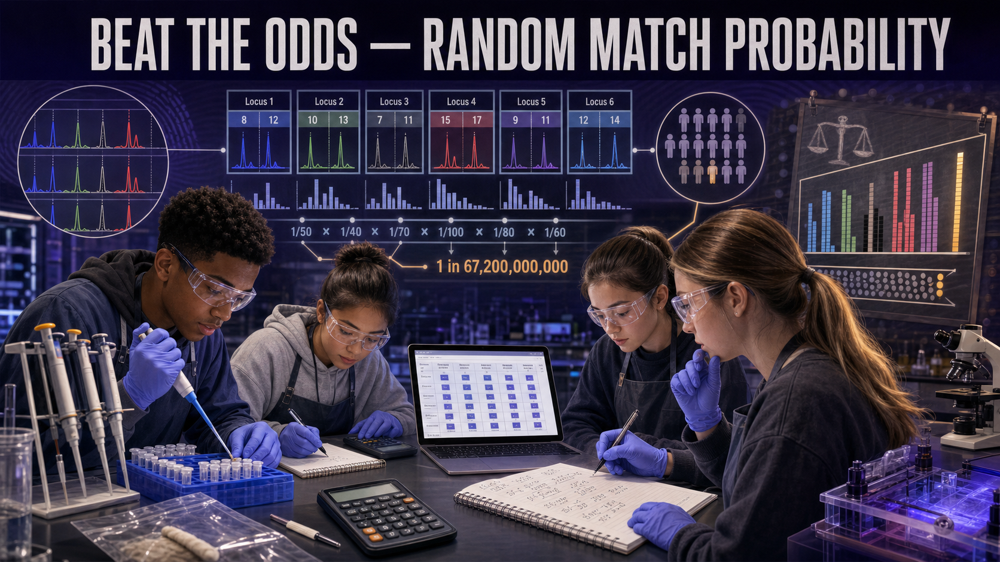

# Beat the Odds — Random Match Probability

!!! mascot-welcome "Welcome, Investigators!"
    { class="mascot-admonition-img"}

    The lab found a DNA match. Now the defense attorney stands up and says,
    "Lots of people share that profile." Are they right? Today you'll do the
    math that answers that question — and learn how a single number can turn a
    match into the most powerful evidence in the room. Follow the evidence!

## The Case

A burglary left a bloodstain on a broken window. The crime lab developed a
**DNA profile** from the stain and found that it matches the profile of the
defendant, **J. Rivera**, at every locus tested. The prosecution says the match
is overwhelming. The defense fires back:

> "A match isn't proof. Thousands — maybe millions — of people could have this
> same profile. My client just happens to be one of them."

You are the prosecution's expert witness. Your job is **not** to declare Rivera
guilty — that's the jury's call. Your job is to calculate the **random match
probability (RMP)**: the chance that a random, unrelated person would share this
exact profile by coincidence. Then you must explain that number to a jury in
plain English, honestly and without overstating it.

## Learning Objectives

By the end of this investigation you will be able to:

1. **Explain** why alleles at independent loci let us multiply frequencies.
2. **Apply** the product rule to calculate a random match probability across
   multiple loci.
3. **Analyze** how each added locus changes the RMP on a logarithmic scale.
4. **Evaluate** what "1 in 7 billion" does and does not tell a jury, avoiding
   the prosecutor's fallacy.

## Quick Facts

| | |
|---|---|
| **Lab type** | 💻 Virtual |
| **Group size** | 1–2 investigators (one computer each) |
| **Time** | 40–50 minutes |
| **Cost** | $0 (needs a computer or tablet) |
| **Ties to** | [Ch 8 — Random Match Probability, Product Rule, DNA Alleles, Homozygous vs Heterozygous, DNA Database Searching](../../chapters/08-forensic-dna-profiling/index.md) |

## Materials

Per investigator (no consumables):

- A computer or tablet with a web browser
- The **Random Match Probability** MicroSim (embedded below)
- The **Evidence Card** of allele frequencies (provided by your teacher)
- A calculator that shows scientific notation (or a phone calculator)
- Your lab notebook for the courtroom statement

!!! mascot-warning "Beware the Prosecutor's Fallacy"
    { class="mascot-admonition-img"}

    The RMP is the chance that a **random person** matches — it is **not** the
    chance the defendant is innocent. Swapping those two ideas is a famous
    courtroom mistake called the **prosecutor's fallacy**. Say exactly what the
    number means, and never a word more.

## Background: Why We Multiply

A **DNA profile** isn't one measurement — it's a set of results from many
different **loci** (locations on the DNA). At each locus a person inherits two
**alleles**, one from each parent. Some allele combinations are common in the
population; some are rare. Population geneticists have measured how often each
allele shows up, and those numbers are printed on your Evidence Card.

Here's the key idea. Because the loci used in forensic testing sit on different
chromosomes (or far apart on the same one), the genotype you inherit at one
locus is **independent** of the genotype at another — knowing one tells you
nothing about the next. When two events are independent, the probability of
**both** happening is the product of their separate probabilities. That is the
**product rule**: multiply the per-locus frequencies together to get the
frequency of the whole profile.

For a **heterozygous** locus (two different alleles, frequencies *p* and *q*),
the genotype frequency is **2pq**. For a **homozygous** locus (two copies of the
same allele, frequency *p*), it is **p²**. One locus might match roughly 1 in 10
people — not impressive on its own. But multiply a dozen such loci together and
the profile frequency collapses toward one in billions. Watch it happen.

### Explore: The Random Match Probability Calculator

<iframe src="../../sims/rmp-product-rule/main.html" width="100%" height="500px" scrolling="no"></iframe>

Random Match Probability Product-Rule Interactive MicroSim

Type: microsim 
**sim-id:** rmp-product-rule 
**Library:** p5.js 
**Status:** Specified

Learning Objective: Apply the product rule across independent loci to calculate
a DNA profile's random match probability and interpret it against population
size (Bloom Level 3 — Apply).

Toggle loci in and out with the checkboxes and watch the **running product**
shrink on a log scale. Notice how the RMP reads three ways — as a fraction, as
"1 in X," and compared to the U.S. and world populations. That last comparison
is the one a jury actually feels.

## Procedure

**Part 1 — Read the profile.**

1. Open your Evidence Card. It lists each **locus**, the defendant's
   **genotype** at that locus, and the **population frequency** of each allele.
2. For every locus, decide whether it is **heterozygous** (two different
   alleles) or **homozygous** (two identical alleles). Write "het" or "hom" next
   to each row.

**Part 2 — Calculate locus by locus.**

3. For each **heterozygous** locus, compute the genotype frequency as **2 × p ×
   q**. For each **homozygous** locus, compute **p²**. Record each result.
4. In the MicroSim, turn on **just the first locus** and confirm your hand
   calculation matches the sim's value.
5. Add the loci one at a time. After each one, record the **running RMP** from
   the sim. Watch the number plummet.

**Part 3 — Multiply and interpret.**

6. With **all** loci switched on, read the final RMP as a fraction and as "1 in
   X." This is your profile frequency.
7. Compare that "1 in X" to the world population (~8 billion). How many random,
   unrelated people on Earth would you *expect* to share this profile?
8. Draft a **one-paragraph courtroom statement** of the result in plain English.

## Data Collection

Fill in one row per locus, then complete the summary line.

| Locus | Genotype | Het or Hom? | Allele freq(s) | Genotype frequency |
|-------|----------|-------------|----------------|--------------------|
| 1 | | | | |
| 2 | | | | |
| 3 | | | | |
| 4 | | | | |
| 5 | | | | |
| 6 | | | | |

| Final RMP (fraction) | Final RMP ("1 in X") | Expected matches on Earth |
|----------------------|----------------------|---------------------------|
| | | |

## Analysis Questions

1. Why can you **multiply** the per-locus frequencies together? What assumption
   about the loci makes the product rule valid?
2. Pick the single locus with the **highest** genotype frequency (the least
   rare). On its own, roughly how many people would match it? Why isn't one
   locus enough for court?
3. The RMP dropped fastest when you added certain loci. What made those loci
   more powerful than others — common alleles or rare ones? Explain.
4. Write the sentence you would say to the jury to describe your final RMP.
   Then write the **wrong** version that commits the prosecutor's fallacy, and
   explain the difference.
5. Identical twins share the same STR profile. What does that tell you about the
   limits of an RMP, and how might a database search of many people change how
   you interpret a "1 in a billion" match?

## Deliverable

Turn in your completed **RMP worksheet** (all loci, the running values, and the
final number) plus a **one-paragraph expert-witness statement** written for a
jury. The statement must (a) give the RMP three ways, (b) compare it to a
population, and (c) state clearly what the number does *not* prove.

!!! mascot-thinking "What Does the Data Tell Us?"
    { class="mascot-admonition-img"}

    A random match probability of 1 in 7 billion doesn't say Rivera is guilty —
    it says that if you grabbed a random stranger, the odds they'd match by pure
    chance are about the same as picking one specific person off the entire
    planet. Powerful, yes. Proof of guilt, no. That honesty is what makes an
    expert witness trustworthy.

??? question "Extension Challenge: The Relatives Problem"
    The product rule assumes the "random person" is **unrelated** to the
    defendant. Full siblings share far more DNA than strangers do. Research how
    forensic scientists calculate a **separate, larger** match probability for a
    close relative, and rewrite your courtroom statement to address a defense
    claim that "it could have been my brother."

## Teacher Notes

??? note "Setup, timing, and grading (click to expand)"
    - **Prep:** Print one Evidence Card per investigator with 6–13 loci, each
      showing a genotype and realistic allele frequencies (0.05–0.30 works
      well). Vary the cards slightly so neighbors can't copy final answers.
    - **Math scaffold:** Some students freeze at scientific notation. A quick
      warm-up multiplying three small fractions (1/10 × 1/8 × 1/12) before they
      touch the sim pays off. The MicroSim's log-scale bar does the heavy
      lifting once they trust it.
    - **The point is the interpretation.** The calculation is arithmetic; the
      grade should reward the **courtroom paragraph** — correct RMP, honest
      framing, and a clean avoidance of the prosecutor's fallacy.
    - **Differentiation:** For a shorter version, hand out pre-computed
      per-locus frequencies so students only multiply. For a challenge, require
      the relatives extension and a rebuttal to a defense expert.
    - **Assessment focus:** Full credit goes to students who state precisely
      what the RMP means (chance a *random* person matches) and never claim it
      proves guilt or innocence.

!!! mascot-celebration "Case Closed — For Now"
    { class="mascot-admonition-img"}

    You just turned a pile of allele frequencies into a number a jury can
    understand — and you were honest about its limits. That combination of
    rigor and restraint is exactly what a real DNA analyst brings to the witness
    stand. Beautifully argued, investigators. **Follow the evidence!**
