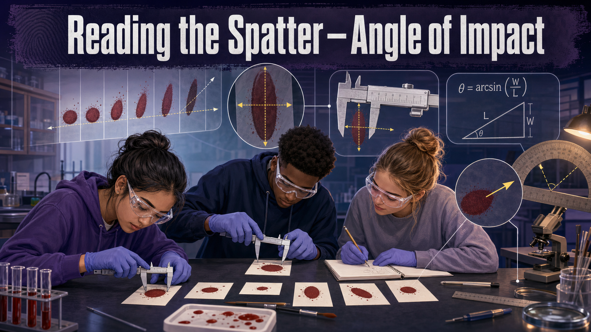

# Reading the Spatter — Angle of Impact

!!! mascot-welcome "Welcome, Investigators!"
    { class="mascot-admonition-img"}

    A blood drop is honest. The moment it hits a surface, its shape records the
    angle it arrived at — a circle from straight above, a long skinny teardrop
    from a shallow strike. Today you'll learn to read that shape backward into a
    number. One ruler, a little trig, and a drop of "blood" is all it takes.
    Follow the evidence!

## The Case

An investigator photographs a wall at a scene and finds a row of elongated
bloodstains. **Detective Reyes** wants to know the direction and steepness each
drop was traveling — because those angles are the first step toward reconstructing
where the victim was standing. But the photos have no protractor floating in
mid-air. All Reyes has is the **shape of each stain.**

Your job: prove you can recover the **angle of impact** from a stain's dimensions
alone. You'll drip a blood simulant onto paper set at angles you *know*, measure
the stains, calculate each angle, and answer the question — **how close does the
width-to-length math get you to the true angle, and what makes it drift?**

## Learning Objectives

By the end of this investigation you will be able to:

1. **Describe** how a blood drop's impact angle changes its stain shape.
2. **Measure** the width and length of an elliptical bloodstain accurately.
3. **Calculate** the angle of impact using the arcsin(width ÷ length) formula.
4. **Evaluate** your measurement error by comparing calculated angles to known angles.

## Quick Facts

| | |
|---|---|
| **Lab type** | 🔀 Combination (physical drip + virtual trig check) |
| **Group size** | 2–3 investigators |
| **Time** | 45–55 minutes |
| **Cost** | ≈ $12 per group (washable simulant) |
| **Ties to** | [Ch 7 — Blood Drop Physics, Angle of Impact Formula, Surface Tension, Passive Bloodstains](../../chapters/07-bloodstain-pattern-analysis/index.md) |

## Materials

Per group (≈ $12):

- **Blood simulant:** water + red food coloring + a small splash of corn syrup (for viscosity)
- Disposable pipettes or medicine droppers
- White butcher paper or cardstock targets (several sheets)
- A cardboard incline you can set to **90°, 60°, 30°, and 15°** (fold + tape, checked with a protractor)
- Protractor, metric ruler (mm), and a calculator with an **arcsin (sin⁻¹)** key
- Masking tape, paper towels, and a drip tray or newspaper underneath

!!! mascot-warning "Safety & Fair-Test Rules"
    { class="mascot-admonition-img"}

    - The simulant stains clothes — wear aprons and cover the bench. Mix a
      **washable** recipe (skip permanent dyes).
    - **Drop from the same height every time** (measure it!). Height changes the
      drop's energy and can smear your stain. Consistency is the whole game.
    - Let stains **dry before measuring** so you don't drag the edge and stretch
      your length reading.

## Background: How a Drop Writes Down Its Angle

A blood drop in flight is a sphere held together by **surface tension**. When it
strikes a surface head-on (90°), it spreads into a near-perfect **circle** —
width and length are equal. Strike at a shallow angle instead, and the same drop
smears into a long, narrow **ellipse**: the length grows while the width stays
about the same. The shallower the angle, the longer and skinnier the stain.

That relationship is exact enough to write as a formula. For an elliptical stain:

**sin(impact angle) = width ÷ length**, so **impact angle = arcsin(W ÷ L)**.

A stain 5 mm wide and 10 mm long gives arcsin(5 ÷ 10) = arcsin(0.5) = **30°**. A
round stain (W ≈ L) gives arcsin(1) = **90°** — straight down. The math only
needs two ruler measurements, which is exactly why analysts can pull angles off a
photograph. Warm up on the simulator, then go make some stains.

### Explore: Angle of Impact Calculator

<iframe src="../../sims/angle-of-impact-calculator/main.html" width="100%" height="500px" scrolling="no"></iframe>

Angle of Impact Calculator Interactive MicroSim

Type: microsim 
**sim-id:** angle-of-impact-calculator 
**Library:** p5.js 
**Status:** Specified

Learning Objective: Calculate the angle of impact from a bloodstain's width and
length using the arcsin ratio (Bloom Level 3 — Apply).

Feed the calculator different width and length values and watch the angle — and
the stain shape — respond. Try to predict the angle *before* you read it. Once
the pattern clicks, the real stains will make sense fast.

## Procedure

**Part 1 — Make stains at known angles.**

1. Set your incline to **90°** (flat, drop lands from directly above) and tape a
   fresh target on it. Mark the drop height on a ruler so it never changes.
2. Release **one** drop of simulant onto the target. Let it dry.
3. Repeat for **60°**, **30°**, and **15°**, each on its own labeled target.
   Make 2–3 stains per angle so you can pick the cleanest one.

**Part 2 — Measure width and length.**

4. For the cleanest stain at each angle, measure the **width** (short axis) and
   **length** (long axis, tip to tail — do not include any thin spatter "tail")
   in millimeters.
5. Record both in your data table.

**Part 3 — Calculate and compare.**

6. For each stain compute **W ÷ L**, then **arcsin** of that value to get the
   calculated impact angle.
7. Subtract to find the **error** = |calculated angle − true angle|. Use the
   simulator to double-check your arcsin arithmetic.

## Data Collection

| True angle | Width W (mm) | Length L (mm) | W ÷ L | Calculated angle = arcsin(W÷L) | Error (°) |
|------------|--------------|---------------|-------|--------------------------------|-----------|
| 90° | | | | | |
| 60° | | | | | |
| 30° | | | | | |
| 15° | | | | | |

## Analysis Questions

1. Which true angle produced the **most circular** stain, and which produced the
   **longest, narrowest** one? Explain the trend in terms of the drop's path.
2. At which angle was your **calculated value closest** to the true angle? At
   which was it **worst**? Propose a reason.
3. The 15° stains are usually the hardest to measure accurately. Why does a very
   shallow angle make the length measurement unreliable?
4. Your teammate measured length **including** the thin spatter tail. Would that
   make the calculated angle too **big** or too **small**? Show why using the
   formula.
5. An analyst reads a real stain as W = 4 mm, L = 8 mm. What impact angle does
   the formula give, and what does that angle tell Detective Reyes about the
   drop's flight path?

## Deliverable

Turn in your completed data table plus a short **Angle-of-Impact Memo** that
reports your average error across the four angles, names the single largest
source of that error, and states one change you'd make to measure more accurately
next time. Attach your best stain from each angle.

!!! mascot-tip "Investigator Tip"
    { class="mascot-admonition-img"}

    Measure the **length tip-to-tip of the solid ellipse only** — the wispy tail
    that points in the drop's direction of travel is *not* part of the length.
    Including it stretches L, shrinks W ÷ L, and hands you an angle that's too
    shallow. Same mistake, every year.

??? question "Extension Challenge: Find the Missing Height"
    You measured stains but never recorded your drop height on one target. Using
    two stains from the *same* angle but different heights, describe what changes
    in the stain and what stays the same. Which stain property is tied to
    **angle**, and which is tied to **energy/height**? Design a quick test to
    separate the two.

## Teacher Notes

??? note "Setup, timing, and grading (click to expand)"
    - **Prep:** Pre-build the four inclines and verify each with a protractor —
      "known" angles that are actually off will wreck the error analysis. Mix the
      simulant thin enough to drip cleanly (too much corn syrup and it won't
      release a round drop at 90°).
    - **Height control is everything.** Give every group a fixed drop-height jig
      (a ruler taped upright works). Uncontrolled height is the top cause of
      smeared, unmeasurable stains.
    - **Differentiation:** For a shorter lab, supply pre-made dried stains and go
      straight to measuring + calculating. For a challenge, hand groups a
      "mystery" stain and have them report the angle blind, then reveal it.
    - **Assessment focus:** Reward correct use of arcsin (not just sin), consistent
      tip-to-tip length measurement, and an honest error discussion. Precision of
      *reasoning* beats a lucky number.

!!! mascot-celebration "Case Closed — For Now"
    { class="mascot-admonition-img"}

    You just turned the shape of a stain into an angle — the exact skill that
    lets analysts reconstruct a flight path from a wall in a photograph. Keep
    those angles; in the next investigation you'll run strings back to find where
    the drops came from. **Follow the evidence!**
