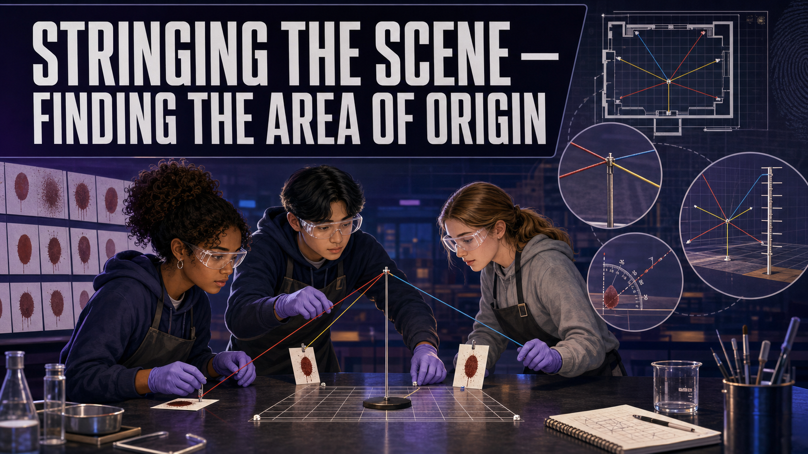

# Stringing the Scene — Finding the Area of Origin

!!! mascot-welcome "Welcome, Investigators!"
    { class="mascot-admonition-img"}

    Every drop on this wall came *from somewhere*. Trace each one backward along
    its flight path and the lines all crowd toward a single region of space — the
    spot where the blood was set flying. Today you'll find that spot with nothing
    but string, pins, and the angles you already know how to measure. Follow the
    evidence!

## The Case

A struggle in the corner of a garage left a spray of bloodstains across the wall.
**Detective Reyes** is back, and this time the question is bigger than any single
drop: **where in the room was the victim when the blow landed?** The suspect,
**Mr. Halloran**, claims the victim was struck while lying on the floor. The
prosecution says the victim was standing. The bloodstains on the wall can settle
it — if you can reconstruct the **area of origin**.

Your job: from a set of directional stains, run strings back to the **area of
convergence** in two dimensions, then use each stain's **impact angle** to lift
those strings into three dimensions and estimate the **height** of the origin.
Then answer the question — **standing, or on the floor?**

## Learning Objectives

By the end of this investigation you will be able to:

1. **Determine** the direction of travel of a directional bloodstain from its shape.
2. **Locate** the 2D area of convergence by extending strings back along stain paths.
3. **Reconstruct** the 3D area of origin using impact angle and the stringing method.
4. **Interpret** the height of the area of origin to test a claim about the event.

## Quick Facts

| | |
|---|---|
| **Lab type** | 🔀 Combination (physical stringing + virtual check) |
| **Group size** | 2–4 investigators |
| **Time** | 50–60 minutes |
| **Cost** | ≈ $16 per group (reusable) |
| **Ties to** | [Ch 7 — Area of Convergence, Area of Origin in 3D Space, Stringing Technique, Cast-Off Bloodstains](../../chapters/07-bloodstain-pattern-analysis/index.md) |

## Materials

Per group (≈ $16, mostly reusable):

- A **mock wall + floor corner** built from foam board or a cardboard box
- A printed **directional bloodstain pattern** taped to the wall (from the *Reading the Spatter* lab, or a supplied sheet)
- Colored **string or yarn** (one length per stain used)
- **Push pins** or low-tack putty to anchor each string
- **Protractor** and metric ruler
- A tape measure or meter stick to record the origin height
- Fine-tip marker and small angle labels for each stain

!!! mascot-warning "Safety & Fair-Test Rules"
    { class="mascot-admonition-img"}

    - Push pins are sharp — pin **into the board, not toward your hand**, and
      count them back in at cleanup.
    - Use **only the well-formed elliptical stains** for stringing. A round drop
      or a smeared blob has no reliable direction and will throw your convergence
      off.
    - Keep each string **taut and straight**. A sagging string is a lie about the
      flight path.

## Background: From a Wall of Stains to a Point in Space

A well-formed bloodstain is directional: its **narrow, pointed end shows the
direction the drop was traveling.** Draw a straight line back through the long
axis of each stain and you're tracing its flight path in reverse. Do that for
several stains and the lines crowd together in one small region of the wall — the
**area of convergence**. That's a **2D** answer: it tells you *where on the wall
plane* the drops were headed away from, but not how far out into the room, and
not how high.

To get the third dimension you add the **impact angle** you learned to calculate
from width and length. Anchor a string at each stain and raise it to that stain's
impact angle above the wall. Where the strings from several stains cross in space
is the **area of origin** — the actual 3D region where the blood source was when
it was struck. The height of that crossing is the payoff: a low origin supports
"on the floor," a chest-high origin supports "standing." Try it clean in the
simulator first.

### Explore: Area of Origin Stringing

<iframe src="../../sims/area-of-origin-stringing/main.html" width="100%" height="500px" scrolling="no"></iframe>

Area of Origin Stringing Interactive MicroSim

Type: microsim 
**sim-id:** area-of-origin-stringing 
**Library:** p5.js 
**Status:** Specified

Learning Objective: Reconstruct the 3D area of origin of a bloodstain pattern by
stringing stains back along their flight paths using impact angle (Bloom Level 4
— Analyze).

Add strings one at a time and watch the **area of convergence** tighten as more
stains agree, then raise them to their impact angles to see the **area of origin**
lift off the wall. Notice how one bad angle spreads the whole cluster — a preview
of the error you'll manage on the real wall.

## Procedure

**Part 1 — Read direction and convergence (2D).**

1. Number each usable directional stain on the pattern. For each, mark the
   **pointed end** — that's the direction of travel.
2. Draw (or pin a string along) the **long axis** of each stain and extend it
   back across the wall.
3. The region where the back-extended lines **cross** is your **area of
   convergence.** Mark it and note its position on the wall.

**Part 2 — Add angle to reach 3D origin.**

4. From the *Reading the Spatter* method, record each stain's **impact angle**
   (arcsin of width ÷ length). Label each stain with its angle.
5. Anchor a string at each stain with a push pin. Raise each string **out from
   the wall at that stain's impact angle**, keeping it aligned with the stain's
   direction line.
6. Hold or prop the strings taut. Where they **converge in space** is the **area
   of origin.**

**Part 3 — Measure and decide.**

7. Measure the **height** of the area of origin above the floor and its distance
   out from the wall.
8. Compare that height to Mr. Halloran's claim (victim on the floor) versus the
   prosecution's (victim standing). Decide which the evidence supports.

## Data Collection

| Stain # | Direction (points toward…) | Impact angle (°) | Reaches convergence? | Notes |
|---------|----------------------------|------------------|----------------------|-------|
| 1 | | | | |
| 2 | | | | |
| 3 | | | | |
| 4 | | | | |
| 5 | | | | |

**Area of convergence (on wall):** ____________  **Area of origin height:** ______ cm  **Distance out from wall:** ______ cm

## Analysis Questions

1. How did you determine each stain's **direction of travel** from its shape?
2. What is the difference between the **area of convergence** and the **area of
   origin**? Which one required the impact angles, and why?
3. Based on your measured origin **height**, was the victim more likely
   **standing** or **on the floor** when struck? Cite your number.
4. One stain's string clearly missed the cluster. Give two reasons a single stain
   might not converge with the others, and explain why analysts use **many**
   stains rather than one.
5. Why is an **area** of origin (a region) a more honest result than a single
   exact point? Connect your answer to measurement error.

## Deliverable

Turn in a **Reconstruction Report**: your completed stain table, the measured
area-of-origin height and distance from the wall, and a one-paragraph conclusion
stating whether the evidence supports "standing" or "on the floor" — with the
height that backs it up. Include a labeled photo or sketch of your strung scene.

!!! mascot-thinking "What Does the Data Tell Us?"
    { class="mascot-admonition-img"}

    Your strings don't meet at a perfect dot — they meet in a fuzzy little cloud,
    and that's correct. Real reconstructions report an *area* of origin, not a
    pinpoint, because every stain carries a little measurement error. Naming the
    uncertainty isn't weakness; it's what makes your conclusion hold up.

??? question "Extension Challenge: Cast-Off vs. Impact"
    Not every pattern comes from a single origin. A **cast-off** pattern — blood
    flung from a swinging object — forms a line of stains that *won't* converge to
    one region. Add three stains that trend in a line rather than a cluster.
    Re-run your stringing. How would you tell an investigator you're looking at
    cast-off, not a single impact site?

## Teacher Notes

??? note "Setup, timing, and grading (click to expand)"
    - **Prep:** Build reusable foam-board wall/floor corners once and they'll last
      for years. Print directional patterns with a **known** true origin height so
      you can score accuracy. Six to eight clean elliptical stains string best —
      more just adds tangle.
    - **Pair it with the angle lab.** This investigation assumes students can
      already compute impact angle from width ÷ length. Run *Reading the Spatter*
      first, or supply pre-labeled angles for a shorter version.
    - **Differentiation:** For a shorter lab, do the 2D convergence only (no
      angles). For a challenge, hide the true origin height and grade on how close
      the strung estimate lands, plus a stated uncertainty range.
    - **Assessment focus:** Reward correct direction-of-travel reads, taut and
      correctly-angled strings, an origin *region* rather than a false pinpoint,
      and a conclusion tied to an actual measured height.

!!! mascot-celebration "Case Closed — For Now"
    { class="mascot-admonition-img"}

    From a scatter of stains on a wall, you rebuilt a moment in space — how high
    off the floor the blood began its flight. That's the whole promise of
    bloodstain pattern analysis: the scene remembers, if you know how to ask.
    **Follow the evidence!**
