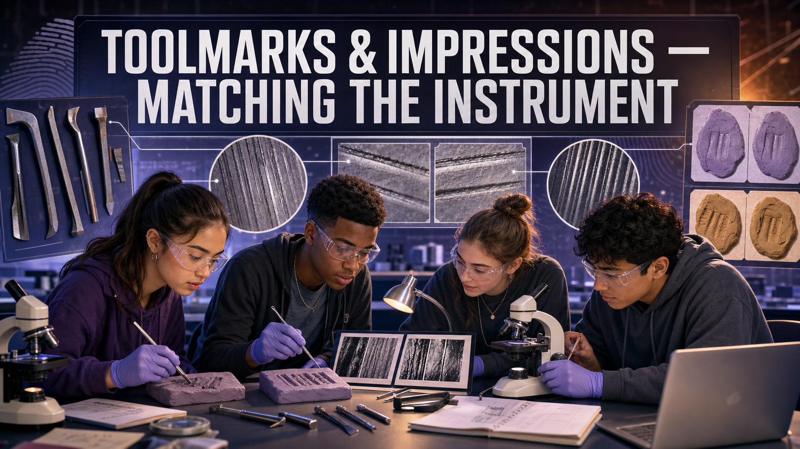

# Toolmarks & Impressions — Matching the Instrument

!!! mascot-welcome "Welcome, Investigators!"
    { class="mascot-admonition-img"}

    A crowbar leaves more than a dent — it leaves a **signature.** Every tool
    picks up tiny nicks and wear as it's used, and those imperfections scratch a
    one-of-a-kind pattern into whatever it forces. Today you'll play comparison
    microscope: press each suspect tool into clay, then match its marks to the
    pry mark left at the scene. Follow the evidence!

## The Case

Someone forced the back door of the electronics shop. At the **point of entry**,
the door frame carries a fresh **pry mark** — a gouge where a tool was wedged in
and levered. Three tools were recovered from three suspects:

- **Tool A** — a flat-blade screwdriver
- **Tool B** — a wood chisel
- **Tool C** — a bolt cutter

Your job: make a **known impression** from each tool, then compare its marks to
the crime-scene impression — first by **class characteristics** (shape, width),
then by the fine **striations and compression marks** that can tie the mark to
one specific tool.

## Learning Objectives

By the end of this investigation you will be able to:

1. **Distinguish** class characteristics from individual characteristics on a
   toolmark.
2. **Produce** controlled known impressions from suspect tools in a soft medium.
3. **Compare** a questioned toolmark to knowns under magnification using shape,
   width, and striation patterns.
4. **Justify** an identification or exclusion using both class and individual
   evidence.

## Quick Facts

| | |
|---|---|
| **Lab type** | 🧪 Physical bench lab |
| **Group size** | 2–3 investigators |
| **Time** | 40–50 minutes |
| **Cost** | ≈ $15 per group (consumables) |
| **Ties to** | [Ch 13 — Toolmark Analysis, Compression Marks, Sliding Marks, Comparison Microscope, Class vs Individual Characteristics](../../chapters/13-firearms-and-ballistics/index.md) |

## Materials

Per group (≈ $15):

- Modeling clay or plasticine (a fresh, smooth block)
- 3–4 hardware tools with different edges: a flat-blade screwdriver, a wood
  chisel, a serrated or notched edge, a bolt cutter
- Hand lens or loupe (10×), or a USB microscope if available
- A rolling pin or flat board to prepare a smooth clay surface
- Labels or tags (A, B, C) and a marker
- A "crime-scene" impression the teacher makes ahead of time with **one hidden
  tool**
- *Shared:* a ruler or caliper with millimeter markings for width measurements

!!! mascot-warning "Safety & Fair-Test Rules"
    { class="mascot-admonition-img"}

    - Tools have **edges and points** — press *down into* the clay, never toward
      a hand, and keep fingers clear of the blade path.
    - **Smooth a fresh clay surface** before every impression. A dented or reused
      surface adds marks that aren't from the tool — that's contamination.
    - Press each tool with **consistent pressure and angle.** Wildly different
      force changes the mark and ruins a fair comparison.

## Background: Class First, Individual Second

A **toolmark** is any impression, scratch, or gouge a tool leaves in a softer
surface. Examiners sort the features into two levels. **Class characteristics**
come from the tool's design — a screwdriver blade is a certain width, a bolt
cutter has two curved jaws. Class characteristics can *narrow the field* ("the
mark is 6 mm wide, so it wasn't the 10 mm chisel") but they're shared by every
tool of that make and size, so they can never point to one single tool.

**Individual characteristics** are the tie-breaker. As a tool is manufactured and
used, it picks up microscopic **nicks, burrs, and wear** unique to that one
object. When the tool scrapes across a surface it drags those imperfections along,
cutting a pattern of fine parallel lines called **striations** (from a *sliding*
mark). When it's pressed straight in, it stamps a **compression mark** that
mirrors its worn edge. Line up the striations from a questioned mark against a
known impression and — if they match ridge-for-ridge — you can associate that
mark with **one specific tool.** That side-by-side alignment is exactly what a
**comparison microscope** does in a real lab.

Before you pick up a tool, see how striation matching works.

### Explore: Striation-Overlay Comparator

Slide a suspect tool's test mark to align its striations with the crime-scene
toolmark, then score the correlation to identify or exclude the tool.

<iframe src="../../sims/striation-overlay-comparator/main.html" width="100%" height="565" scrolling="no"></iframe>

Striation-Overlay Comparator Interactive MicroSim

Type: microsim 
**sim-id:** striation-overlay-comparator 
**Library:** p5.js 
**Status:** Implemented

Learning Objective: Compare two toolmark striation patterns by overlaying them
and scoring their alignment, mimicking the split-field view of a comparison
microscope (Bloom Level 4 — Analyze).

Check each tool's **class width** first — a tool of the wrong size is excluded on
class before you ever look at striations. Then pick a tool, slide it until the
striations line up, and press **Score Alignment**. Only one tool truly matches; a
wrong tool never reaches a match no matter how you shift it. This rehearses the key
move — sliding one mark against another until the striations line up or clearly
don't — before you do it for real under the loupe.

## Procedure

**Part 1 — Make the known impressions.**

1. Smooth a fresh patch of clay with the rolling pin so it has no stray marks.
2. Take **Tool A** and press its working edge firmly and straight into the clay
   to make a **compression mark**; then, on a fresh patch, drag it a short
   distance to make a **sliding (striation) mark.** Label both **A.**
3. Repeat for **Tool B** and **Tool C**, using consistent pressure. Keep each
   tool's knowns clearly labeled.

**Part 2 — Examine the crime-scene mark.**

4. Get the teacher's **crime-scene impression** (made with one hidden tool).
   Measure its **width** and note its overall **shape** — these are class
   characteristics.
5. Under the loupe or USB microscope, look for **individual characteristics:**
   fine striation lines, a distinctive nick, or an irregular edge stamped into
   the compression mark.

**Part 3 — Compare and decide.**

6. Compare the crime-scene mark's **class characteristics** to each known.
   Immediately **exclude** any tool whose width or shape can't match.
7. For the surviving candidate(s), align the crime-scene **striations** against
   each known — slide them mentally (or in the comparator) until lines either
   coincide or don't.
8. Commit to an identification (or an exclusion) and record the specific
   features that support it.

## Data Collection

Fill in one row per tool.

| Tool | Class: width (mm) | Class: shape | Individual features (striations / nicks) | Class match? | Individual match? |
|------|-------------------|--------------|------------------------------------------|--------------|-------------------|
| Crime-scene mark | | | | — | — |
| A (screwdriver) | | | | | |
| B (chisel) | | | | | |
| C (bolt cutter) | | | | | |

## Analysis Questions

1. Which tool made the crime-scene mark? Cite **one class** characteristic and
   **one individual** characteristic that support your identification.
2. Which tool did you **exclude first**, and was it excluded on class or
   individual characteristics? Explain why that difference matters.
3. Explain in your own words why class characteristics alone can **never**
   identify a single tool, but can still be powerful evidence.
4. A compression mark and a sliding mark come from the same tool. What does each
   type reveal that the other doesn't?
5. Real toolmark identification has been **questioned** since the 2009 NAS
   report for lacking measured error rates. How would you phrase your conclusion
   honestly to a jury, given that limitation?

## Deliverable

Turn in a one-page **Toolmark Comparison Report** naming the tool you identify
and the tool(s) you exclude, with a labeled sketch or photo of the crime-scene
mark and the matching known side by side. Mark the specific striations or edge
features you relied on.

!!! mascot-tip "Investigator Tip"
    { class="mascot-admonition-img"}

    Angle and pressure are everything. If your known impression looks nothing
    like the scene mark, don't panic — try re-pressing the tool at the **same
    angle** the burglar likely used. A real examiner makes *several* test
    impressions to find the one that reproduces the questioned mark before
    calling it a match.

??? question "Extension Challenge: Fool the Examiner"
    Trade crime-scene impressions with another group — but each team secretly
    makes **two** knowns with the *same model* of screwdriver. Can the other
    team still tell the two identical-looking tools apart using only individual
    characteristics? Write down what finally separated them, or explain why the
    comparison had to stay "inconclusive."

## Teacher Notes

??? note "Setup, timing, and grading (click to expand)"
    - **Prep:** Make each group's crime-scene impression yourself with **one**
      known tool, and keep the answer sealed. Deliberately nick one tool's edge
      with a file so it carries an obvious individual characteristic — that makes
      the striation match findable with a hand lens.
    - **Clay matters:** Firm plasticine holds fine detail better than soft
      children's dough. Chill it briefly if it's too soft to take striations.
    - **Use the Striation-Overlay Comparator** above to rehearse the sliding
      comparison on screen first, then have students do it physically by rocking
      one clay strip beside another under the loupe.
    - **Differentiation:** For a quicker lab, compare compression marks only. For
      a challenge, add two same-model tools (see the Extension) so class
      characteristics can't separate them.
    - **Assessment focus:** Reward students who **exclude on class first**, then
      reach for individual characteristics — and who use cautious language given
      the technique's documented limitations.

!!! mascot-celebration "Case Closed — For Now"
    { class="mascot-admonition-img"}

    You matched a gouge in a door frame to the one tool that made it — the same
    class-then-individual logic a real firearms-and-toolmark examiner uses every
    day. Every nick told a story, and you were patient enough to read it.
    **Follow the evidence!**
