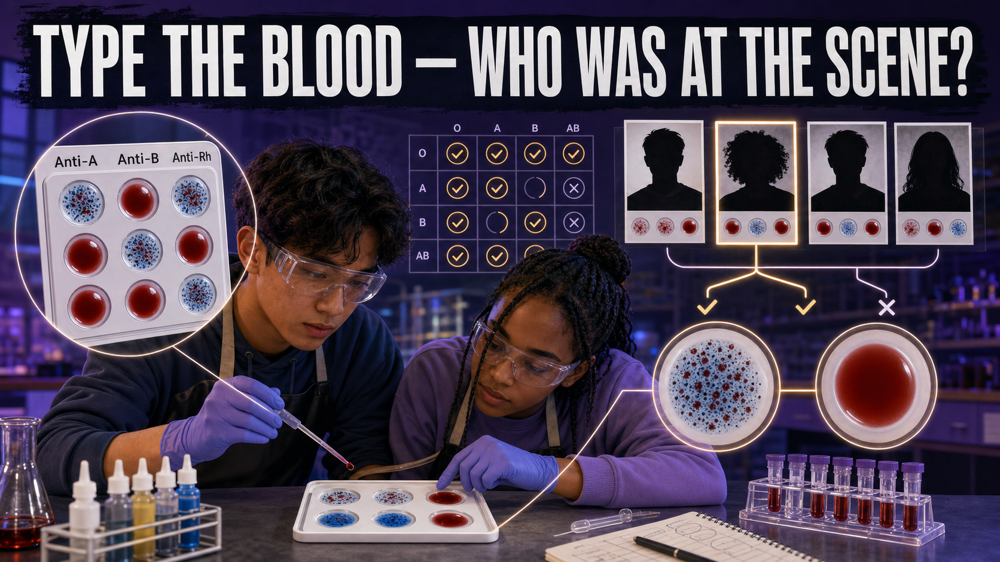

# Type the Blood — Who Was at the Scene?

!!! mascot-welcome "Welcome, Investigators!"
    { class="mascot-admonition-img"}

    A single drop of dried blood on a windowsill is about to narrow four
    suspects down to one. You won't do it by matching a name — blood can't do
    that. You'll do it by **crossing suspects off the list** until only the
    consistent one remains. Grab your typing tray. Follow the evidence!

## The Case

A jewelry case was smashed during last night's gala and the thief cut their
hand on the broken glass. Investigators recovered **one blood stain** from the
scene. Four guests had the opportunity and no alibi:

- **Ms. Ortega**, who left early complaining of a "paper cut."
- **Mr. Whitfield**, whose sleeve had a fresh red smear.
- **Dr. Kane**, who wore a bandage on one thumb.
- **Mr. Sato**, who insists he never went near the case.

Your job: type the crime-scene stain and all four suspects with a **simulated
blood-typing kit**, then answer the question the detective needs settled —
**whose blood type is consistent with the stain, and whom can you exclude
outright?**

## Learning Objectives

By the end of this investigation you will be able to:

1. **Explain** how anti-A, anti-B, and anti-Rh sera reveal an unknown ABO/Rh type.
2. **Determine** the blood type of an unknown sample by reading agglutination.
3. **Compare** suspect types against a crime-scene stain to include or exclude.
4. **Justify** why blood type excludes suspects far more powerfully than it identifies one.

## Quick Facts

| | |
|---|---|
| **Lab type** | 🧪 Physical bench lab |
| **Group size** | 2–3 investigators |
| **Time** | 40–50 minutes |
| **Cost** | ≈ $35 per group (simulated kit — no biohazard) |
| **Ties to** | [Ch 6 — ABO Blood Typing, Rh Factor, Agglutination Chemistry, Blood Composition](../../chapters/06-forensic-serology/index.md) |

## Materials

Per group (≈ $35):

- 1 simulated-blood ABO/Rh typing kit (synthetic "bloods" for four suspects + one scene stain)
- Simulated **anti-A**, **anti-B**, and **anti-Rh (anti-D)** sera (in dropper bottles)
- White typing trays or spot plates with labeled wells
- Wooden toothpick stirrers (one per well — never reuse)
- Fine-tip marker and masking tape for labeling
- Paper towels and a waste cup
- *Shared:* a white light source or light box to read faint reactions

!!! mascot-warning "Safety & Fair-Test Rules"
    { class="mascot-admonition-img"}

    - Everything here is **synthetic** — no real blood — but wear goggles and
      treat the sera like any lab chemical. Wipe spills, wash hands after.
    - **Use a fresh toothpick for every well.** One reused stirrer can carry
      anti-A into a "B" well and hand you a false AB result.
    - Add sera in the **same order** for every sample. Sloppy technique, not the
      blood, is the number-one cause of a wrong type.

## Background: Reading Blood Without a Name Tag

Your red blood cells wear tiny molecular flags called **antigens**. In the
**ABO system**, type A cells carry the A antigen, type B carry B, type AB carry
both, and type O carry neither. A separate flag, the **Rh (D) antigen**, makes
you "positive" if present and "negative" if absent. Nobody can see these flags
directly — so we make them show themselves.

The trick is **agglutination**: clumping. When you add **anti-A serum** to blood
that carries the A antigen, the antibodies latch onto the A flags and drag the
cells into visible clumps. No matching antigen, no clumping — the drop stays
smooth. So a sample that clumps with anti-A but not anti-B is **type A**; one
that clumps with both is **AB**; one that clumps with neither is **O**. Add
anti-Rh the same way to settle positive or negative.

Here's the catch that makes this forensic science and not magic: type O-positive
is the **most common** type on Earth — over a third of people. If the stain is
O-positive, you have not found *the* person; you have found *a huge group* the
person belongs to. Blood type is **class evidence**. It **excludes** suspects
with certainty (a type-A person did not leave a type-B stain) but it never
**identifies** one by itself. Meet the reaction before you run the kit.

### Explore: ABO Blood Typing

<iframe src="../../sims/abo-blood-typing/main.html" width="100%" height="500px" scrolling="no"></iframe>

ABO Blood Typing Interactive MicroSim

Type: microsim 
**sim-id:** abo-blood-typing 
**Library:** p5.js 
**Status:** Specified

Learning Objective: Determine an unknown ABO/Rh blood type by interpreting
agglutination reactions with anti-A, anti-B, and anti-Rh sera (Bloom Level 3 —
Apply).

Test each blood type against the three sera and watch which wells clump. Build
yourself a mental **key** — which pattern of clumping means A, B, AB, or O —
before you touch a real toothpick.

## Procedure

**Part 1 — Set up the trays.**

1. Label five typing trays: **SCENE**, **Ortega**, **Whitfield**, **Kane**, **Sato**.
2. On each tray, label three wells: **Anti-A**, **Anti-B**, **Anti-Rh**.
3. Place one drop of that sample's simulated blood in each of its three wells.

**Part 2 — Add the sera and read the clumps.**

4. To the **Anti-A** well add one drop of anti-A serum; to **Anti-B** add anti-B;
   to **Anti-Rh** add anti-Rh. Keep the order identical for every tray.
5. Stir each well with its **own fresh toothpick** for a few seconds.
6. Wait 30–60 seconds, then read against the light. **Clumping / grainy = positive
   reaction; smooth = negative.** Record each well.

**Part 3 — Type and compare.**

7. From the three reactions, write the full type for each sample (e.g. clumps in
   Anti-A and Anti-Rh only = **A positive**).
8. Compare each suspect's type to the **SCENE** type. Mark each suspect **consistent**
   (same type) or **excluded** (different type).

## Data Collection

Record + for clumping, − for smooth. Then write the type.

| Sample | Anti-A | Anti-B | Anti-Rh | Blood type | Consistent with SCENE? |
|--------|--------|--------|---------|------------|------------------------|
| SCENE | | | | | — |
| Ortega | | | | | |
| Whitfield | | | | | |
| Kane | | | | | |
| Sato | | | | | |

## Analysis Questions

1. What is the crime-scene stain's blood type, and which **three** reactions did
   you use to determine it?
2. Which suspects can you **exclude**? For one of them, name the specific reaction
   that rules them out.
3. Which suspect(s) are **consistent** with the stain? Can blood typing alone
   prove that person is the thief? Explain.
4. Suppose the scene stain typed **O positive**. Roughly a third of people are
   O positive. What does that do to the strength of your conclusion, and what
   evidence would you request next?
5. A team reused one toothpick between the Anti-A and Anti-B wells and got an
   "AB" result. Explain how contamination produced a **false** type.

## Deliverable

Turn in a one-page **Serology Report** listing all five blood types, the
suspects you exclude (with the reaction that excludes each), the suspect(s)
consistent with the stain, and one sentence stating clearly what blood-type
evidence *can* and *cannot* prove in this case. Attach your completed data table.

!!! mascot-thinking "What Does the Data Tell Us?"
    { class="mascot-admonition-img"}

    Notice what just happened: your strongest, most certain results were the
    *exclusions*. "Consistent with" only shrinks the crowd — it never points to
    one face. The best investigators lead with what the evidence rules **out**,
    then ask for more. **Every clue matters.**

??? question "Extension Challenge: The Missing Suspect"
    A fifth suspect appears, but their sample is contaminated and won't type.
    Given the four types you already have and the scene type, could a new suspect
    of *any* type change your conclusion? Design a two-line rule your team could
    hand police for deciding when blood type is worth collecting at all.

## Teacher Notes

??? note "Setup, timing, and grading (click to expand)"
    - **Prep:** One class-size simulated ABO/Rh kit (Carolina / Home Science
      Tools) covers several groups. Pre-fill and label the five "blood" bottles
      so groups spend time reading reactions, not decanting. Set the SCENE stain
      equal to exactly **one** suspect and make the other three genuinely
      different types so exclusions are clean.
    - **The teaching moment is the O-positive trap.** If you want a harder run,
      make two suspects share the scene type — now blood typing *cannot* pick
      between them and students must say so. That honesty is the assessment.
    - **Differentiation:** For a shorter lab, type only ABO (skip Rh). For a
      challenge, add a suspect whose type matches the scene to force the
      "consistent ≠ guilty" conclusion.
    - **Assessment focus:** Reward correct reading of agglutination, correct
      exclusions with the *specific* reaction cited, and — most of all — students
      who refuse to call a consistent type a match.

!!! mascot-celebration "Case Closed — For Now"
    { class="mascot-admonition-img"}

    You turned an invisible molecular flag into a courtroom-ready statement about
    who was — and wasn't — at that jewelry case. And you did it the honest way:
    by ruling people out, not by overselling a match. That's real serology.
    **Follow the evidence!**
